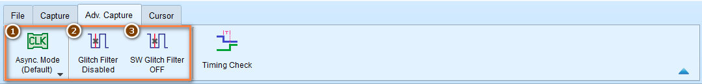
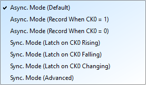
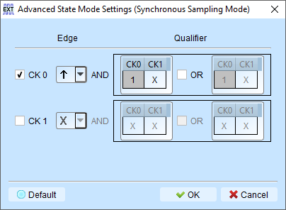
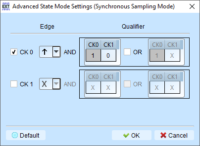
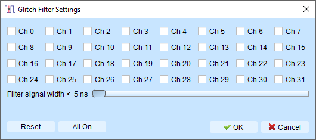
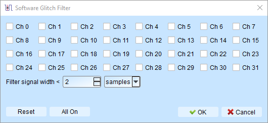

# Advanced Capture Settings

In addition to the basic capture settings we introduced in the last section, we also provide some advanced capture settings for you to choose from. Here are the details:

<figure markdown>
  { width="800" }
  <figcaption>Advanced Capture Settings</figcaption>
</figure>

## Asynchronous Mode / Synchronous Mode

<figure markdown>
  { width="300" }
  <figcaption>List of Asynchronous Mode / Synchronous Mode</figcaption>
</figure>

### Asynchronous Mode (Timing Analysis)

Asynchronous Mode uses the device's internal clock as the sampling clock. This mode
is the default mode for most cases. It takes a sample at the clock rate consistently, and requires that the signal be oversampled to get accurate timing.

!!! tip

    As a rule of thumb, you should sample at least 5 to 10 times of the signal frequency. Sampling rate lower than 5 times of the signal frequency will cause signal distortion.

**Compound Mode**

We also support compound clocks, where external clock is combined with internal clock to form a new sampling clock.

Two modes are supported:

- **Asynchronous Mode (Record When CK0 = 0)**: Only record when the external clock is LOW
- **Asynchronous Mode (Record When CK0 = 1)**: Only record when the external clock is HIGH

**Example:** When SPI Chip Select (CS) is 0 to capture the signal:

- Select asynchronous mode (recorded when CK0 = 0)
- The qualifier condition filters captures to only when CK0 meets the condition

### Synchronous Mode (State Analysis)

Differ from Asynchronous Mode, Synchronous Mode uses an external input clock as the sampling clock.

There are some preset modes for Synchronous Mode:

- **Synchronous Mode (Latch on CK0 Rising)**: Sampled at the rising edge of the external clock
- **Synchronous Mode (Latch on CK0 Falling)**: Sampled at the falling edge of the external clock
- **Synchronous Mode (Latch on CK0 Either)**: Sampled at the rising or falling edge of the external clock

**Configuration:**

- The CK0 channel on the signal line is the external clock input
- When the external clock stops, signal capture also stops
- Creates synchronous operation between device and external clock

### Advanced Settings

Configure multiple edge conditions to sample simultaneously.

**How it works:**

Each edge condition set has two qualifier sets. Sampling occurs immediately when any qualifier is met.

**Example conditions:**

- CK0 ↑ → Sampling occurs immediately

<figure markdown>
  { width="400" }
</figure>

- CK0 ↑ + CK1 = 0 → Sampling occurs immediately

<figure markdown>
  { width="400" }
</figure>

## Glitch Filter

We provide Glitch Filter feature in order to suppress short pulses in recorded data, and eliminate false logic states caused by these short pulses. This is a common issue during the recording process, cause we can't guarantee if there is any noise introduced from the environment.

!!! tip

    Use an Oscilloscope to analyze the signal quality. Try to eliminate the noise as much as possible for better result.

### Hardware Glitch Filter

Filter out unwanted glitches and logical misjudgments caused by slow transitions.

<figure markdown>
  { width="400" }
  <figcaption>Hardware Glitch Filter Configuration</figcaption>
</figure>

**Characteristics**

- Acts as a low-pass filter
- Filters **before** hardware triggering occurs
- Reminds users that glitches may indicate poor data transmission quality

**Filter range**: 5ns to 35ns

Channels using the hardware glitch filter are marked with a **red dot** on the channel label for easy identification.

### Software Glitch Filter

Filter signals after capture without affecting trigger or timing.

<figure markdown>
  { width="400" }
  <figcaption>Software Glitch Filter Configuration</figcaption>
</figure>

**Filter range**: 1ps to 1ms

**Characteristics**

- Changes display and decode contents only
- Does **not** affect triggering
- Does **not** affect recordable time
- Disabling the filter restores original un-filtered waveform

**Advantages over hardware filter**:

- Wider filter range (1ps to 1ms vs. 5ns to 35ns)
- Non-destructive: original recorded data is preserved
- Can be toggled ENABLE or DISABLE to compare filtered and unfiltered results
