# Capture Settings

Here are some important configurations before you start capturing data.

* [Sample Rate](#sample-rate)
* [Channel Settings](#channel-settings)
* [Storage Modes](#storage-modes)
* [Threshold](#threshold)
* [Trigger Settings](trigger-settings.md)

## Sample Rate

As a rule of thumb, you should sample at least 5 to 10 times of the signal frequency. You may setup the sample rate much higher than this if preferred. It generally improves the timing resolution of the captured data. However, it may increase the probability of introducing glitches of data, which may affect the interpretation of the data.

**Examples:**

- I2C at 100 kHz → Use 1 MHz or higher
- SPI at 1 MHz → Use 10 MHz or higher

!!! tip

    [Quick Settings](quick-start.md#step-2-capture-settings) already guaranteed this rule for most of the protocols.

Simply click the **Sample Rate** button in the toolbar to set the sample rate.

<figure markdown>
  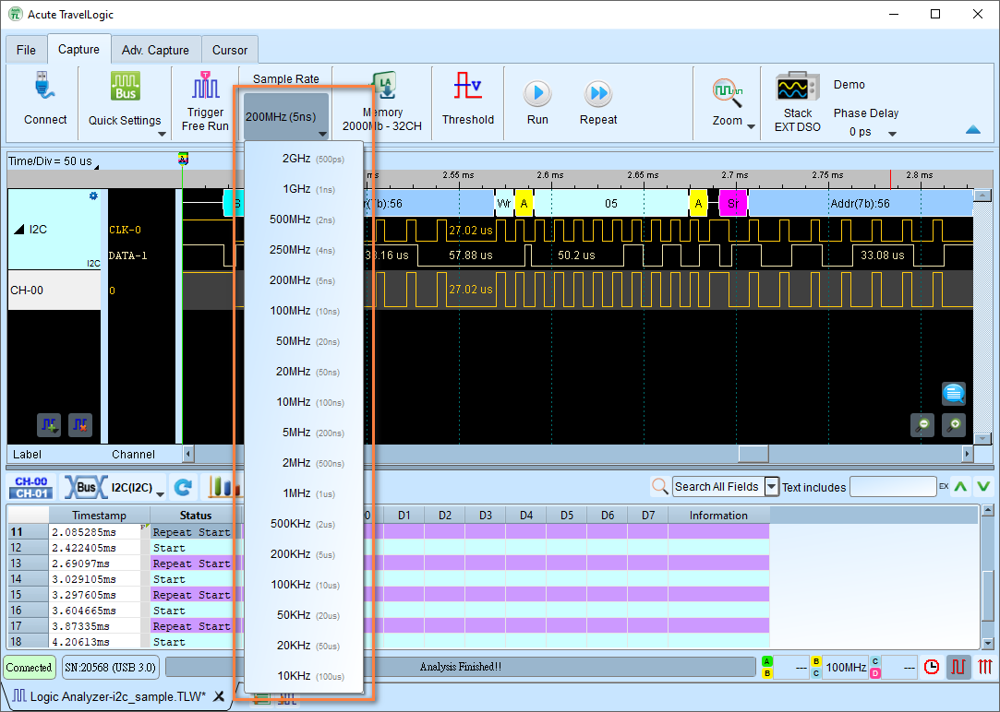{ width="800" }
  <figcaption>Sample Rate Dropdown List</figcaption>
</figure>

For Mixed-Signal Oscilloscope series, the location of the sample rate configuration is slightly different, as shown below.

<figure markdown>
  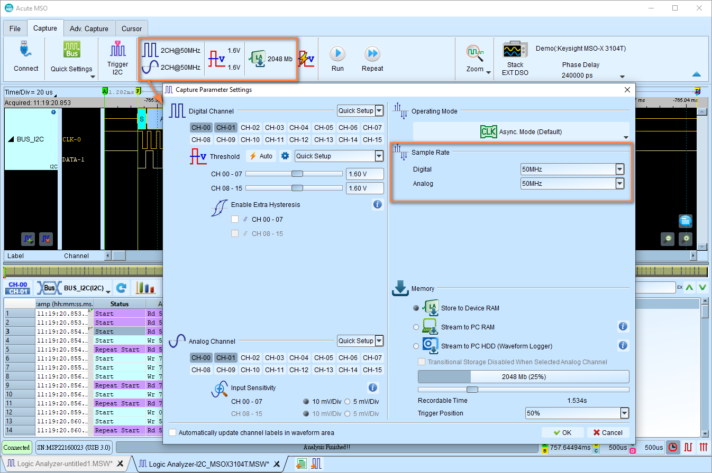{ width="800" }
  <figcaption>Sample Rate Settings for Mixed-Signal Oscilloscope series</figcaption>
</figure>

## Channel Settings

Configure the amount of channels to be used for capturing data. Note that this configuration shall be configured before you start the capture. If some channels are not in use, you can disable them to save memory.

<figure markdown>
  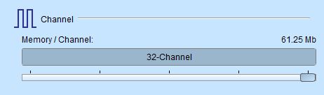{ width="400" }
  <figcaption>Channel Settings</figcaption>
</figure>

<figure markdown>
  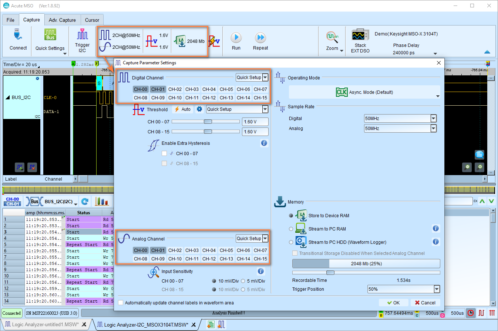{ width="800" }
  <figcaption>Channel Settings for Mixed Signal Oscilloscope series</figcaption>
</figure>

## Storage Modes

Configure how you store your captured data.

<figure markdown>
  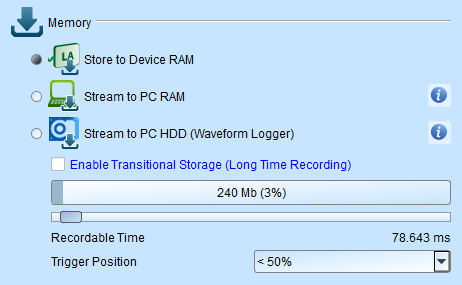{ width="400" }
  <figcaption>Storage Modes</figcaption>
</figure>

<figure markdown>
  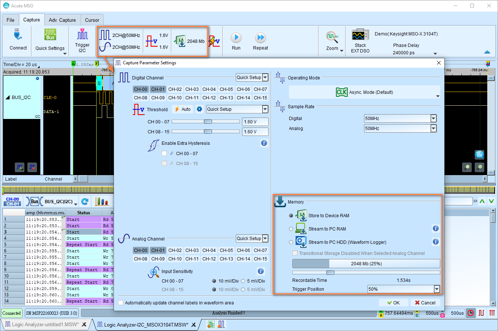{ width="800" }
  <figcaption>Storage Modes for Mixed-Signal Oscilloscope series</figcaption>
</figure>

Here is an image the demonstates the difference between the three main storage modes.

<figure markdown>
  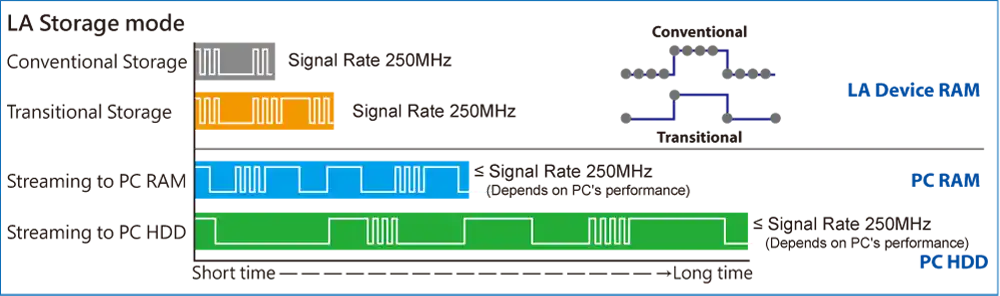{ width="800" }
  <figcaption>Storage Modes Comparison</figcaption>
</figure>

### Store to Device RAM

This mode is the default mode. The recorded data is buffered inside the device RAM. When the memory is full, the capture will stop and the data will be transferred to the PC.

You can set the storage depth for capturing data. Capture stops when the limit is reached.
The upper limit differs between the models.

<figure markdown>
  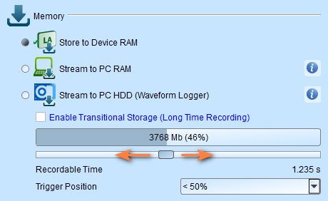{ width="400" }
</figure>

It also provides an estimated recordable time to help you decide how much memory you need.

### Stream to PC RAM

The recorded data is buffered by the device RAM and then streamed to the PC RAM in real time. This will be useful when you got enough PC RAM.

!!! warning

    There will be a limitation due to the throughput of the USB transmission. Thus, it is not recommended to operate this mode with high sampling rate because it bursts more data in a shorter time.

### Stream to PC HDD (Waveform Logger)

This mode is further stored the data to the hard disk, since mostly we have more storage space in the hard disk. It is recommended to use this mode for long captures, but it has the same limitation as the **Stream to PC RAM** mode.

### Transitional Storage

Transitional storage is a feature that applies to the **Store to Device RAM** mode and **Stream to PC RAM** mode. It allows you to capture the data for longer time by only storing the transitions instead of all sample points from the entire capture. 

!!! tip

    It is strongly recommended to use this mode when you have long-idled signals and you still want to capture the data for a long period of time.

### Trigger Position

Set trigger point location in memory using percentage.

- **Example:** 50% means up to 50% of device memory stores pre-trigger data
- **Capture stop condition:** Configure when the capture automatically stops

## Threshold

### Threshold Voltage Level Configuration

Configure voltage thresholds that determine logic levels for captured signals.

!!! tip

    **Rule of thumb:** Threshold = Supply Voltage ÷ 2. This is a good starting point for optimal results.

1. Click on the **Threshold** button in the toolbar

2. Choose a preset from the **Quick Setup** dropdown list or set custom voltage

    Common voltage levels:

    - Vcc 5 V: Configures the threshold to 2.5 V
    - Vcc 3.3 V: Configures the threshold to 1.6 V
    - Vcc 1.8 V: Configures the threshold to 0.9 V

3. Click **OK**

**Rule of thumb:** Threshold = Supply Voltage ÷ 2

<figure markdown>
  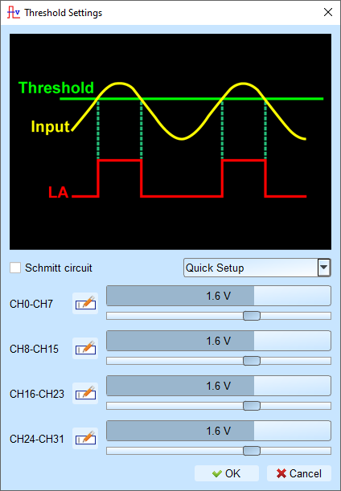{ width="400" }
  <figcaption>Threshold Settings</figcaption>
</figure>

<figure markdown>
  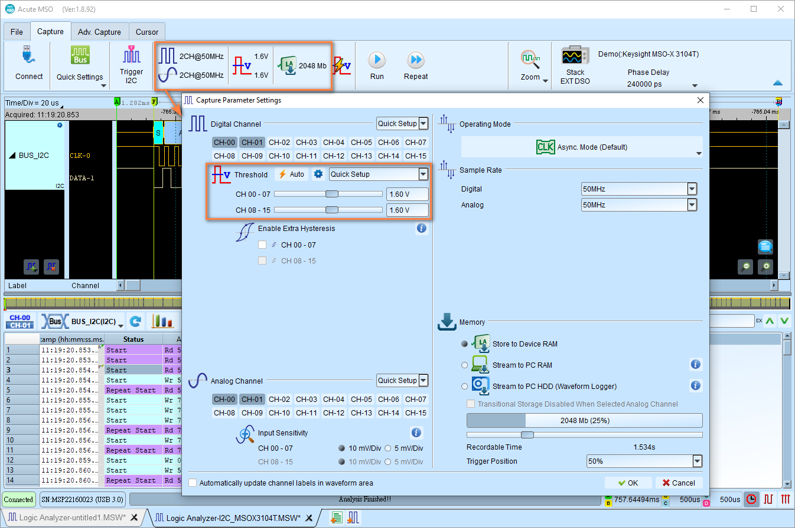{ width="800" }
  <figcaption>Threshold Settings for Mixed-Signal Oscilloscope series</figcaption>
</figure>

### Threshold Configuration with Schmitt Circuit

**Why use Schmitt circuit?**

When using a single threshold and the voltage is close to the threshold during signal transition, the device may capture ambiguous 0 or 1 states. This causes viewing difficulties.

Real signals often contain:
- noise
- slow edges
- bouncing signals (switches)

This causes trouble when analyzing the waveform, as the signal may be captured in an ambiguous state, as the figure below shows.

<figure markdown>
  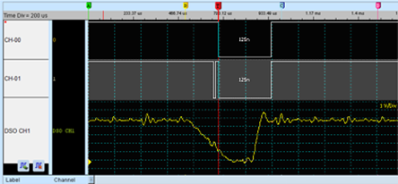{ width="600" }
</figure>

**Hardware surge filter limitations**

A hardware surge filter (low-pass filter) can filter noise but may also filter true signals or high-frequency components, making it unsuitable for this problem.

**Schmitt circuit solution**

Uses two sets of thresholds to create hysteresis on the voltage signal, eliminating noise interference and solving signal jitter.

**Configuration**

When using Schmitt circuit functions:

- Both channels must be used for measurements
- Each measurement point requires two test lines to form two threshold sets

**Channel pairing**

For TravelLogic series, you can pair the channels as follows:

<figure markdown>
  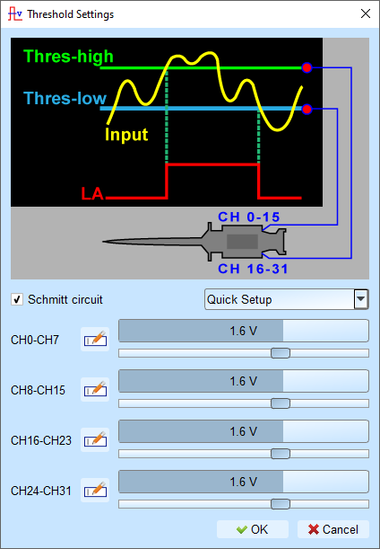{ width="400" }
</figure>

- First threshold set: CH0 - CH15
- Second threshold set: CH16 - CH31
- Pairing: CH0 ↔ CH16, CH1 ↔ CH17, CH2 ↔ CH18, etc.

**How to determine the logic level?**

- Input signal must **rise above Upper Threshold** to switch to logic 1 (HIGH)
- Input signal must **fall below Lower Threshold** to switch to logic 0 (LOW)
- When the input is between the thresholds, the output retains its previous logical state.
