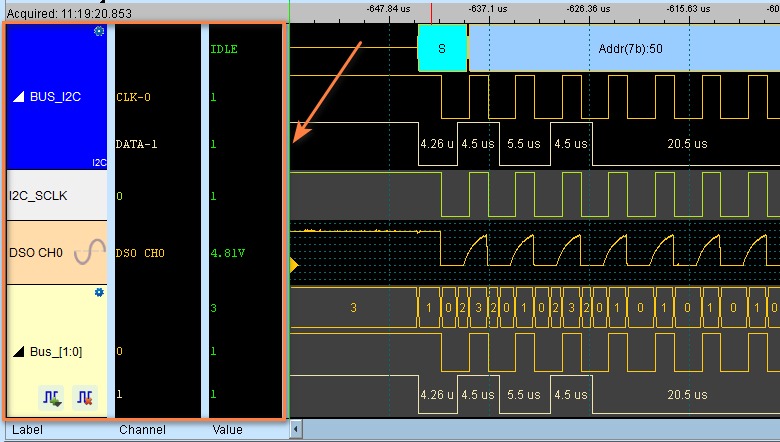
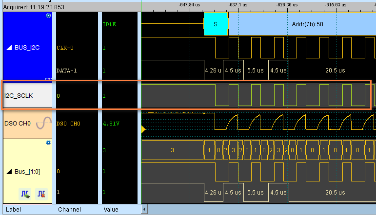
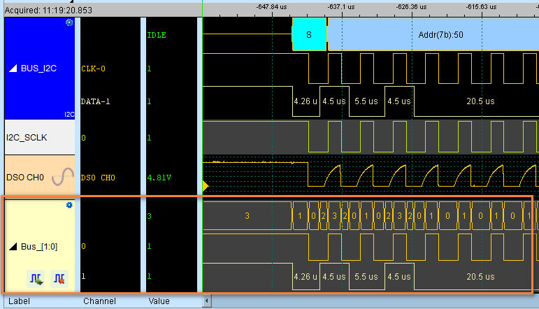
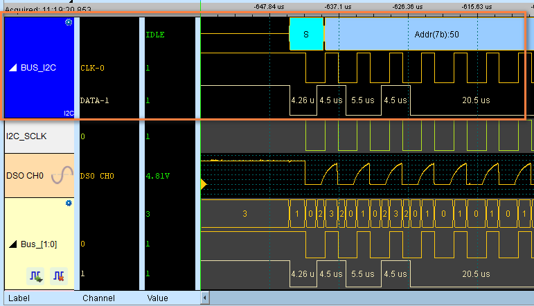
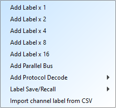
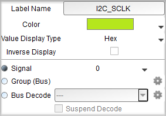

# Channel Labels

Now we focus on the left hand side of the UI, which is the channel label area. This is where we can manage all our channels, buses, and protocol decoders.

<figure markdown>
  { width="600" }
</figure>

## What's displayed in the channel label area?

- Channel names and numbers
- Bus groupings
- Protocol decode configurations
- Signal activity indicators (if enabled)
- Trigger conditions (if enabled)

## Label Types

### Digital Channel

<figure markdown>
  { width="600" }
</figure>

### Analog Channel

!!! note 

    Only available for [Mixed-Signal Oscilloscope](https://www.acute.com.tw/en/product/214) series.

<figure markdown>
  { width="600" }
</figure>

### Parallel Bus

<figure markdown>
  { width="600" }
</figure>

### Protocol Decoder

<figure markdown>
  { width="600" }
</figure>

For protocol decoders, there is a  icon on the top-right corner of the label. Clicking on it will open the protocol decoder settings dialog.

## Operations

### Add channels

Once you click the  icon, a dropdown list will popup to show you a list of options you can add.

<figure markdown>
  { width="200" }
</figure>

### Delete channels

Select the labels to delete first, then click on the  button to delete the selected labels.

### Combine channels

Drag one label onto another to form parallel buses.

### Customization

Left-click on a channel label to open the channel settings dialog.

<figure markdown>
  { width="350" }
</figure>

This allows you to:

- Adjust the source for this channel label by selecting from the *Signal* dropdown list (it does not change the actual recorded data)
- Rename channels by editing the text field
- Editing Display Format
- Editing Colors
- Choose whether to use inverted display

!!! tip
   
    Use descriptive names like "SDA", "Clock", "CS" instead of "CH0", "CH1" to make it easier to understand.

For protocol decoders, you can check the *Suspend Decode* checkbox to prevent the decoder analyze the data once the waveform area refreshes.

