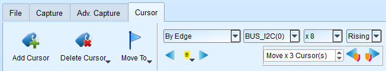
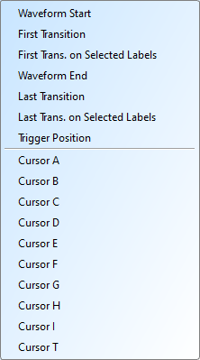
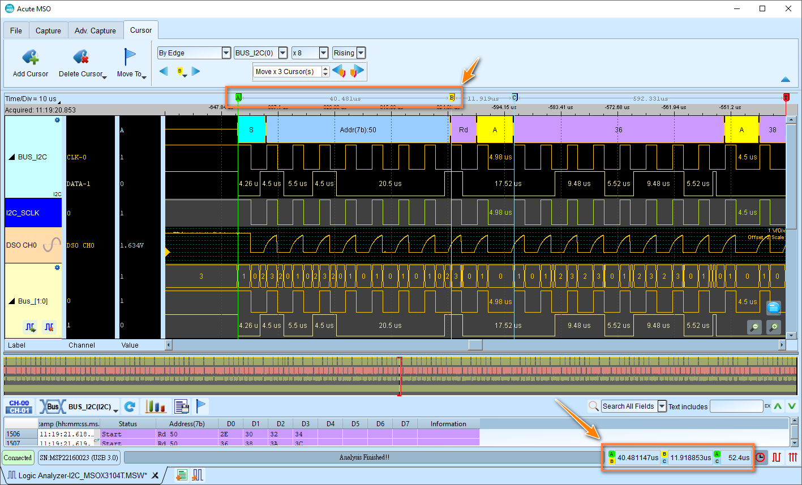
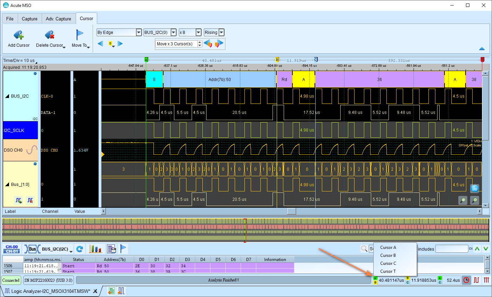

# Interact with cursors

Cursors play a crucial role in navigating and analyzing the captured data. They not only allow you to quickly jump to specific positions in the waveform area, but also provide precise time interval and frequency measurements, as well as sophisticated waveform searches.

## Overview

<figure markdown>
  { width="600" }
  <figcaption>Cursor control panel</figcaption>
</figure>

Cursors can be added, deleted, and dragged to any positions in the waveform area.

### Special-purpose cursors

**T cursor**: Marks the trigger point (most likely to be at a fixed position). This is typically red-colored.

## Operations

### Add cursor

This will automatically add a cursor right after the last cursor (incrementing the letter from A to Z).

!!! tip

    **Keyboard Shortcut**: Press **Shift + A-Z** keys to add a cursor at the mouse position.

### Delete cursor

A dropdown list will popup to show you a list of existing cursors you can delete, or delete them all at once by clicking the **Delete All** button.

### Move To

Quickly jump to specific positions in the waveform area.

**Shortcut**: Press **A-Z** keys to quickly jump to the corresponding cursor location.

<figure markdown>
  { width="200" }
</figure>

**Available positions:**

- Waveform start: Move to the beginning of the captured waveform
- First transition: Move to the first waveform transition on any channel
- First transition on selected label: Move to the first transition of a specific channel label
- Waveform end: Move to the end of the captured waveform
- Last transition: Move to the last waveform transition on any channel
- Last transition on selected label: Move to the last transition of a specific channel label
- Trigger position: Move to the trigger point (a.k.a. T cursor)
- Cursor A-Z: Move to any named cursor position

    !!! tip

        **Keyboard Shortcut**: Press **A-Z** keys to quickly jump to the corresponding cursor location.

## Waveform Search by Cursors

Find specific signal patterns using four search modes.

### 1. By Edge

Move the specified cursor position according to the number of Rising / Falling / Either edges (x1 ~ x4096) of the specified channel.

### 2. By Time

Move the specified cursor position forward or backward to specify the amount of time.

### 3. By Value Match

In search of displayed value content of the specified channel, if the specified channel is the bus protocol, the text comparison will be used for the search. If the specified channel is the bus or channel, the numerical comparison will be used for the search.

### 4. Search Pulse Width

The waveform pulse widths meeting the conditions can be searched on the specified channels. The single-cursor movement function on the left side or the multiple-cursor movement function on the right side can be used on any operation meeting or exceeding the conditions.

## Measuring with cursors

At the bottom right of the UI, there is a measurement display bar that shows measurement values between cursors. It will update automatically when you move the cursors. Of course, you can also manually edit the pairs of cursors by clicking the A-Z buttons.

<figure markdown>
  { width="800" }
</figure>

<figure markdown>
  { width="800" }
</figure>

Additionaly, you can change the display format of the measurement with the icon on right side of the measurement display bar.

1.  **Interval time**: Time between the selected cursor and the reference cursor
2.  **Frequency calculation**: Frequency = 1 / interval time
3.  **Sampling statistics**: Number of samples between cursors, depending on the sampling rate of the captured data.

### Multiple measurements

You can configure the maximum number of cursor measurement groups (3-10) in [system environment settings](preferences.md#options). Default is 3.
