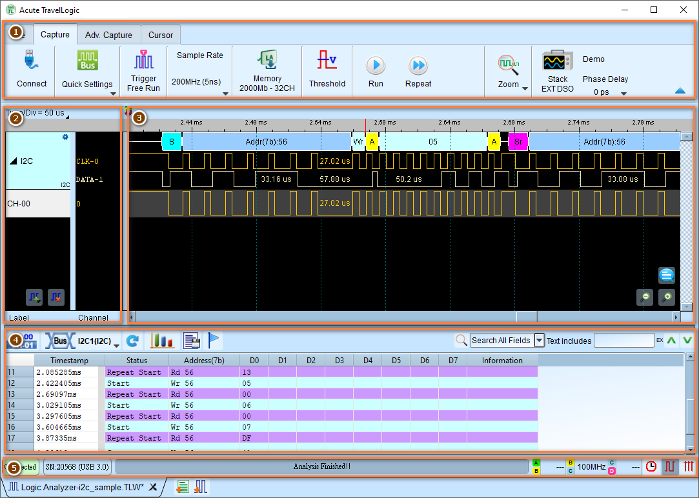

# Understanding the Interface

Learn about the Logic Analyzer interface layout and how each component works together for signal capture and analysis. 
You can follow along whether you own any Acute's Logic Analyzer product or not. If you don’t own one, you may run the software in [Demo Mode](demo-mode.md).

## Main Window Overview

The Logic Analyzer interface is organized into distinct areas, each serving a specific purpose in the capture and analysis workflow.

<figure markdown>
  { width="800" }
  <figcaption>User interface of Logic Analyzer Mode</figcaption>
</figure>

## Interface Components

### 1. Toolbar

The toolbar provides quick access to capture configuration and control functions, located at the top of the window.

**Key functions**

- [**Quick Settings**](quick-start.md#step-2-capture-settings): Fast and convenient protocol configuration presets.
- [**Capture Settings**](capture-settings.md): Configure capture mode, sample rate, memory depth, threshold levels and so on.

    - Sampling rate: Set internal clock frequency for timing mode
    - Threshold: Set voltage levels for logic detection
    - Memory depth: Configure capture memory usage
    - Trigger settings: Configure trigger type and conditions

- **Start and Stop buttons**: Begin or end the capture process.

Before you capture any data, be sure to check the **Capture Settings** first. Select a desired capture mode, sampling rate, capture duration, ports, voltage, and other settings relevant to your preferred capture parameters. This always depends on what you are measuring.

!!! note

    The interface can be slightly different based on the model of the Logic Analyzer you are using. The screenshot above is from TravelLogic application.

To learn more about the configuration of capture settings, see the [Capture Settings](capture-settings.md) section of this user guide.

### 2. Channel Label

The channel label area displays configured channels, buses, and protocol decoders, which are used to label the signals for easier identification. It is located on the left side of the waveform area. You can either add, delete, configure, or rearrange the channel order here.

To learn more about the configuration of channel labels, see the [Channel Labels](channel-labels.md) section of this user guide.

### 3. Waveform Area

Once you have captured data, the waveform area is the place that you can find your captured data. You can zoom in and out of your captured data by using your mouse wheel. Click and drag in the viewport to pan left and right.

**What's displayed in the waveform area?**

- Digital signal transitions (0/1 logic levels)
- Time scale along the bottom
- Trigger point marker (usually at center or user-defined position)
- Cursor lines for measurements
- Bus decode annotations (if enabled)
- Annotations and markers (if added)

To learn more about detailed operations in the waveform area, see the [Navigate the data](navigate-data.md) section of this user guide.

### 4. Report Window

Displays analysis results right under the waveform area.

**Report types:**

1. **Channel Status**

    - Shows logic level transitions
    - Timestamps for state changes
    - Value history

2. **Bus Decode Results**

    - Protocol-level transactions
    - Addresses, data, and control information
    - Error detection and flags
    - Customizable columns

3. **Waveform Measurement Statistics**

    - Period and frequency measurements
    - Pulse width analysis
    - Channel-to-channel delays
    - Edge counts

**Report toolbar functions:**

- Switch between report types
- Export to CSV/TXT
- Configure columns
- Save report settings

To learn more about detailed features in the report area, see the [Navigate the report](navigate-report.md) section of this user guide.

### 5. Status Bar

Displays device connection and capture status information.

**Location:** Bottom of the window

**Information shown:**

- Device connection status (Connected/Disconnected)
- Device model and serial number
- Capture state (Idle/Running/Stopped)
- Current sample rate
- Memory usage

**Indicators:**

- Green: Device connected and ready
- Red: Device disconnected or error
- Yellow: Capture in progress

## How Components Work Together

**Toolbar ↔ Waveform Area**:

- Toolbar settings determine what's captured and displayed
- Waveform zoom affects visible detail but not capture settings

**Channel Labels ↔ Waveform Area**:

- Labels control which signals are displayed
- Rearranging labels reorders waveform display
- Label settings affect decode and display

**Waveform Area ↔ Report Window**:

- Cursors in waveform can limit report range
- Clicking report rows highlights corresponding waveform position
- Decode settings affect both waveform annotations and report content

## What's next?

- [Quick Start](quick-start.md): Beginner guide of the workflow
- [Capture Settings](capture-settings.md): Configure toolbar parameters
- Navigation:

    - [Navigate the data](navigate-data.md): Detailed waveform operations
    - [Navigate the report](navigate-report.md): Understanding report displays
