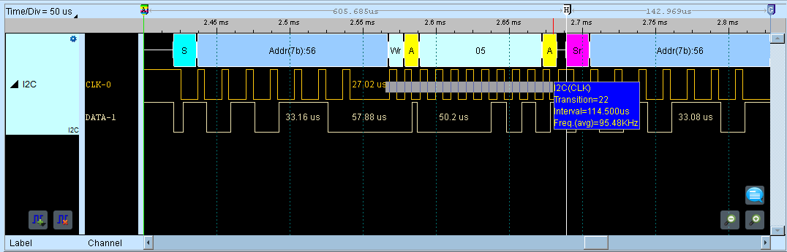
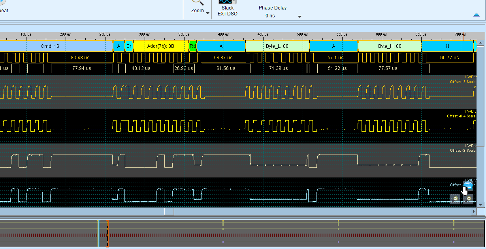
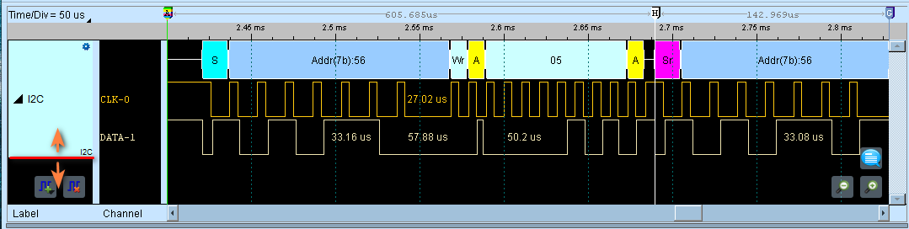
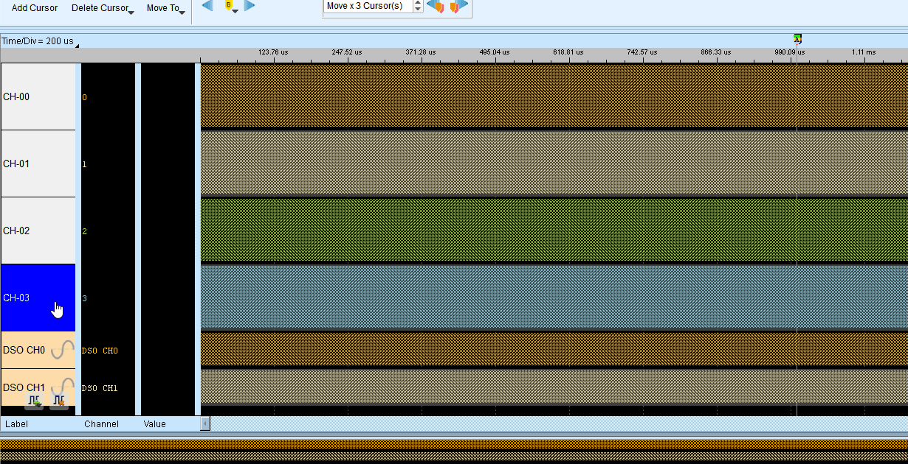
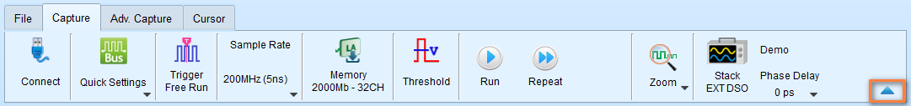
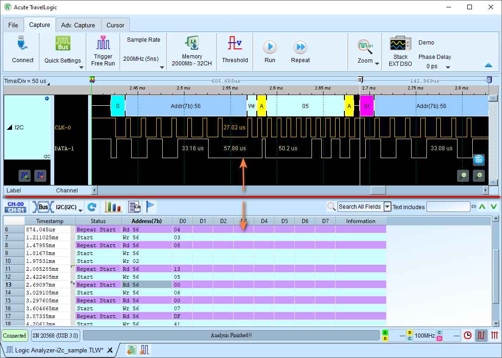
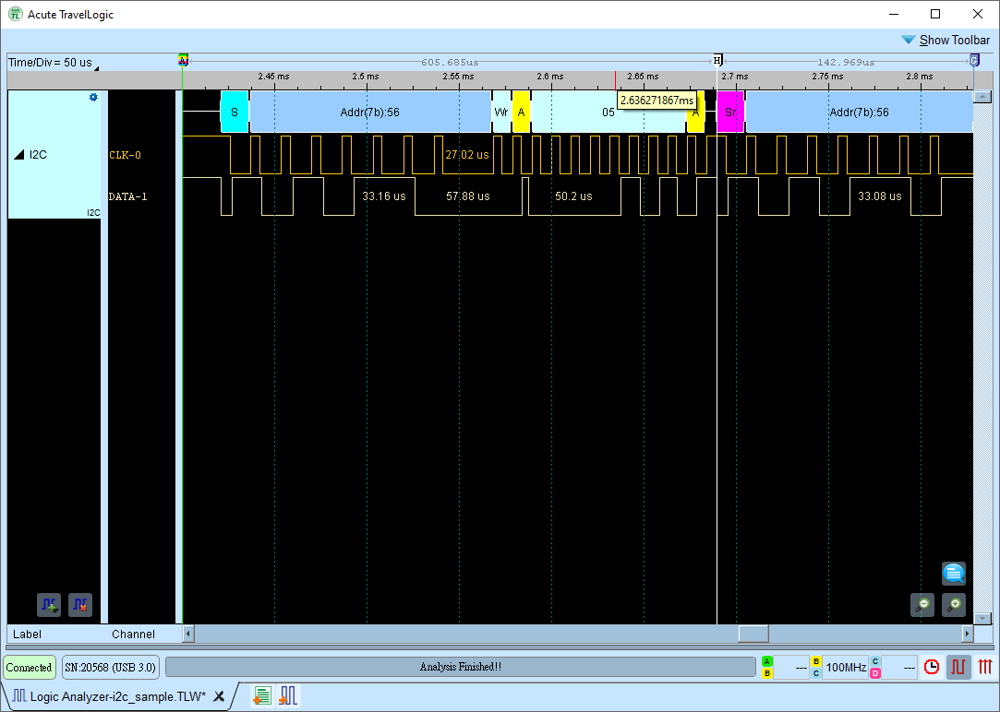
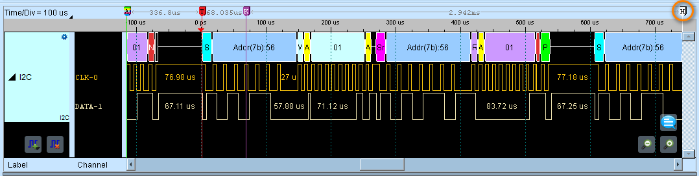
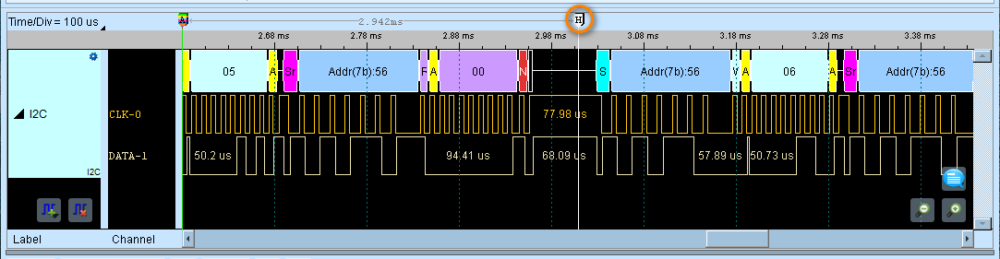

# Navigating the Data

There are some tips and tricks for navigating your data. Here are some of the most common methods.

## Zooming / Panning

**Panning Left and Right**

Left mouse click and drag the waveform area to the left or right.

**Zooming In and Out**

*Mouse wheel up* or press *Number Pad +* to zoom in.
*Mouse wheel down* or press *Number Pad -* to zoom out.

## Quick calculation

Right-click and drag to select region. You are able to get

- Number of signal transitions in the selected interval
- Length of time (duration)
- Average frequency

For example, we can immediately estimate the I2C Clock frequency is about 95 kHz, as in the figure shows.

<figure markdown>
  { width="800" }
  <figcaption>Quick Calculation</figcaption>
</figure>

## Quick note and marker annotations

Add notes and visual markers directly in the waveform area to document important signals or conditions.

<figure markdown>
  { width="800" }
  <figcaption>Quick Note and Marker Annotations</figcaption>
</figure>

This gives you the ability to quickly add text labels, graphic markers, and notes at specific time positions. It makes it more convenient to document your findings anywhere in the waveform area.

## Vertical adjustments

You can adjust the channel labels by dragging the label border.

<figure markdown>
  { width="800" }
  <figcaption>Adjust the height of the channel labels</figcaption>
</figure>

Even the order of the channel labels.

<figure markdown>
  { width="800" }
  <figcaption>Adjust order of the channel labels</figcaption>
</figure>

For more details of how to manage the channel labels, see also [Channel Labels](channel-labels.md) section.

## Display Optimization

Hide the toolbar by clicking the arrow up icon.

<figure markdown>
  { width="800" }
</figure>

To maximize the waveform area, you can drag the divider between the waveform area and the report area to the bottom.

<figure markdown>
  { width="800" }
</figure>

<figure markdown>
  { width="800" }
</figure>

## Fast navigation via Cursors

You can use cursors to quickly navigate to specific positions in the waveform area.

Let see the the following example. Suppose we have a Cursor H outside of our viewing area, and we want to quickly jump to it.

<figure markdown>
  { width="800" }
</figure>

Press the **H** key to jump to Cursor H, and here we go. The Cursor H is now in the middle of the waveform area.

<figure markdown>
  { width="800" }
</figure>

They are just like bookmarks. Next time, you can drop cursors anywhere you want to quickly reference to, this helps you to navigate the waveform area quickly and efficiently. Add any cursors by pressing the **Shift + A-Z** key.

See also [Cursor operations](cursor.md) for more details.
