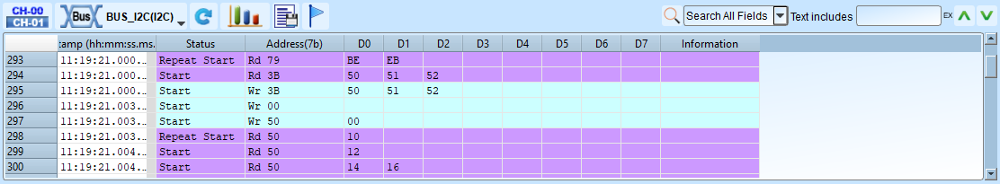
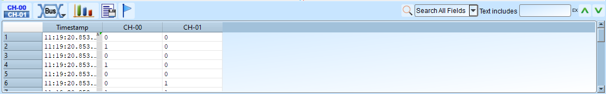
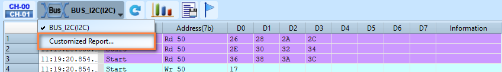
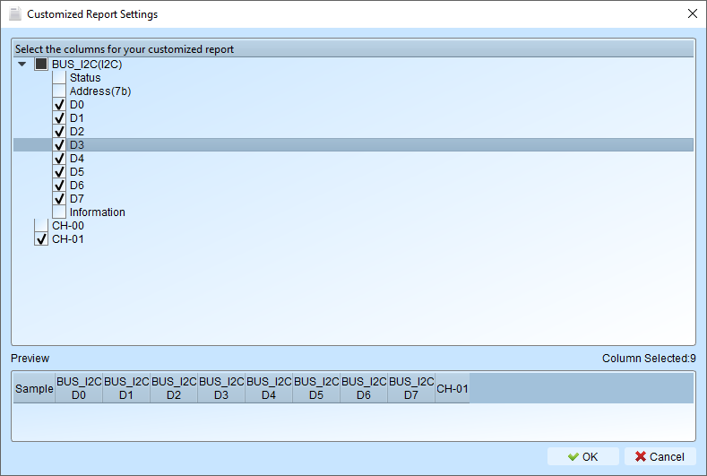

# Navigate Report

## Overview

The report area is the place that you can find the analysis results of the captured data.
Mostly you will use the report area to view the protocol decode results.

There are several kinds of reports you can view here:

- [Protocol decoder result](navigate-report.md#protocol-decoder-report) (varies across different protocols)

<figure markdown>
  
</figure>

- [Transition report](navigate-report.md#transition-report) (0, 1 logic levels along with timestamps)

<figure markdown>
  
</figure>

- [Waveform statistics](navigate-report.md#waveform-statistics) (period, frequency, edge count, etc.)

<figure markdown>
  
</figure>

## Report Toolbar

: Switch to [Transition](#transition-report) report

: Switch to [Protocol decoder](#protocol-decoder-report) report

: Switch to [Waveform statistics](#waveform-statistics) report

: Export the report data into TXT/CSV format

: Refresh the analysis results, used in protocol decoder and waveform statistics reports

: Jump to the specific row number

## Transition report

Display the logic level transitions logs of each channel.

Example:

| Timestamp (hh\:mm\:ss.ms.us.ns) | CH-00 | CH-01 | CH-02 | CH-03 |
|-------------------------------|------|------|------|------|
| 12:00:00.000.000.000 | 0 | 1 | 1 | 0 |
| 12:00:01.000.000.752 | 1 | 1 | 0 | 1 |
| 12:00:02.000.001.999 | 1 | 0 | 0 | 0 |

## Waveform statistics

Perform automated measurements on signal characteristics. This is post-processing analysis feature. That is to say, it does not required to be preconfigured before capturing. After you got your data, you can simply click the measurement item you want to measure. The software automatically calculates and refreshes the measurement values for you.

### Available measurement items

| Measurement item | Description |
|------------------|-------------|
| Period | Time between consecutive rising (or falling) edges |
| Frequency | Number of cycles per second |
| Edge count | Total number of transitions |
| Cycle count | Total number of complete cycles |
| Positive cycle count | Number of high pulses |
| Negative cycle count | Number of low pulses |
| Positive pulse count | Count of positive pulses |
| Negative pulse count | Count of negative pulses |
| Positive pulse width | Duration of high pulses |
| Negative pulse width | Duration of low pulses |
| Channel-to-channel rising delay | Time from channel A rising to channel B rising |
| Channel-to-channel falling delay | Time from channel A falling to channel B falling |
| Channel rising to channel falling delay | Time from channel A rising to channel B falling |
| Channel falling to channel rising delay | Time from channel A falling to channel B rising |
| Phase delay | Phase relationship between two signals |

### Configuration

1. **Select channel**: Choose which channel to measure
2. **Select measurement type**: Pick from available statistics (see the table above)
3. **Set range (optional)**: Use cursors to limit measurement to a specific range, the default range is the entire waveform area

## Protocol decoder report

To learn more about the different columns that are used for our built-in analyzers, 
please refer to the [Protocols](../../protocols/index.md) tab page to find your desired protocol. Here are several quick links to the most common protocols:

-   :material-open-in-new:{ .middle } I2C

    ---

    See more details about I2C decode and trigger settings.

    [:octicons-arrow-right-24: Decode Settings](../protocols/i2c.md)

    [:octicons-arrow-right-24: Trigger Settings](../protocols/i2c.md)

-   :material-open-in-new:{ .middle } MIPI I3C

    ---

    See more details about MIPI I3C decode and trigger settings.

    [:octicons-arrow-right-24: Decode Settings](../protocols/mipi-i3c.md)

    [:octicons-arrow-right-24: Trigger Settings](../protocols/mipi-i3c.md)

-   :material-open-in-new:{ .middle } SPI

    ---

    See more details about SPI decode and trigger settings.

    [:octicons-arrow-right-24: Decode Settings](../protocols/spi.md)

    [:octicons-arrow-right-24: Trigger Settings](../protocols/spi.md)

-   :material-open-in-new:{ .middle } UART

    ---

    See more details about UART decode and trigger settings.

    [:octicons-arrow-right-24: Decode Settings](../protocols/uart.md)

    [:octicons-arrow-right-24: Trigger Settings](../protocols/uart.md)

## Customized Report

Sometimes you may want to focus on a specific part of the report, or you probably want to compare multiple decoder reports at the same time. This customization is what you need.

### Configuration

Select the *Customized Report* item in the dropdown list from the report window toolbar.

<figure markdown>
  { width="600" }
</figure>

Pick the columns you want to include. For the example below, we may choose only the data bits of the I2C decoder.

<figure markdown>
  { width="600" }
</figure>

**Use cases**

In most scenarios, we would like to decode different protocols and observe how they correlate with each other. For example, in a power control system, I2C and USB PD coexist and may affect one another. This is where a customized report becomes useful.
