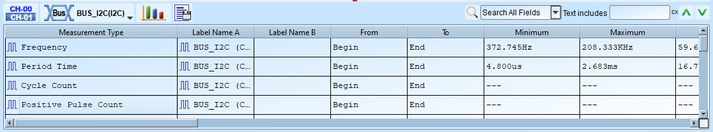

# Navigate Report

## Overview

The report area is the place that you can find the analysis results of the captured data.
Mostly you will use the report area to view the protocol decode results.

There are several kinds of reports you can view here:

- [Protocol decoder result](navigate-report.md#protocol-decoder-report) (varies across different protocols)

<figure markdown>
  
</figure>

- [Transition report](navigate-report.md#transition-report) (0, 1 logic levels along with timestamps)

<figure markdown>
  
</figure>

- [Waveform statistics](navigate-report.md#waveform-statistics) (period, frequency, edge count, etc.)

<figure markdown>
  
</figure>

## Transition report

Display the logic level transitions logs of each channel.

Example:

| Timestamp (hh\:mm\:ss.ms.us.ns) | CH-00 | CH-01 | CH-02 | CH-03 |
|-------------------------------|------|------|------|------|
| 12:00:00.000.000.000 | 0 | 1 | 1 | 0 |
| 12:00:01.000.000.752 | 1 | 1 | 0 | 1 |
| 12:00:02.000.001.999 | 1 | 0 | 0 | 0 |

## Waveform statistics

Perform automated measurements on signal characteristics. This is post-processing analysis feature. That is to say, it does not required to be preconfigured before capturing. After you got your data, you can simply click the measurement item you want to measure. The software automatically calculates and refreshes the measurement values for you.

### Available measurement items

| Measurement item | Description |
|------------------|-------------|
| Period | Time between consecutive rising (or falling) edges |
| Frequency | Number of cycles per second |
| Edge count | Total number of transitions |
| Cycle count | Total number of complete cycles |
| Positive cycle count | Number of high pulses |
| Negative cycle count | Number of low pulses |
| Positive pulse count | Count of positive pulses |
| Negative pulse count | Count of negative pulses |
| Positive pulse width | Duration of high pulses |
| Negative pulse width | Duration of low pulses |
| Channel-to-channel rising delay | Time from channel A rising to channel B rising |
| Channel-to-channel falling delay | Time from channel A falling to channel B falling |
| Channel rising to channel falling delay | Time from channel A rising to channel B falling |
| Channel falling to channel rising delay | Time from channel A falling to channel B rising |
| Phase delay | Phase relationship between two signals |

### Configuration

1. **Select channel**: Choose which channel to measure
2. **Select measurement type**: Pick from available statistics (see the table above)
3. **Set range (optional)**: Use cursors to limit measurement to a specific range, the default range is the entire waveform area

## Protocol decoder report

To learn more about the different columns that are used for our built-in analyzers, 
please refer to the [Protocols](../../protocols/index.md) tab page to find your desired protocol. Here are several quick links to the most common protocols:

-   :material-open-in-new:{ .middle } I2C

    ---

    See more details about I2C decode and trigger settings.

    [:octicons-arrow-right-24: Decode Settings](../protocols/i2c.md)

    [:octicons-arrow-right-24: Trigger Settings](../protocols/i2c.md)

-   :material-open-in-new:{ .middle } MIPI I3C

    ---

    See more details about MIPI I3C decode and trigger settings.

    [:octicons-arrow-right-24: Decode Settings](../protocols/i3c.md)

    [:octicons-arrow-right-24: Trigger Settings](../protocols/i3c.md)

-   :material-open-in-new:{ .middle } SPI

    ---

    See more details about SPI decode and trigger settings.

    [:octicons-arrow-right-24: Decode Settings](../protocols/spi.md)

    [:octicons-arrow-right-24: Trigger Settings](../protocols/spi.md)

-   :material-open-in-new:{ .middle } UART

    ---

    See more details about UART decode and trigger settings.

    [:octicons-arrow-right-24: Decode Settings](../protocols/uart.md)

    [:octicons-arrow-right-24: Trigger Settings](../protocols/uart.md)

## Report Storage

### 4. Save Report Contents

Export report contents as text files for documentation or further analysis.

**Supported formats:**

- .CSV (Comma-Separated Values)
- .TXT (Plain text)

**What's included:**

- Decode results
- Timestamps
- Channel states
- Customized report columns

**How to save:** Click the save button in the report window toolbar.

---

## Tips And Best Practices

### Measurement Range Selection

- Use **cursors** to define the measurement range for more accurate statistics
- Measure only the relevant portion of long captures to avoid averaging effects
- Clear cursor selection to measure the entire waveform

---

### Efficient Measurement Workflows

**Compare multiple channels:**

1. Set up measurement type on first channel
2. Drag to copy to all channels you want to compare
3. Review results in report area

**Analyze single signal thoroughly:**

1. Drag multiple measurement types onto one channel name
2. View comprehensive signal characteristics
3. Export results for documentation

**Tips:**

- Resize report area by dragging the divider
- Use row numbers for easier reference (enable in preferences)
- Right-click in report for context menu options

---

### Report Organization

- Customize report columns using [Customized Report Settings](bus-decode.md#customized-report-settings)
- Show row numbers for easier reference (enable in [system environment settings](preferences.md#report-options))
- Include timestamp information for precise time correlation
