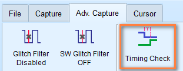
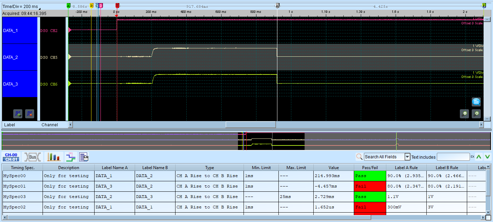

# Power Sequence Validation 

!!! note

    This feature is not supported on [TravelBus series](https://www.acute.com.tw/en/product/217) products.

## Overview

In the previous sections, we introduced [Waveform Statistics](navigate-report.md#waveform-statistics) and [Cursor](cursor.md) for you to perform measurement analysis on your captured data. With both tools, we can apply to various applications within debugging.

This is important in modern electronic systems. Some use cases such as:

- Power On/Off sequence verification on motherboards
- Repeated measurement sequences
- Design verification

In this section, we will introduce how to further add restrictions on these measurements to ensure these timing meets our requirements, to ensure the step-by-step power sequence of supplying and removing power to the components are correct and prevent from damage.

## Step-by-step workflow

1. Find the `Timing Check` button in the **Adv. Capture** tab of the toolbar and click it to open the timing check dialog.

    <figure markdown>
      { width="400" }
    </figure>

2. Choose the configuration (.csv) file you want to use for.
3. Choose which mode to enter, either **Timing Check** or **H/W Strap**.
4. After the configuration is set, start the capture by clicking the **Start** button.
5. Once finished, the software will analyze the results and display the Pass/Fail status for each measurement.

A snapshot of the timing check report is shown below:

<figure markdown>
  { width="800" }
</figure>

## Configuration File Format

Here we start defining how we construct the configuration file. The configuration file is in CSV format and is composed of multiple sections, which define the capture settings we need.

**Configuration file format requirements**

- Field names at the beginning of each section
- Comma-separated values
- Semicolon (;) at the end of each section
- Comments after double slash (//) are ignored

Valid format examples:

``` linenums="1"
[SampleRate]
200MHz
;
```

``` linenums="1"
[DigitalSampleRate]
25MHz
;
```

If you need sample files for reference, please contact us at [service@acute.com.tw](mailto:service@acute.com.tw).

## Configuration Cheat Sheet

### SampleRate

Input the sample rate value, Units: **MHz**, **KHz**, **Hz**.

Example:

``` linenums="1"
[SampleRate]
200MHz
;
```

!!! note

    The maximum sampling rate range that can be used will be affected by the number of channels and trigger types. The minimum sampling rate cannot be lower than **100 kHz**.

If `SampleRate` is set, both `AnalogSampleRate` and `DigitalSampleRate` will be set to the same value.

### AnalogSampleRate

!!! note

    This configuration is only available for [Mixed-Signal Oscilloscope](https://www.acute.com.tw/en/product/214) series.

Input the analog sample rate value, Units: **MHz**, **KHz**, **Hz**.

Example:

``` linenums="1"
[AnalogSampleRate]
100MHz
;
```

### DigitalSampleRate

Input the digital sample rate value, Units: **MHz**, **KHz**, **Hz**.

Example:

``` linenums="1"
[DigitalSampleRate]
100MHz
;
```

### ChannelNumber

!!! note

    This is only available for [TravelLogic](https://www.acute.com.tw/en/product/218) series.

!!! note

    The number of channels available will vary depending on the sample rate and whether transitional storage mode is enabled/disabled.

Specify the number of channels to use.

| Sample rate | LA Non-Transition | LA Transition |
|-------------|-------------------|---------------|
| 2 GHz | 0:3 (4 channels) | 0:2 (3 channels) |
| 1 GHz | 0:7 (8 channels) | 0:5 (6 channels) |
| 500 MHz | 0:15 (16 channels) | 0:11 (12 channels) |
| 250 MHz, 200MHz | 0:31 (32 channels) | 0:23 (24 channels) |

Example:

``` linenums="1"
[ChannelNumber]
24
;
```

### RecordLength

Set the recording memory depth. Units: **MB**, **Mb**.

The maximum recording memory depth depends on the different models. The value cannot be lower than 16 Mb.

Example:

``` linenums="1"
[RecordLength]
100Mb
;
```

### TransitionalMode

Enable or disable transitional storage mode. 

Set to **1** to enable transitional storage mode, **0** to disable.

Example:

``` linenums="1"
[TransitionalMode]
1 // Transitional storage mode ON
;
```

!!! note

    This is ignored when analog channels are used with [Mixed-Signal Oscilloscope](https://www.acute.com.tw/en/product/214) series.

### Threshold

Configure voltage thresholds for logic level detection. Unit: **mV** or **V**. 

For [TravelLogic](https://www.acute.com.tw/en/product/218) series, the voltage threshold range is ±5V.

For [Mixed-Signal Oscilloscope](https://www.acute.com.tw/en/product/214) series, the voltage threshold range is ±20V.

Example:

``` linenums="1"
[Threshold]
1.6V // Ch 00-07
1.5V // Ch 08-15
1.2V // Ch 16-23 or secondary for Ch00-07
2.5V // Ch 24-31 or secondary for Ch08-15
;
```

!!! note

    For TravelLogic series, when the Schmitt circuit function is enabled, Channel 16-31 will turn into the secondary reference threshold voltage. Mixed-Signal Oscilloscope series are not affected.

### UseSchmittCircuit

For [TravelLogic](https://www.acute.com.tw/en/product/218) series, set to **1** to enable Schmitt circuit function, **0** to disable. This will affect the significance of the parameters of the voltage level, and the maximum number of available channels will drop to 16 channels.

For [Mixed-Signal Oscilloscope](https://www.acute.com.tw/en/product/214) series, this parameter is used to enable hardware Schmitt circuit hysteresis function, and the number of available channels will not be affected.

Example:

``` linenums="1"
[UseSchmittCircuit]
1 // Input 1 to enable Schmitt circuit
;
```

### Hysteresis

!!! note

    This parameter is only available for [Mixed-Signal Oscilloscope](https://www.acute.com.tw/en/product/214) series.

Enable or disable hardware Schmitt circuit hysteresis function. Set to **1** to enable, **0** to disable.

Example:

``` linenums="1"
[Hysteresis]
1 // Input 1 to enable hardware Schmitt circuit hysteresis function
;
```

### Channel

Channel configuration and their properties respectively. Columns are defined as follows:

1. Channel selection: `CH0` (for digital channel 0), `CH(A)0` (for analog channel 0)
2. Label name: Up to 31 alphanumeric characters
3. Mode (*optional*): *TimingCheck*, *HwStrap*, or *TimingCheck+HwStrap*

| Mode | Description |
|------|-------------|
| TimingCheck | Channel only for timing check, hidden in H/W strap |
| HwStrap | Channel only for hardware strap, hidden in timing check |
| TimingCheck+HwStrap | Available in both modes |

4. Expected maximum voltage (*optional*): For analog channels, units: **mV**, **V**
5. Expected minimum voltage (*optional*): For analog channels, units: **mV**, **V**

Example (for digital channels):

``` linenums="1"
[Channel]
CH20, MyData0, HwStrap
CH22, MyData1, TimingCheck
CH24, MyData2, TimingCheck+HwStrap
;
```

Example (for analog channels):

``` linenums="1"
[Channel]
// (Analog Channel settings. ONLY for Mixed-Signal Oscilloscope series)
CH(A)1, VCC (1.8V) //Analog CH1, Using the default voltage division and offset
CH(A)2, VDD (1.5V) //Analog CH2, Using the default voltage division and offset
CH(A)3, AAA, TimingCheck, 1.5V // Analog CH3, Set up the max voltage division
CH(A)4, BBB,, 1.0V // Analog CH4, Set up the max voltage division
CH(A)5, CCC,, 2.0V, 1.0V // Analog CH5, Set up the max & min voltage division
;
```

!!! tip

    This section accepts multiple lines of input.

### AnalogChannel

!!! note

    This section is only available for [Mixed-Signal Oscilloscope](https://www.acute.com.tw/en/product/214) series.

Configure analog channels and their properties respectively. Columns are defined as follows:

1. Channel selection: `CH(A)0` (for analog channel 0). for MSO3000 series, use `DSO CH1` for analog channel 1.
2. Label name: Up to 31 alphanumeric characters
3. Voltage division: 
    
    Units: **V**, **mV**

4. Voltage offset:

    Units: **V**, **mV**

5. (*optional*) Probe attenuation

    !!! note

        Only available for MSO3000 series.


6. (*optional*) Bandwidth Limit: Units: **FULL**, **20MHz**, **100MHz**

    !!! note

        Only available for MSO3000 series.


7. (*optional*) Coupling: Units: **DC**, **AC**

    !!! note

        Only available for MSO3000 series.

Example:

``` linenums="1"
[AnalogChannel] // MSO3K settings sample
// Analog CH1, display name is MyVolt1, voltage division 1V, voltage offset +1.0 division, x10 probe attenuation, FULL bandwidth, DC coupling
DSO CH1, MyVolt1, 1V, 1.0, 10, FULL, DC

// Analog CH4, display name is MyVolt2, voltage division 500mV, voltage offset -3.0 division, x1 probe attenuation, bandwidth limited to 20MHz, AC coupling
DSO CH4, MyVolt2, 500mV, -3.0, 1, 20MHz, AC
;

[AnalogChannel] // MSO2K settings sample
CH(A)3, MyVolt5, 1V, 1.0 //Analog CH3, display name is MyVolt5, voltage division 1V, voltage offset +1.0 division
;
```

### Trigger

A single line input that defines the trigger conditions. Columns are defined as follows:

1. Trigger channel label: Reference to label defined in `Channel`
2. Trigger type:

    - `CHANNEL_LOW`
    - `CHANNEL_HIGH`
    - `CHANNEL_ANY`
    - `CHANNEL_RISING`
    - `CHANNEL_FALLING`
    - `CHANNEL_CHANGING`
    - `ANALOG_CH_RISING` (only for Mixed-Signal Oscilloscope series)
    - `ANALOG_CH_FALLING` (only for Mixed-Signal Oscilloscope series)

3. Mode (*optional*): *TimingCheck*, *HwStrap*, or *TimingCheck+HwStrap*
4. Voltage (*optional*): For analog channels, units: **mV**, **V**

Example:

Triggered when MyData2 channel label (which corresponds to configuration in [`Channel`](#channel)) rises in HwStrap mode

``` linenums="1"
[Trigger] 
MyData1, CHANNEL_RISING, HwStrap
;
```

Triggered when MyData2 channel label (which corresponds to configuration in [`Channel`](#channel)) rises in TimingCheck mode

``` linenums="1"
[Trigger] 
MyData2, CHANNEL_RISING, TimingCheck
;
```

Analog channel rising (VCC (1.8V)) 

``` linenums="1"
[Trigger] //Analog Trigger (Only for MSO series)
// Triggered when Analog Ch1 rising equal or more than 1.5V
VCC (1.8V), ANALOG_CH_RISING, TimingCheck, 1.5V
;
```

### TriggerPosition

Set the trigger point position in memory. Units: **%**.

Example:

``` linenums="1"
[TriggerPosition]
20% // Set trigger position to 20%
;
```

### RangeStart

Set the measurement start position using cursor reference.

Acceptable values: **CursorA** to **CursorZ**.

Example:

``` linenums="1"
[RangeStart]
CursorS // Measurement starts from Cursor S
;
```

### RangeEnd

Set the measurement end position using cursor reference.

Acceptable values: **CursorA** to **CursorZ**.

Example:

``` linenums="1"
[RangeEnd]
CursorE // Measurement ends at Cursor E
;
```

### TimingCheck

Multiple lines input that defines the timing measurements and specifications. Columns are defined as follows:

1. Specification name: Only for display purpose
2. Specification description: Only for display purpose
3. Target CH A: Reference to channel label defined in [`Channel`](#channel)
4. Target CH B: Reference to channel label defined in [`Channel`](#channel)
5. Timing check types:

    - `CHA_RISE_TO_CHB_RISE`: First CH A rising edge to first CH B rising edge

    <figure markdown>
      { width="400" }
    </figure>

    - `CHA_RISE_TO_CHB_FALL`: First CH A rising edge to first CH B falling edge

    <figure markdown>
      { width="400" }
    </figure>

    - `CHA_FALL_TO_CHB_RISE`: First CH A falling edge to first CH B rising edge
    
    <figure markdown>
      { width="400" }
    </figure>

    - `CHA_FALL_TO_CHB_FALL`: First CH A falling edge to first CH B falling edge
    
    <figure markdown>
      { width="400" }
    </figure>

    - `CHA_RISE_TO_NEXT_CHB_RISE`: Next CH B rising edge comes after first CH A rising edge

    <figure markdown>
      { width="400" }
    </figure>

    - `CHA_RISE_TO_NEXT_CHB_FALL`: Next CH B falling edge comes after first CH A rising edge

    <figure markdown>
      { width="400" }
    </figure>

    - `CHA_FALL_TO_NEXT_CHB_RISE`: Next CH B rising edge comes after first CH A falling edge
    
    <figure markdown>
      { width="400" }
    </figure>

    - `CHA_FALL_TO_NEXT_CHB_FALL`: Next CH B falling edge comes after first CH A falling edge

    <figure markdown>
      { width="400" }
    </figure>
    
    - `CHA_RISE_TO_PREV_CHB_RISE`: First CH A rising edge to previous CH B rising edge
    
    <figure markdown>
      { width="400" }
    </figure>
    
    - `CHA_RISE_TO_PREV_CHB_FALL`: First CH A rising edge to previous CH B falling edge

    <figure markdown>
      { width="400" }
    </figure>

    - `CHA_FALL_TO_PREV_CHB_RISE`: First CH A falling edge to previous CH B rising edge

    <figure markdown>
      { width="400" }
    </figure>

    - `CHA_FALL_TO_PREV_CHB_FALL`: First CH A falling edge to previous CH B falling edge

    <figure markdown>
      { width="400" }
    </figure>

    - `CHA_RISE_TO_FAREST_CHB_RISE`
    
    <figure markdown>
      { width="400" }
    </figure>
    
    - `CHA_RISE_TO_FAREST_CHB_FALL`
    
    <figure markdown>
      { width="400" }
    </figure>
    
    - `CHA_FALL_TO_FAREST_CHB_RISE`

    <figure markdown>
      { width="400" }
    </figure>

    - `CHA_FALL_TO_FAREST_CHB_FALL`
    
    <figure markdown>
      { width="400" }
    </figure>
    
    - `CHA_HIGH_TIME`
    - `CHA_LOW_TIME`
    - `CHA_HIGH_PULSE_COUNT`
    - `CHA_LOW_PULSE_COUNT`
    - `CHA_RISE_EDGE_COUNT`
    - `CHA_FALL_EDGE_COUNT`
    - `CHA_EDGE_COUNT`

    The following measurements are only available for [Mixed-Signal Oscilloscope](https://www.acute.com.tw/en/product/214) series.

    - `CHA_SLEW_RATE`
    - `CHA_V_MAX`
    - `CHA_V_MIN`
    - `CHA_V_PP`
    - `CHA_V_HIGH`
    - `CHA_V_LOW`
    - `CHA_V_AMPLITUDE`
    - `CHA_V_MEAN`
    - `CHA_RISE_TIME`
    - `CHA_FALL_TIME`

6. Minimum limit:

    For time measurements, units: **ns**, **us**, **ms**, **s**

    For voltage measurements, units: **mV**, **V**

    For slew rate measurements, units: **mV/us**, **mV/ms**, **V/us**, **V/ms**

    `X` stands for no limitation.

7. Maximum limit:

    For time measurements, units: **ns**, **us**, **ms**, **s**

    For voltage measurements, units: **mV**, **V**

    For slew rate measurements, units: **mV/us**, **mV/ms**, **V/us**, **V/ms**

    `X` stands for no limitation.

8. (*optional*) CH A reference voltage
    
    For analog channels, units: **mV**, **V**
    
    Example: 90% means 90% of the reference channel voltage.
    
    Example: 1.5V for directly set the reference voltage.

9. (*optional*) CH B reference voltage
    
    For analog channels, units: **mV**, **V**
    
    Example: 90% means 90% of the reference channel voltage.

    Example: 1.5V for directly set the reference voltage.

10. (*optional*) CH A pass count

    Ignore N times of the condition is met.

11. (*optional*) CH B pass count

    Ignore N times of the condition is met.

Example:

``` linenums="1"
[TimingCheck]
Spec_00, Desc_00, MyData0, MyData1, CHA_RISE_TO_CHB_RISE, 1ns, 10ms
Spec_01, Desc_01, MyData1, MyData2, CHA_FALL_TO_CHB_RISE, X, 100ms
Spec_02, Desc_02, MyData2, MyData3, CHA_FALL_TO_CHB_FALL, 100us, X
;
```

Analog channel example (Mixed-Signal Oscilloscope series ONLY)

``` linenums="1"
[TimingCheck]
Spec_00, Desc_00, VDD (1.5V), VCC (1.8V), CHA_RISE_TO_CHB_RISE, 10ms, 20ms, 90%, 90%, 0, 0
Spec_01, Desc_01, VDD (1.5V), VCC (1.8V), CHA_RISE_TO_CHB_RISE, 1ms, 5ms, 80%, 80%, 0, 0
Spec_02, Desc_02, CH0 (3.3V), CH0 (3.3V), CHA_SLEW_RATE, 20mV/ms, 50mV/us // Rising
Spec_03, Desc_03, CH0 (3.3V), CH0 (3.3V), CHA_SLEW_RATE, 50mV/ms, 20mV/us // Falling
Spec_04, Desc_04, CH0 (3.3V),, CHA_V_HIGH, 500mV, 600mV // Voltage High 
Spec_05, Desc_05, CH0 (3.3V),, CHA_RISE_TIME, 50ms, 100ms // Rise Time
;
```

### HWStrap

A single line input that defines the hardware strap conditions. Columns are defined as follows:

1. Target Channel: `CH0` (for digital channel 0), only for display purpose.
2. Target Channel Label: Reference to label defined in [`Channel`](#channel)
3. Reference Channel Label: Reference to label defined in [`Channel`](#channel)
4. Reference Channel Type:

    | Reference Channel Type |
    |------------------------|
    | `CHANNEL_RISING` |
    | `CHANNEL_FALLING` |
    | `CHANNEL_CHANGING` |
    
5. Specification Value: Enter 0 or 1 for expected value, failed on result is not as expected.

6. CH A Ref. Voltage: For analog channels

    Units can be in voltages (**mV**, **V**) or percentages (**%**).

    Example: 90% means 90% of the reference channel voltage.

    Example: 1.5V for directly set the reference voltage.

7. CH B Ref. Voltage: For analog channels

    Units can be in voltages (**mV**, **V**) or percentages (**%**).

    Example: 90% means 90% of the reference channel voltage.

    Example: 1.5V for directly set the reference voltage.

8. CH A Pass Counts: 

    Ignore N times of the condition is met.

9. CH B Pass Counts: Enter 0 or 1 for expected value.

    Ignore N times of the condition is met.

Example:

``` linenums="1"
[HwStrap] 
CH0, MyData0, MyData1, CHANNEL_RISING, 1
CH1, MyData1, MyData2, CHANNEL_RISING, 1
CH2, MyData2, MyData3, CHANNEL_FALLING, 0
;
```

Analog channel example (Mixed-Signal Oscilloscope series ONLY)

```
[HwStrap] //Analog Channel (MSO series ONLY)
CH(A)1, VCC (1.8V), VDD (1.5V), CHANNEL_RISING, 1, 90%, 90%, 0, 0
;
```
