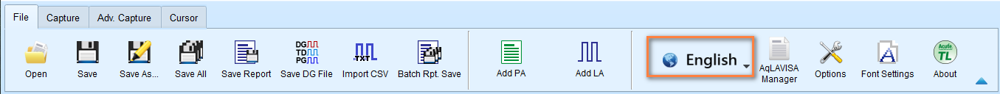
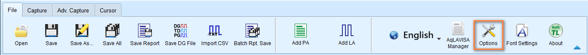
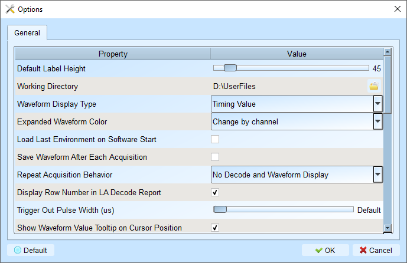

# System environment options

## Language

<figure markdown>
  { width="800" }
</figure>

**Available languages**

- English
- Traditional Chinese (繁體中文)
- Simplified Chinese (简体中文)

## Options

<figure markdown>
  { width="800" }
</figure>

<figure markdown>
  { width="400" }
</figure>

All values marked **bold** are the default values.

- `Default Label Height`: **45** - Modify the default channel height in the waveform area.
- `Working Directory`: Location for temporary files and waveforms during operation.

    - For Windows users: default to **C:\Users\<username>\Documents\Acute\<ProductName>**

- `Waveform Display Type`: **Time value** - Choose what to display between waveform edges:

    - Time value: Show duration of high/low states
    - Logic value: Show 0/1 on the waveform
    - None: Clean waveform view
    - Time value (Without Unit): Show duration of high/low states without unit
    
- `Expanded Waveform Color`: **Channel by channel** - Enable different colors for each channel.

    - Same as origin: Unified color for all channels.
    - Channel by channel: Enable different colors for each channel.

- `Load Last Environment On Software Start`: **Disabled** - Restore previous settings (not waveforms) when launching the application.

- `Save Waveform After Each Acquisition`: **Disabled** - Automatically save to working directory after capture. This is useful for repeated captures.

- `Repeat Acquisition Behavior`: **No Decode and Waveform Display** - Configure waveform decoding display during repeat captures.

    - No Decode and Waveform Display: Faster acquisition, analyze later
    - Apply Decode and Waveform Display (1s Gap): Update waveform decoding display every 1 second
    - Apply Decode and Waveform Display (2s Gap): Update waveform decoding display every 2 seconds
    - Apply Decode and Waveform Display (5s Gap): Update waveform decoding display every 5 seconds

    *Trade-off*: Faster updates provide real-time feedback but may impact performance with complex decodes.

- `Display Row Number In LA Decode Report`: **Enabled** - Show row numbers on the left side of the report area.

- `Trigger Out Pulse Width (μs)`: **Default** - Default length from trigger point to end of capture.

- `Show Waveform Value Tooltip On Cursor Position`: **Enabled** - Display channel numbers and bus decode names when hovering over cursor.

- `Auto-reconnect Device`: **Enabled** - Automatically reconnect when device is re-plugged after going offline.

- `Show Channel Information In Waveform Display`: **Enabled** - Display channel numbers in waveform area.
- `Show Value Information In Waveform Display`: **Disabled** - Display current logic level in waveform area.
- `Show Trigger Information In Waveform Display`: **Disabled** - Display trigger setting values on channel labels.
- `Show Channel Activity In Waveform Display`: **Disabled** - Summarize edge transitions for each channel.

- `Use Multicore Processing`: **Enabled** - Enable multi-core CPU usage to speed up data processing.

- `Display Waveform Time Scale Dash Line`: **Enabled** - Add vertical lines to align waveform area with report area.
- `Use Multicore Processing`: **Enabled** - Enable multi-core CPU usage to speed up data processing.
- `Display Report Timestamp Information`: **Show Timing with Date Time Info** - Choose timestamp format for report display.

    - Show Timing Info: Show timing information in the format of HH:MM:SS.SSS
    - Show Timing Info With Date Time Info: Show timing information in the format of YYYY-MM-DD HH:MM:SS.SSS
    - Show Sample Count: Show timing information in the format of 1234567890

- `Show Cursor Position In Decode/Transition Report`: **Enabled** - Display cursor location in the report time field.

- `Show Cursor Separate Time On Cursor Bar`: **Enabled** - Show time intervals between cursors on the cursor bar.

- `Cursor Font Size In Report Area`: **6** - Adjust font size for cursor positions in reports (4 - 15).

- `Report Data Display Byte Number`: **8** - Set the number of bytes to display per report field (options: 8, 16, 24, 32).

- `Display Waveform Time Scale Dash Line`: **Enabled** - Add vertical lines to align waveform area with report area.

- `Enable Label Combine By Mouse Dragging`: **Enabled** - Drag one channel label onto another to combine channels.

- `Max. Logic Analyzer Cursor Measurement Tab Count`: **3** - Set number of cursor measurement groups (3-10).

- `Detail Report Byte Numbers`: **4096** - Limit the number of bytes displayed in each detail report (options: 1024, 2048, 4096, 8192, 16384, 32768, 65536).

- `Stop Waveform Acquisition When Cursor Reaches End Of Capture`: **Disabled** - Stop waveform acquisition when cursor reaches end of capture.

## Font Settings

- Period and value display in waveform area
- Channel labels
- User notes
