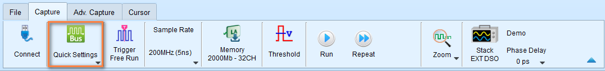
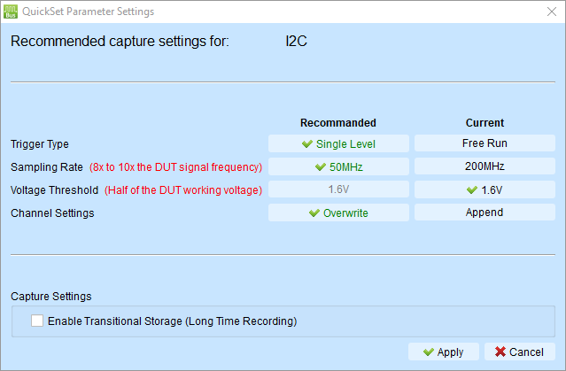

# Quick Start

A step-by-step walkthrough to help you capture, analyze, and export your first waveform with the Logic Analyzer.

## Before you begin

Make sure you have:

- A Logic Analyzer hardware plugged into your PC USB port
- A signal source available for testing (e.g., I2C sensor, SPI device, oscillator, etc.)
- Connect the signal wires between the Logic Analyzer hardware and the signal source.
- The latest version of the Logic Analyzer software installed
   
    * If not, check the [Software Installation](../software/download.md) guide.

We take I2C as an example in this guide shortly.

## Step 1: Start a Logic Analyzer mode session

### 1.1 Connect the Device

1. Connect the Logic Analyzer to your computer via USB
2. Wait for the device driver to load
3. Launch the TravelLogic software

### 1.2 Verify Connection

Check the **status bar** at the bottom of the window:

- **Green indicator:** Device connected and ready
- **Red indicator:** Device not detected - check USB connection

**Model information** should display in the status bar (e.g., "LA4136B Connected").

**Troubleshooting:** If device isn't detected, see [Troubleshooting](../troubleshooting/additional-resources.md).

## Step 2: Capture Settings

### 2.1 Setup with Quick Settings (Recommended for Beginners)

Quick Settings provides preset configurations for common protocols, saving time on manual setup. It immediately configure required channels and related settings. When configuring specific bus decode, the sampling rate and threshold are automatically set according to default conditions.

If you're trying to capture a common protocol like I2C:

1. Click on the [**Quick Settings**](capture-settings.md#quick-settings) button in the toolbar

    <figure markdown>
        { width="800" }
    </figure>

2. Select the protocol you want to capture from the dropdown list. Here we select I2C and there will be a dialog popup to configure the parameters for I2C.

    <figure markdown>
        { width="600" }
    </figure>

    It will make some changes to the capture settings to make it suitable for I2C. As you can see,

    * **Sample rate** is set from 200 MHz to 50 MHz (usually pick the 10 times of the signal frequency)
    * **Threshold** is set to 1.6V (half of the supply voltage, which is 3.3V most of the time)
    * **Trigger type** is set to Single Level Trigger (to help us capture the data when the signal changes)
    * **Channel Settings** shows **Overwrite**, which means the software will overwrite the existing channel configuration with the new ones for I2C.

    Typically, you don't need to change the parameters for I2C. Just click **Apply** to finish the configuration.
 
    !!! note

        You can always pick on the current settings by clicking the parameters listed in the **Current** column.

3. (Optional) You can enable the [**Transitional Storage**](capture-settings.md#transitional-storage) to capture the data for longer time. Leave it unchecked for now.

4. Click **Apply**

Skip to [Step 3: Capture Data](quick-start.md#step-3-capture-data) after you have configured the capture settings.

### 2.2 Manual Channel Configuration (Advanced)

As mentioned above, Quick Settings is a good choice for beginners. But if you want to configure the channels manually, you can do the following steps.

For custom configurations or protocols not in Quick Setting:

1. Click the **"+"** (Add Label) button in the channel label area
2. Select channels you want to monitor
3. Click on each channel label to rename it (e.g., "Clock", "Data", "Enable")
4. Connect your probe tips to the signal source

**Channel assignment tips:**

- Use descriptive names that match your circuit
- Start with fewer channels (4-8) until familiar
- Group related signals together

## Step 3: Capture Data

### 3.1 Start Capturing Data

1. Click the **Start** button in toolbar (or press **Enter**)
2. The status changes to "Waiting for trigger"

### 3.2 Trigger the Capture

**For automatic triggers:**

- Generate activity on your circuit (e.g., send I2C transaction)
- Capture stops automatically when trigger condition is met

**For manual trigger:**

- Click **Stop** button to set trigger point at current moment

<!-- ### Choose a Trigger Type

For your first capture, use **Single Level Trigger**:

1. Click the **Trigger** button in the toolbar
2. Select **Single Level** from the dropdown

### Configure the Trigger Condition

Set the trigger to capture when your signal changes:

**For a clock signal:**

1. Find the clock channel row in the trigger dialog
2. Set it to **↑** (Rising edge)
3. Set all other channels to **X** (Don't care)

**For I2C/SPI protocols:**

Quick Setting already configured this - the trigger activates on protocol Start condition.

**For testing/learning:**

Use **Manual trigger** - capture starts immediately when you click Stop.

### Set Pass Count

- Leave at **0** to trigger on the first match
- Set to higher values to skip initial transactions

**Click OK** to apply trigger settings.

See: [Capture Settings - Trigger](capture-settings.md#trigger-parameter-setting) for advanced trigger options. -->

### 3.3 Review Captured Data

Once capture completes:

- Waveform appears in the waveform area
- Trigger point is marked (usually center of display)
- Status bar shows "Stopped"

**First-time tips:**

- Use mouse wheel to zoom in/out
- Click and drag to pan left/right
- Look for your expected signal patterns

## Step 4: Decode Protocol (Optional)

If you captured a bus protocol, decode it to see transactions.

### 4.1 Add Protocol Decode

**If you used Quick Setting:** Protocol decode is already configured - skip to 8.2.

**For manual decode:**

1. Click **"+"** → **Add Protocol Decode** in channel label area
2. Select protocol type (I2C, SPI, UART, etc.)
3. Assign channels to protocol signals
4. Configure protocol parameters (baud rate, address format, etc.)
5. Click **OK**

### 4.2 View Decode Results

**In waveform area:**

- Protocol annotations appear above waveform
- Shows addresses, data, ACK/NAK, etc.

**In report area:**

- Detailed transaction table appears below waveform
- Each row represents one transaction
- Columns show address, data, control signals

### 4.3 Interpret Results

**For I2C:**

- Look for START condition
- Check slave address (7-bit or 10-bit)
- Verify data bytes
- Confirm ACK/NAK responses

**For SPI:**

- Check chip select (CS) assertion
- Verify MOSI data (master → slave)
- Verify MISO data (slave → master)
- Count clock cycles

**For UART:**

- Check start/stop bits
- Verify baud rate detection
- Look for framing errors
- Check parity if enabled

See: [Bus Decode](bus-decode.md) for all supported protocols.

## Step 5: Save and Export

Preserve your work and share results.

### 5.1 Save Waveform File

1. Click **File** → **Save** (or **Save As**)
2. Choose location and filename
3. Save as **.TLW** format (preserves all settings)
4. Click **Save**

**Benefit:** You can reopen the file later with all decode and cursor settings intact.

### 5.2 Export Decode Report

1. In the **Report Area**, click the **Save** button
2. Choose **CSV** or **TXT** format
3. Select location and filename
4. Click **Save**

**Use cases:**

- Import to Excel for analysis
- Include in test reports
- Share with team members

### 5.3 Export for Other Tools

**For waveform viewers (GTKWave, etc.):**

1. Click **File** → **Save As**
2. Select **Value Change Dump (*.vcd)** format
3. Save file

**For MATLAB analysis:**

1. Click **File** → **Save As**
2. Select **MATLAB array file (*.m)** format
3. Save file

See: [Export Data](export-data.md) for all export options.

## Step 6: Further Analysis (Optional)

Cursors let you measure time between events precisely.

### 6.1 Add Cursors

1. Hold **Shift** key
2. Click on the waveform to place first cursor (Cursor 1)
3. Click again to place second cursor (Cursor 2)

**Result:** Time difference (ΔT) displays at the bottom of the screen.

### 6.2 Move Cursors

1. Click and drag cursor line to reposition
2. Or use **arrow keys** for fine adjustment (select cursor first)

### 6.3 Common Measurements

**Measure clock period:**

- Place Cursor 1 on rising edge
- Place Cursor 2 on next rising edge
- ΔT = clock period
- Frequency = 1 ÷ ΔT

**Measure pulse width:**

- Place Cursor 1 on rising edge
- Place Cursor 2 on falling edge
- ΔT = high pulse width

**Measure setup time:**

- Place Cursor 1 on data change
- Place Cursor 2 on clock edge
- ΔT = setup time

See: [Cursor Measurements](cursor.md) for advanced cursor operations.

### Step 6.4: Use Statistics and Measurements

Generate automated measurements on your signals.

### 6.4.1 Open Waveform Statistics

1. In the **Report Area toolbar**, select **Waveform Data Statistics**
2. Choose the channel you want to measure
3. Select measurement type from dropdown

### 6.4.2 Common Measurements

**Frequency measurement:**

- Select channel (e.g., Clock signal)
- Choose **Frequency** measurement
- Result appears in report area

**Period measurement:**

- Select channel
- Choose **Period** measurement
- Shows time between consecutive edges

**Pulse width:**

- Select channel  
- Choose **Positive pulse width** or **Negative pulse width**
- Shows duration of high/low states

### 6.4.3 Channel-to-Channel Delay

Measure timing relationship between two signals:

1. Select first channel
2. Choose delay measurement type (e.g., "Channel rising to channel falling delay")
3. Select second channel when prompted
4. Delay time displays in report

See: [Report Area - Waveform Statistics](navigate-report.md#waveform-statistics) for all measurement types.

## Next Steps

### Improve Your Skills

- **Try different trigger types:** [Multi-level triggers](capture-settings.md#multi-level-trigger) for complex conditions
- **Explore capture modes:** [Synchronous mode](advanced-capture.md#synchronous-mode-state-analyzer) for state analysis
- **Learn annotations:** Add [text and graphics](waveform-area.md#add-text--graphic-annotations) to document findings
- **Master cursors:** Use [multiple cursors](cursor.md) for parallel measurements

### Advanced Features

- [**Power sequence timing validation**](power-sequence-validation.md): Automate checks with horiztonal timing validation
- **Mixed-signal analysis:** Combine with [Stack Oscilloscope](stack-oscilloscope.md)
- **Glitch filtering:** Remove noise with [Hardware/Software filters](advanced-capture.md#glitch-filter-settings)
- **Custom reports:** Create [customized decode reports](bus-decode.md#customized-report-settings)

### Practice Scenarios

**Scenario 1: Verify I2C Communication**

- Configure I2C decode
- Capture sensor read transaction
- Verify address and data bytes
- Measure clock frequency and duty cycle

**Scenario 2: Debug SPI Timing**

- Set up SPI decode
- Place cursors on setup and hold times
- Verify timing meets datasheet specs
- Export timing measurements

**Scenario 3: Analyze UART Issues**

- Configure UART decode with known baud rate
- Capture communication
- Check for framing errors
- Measure actual vs. expected baud rate

## Troubleshooting Tips

**Problem: Capture doesn't trigger**

- Check trigger channel is connected
- Verify signal is active (generating transitions)
- Try Manual trigger to capture anyway
- Lower trigger Pass Count to 0

**Problem: Waveform looks noisy**

- Check probe connections (loose wires?)
- Verify threshold voltage is correct
- Try [Glitch Filter](advanced-capture.md#glitch-filter-settings)
- Increase sample rate

**Problem: Decode shows errors**

- Verify channel assignments are correct
- Check sample rate is high enough (≥10× signal frequency)
- Confirm protocol settings (baud rate, clock polarity, etc.)
- Verify threshold voltage matches logic family

**Problem: Can't see enough waveform**

- Increase memory depth setting
- Adjust trigger position (more post-trigger %)
- Use [Transitional Storage](capture-settings.md#transitional-storage) for longer captures
