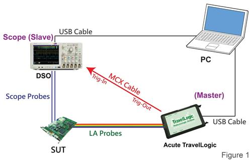
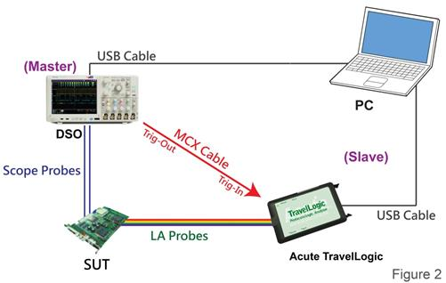
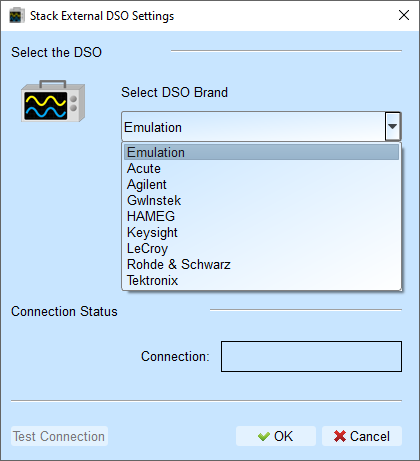

# Stack Oscilloscope

## Overview

This feature is an feature that integrates analog data captured from external oscilloscope with the digital data captured internally from the device.

**Benefits:**

- Correlate digital logic with analog waveforms
- Identify glitches and noise
- Verify timing relationships between digital and analog signals

## Stacking Cables

For Acute oscilloscopes: Standard MCX-MCX cable

<figure markdown>
  { width="100" }
</figure>

For external oscilloscopes: Optional BNC-MCX cable

<figure markdown>
  { width="100" }
</figure>

- Optional BNC-MCX cable
- Length: 50 cm or 100 cm

## Hardware connection

There are two methods for connecting the logic analyzer and oscilloscope:

- Method 1: Acute's logic analyzer as Master, External Oscilloscope As Slave

<figure markdown>
   { width="500" }
</figure>

**Direction**: Acute's logic analyzer **Trig-Out** port connect with the external oscilloscope's **Trig-In** port

- Method 2: External Oscilloscope as Master, Acute's logic analyzer as Slave

<figure markdown>
  { width="500" }
</figure>

**Direction**: External oscilloscope **Trig-Out** port connect with Acute's logic analyzer's **Trig-In** port

## Requirements

Stack Oscilloscope depends on the Virtual Instrument Software Architecture (VISA) library to be installed, provided by the oscilloscope manufacturer.

| Manufacturer | Required software |
|-------------------|-------------------|
| Acute | Acute DSO software |
| Gwinstek | GW USB driver |
| Tektronix | TEKVISA CONNECTIVITY SOFTWARE |
| Agilent/Keysight | KEYSIGHT IO LIBRARIES SUITE |
| LeCroy | NI-VISA and Drivers |
| HAMEG | NI-VISA and Drivers |
| Rohde & Schwarz | NI-VISA and Drivers |

## Software Configuration

### Select The Oscilloscope

<figure markdown>
  { width="400" }
</figure>

Choose oscilloscope brand from the dropdown list.

!!! note

    **Emulation** mode is used to load the saved log files when there is no external oscilloscope hardware connected.

### Connection Type

Select how the oscilloscope connects to the PC:

- **USB**: Direct USB connection
- **TCP/IP**: Network connection

### Connect IP (TCP/IP Mode Only)

Enter the oscilloscope's IP address when using TCP/IP connection.

**Recommended IP settings for direct crossover cable:**

- TravelLogic: 192.168.1.2
- Oscilloscope: 192.168.1.3
- Gateway: 192.168.1.1
- DHCP: OFF

If IP settings don't take effect, please try to disable and re-enable the network interface or reboot the computer.

### Test Connection / Connection Status

- **Test connection**: Verify communication with the oscilloscope
- **Connection status**: Displays the current connected oscilloscope model and automatically adds oscilloscope channels to the waveform window

## Stack Delay Compensation

When our logic analyzer triggers, the Trig-Out signal travels through the connection cable to the oscilloscope, creating a time delay. This timing delay causes misalignment between digital and analog waveforms horizontally.

**To compensate:**

1. In the waveform display, position mouse over the oscilloscope waveforms
2. Hold down the **Shift** key
3. Use the left mouse button to drag the oscilloscope waveforms to align them properly

This corrects the stack delay and synchronizes the digital and analog within the display.

<figure markdown>
  { width="500" }
</figure>

## Supported Oscilloscope Models

| Manufacturer | Model | USB | TCP/IP |
|--------------|-------|-----|--------|
| Acute | **MSO 3000 series**: MSO3124V, MSO3124H, MSO3124D, MSO3124B, MSO3124E  **TravelScope 3000 series**: TS3124V, TS3124H, TS3124B, TS3124E  **TravelScope 2000 series**: TS2202E, TS2212E, TS2212A, TS2202F, TS2212F, TS2212B, TS2212H  **DS-1000 series**: DS-1002, DS-1102, DS-1202, DS-1302 | v | |
| Gwinstek | GDS-1062A, GDS-1102A, GDS-1152A | v | | 
| | GDS-2062, GDS-2064, GDS-2072E, GDS-2074E, GDS-2102, GDS-2104, GDS-2102E, GDS-2104E, GDS-2202, GDS-2204, GDS-2202E, GDS-2204E | v | |
| | GDS 3152, GDS 3154, GDS 3252, GDS3254, GDS 3352, GDS 3354 | v | |
| HAMEG | HMO3032, HMO3034, HMO3042, HMO3044, HMO3052, HMO3054 | v | v |
| | HMO2022, HMO2024 | v | v |
| | HMO1002 | v | v |
| Keysight (Agilent) | *DSO1000A Series*: DSO1024A, DSO1022A, DSO1014A, DSO1012A, DSO1004A, DSO1002A  *DSO5000A Series*: DSO5012A, DSO5014A, DSO5032A, DSO5034A, DSO5052A, DSO5054A  *DSO6000A Series*: DSO6012A, DSO6014A, DSO6032A, DSO6034A, DSO6052A, DSO6054A, DSO6102A, DSO6104A  *DSO6000L Series*:  DSO6014L, DSO6054L, DSO6104L  *DSO7000A Series*: DSO7012A, DSO7014A, DSO7032A, DSO7034A, DSO7052A, DSO7054A, DSO7104A  *DSO7000B Series*: DSO7012B, DSO7014B, DSO7032B, DSO7034B, DSO7052B, DSO7054B, DSO7104B  *DSO9000A Series*: DSO9404A, DSO9254A, DSO9104A, DSO9064A, DSO91304A, DSO91204A, DSO90804A, DSO90604A, DSO90404A, DSO90254A  *MSO6000A Series*: MSO6012A, MSO6014A, MSO6032A, MSO6034A, MSO6052A, MSO6054A, MSO6102A, MSO6104A  *MSO7000A Series*:  MSO7012A, MSO7014A, MSO7032A, MSO7034A, MSO7052A, MSO7054A, MSO7104A  *MSO7000B Series*: MSO7012B, MSO7014B, MSO7032B, MSO7034B, MSO7052B, MSO7054B, MSO7104B  *MSO9000A Series*: MSO9404A, MSO9254A, MSO9104A, MSO9064A  *DSO-X 2000A Series*: DSO-X 2002A, DSO-X 2004A, DSO-X 2012A, DSO-X 2014A, DSO-X 2022A, DSO-X 2024A  *DSO-X 3000T Series*: DSO-X 3012T, DSO-X 3032T, DSO-X 3102T, DSO-X 3014T, DSO-X 3024T, DSO-X 3034T, DSO-X 3054T, DSO-X 3104T  *DSO-X 4000A Series*: DSO-X 4022A, DSO-X 4024A, DSO-X 4032A, DSO-X 4034A, DSO-X 4052A, DSO-X 4054A, DSO-X 4104A, DSO-X 4154A  *DSO-X 6000A Series*: DSO-X 6002A, DSO-X 6004A, DSO-X 6002A, DSO-X 6004A  *MSO-X 2000A Series*: MSO-X 2002A, MSO-X 2004A, MSO-X 2012A, MSO-X 2014A, MSO-X 2022A, MSO-X 2024A  *MSO-X 3000T Series*: MSO-X 3012T, MSO-X 3032T, MSO-X 3052T, MSO-X 3102T, MSO-X 3014T, MSO-X 3024T, MSO-X 3034T, MSO-X 3054T, MSO-X 3104T  *MSO-X 4000A Series*: MSO-X 4022A, MSO-X 4024A, MSO-X 4032A, MSO-X 4034A, MSO-X 4052A, MSO-X 4054A, MSO-X 4104A, MSO-X 4154A  *MSO-X 6000A Series*: MSO-X 6002A, MSO-X 6004A  *DSO-X 90000A Series*: DSO-X92804A, DSO-X92504A, DSO-X92004A, DSO-X91604A  *DSA 90000A Series*:  DSA91204A, DSA90804A, DSA90604A, DSA90404A, DSA90254A  *DSA-X 90000A Series*: DSA-X93204A, DSA-X92804A, DSA-X92504A, DSA-X92004A, DSA-X91604A  *DSAZ / DSOZ Series*: DSAZ634A, DSOZ634A, DSAZ632A, DSOZ632A, DSAZ594A, DSOZ594A, DSAZ592A, DSOZ592A, DSAZ504A, DSOZ504A, DSAZ334A, DSOZ334A, DSAZ254A, DSOZ254A, DSAZ204A, DSOZ204A, DSOS054A, DSOS104A, DSOS204A, DSOS254A, DSOS404A, DSOS604A, DSOS804A  *MSOS Series*: MSOS054A, MSOS104A, MSOS204A, MSOS254A, MSOS404A, MSOS604A, MSOS804A  *DSO-X 3000G Series*: DSO-X 3012G, DSO-X 3022G, DSO-X 3032G, DSO-X 3052G, DSO-X 3102G, DSO-X 3014G, DSO-X 3024G, DSO-X 3034G, DSO-X 3054G, DSO-X 3104G  *MSO-X 3000G Series*: MSO-X 3012G, MSO-X 3022G, MSO-X 3032G, MSO-X 3052G, MSO-X 3102G, MSO-X 3014G, MSO-X 3024G, MSO-X 3034G, MSO-X 3054G, MSO-X 3104G  *DSA-X90000Q Series*: DSA-X96204Q, DSO-X96204Q, DSA-X95004Q, DSO-X95004Q, DSA-X93304Q, DSO-X93304Q, DSA-X92504Q, DSO-X92504Q, DSA-X92004Q, DSO-X92004Q  *EXR400A Series*: EXR408A, EXR404A  *EXR100A Series*: EXR108A, EXR104A | v | v |
| LeCroy | *WaveRunner Series*: WaveRunner 44Xi, WaveRunner 64Xi, WaveRunner 62Xi, WaveRunner 104Xi, WaveRunner 204Xi, WaveRunner 44Xi-A, WaveRunner 62Xi-A, WaveRunner 64Xi-A, WaveRunner 104Xi-A, WaveRunner 204Xi-A, WaveRunner 44MXi, WaveRunner 64MXi, WaveRunner 104MXi, WaveRunner 204MXi, WaveRunner 44MXi-A, WaveRunner 64MXi-A, WaveRunner 104MXi-A, WaveRunner 204MXi-A, WaveRunner 6030A, WaveRunner 6050A, WaveRunner 6051A, WaveRunner 6100A, WaveRunner 6200A, WaveRunner 604Zi, WaveRunner 606Zi, WaveRunner 610Zi, WaveRunner 620Zi, WaveRunner 625Zi, WaveRunner 640Zi, WaveRunner HRO 64Zi, WaveRunner HRO 66Zi  *WaveSurfer Series*: WaveSurfer 24Xs, WaveSurfer 42Xs, WaveSurfer 44Xs, WaveSurfer 62Xs, WaveSurfer 64Xs, WaveSurfer 104Xs, WaveSurfer 24MXs-B, WaveSurfer 42MXs-B, WaveSurfer 44MXs-B, WaveSurfer 62MXs-B, WaveSurfer 64MXs-B, WaveSurfer 104MXs-B, WaveSurfer 422,WaveSurfer 424, WaveSurfer 432, WaveSurfer 452, WaveSurfer 434, WaveSurfer 454, WaveSurfer 24Xs-A, WaveSurfer 44Xs-A, WaveSurfer 42Xs-A, WaveSurfer 64Xs-A, WaveSurfer 62Xs-A, WaveSurfer 104Xs-A, WaveSurfer 24MX-A, WaveSurfer 44MX-A, WaveSurfer 42MX-A, WaveSurfer 64MX-A, WaveSurfer 62MX-A, WaveSurfer 104MX-A  *MSO Series*: MSO 44MXs-B, MSO 64MXs-B, MSO 104MXs-B  *HDO4000 Series*: HDO4022, HDO4024, HDO4032, HDO4034, HDO4054, HDO4104, HDO4022-MS, HDO4024-MS, HDO4032-MS, HDO4034-MS, HDO4054-MS, HDO4104-MS  *HDO6000 Series*: HDO6034, HDO6054, HDO6104, HDO6034-MS, HDO6054-MS, HDO6104-MS  *SDA/DDA 8 Zi-A Series*: SDA804Zi-A, SDA806Zi-A, SDA808Zi-A, SDA813Zi-A, SDA816Zi-A, SDA820Zi-A, SDA825Zi-A, SDA830Zi-A, SDA845Zi-A, DDA808Zi-A, DDA820Zi-A, DDA830Zi-A | | v |
| Rohde & Schwarz | RTO1002, RTO1004, RTO1012, RTO1014, RTO1022, RTO1024, RTO1044, RTE1022, RTE1024, RTE1032, RTE1034, RTE1052, RTE1054, RTE1102, RTE1104, RTE1152, RTE1154, RTE1202, RTE1204, RTO2002, RTO2004, RTO2012, RTO2014, RTO2022, RTO2024, RTO2032, RTO2034, RTO2044, RTO2064, RTO64, RTM3002, RTM3004, RTP164, MXO44, MXO54, MXO58 | | v |
| Tektronix | TDS1001B, TDS1002B, TDS1012B,TDS2002B, TDS2004B, TDS2012B, TDS2014B, TDS2022B, TDS2024B, TDS3012, TDS3014, TDS3032, TDS3034, TDS3052, TDS3054, TDS3012B, TDS3014B, TDS3032B, TDS3034B, TDS3052B, TDS3054B, TDS3012C, TDS3014C, TDS3032C, TDS3034C, TDS3052C, TDS3054C, DPO2012, DPO2014, DPO2024, MSO2012, MSO2014, MSO2024 DPO3012, DPO3014, DPO3032, DPO3034, DPO3052, DPO3054, MSO3012, MSO3014, MSO3032, MSO3034, MSO3052, MSO3054 DPO4032, DPO4034, DPO4054, DPO4104, DPO4034B, DPO4054B, DPO4104B, MSO4032, MSO4034, MSO4054, MSO4104, MSO4034B, MSO4054B, MSO4104B, TDS5104, TDS5034, TDS5054, TDS5104B, TDS5034B, TDS5054B, DPO5034, DPO5054, DPO5104, DPO5204, MSO5034, MSO5054, MSO5104, MSO5204, DPO7054, DPO7104, DPO7254, DPO7354, MDO3012, MDO3014, MDO3022, MDO3024, MDO3032, MDO3034, MDO3052, MDO3054, MDO3102, MDO3104, MDO4054, MDO4104 TDS1012C, TDS1002C, TDS1001C, TDS7054, TDS7104, TDS7154, TDS7254, TDS7404, DPO7054C, DPO7104C, DPO7254C, DPO7354C, DPO72004B, DPO71604B, DPO71254B, DPO70804B, DPO70604B, DPO70404B, DPO72004, DPO71604, DPO71254, DPO70804, DPO70604, DPO70404, DSA72004B, DSA71604B, DSA71254B, DSA70804B, DSA70604B, DSA70404B, DSA72004, DSA71604, DSA71254, DSA70804, DSA70604, DSA70404, TDS2001C, TDS2002C, TDS2004C, TDS2012C, TDS2014C, TDS2022C, TDS2024C, MDO32, MDO34, MSO54, MSO56, MSO58, MSO64, MDO4014B-3, MDO4034B-3, MDO4054B-3, MDO4054B-6, MDO4104B-3, MDO4104B-6, MDO4024C, MDO4034C, MDO4054C, MDO4104C | v | v |
