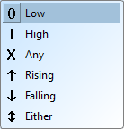
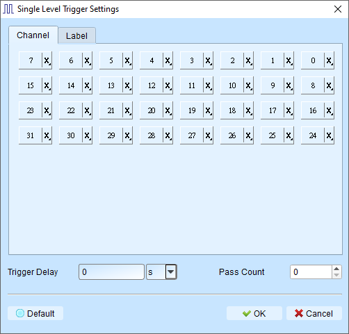
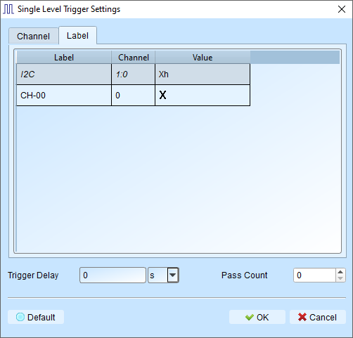
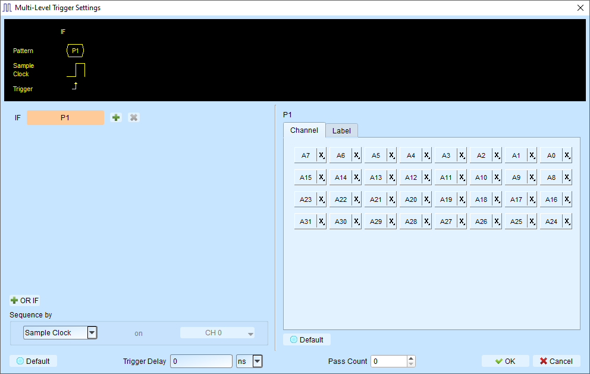
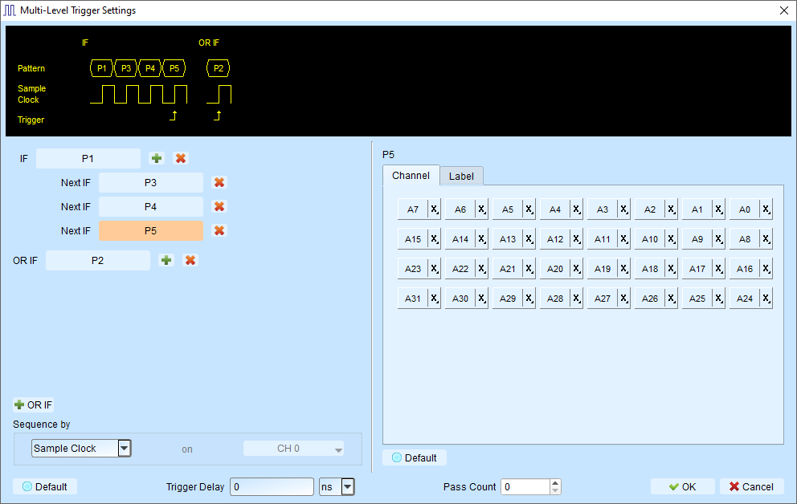
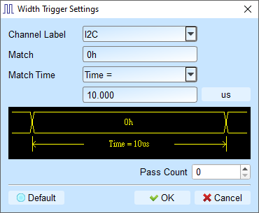
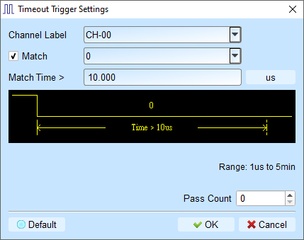

# Trigger Settings

We will then introduce the trigger settings in the following sections. You can choose the one that is most suitable for your capture.
Since we provide many trigger types, we separate them into different sections for easy reference.

## Trigger Conditions

<figure markdown>
  { width="200" }
  <figcaption>Trigger Conditions</figcaption>
</figure>

These are the common conditions that you can find everywhere in the trigger settings.
The trigger conditions are:

- **0** - LOW level
- **1** - HIGH level
- **X** - Don't care term (Any value is allowed)
- **↑** - Rising edge
- **↓** - Falling edge
- **Either** - Any edge (Rising or Falling edge)

## Trigger Types

### Single Level Trigger

A single capture will record data until a digital trigger is found on a single channel.

**Configuration**

<figure markdown>
  { width="400" }
  <figcaption>Per Channel Trigger Settings</figcaption>
</figure>

All the channels can be configured with the [Trigger Conditions](#trigger-conditions) listed above. You can choose the one that is most suitable for your capture.
The most common use case is to trigger on a rising edge of a clock signal.

We also provide trigger from a specific binary pattern from a specific channel label (e.g. I2C).

<figure markdown>
  { width="400" }
  <figcaption>Trigger from a specific binary pattern</figcaption>
</figure>

- **Trigger Delay**: The interval of time that the must be met before triggering. Default is 0 (trigger immediately).
- **Pass Count**: Number of matching trigger events to ignore before triggering. Default is 0 (trigger on first match).

### Multi-level Trigger

Multi Level triggering is composed of multiple single-stage trigger conditions.
You can create complex trigger conditions using multiple stages (up to 16 states).

!!! warning

    **Multi-level Trigger** is not supported when sampling frequency is ≥ 2 GHz.

**Configuration**

<figure markdown>
  { width="600" }
  <figcaption>Multi-level Trigger Settings</figcaption>
</figure>

Each state is configured like a single-level trigger (as shown in the right side of the figure).

States can be connected with:

**Next IF** 

*Continuous* trigger conditions (signals must match on adjacent sample clocks)

- Signals captured by two adjacent sample clocks must meet the conditions
- Typically used with synchronous or state mode measurements
- Signals are in a continuous, predictable state

**Then IF** 

*Non-continuous* trigger conditions (signals can match with any number of samples between)

- Triggers when both conditions are met, regardless of signals between them
- Suitable for asynchronous or timing mode
- Ideal when edge transitions must meet conditions but intermediate states don't matter

Additionally, you can also add the OR (OR IF) statement to make conditions in parallel.

**OR IF** 

Establish parallel trigger conditions. Any matching condition will trigger.

An example is shown in the figure below. Either of the two patterns starting with P1 or P2 will trigger in the capture.

<figure markdown>
  { width="600" }
  <figcaption>OR IF Example</figcaption>
</figure>

**Sequence by** 

By default, the trigger conditions are sampled based on the sampling clock internally.
This feature further allows you to set sampling method based on your customization.

**Example**

If signal data is valid only when the clock is rising, you can:

- Set Sequence by to **Custom Rising**
- Select the Clock pin as the valid condition
- Set conditions for other data lines using multi-level triggering

!!! note

    **Sequence by** feature is only supported when sampling frequency is ≤ 250 MHz.

### Width Trigger

Trigger when a channel meets the trigger condition and the pulse width matches the specified length.

<figure markdown>
  { width="400" }
  <figcaption>Width Trigger Settings</figcaption>
</figure>

### Timeout Trigger

Trigger when a signal duration exceeds the set time value, without waiting for a complete pulse.

<figure markdown>
  { width="400" }
  <figcaption>Timeout Trigger Settings</figcaption>
</figure>

### External Trigger

Use the device's **Trig-In** input pulse signal as the trigger condition.

### Manual Trigger (Force Trigger)

During a capture process, click the **Stop** button to manually set the trigger point in the captured data.

### Protocol Trigger

Our support different protocol trigger framing, which makes our analyzer powerful and easy to locate errors (complete reference docs are coming soon).

<!-- Please refer to the [Protocol](../protocols/index.md) Page for more details. Here are some quick links to common protocols like I2C, MIPI I3C, SPI, UART, etc.:

-   :material-open-in-new:{ .middle } I2C

    ---

    See more details about I2C decode and trigger settings.

    [:octicons-arrow-right-24: Trigger Settings](../protocols/i2c.md)

    [:octicons-arrow-right-24: Decode Settings](../protocols/i2c.md)

-   :material-open-in-new:{ .middle } MIPI I3C

    ---

    See more details about MIPI I3C decode and trigger settings.

    [:octicons-arrow-right-24: Trigger Settings](../protocols/mipi-i3c.md)

    [:octicons-arrow-right-24: Decode Settings](../protocols/mipi-i3c.md)

-   :material-open-in-new:{ .middle } SPI

    ---

    See more details about SPI decode and trigger settings.

    [:octicons-arrow-right-24: Trigger Settings](../protocols/spi.md)

    [:octicons-arrow-right-24: Decode Settings](../protocols/spi.md)

-   :material-open-in-new:{ .middle } UART

    ---

    See more details about UART decode and trigger settings.

    [:octicons-arrow-right-24: Trigger Settings](../protocols/uart.md)

    [:octicons-arrow-right-24: Decode Settings](../protocols/uart.md)

 --> -->
