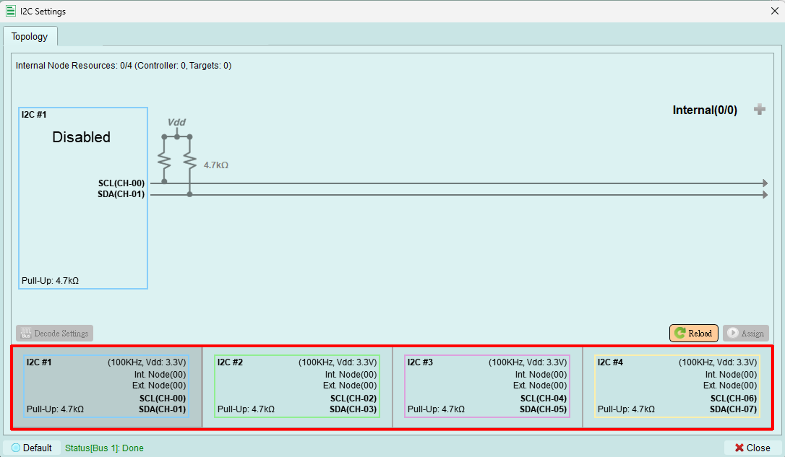

# Bus select

Choose which bus to use for I2C Protocol Exerciser operations.

## Available buses

Four buses are available for configuration. Each bus can be set to a different mode by clicking on it.

**Example multi-bus configuration:**

- Bus 1: Controller mode
- Bus 3: Another controller (simultaneous operation)
- Bus 2, 4: Disabled or Target mode

## Channel assignments

Channel assignments for each bus are fixed and cannot be adjusted manually. The device automatically assigns channels based on the bus number you select.

---

## Current limitation

**Important:** Currently, only **ONE** bus is supported for user operation.

Multiple bus support may be available in future software versions.

---

## Selecting a bus

1. Click on the desired bus in the topology diagram
2. The selected bus is highlighted
3. Configure the bus using [Px Pair Settings](px-pair-settings.md)
