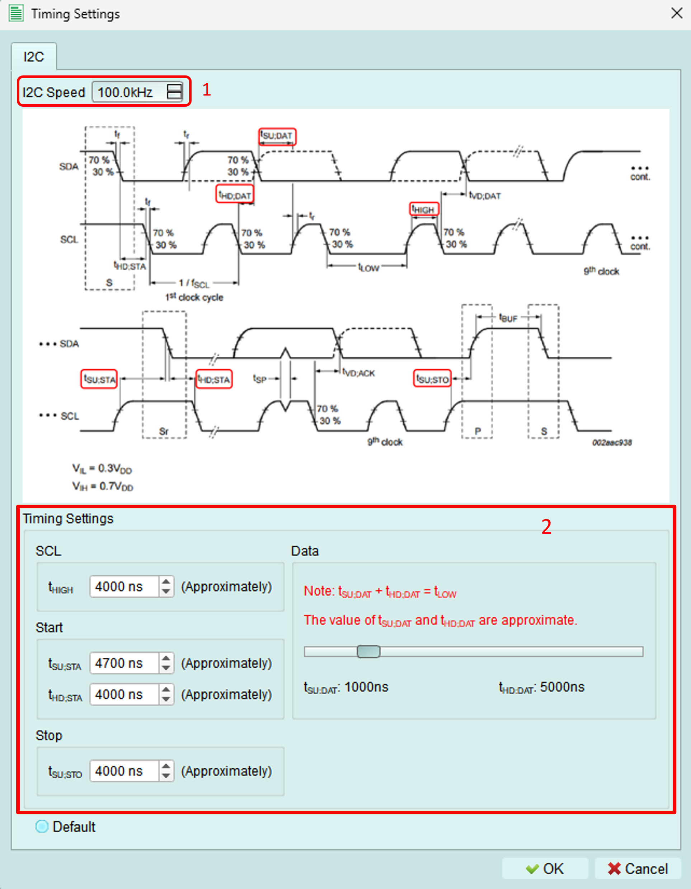
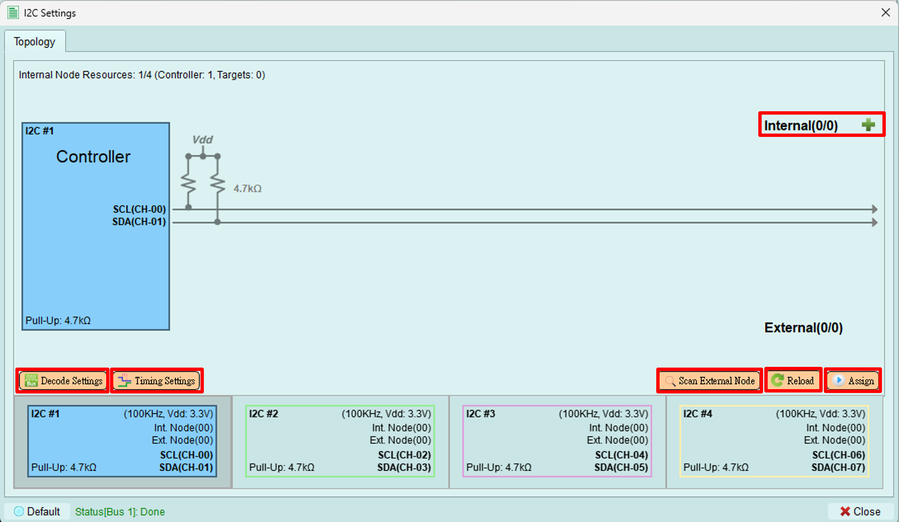
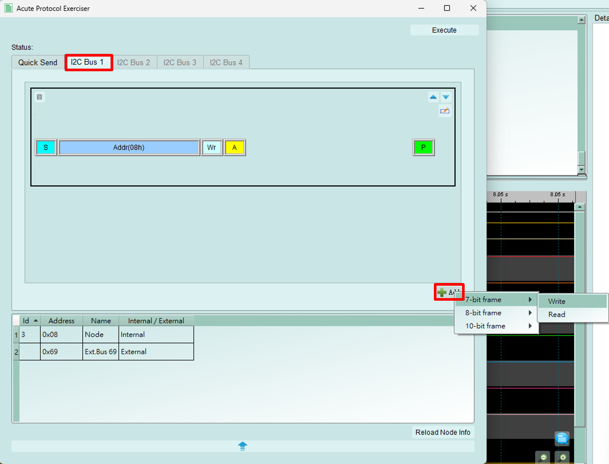
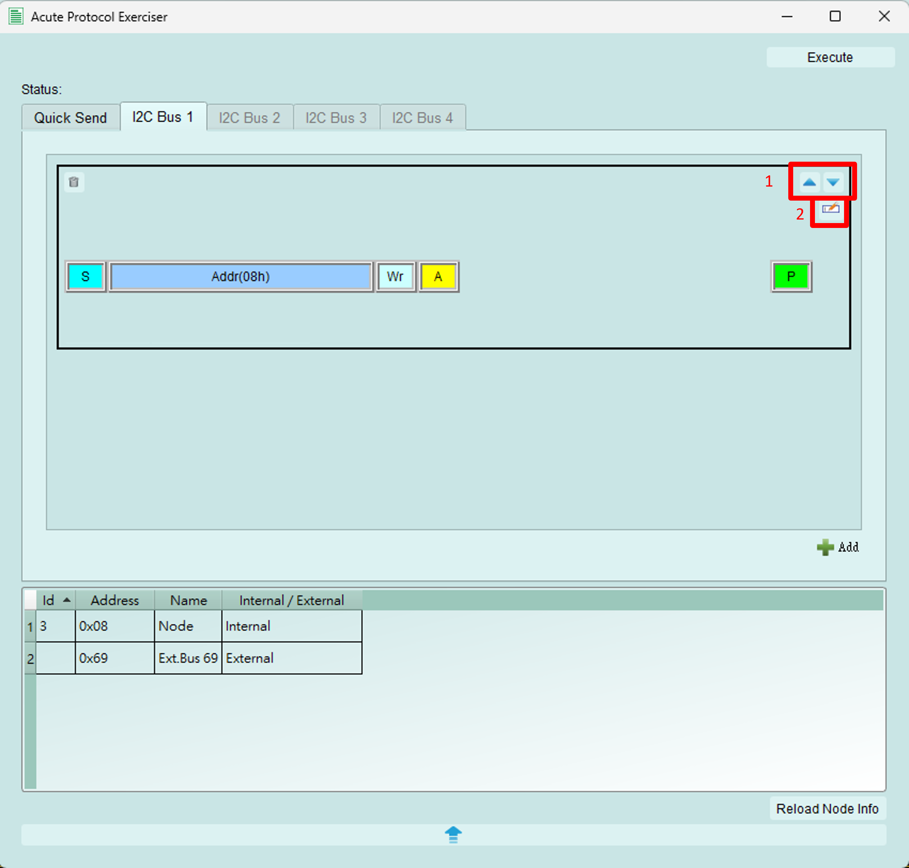
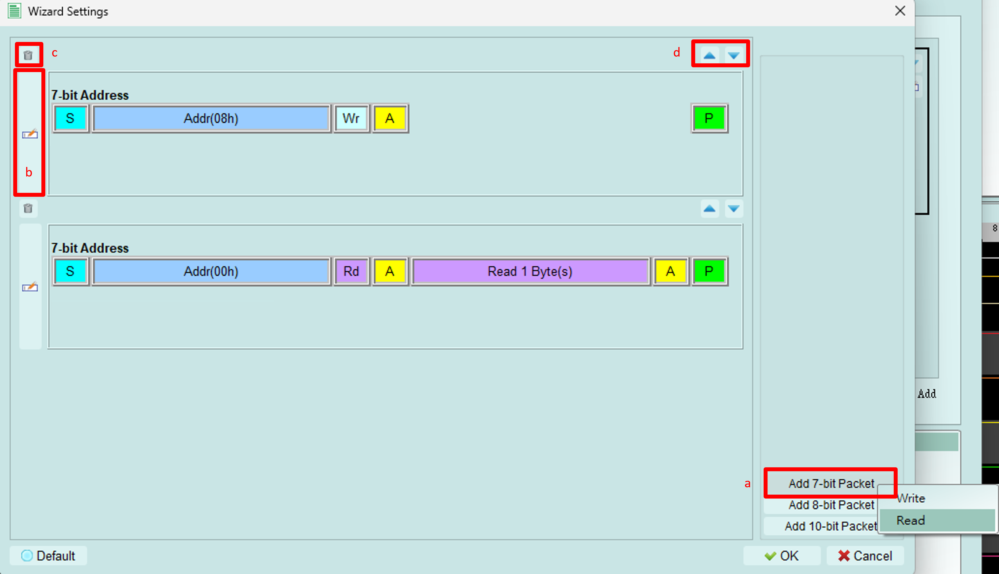

# Controller mode

Configure I2C controller settings, timing parameters, and send transactions to target devices.

## Timing settings

Adjust I2C timing parameters to match your device requirements or test edge cases.

### 1. Clock frequency

Set the I2C clock (SCL) frequency.

**Range:** 1 kHz to 1000 kHz (1 MHz)

**Standard I2C speeds:**

- Standard mode: 100 kHz
- Fast mode: 400 kHz
- Fast-mode Plus: 1000 kHz (1 MHz)

### 2. Timing components

Adjust individual timing components for precise control.

**Adjustable range:** 5 ns to 20 μs per component

**Components:**

- Setup time (SDA before SCL)
- Hold time (SDA after SCL)
- Clock high time
- Clock low time
- START/STOP conditions timing

**Interactive adjustment:**

Drag the slider bar to adjust the setup and hold time of data signals dynamically.

---

## Functions

### Assign

Upload the configured topology to the exerciser device.

**What's uploaded:**

- Number of controllers
- Internal node configurations
- Device addresses
- Internal node types and register settings

**Purpose:** The device needs this information to properly send commands and respond to bus transactions.

**When to use:** After making any changes to:

- Internal nodes
- Addresses
- Mode settings
- Bus configuration

---

### Reload

Reload the topology from the exerciser device and display it in the software.

**Use cases:**

- Verify what's currently loaded on the device
- Synchronize after external changes
- Refresh after programmatic configuration (e.g., via Python API)

---

### Scan external node

Scan all available addresses from 0x08 to 0x77 to detect connected devices.

**How it works:**

- Controller sends transactions to each address
- If a device responds with ACK, it appears in the topology
- Non-responsive addresses are skipped

**Benefits:**

- Automatically discover connected devices
- Verify device addresses
- Check for address conflicts
- Confirm device connectivity

**Time:** Scanning all addresses takes a few seconds.

---

### Decode settings

Configure Logic Analyzer parameters for I2C signal decoding.

**Settings include:**

- SCL (clock) channel assignment
- SDA (data) channel assignment
- Decode display options
- Color coding

**Purpose:** Proper decode settings ensure the Logic Analyzer correctly interprets I2C signals captured during exerciser operations.

---

## Send packets {#send-packets}

To open the wizard, see [Wizard](../index.md#wizard) in the toolbar.

The I2C wizard provides two methods for sending packets: Quick Send and Packet Constructor.

---

### Quick send

Send simple I2C transactions quickly with a streamlined interface.

**Configuration:**

1. **Bus selection:** Choose which bus to send the packet from
2. **Address mode:** Select 7-bit, 8-bit, or 10-bit addressing
   - *This documentation uses 7-bit mode as the example*
3. **Packet details:**
   - **R/W:** Select WRITE or READ operation
   - **Address:** Set the target device address
   - **Sub-address:** Set the register address (if sub-addressing is enabled)
   - **Write data:** Enter data bytes to write
   - **Read byte count:** Specify number of bytes to read (for READ operations)
4. **Address table:** Displays information about internal and external nodes
5. **Send button:** Transmit the configured packet
6. **Reload button:** Refresh the address table

---

### Packet constructor

Build complex I2C transaction sequences with multiple packets.

**How to use:**

1. Switch to the **Bus** tab
2. Click the **Add** button (bottom right)
3. Add 7-bit, 8-bit, or 10-bit WRITE or READ packets
4. Configure packet details
5. Click **Execute** to send all packets in sequence

*This documentation uses 7-bit mode as the example.*

---

#### Edit packet

Manage and sequence multiple I2C packets.

**Functions:**

1. **Reorder packets:** Use arrow buttons to adjust packet execution order
2. **Edit packet details:** Click to open the detailed editing dialog (see below)
3. **Delete packet:** Remove packet from the sequence
4. **Packet list:** View all configured packets

---

#### Packet sequence editor

Configure a sequence of WRITE and READ operations.

**Operations:**

1. **Add packet:** Insert new WRITE or READ packet into the sequence
2. **Edit packet:** Configure packet details (opens detail editor)
3. **Delete packet:** Remove selected packet from sequence
4. **Reorder:** Adjust execution order of packets

---

#### Detail packet editor

Configure individual packet parameters.

**Fields:**

1. **Address:** Set device address and choose WRITE or READ operation
2. **Sub-address:** Set register address (if this function is enabled for the target)
3. **Data:**
   - **WRITE operation:** Enter data bytes to transmit
   - **READ operation:** Set the number of bytes to read
4. **Next packet:** Choose the condition between this packet and the next:
   - **START:** New I2C transaction (STOP then START)
   - **REPEAT START:** Continue transaction (no STOP condition)

---

## Tips and best practices

### Timing configuration

- Start with standard frequencies (100 kHz or 400 kHz)
- Adjust timing only if testing edge cases or specific requirements
- Verify timing meets I2C specification for your target devices

### Quick send vs. Packet constructor

**Use Quick Send for:**

- Single transactions
- Quick testing
- Simple READ/WRITE operations

**Use Packet Constructor for:**

- Complex sequences
- Multiple operations
- Testing specific protocol scenarios
- Automated test sequences

### Transaction sequences

**Common patterns:**

**EEPROM write:**
1. START
2. Address + WRITE
3. Register address
4. Data byte(s)
5. STOP

**EEPROM read:**
1. START
2. Address + WRITE
3. Register address
4. REPEAT START
5. Address + READ
6. Data byte(s)
7. STOP

**Use Repeat Start for read operations** to maintain bus control and specify the starting register address.