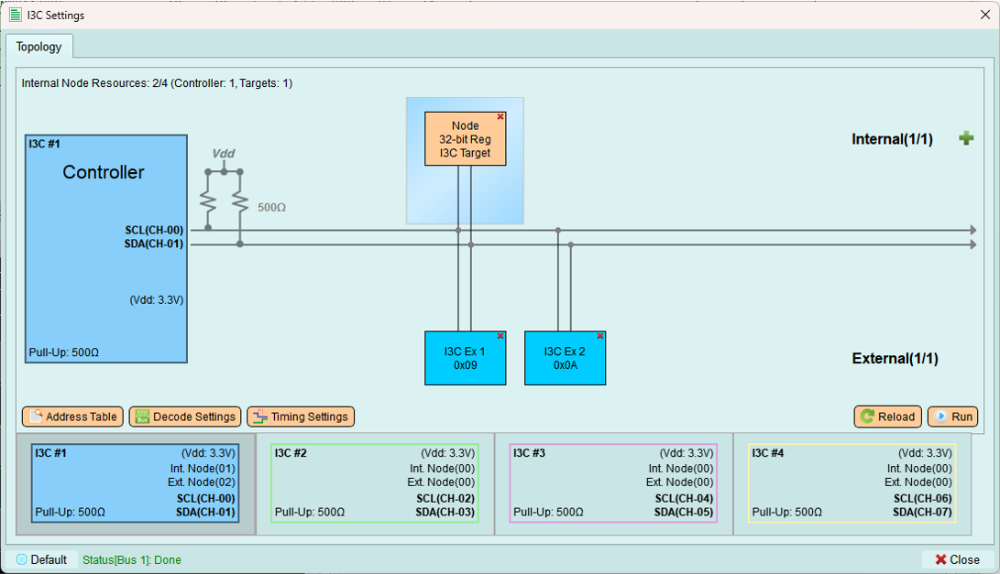
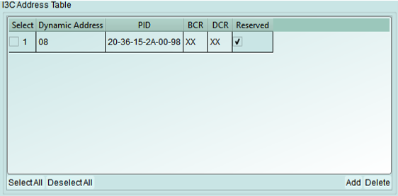
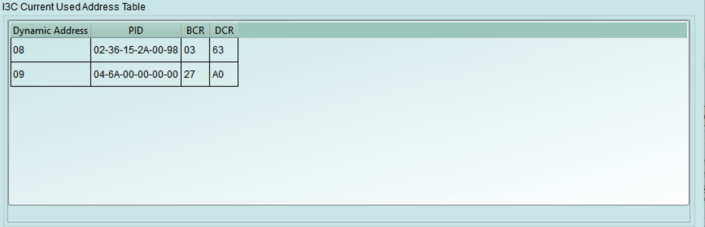
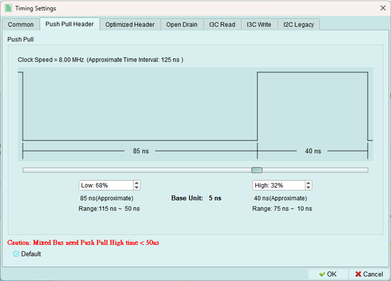
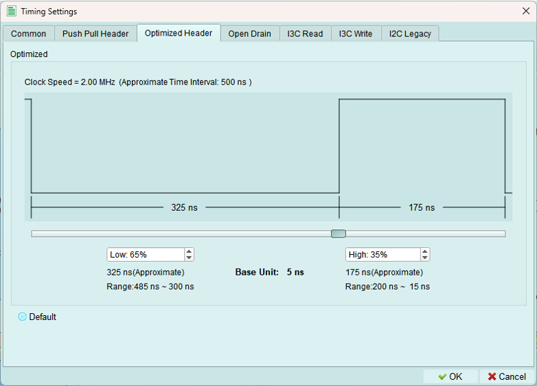
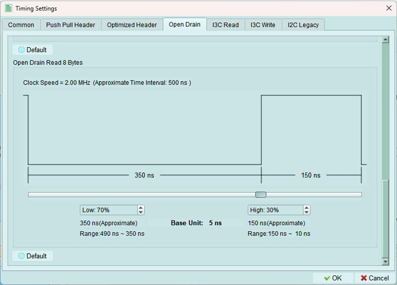
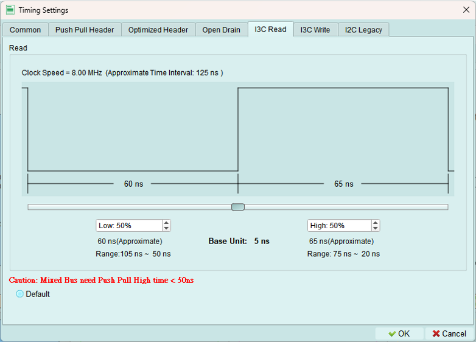
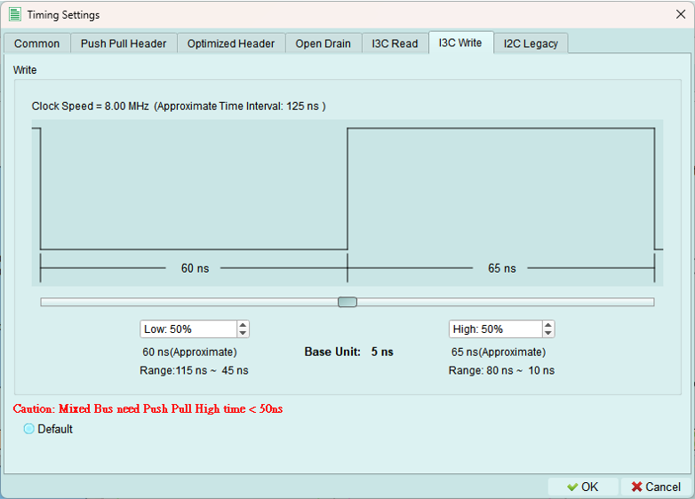
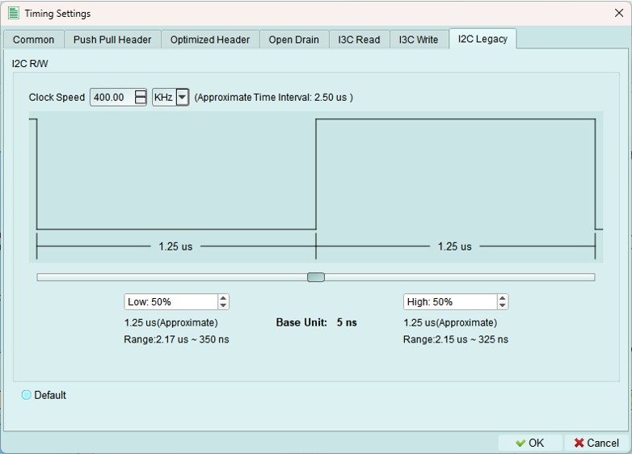

# Controller mode

Configure I3C controller settings, manage device addresses, and send transactions.

---

## Address table

Manage addresses for I3C and legacy I2C devices on the bus.

---

### I3C address table

Reserve dynamic addresses for I3C devices by specifying their device characteristics.

**Configuration fields:**

- **PID (Provisional ID):** 48-bit unique device identifier
- **BCR (Bus Characteristics Register):** Device capabilities and role
- **DCR (Device Characteristics Register):** Device type classification
- **Dynamic Address:** Preferred address for assignment

**Address assignment:**

If the requested dynamic address is already in use, the controller automatically increments the value until an available address is found.

**Use X (Don't Care):** Enter X in fields where the specific value doesn't matter for your test.

---

### I2C address table

Add legacy I2C devices to the controller's device list.

**When to use:**

- External I2C devices are connected to the bus
- Testing mixed I3C and I2C configurations
- Maintaining legacy device compatibility

**Note:** I2C devices use static addresses and do not participate in dynamic address assignment.

---

### In-used table

View I3C devices that have been assigned dynamic addresses and are currently active on the bus.

**Displayed information:**

- Dynamic addresses currently assigned
- Device PID
- Device BCR and DCR
- Assignment status

---

## Decode settings

Configure Logic Analyzer parameters for I3C signal decoding.

### Configuration options

1. **Color:** Select colors for Logic Analyzer decode elements
   - Customize for better visual distinction
   - Match your preferred color scheme

2. **Startup mode:** Select the initial decode mode for the Logic Analyzer
   - **SDR mode (default):** Standard Single Data Rate - keep this for normal operation
   - **HDR modes:** High Data Rate modes (DDR, TSP, TSL, etc.)

3. **Extended specification:** Enable MIPI I3C debug information
   - Shows additional protocol details
   - Useful for compliance testing
   - Provides deeper insight into I3C operation

4. **Report detail option:** Enable detailed decoding information
   - More verbose decode output
   - Includes timing margins and protocol details
   - Helpful for debugging complex issues

---

## Timing settings

Configure I3C timing parameters to match device requirements or test specific timing scenarios.

**Base timing unit:** 5 ns minimum

**Important:** All timing values must be multiples of 5 ns. Values below 5 ns are not permitted.

---

### Common settings

Configure core I3C timing parameters.

**1. I3C clock speed range:** 100 Hz to 13 MHz

**2. Open drain clock speed range:** 100 Hz to 5 MHz

**3. Timing parameters (base unit: 5 ns):**

- **tCAS:** Clock-to-data setup time
- **tCBP:** Clock-to-data valid time
- **tCASr:** Clock-to-data setup time (read)
- **tCBSr:** Clock-to-data valid time (read)

---

### Push-pull header

Configure timing for push-pull mode headers.

**Use for:** High-speed I3C transactions using push-pull drivers on both SCL and SDA.

---

### Optimized header

Configure timing for optimized push-pull headers with enhanced performance.

---

### Open drain modes

I3C uses open drain for legacy I2C compatibility and some control operations.

#### 1. Open drain fast

Fast open-drain timing for I2C-compatible operations at higher speeds.

#### 2. Open drain slow

Slower open-drain timing for maximum I2C compatibility.

#### 3. Open drain read 8 bytes

Optimized timing for reading 8-byte blocks in open-drain mode.

---

### I3C read

*Push-pull speed mode*

Configure timing parameters for I3C READ transactions.

**Use for:** High-speed private READ operations from I3C targets.

---

### I3C write

*Push-pull speed mode*

Configure timing parameters for I3C WRITE transactions.

**Use for:** High-speed private WRITE operations to I3C targets.

---

### Legacy I2C

Configure timing for legacy I2C device communication.

**Speed range:** 100 Hz to 1 MHz

**I2C standard speeds:**

- Standard mode: 100 kHz
- Fast mode: 400 kHz
- Fast-mode Plus: 1 MHz

**Use for:** Communicating with I2C devices on an I3C bus.

---

## Run

Upload the configured topology to the exerciser device and activate the bus.

**What's uploaded:**

- Controller and internal node configurations
- Device addresses (static and dynamic)
- Internal node types and characteristics
- Timing settings
- All topology parameters

**Purpose:** The exerciser needs this complete configuration to properly initiate transactions and respond to device requests.

---

### Run process

The Run process executes several steps. Some steps are optional depending on your configuration.

**Status indicators:**

 **Error occurred** - Check status message for details

 **Wait for processing** - Step is currently executing

 **Skip this process** - Step not needed for current configuration

 **Process succeeded** - Step completed successfully

---

### Successful activation

When all steps complete successfully, the exerciser is active and ready to send commands.

**What this means:**

- Topology is loaded
- Device is initialized
- Bus is operational
- Ready to send transactions

---

## Reload

Refresh the topology display from the exerciser device.

**Use cases:**

- Verify current device configuration
- Sync after external changes (e.g., Python API updates)
- Refresh after device reset
- Check dynamic address assignments

**When building topology via Python code:** Use Reload to update the GUI with the current exerciser state.

---

## Tips and best practices

### Address table management

- Define all known devices in address tables before running
- Use PID, BCR, DCR values from device datasheets
- Test with simple topology first, then add complexity
- Verify addresses don't conflict

### Timing configuration

- Start with default timing values
- Adjust only if devices require specific timing
- Verify timing meets MIPI I3C specification
- Test timing margins if validating device compliance

### Run process troubleshooting

**If Run fails:**

- Check error message for specific issue
- Verify all required fields are filled
- Confirm addresses don't conflict
- Check internal node configurations
- Ensure timing values are valid (multiples of 5 ns)