# Internal node

Create virtual I3C and legacy I2C target devices for comprehensive bus testing.

---

## I3C node configuration

Configure virtual I3C target devices with complete device characteristics.

---

### 1. Name

Set a descriptive name for this internal node for easy identification.

**Examples:**

- "Sensor_1"
- "EEPROM_0x50"
- "Test_Target_A"

---

### 2. Static address

Set the static I3C address (if the device supports static addressing).

**Range:** 0x08 to 0x7D (I3C allows limited static addresses)

**Note:** Many I3C devices use dynamic addressing only. Leave blank if not using static address.

---

### 3. Register settings

Configure how the internal node's registers behave.

#### Register type

**Current support:** 32-bit register only

The internal node simulates a device with 32-bit register storage.

#### Sub-address type

Choose whether the node uses register addressing:

##### Without sub-address

No sub-addressing (register addressing) is used.

**Behavior:** Direct data READ/WRITE without register selection.

##### 8-bit sub-address

Uses 8-bit sub-addressing for register access.

**Current support:** 8-bit sub-address only

**Behavior:** First byte after address selects the register, subsequent bytes are data.

#### Sub-address data format

Configure multi-byte transaction behavior. **Available only when 8-bit Sub-Address is selected.**

##### Repeat sub-address

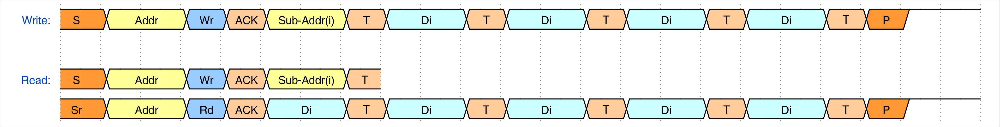

All bytes in the transaction access the same register.

**Example:** Write 4 bytes to register 0x10
- All 4 bytes → Register 0x10

##### Increment sub-address

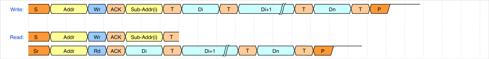

Sub-address increments by 1 for each byte.

**Example:** Write 4 bytes starting at register 0x10
- Byte 1 → 0x10, Byte 2 → 0x11, Byte 3 → 0x12, Byte 4 → 0x13

##### Increment loop sub-address

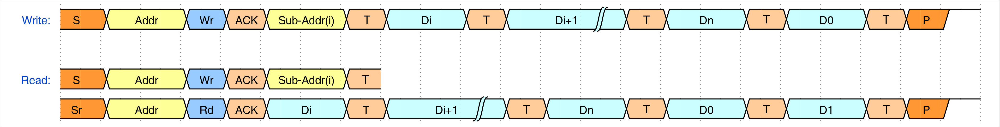

Sub-address increments and wraps at register boundary.

**Example:** Write 4 bytes starting at 0xFE
- Byte 1 → 0xFE, Byte 2 → 0xFF, Byte 3 → 0x00, Byte 4 → 0x01

##### Ignore sub-address

Sub-address byte is acknowledged but ignored.

**Use for:** Testing edge cases or non-compliant behavior.

---

### 4. I3C node information

Configure I3C-specific device characteristics.

#### PID (Provisional ID)

Build the 48-bit unique device identifier.

**Components:**

- Manufacturer ID
- Part ID
- Instance ID

**Source:** Obtain from device datasheet or MIPI I3C specification.

#### BCR (Bus Characteristics Register)

Configure the Bus Characteristics Register.

**Important:** BCR settings affect available options in other settings.

**Defines:**

- Device role (I3C vs. I2C)
- Advanced capabilities
- IBI support
- Offline capability
- Maximum data speed

#### DCR (Device Characteristics Register)

Set the Device Characteristics Register value.

**Options:**

- **Predefined classes:** Select from standard device types
- **Custom:** Type a specific value in the spinbox

**Defines:** Device class (sensor, memory, etc.)

#### Additional settings 
##### 1. GETCAPS (Get Capabilities)

Configure how the internal node responds to GETCAPS CCC.

**Version 1.0:**

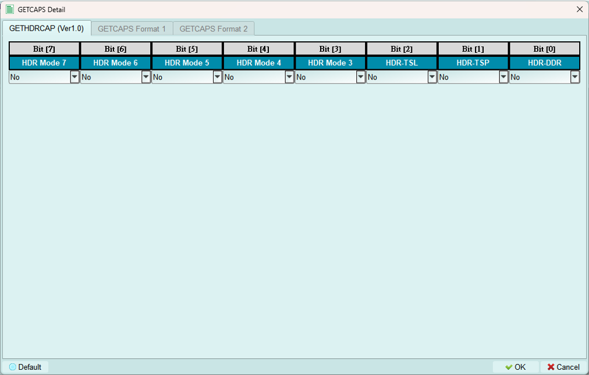

Available when I3C specification version 1.0 is selected.

**Format 1 (Simple):**

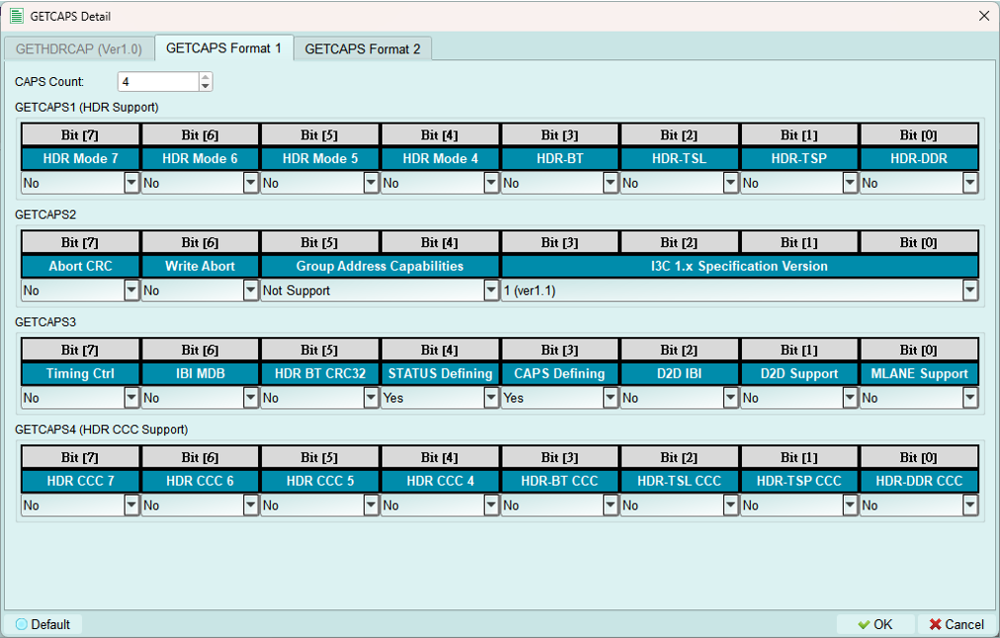

Basic capabilities response.

**Enable Format 2:**

- Set **CAPS Defining bit** to enable GETCAPS Format 2
- Set **STATUS Defining bit** to enable GETSTATUS Format 2

**Format 2 (Defining Byte):**

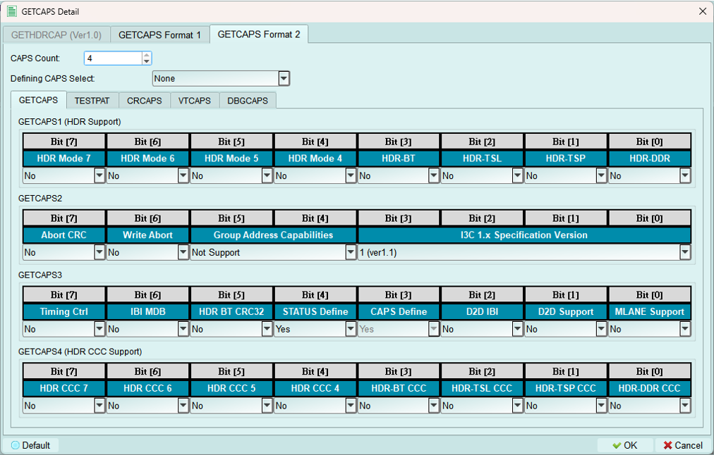

*Currently supports one type of defining byte per configuration.*

Includes base GETCAPS Format 1 fields plus additional capability bytes:

**TESTPAT (Test Pattern):**

**CRCAPS (Clock Rate Capabilities):**

**VTCAPS (Virtual Target Capabilities):**

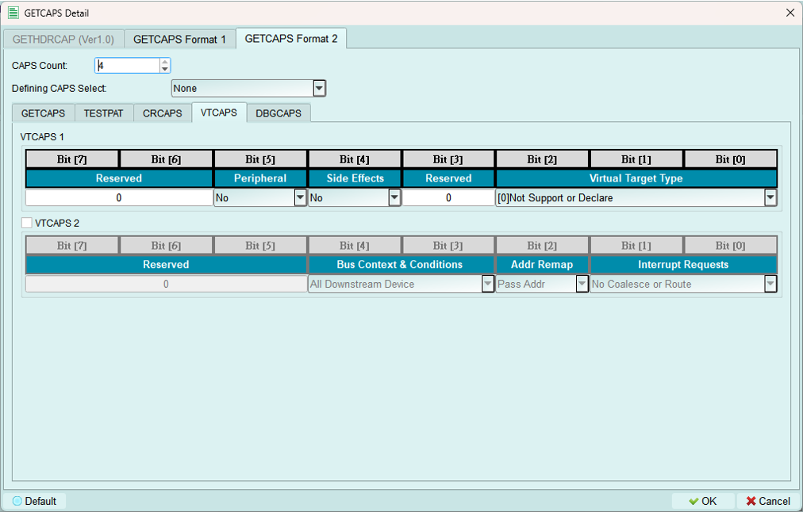

**DBGCAPS (Debug Capabilities):**

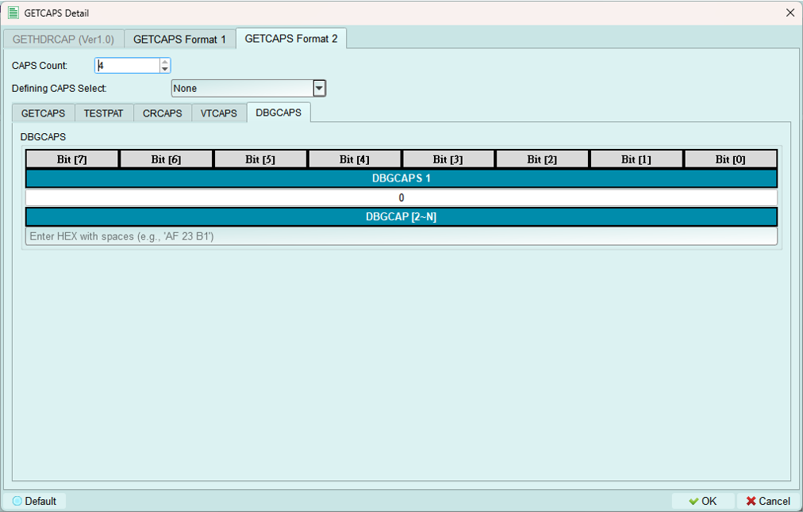

---

##### 2. GETSTATUS (Get Status)

Configure how the internal node responds to GETSTATUS CCC.

**Format 1 (Simple):**

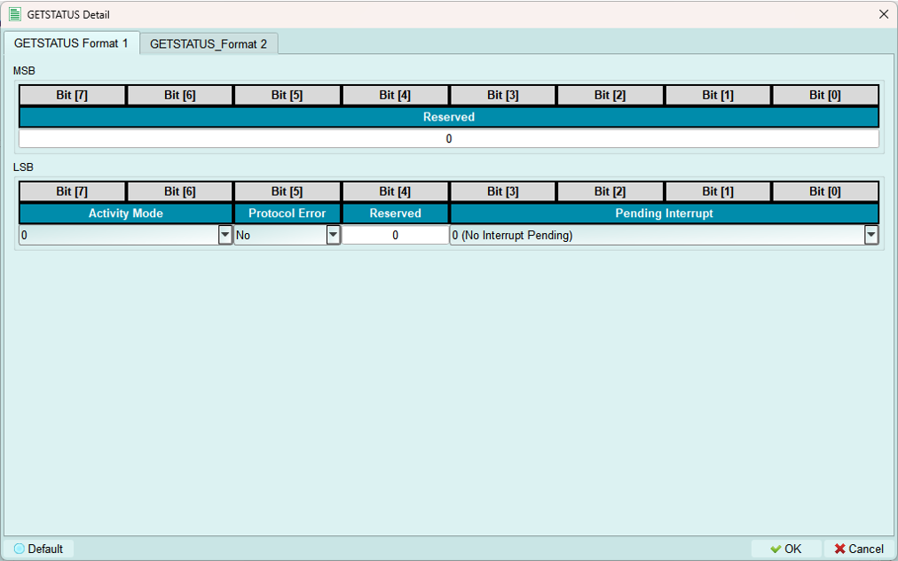

Basic status response with standard status fields.

**Format 2 (Defining Byte):**

*Currently supports one type of defining byte per configuration.*

Includes base GETSTATUS Format 1 fields plus additional status bytes:

**NASTAT (Not Acknowledged Status):**

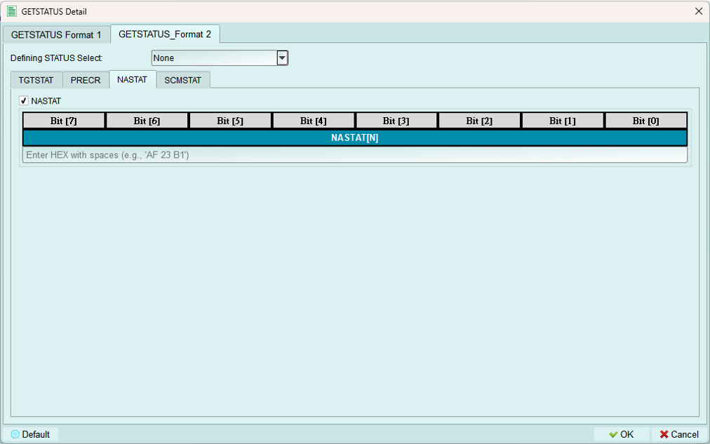

**PRECR (Pending Read Error Count Report):**

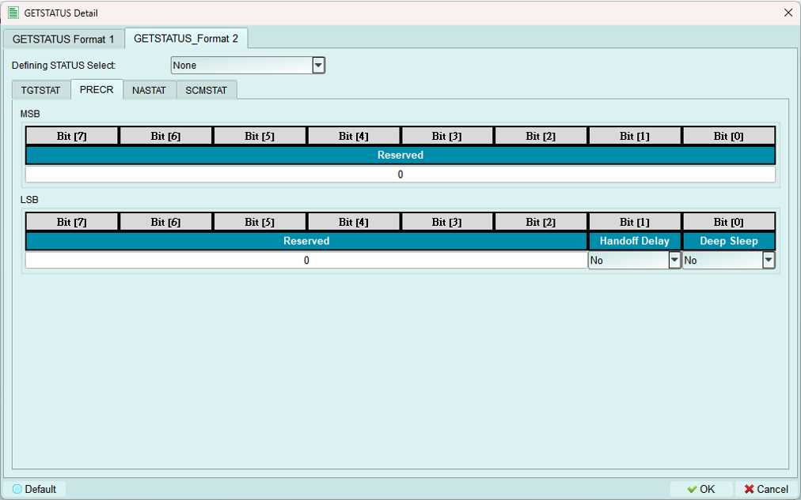

**SCMSTAT (Secondary Controller Mode Status):**

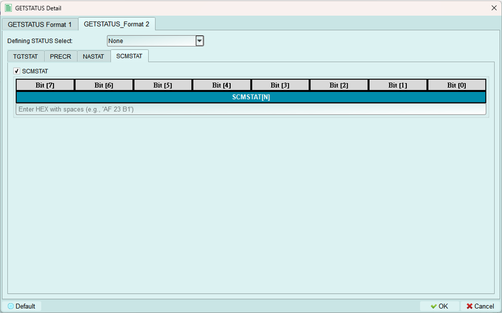

---

##### 3. GETMXDS (Get Max Data Speed)

Configure maximum data speed capabilities response.

**Format 1 & 2 (Simple):**

Basic max data speed response.

**Enable Format 3:**

Select **Support** in the Defining Byte field to enable defining byte format (Format 3).

**Format 3 (Defining Byte):**

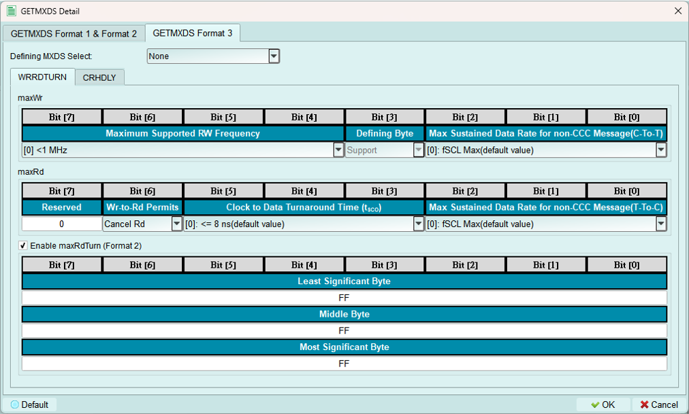

*Currently supports one type of defining byte per configuration.*

Includes base GETMXDS fields plus:

**WRRDTURN (Write-Read Turnaround):** Shown above

**CRHDLY (Clock-to-Data Turnaround Delay):**

---

##### 4. MWL & MRL (Max Write/Read Length)

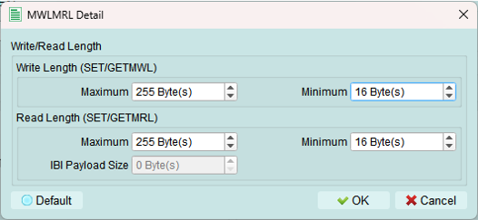

Configure maximum write length (MWL) and maximum read length (MRL) for the device.

**IBI Size:** Only available when BCR IBI-related bits are set to Support.

**Purpose:**

- Define buffer size limits
- Prevent overflow conditions
- Match actual device capabilities
        

---

## Legacy I2C node configuration

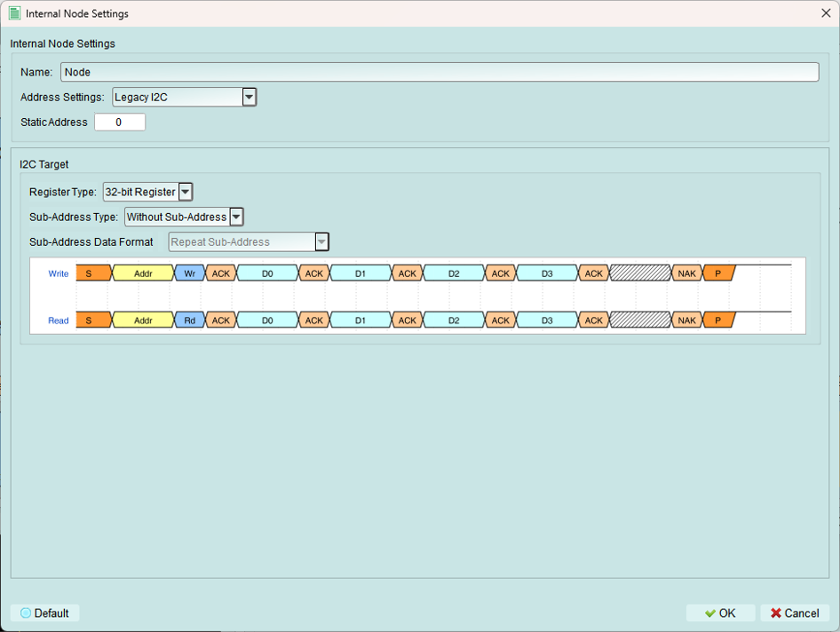

Create virtual legacy I2C devices that operate on the I3C bus.

**Use cases:**

- Test mixed I3C and I2C bus scenarios
- Simulate legacy device compatibility
- Verify backward compatibility behavior

---

### 1. Name

Set a descriptive name for identification.

---

### 2. Static address

Set the I2C address for this legacy device.

**Range:** 0x08 to 0x77 (standard I2C device range)

**Note:** I2C devices always use static addresses, not dynamic assignment.

---

### 3. Register settings

Configure register behavior for the legacy I2C node.

#### Register type

**Current support:** 32-bit register only

#### Sub-address type

##### Without sub-address

No register addressing is used.

##### 8-bit sub-address

Uses 8-bit sub-addressing for register access.

**Current support:** 8-bit sub-address only

#### Sub-address data format

**Available only when 8-bit Sub-Address is selected.**

##### Repeat sub-address

All bytes access the same register.

##### Increment sub-address

Sub-address increments for each byte (common for EEPROMs).

##### Increment loop sub-address

Sub-address increments with wraparound.

##### Ignore sub-address

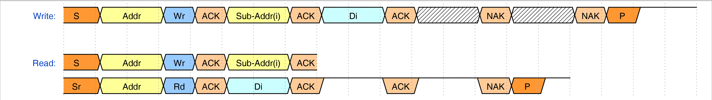

Sub-address is acknowledged but not used.

---

## I3C stress test

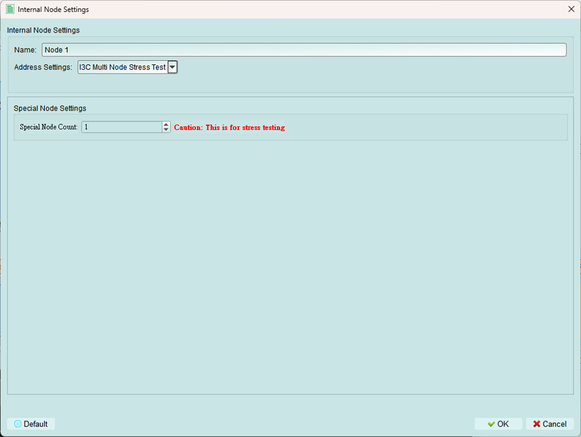

Test controller IBI handling under stress conditions.

**Function:** Continuously sends IBI (In-Band Interrupt) packets from the internal node.

**Purpose:** Test the controller's ability to handle a high volume of IBI requests.

**Use cases:**

- Stress testing controller IBI handling
- Verifying IBI queue management
- Testing IBI priority mechanisms
- Validating controller performance under load

---

## Tips and best practices

### I3C vs. I2C nodes

**Use I3C nodes when:**

- Testing I3C-specific features (DAA, IBI, HDR)
- Simulating modern I3C devices
- Need dynamic addressing

**Use I2C legacy nodes when:**

- Testing backward compatibility
- Simulating legacy devices on I3C bus
- Verifying mixed-mode operation

### Device characteristics

- Use realistic PID values from actual devices or create unique test values
- BCR should accurately reflect device capabilities
- DCR should match the type of device you're simulating
- Configure GETCAPS, GETSTATUS, GETMXDS to match real device behavior

### Sub-addressing

- **Increment mode:** Most common (EEPROMs, registers)
- **Repeat mode:** FIFO-like devices
- **Loop mode:** Circular buffers
- **Ignore mode:** Edge case testing

### Stress testing

- Use IBI stress test to validate controller robustness
- Start with slow IBI rate, increase to find limits
- Monitor bus performance under stress
- Verify no lost IBI packets