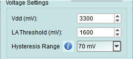
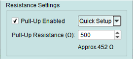

# PX pair settings

Configure operating mode, voltage levels, and pull-up resistors for the I3C bus.

## Accessing settings

Click the large button on the left side of the topology dialog to open the **PX Pair Settings** dialog.

---

## Mode settings

The Acute PX device supports multiple targets and controllers on the same bus. Select the appropriate mode for your testing scenario.

### Mode selection options

#### 1. Disable

Deactivate I3C bus functions on this bus.

**Use when:**

- Bus is not needed for current test
- Preventing accidental bus activity
- Isolating other buses

---

#### 2. Controller mode

Exerciser simulates an I3C controller with optional target nodes on this bus.

**Features:**

- Initiate all bus transactions
- Perform dynamic address assignment
- Send CCC commands
- Control bus timing
- Accept in-band interrupts (IBI) from targets

**IBI Size configuration:**

Define the maximum amount of IBI data the virtual controller will accept from targets.

**Use cases:**

- Testing target device implementations
- Simulating a controller with multiple targets
- Verifying protocol compliance

---

#### 3. Target mode

Exerciser simulates I3C target devices on this bus.

**Features:**

- Respond to controller commands
- Accept dynamic address assignment
- Send IBI requests (if enabled)
- Operate in HDR modes when commanded

**Use cases:**

- Testing controller implementations
- Simulating sensors or peripherals
- Verifying target behavior

---

### Internal nodes

**In both Controller and Target modes**, you can create virtual internal nodes to simulate multiple target devices on the bus.

See: [Internal Node](internal-node.md)

---

## Voltage settings

Configure voltage levels for proper I3C operation and signal decoding.

**All voltage values are in millivolts (mV).**

### 1. Vdd

Set the working voltage for the I3C bus.

**Typical I3C voltages:**

- 3300 mV (3.3V) - Most common
- 1800 mV (1.8V) - Low-power I3C
- 1200 mV (1.2V) - Ultra-low-power applications

### 2. Logic Analyzer threshold

Set the threshold voltage for the Logic Analyzer to properly decode I3C signals.

**Recommendation:** Set to approximately Vdd/2 for optimal signal detection.

**Examples:**

- Vdd = 3300 mV → Threshold = 1650 mV
- Vdd = 1800 mV → Threshold = 900 mV

### 3. Hysteresis range

Set the hysteresis range for noise immunity on I3C signals.

**Purpose:** Prevents false signal detection on noisy or slow-transitioning signals.

**Typical value:** 100-300 mV

---

## Resistance settings

Configure internal pull-up resistors for the I3C bus.

### 1. Pull-up enabled

Check the checkbox to activate internal pull-up resistors.

**When to enable:**

- No external pull-up resistors on the bus
- Standalone testing without external hardware
- Testing pull-up effects on signal quality

**When to disable:**

- External pull-up resistors are present
- Device under test provides pull-ups
- Avoiding conflicts with existing pull-ups

### 2. Pull-up resistance

Set the pull-up resistance value.

**Input methods:**

- Type a custom value directly
- Select from common preset values in the dropdown

**Common I3C pull-up values:**

- 1.0 kΩ - High-speed I3C (push-pull modes)
- 2.0 kΩ - Typical I3C
- 4.7 kΩ - I2C legacy compatibility

**Selection guidelines:**

- Lower resistance: Faster transitions, higher current
- Higher resistance: Lower power, slower transitions
- I3C typically uses lower resistance than I2C due to push-pull operation

---

## Tips and best practices

### Mode selection

**Choose Controller mode when:**

- Testing target devices
- Need to initiate transactions
- Performing dynamic address assignment
- Sending CCC commands

**Choose Target mode when:**

- Testing controller implementations
- Simulating sensors or peripherals
- Verifying target response behavior

### Voltage configuration

- Always match Vdd to your device specifications
- Verify mixed-voltage devices are compatible
- I3C devices must tolerate the bus voltage
- Legacy I2C devices must operate at the same voltage

### Pull-up resistors

- Calculate based on bus capacitance and speed requirements
- I3C uses push-pull for high-speed, open-drain for legacy I2C
- Pull-ups primarily affect open-drain (I2C legacy) operation
- Test with recommended 2.0 kΩ first, adjust as needed