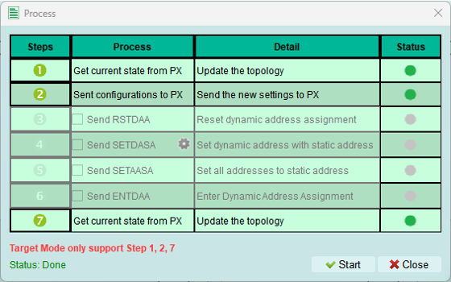

# Target mode

Configure the exerciser to act as an I3C target device responding to an external controller.

## Overview

Target mode allows the exerciser to simulate one or more I3C target devices. Use this mode when you have an external controller and want to test its behavior with simulated targets.

**Use cases:**

- Test controller implementations
- Simulate sensors, memory, or peripheral devices
- Verify dynamic address assignment from controller perspective
- Test IBI (In-Band Interrupt) handling

---

## Decode settings

Configure Logic Analyzer parameters for I3C signal decoding.

**Configuration is identical to Controller mode.**

### Options

1. **Color:** Select colors for Logic Analyzer decode elements
   - Customize visual appearance
   - Improve readability

2. **Startup mode:** Select initial decode mode
   - **SDR mode (default):** Standard operation - recommended for normal use
   - **HDR modes:** High Data Rate variants

3. **Extended specification:** Enable MIPI I3C debug information
   - Additional protocol details
   - Useful for compliance and debugging

4. **Report detail option:** Enable detailed decode information
   - Verbose output with timing details
   - Helpful for in-depth analysis

---

## Run

Upload the topology configuration to the exerciser device.

**What's uploaded:**

- Internal node configurations
- Target device characteristics (PID, BCR, DCR)
- Register settings

**Note:** Some controller-specific steps (like address table setup and timing configuration) are not available in Target mode.

### Run process

The Run process executes configuration steps for Target mode.

**Status indicators:**

 **Error occurred** - Check status message

 **Wait for processing** - Step executing

 **Skip this process** - Not needed

 **Process succeeded** - Step complete

---

### Successful activation

When the process completes successfully:

- Target devices are active
- Exerciser awaits controller commands
- Ready to respond to bus transactions

---

## Reload

Refresh the topology from the exerciser device and display it in the software.

**Identical to Controller mode functionality.**

**Use cases:**

- Verify current device configuration
- Sync after programmatic changes (e.g., Python API)
- Check dynamic address assignments received from controller
- Refresh display after manual device updates

---

## Target behavior

### Responding to commands

In Target mode, the exerciser:

- Waits for controller to assign dynamic addresses (DAA)
- Responds to Common Command Codes (CCC)
- Handles private READ/WRITE transactions
- Can generate IBI requests (if configured)
- Supports hot-join (if enabled)

### Address assignment

**Static address (optional):**

- Target announces static address during bus initialization
- Controller may assign a dynamic address during ENTDAA

**Dynamic address:**

- Received from controller during dynamic address assignment
- Stored and used for subsequent transactions
- Can be reassigned by controller using SETNEWDA CCC

---

## Limitations in Target mode

**Not available:**

- Address table configuration (controller function)
- Timing settings (controller sets bus timing)
- Initiating transactions (only controller can initiate)
- Scanning for devices (controller function)

**Available:**

- Internal node configuration
- Decode settings
- Run and Reload operations
- Response to all controller commands

---

## Testing with Target mode

### Setup for controller testing

1. Configure target device characteristics (PID, BCR, DCR)
2. Add internal nodes if simulating multiple targets
3. Set up decode settings for capture
4. Click Run to activate targets
5. Connect external controller
6. Start capture
7. Controller performs DAA and sends commands
8. Verify target responses in captured data

---

## Tips and best practices

### Device characteristics

- Use realistic PID, BCR, DCR values from actual devices
- Configure BCR to match device capabilities you're simulating
- DCR should match the device type class

### Internal nodes

- Create multiple internal nodes to test multi-target scenarios
- Mix I3C and I2C legacy devices
- Test edge cases with unusual device combinations

### Verification

- Always capture during target testing
- Verify dynamic address assignment succeeds
- Check IBI behavior if configured
- Confirm CCC responses are correct
- Validate private transaction handling