# Wizard

## Quick Send
1. IBI:
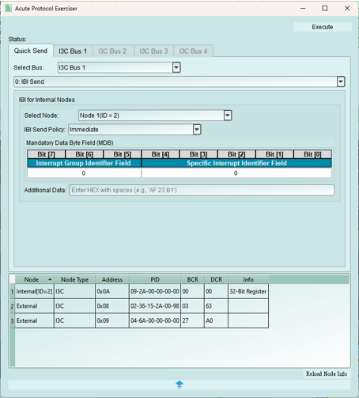
IBI (In-Band Interrupt) in MIPI I3C is a mechanism that lets a target device interrupt or notify the controller (master) using the same SDA/SCL lines as normal I3C data transfers—no extra interrupt pin is needed.

2. Hot Join:
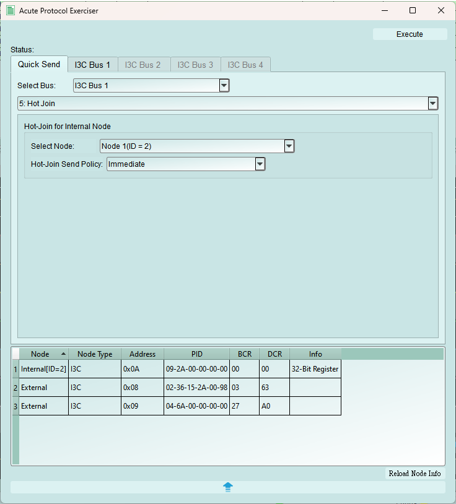
Hot-Join is a feature of MIPI I3C that allows a target device to be added to an active I3C bus after the system is already powered and running, without resetting or disturbing existing devices.

3. Private RW:
    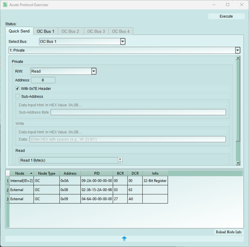
    In MIPI I3C, Private Read and Private Write are the basic point-to-point data transfer operations between the controller and a single target device using that target’s dynamic address.
    They are called private because only one specific target participates in the transfer, unlike broadcast or group operations.

    1. Private Read with SubAddress
    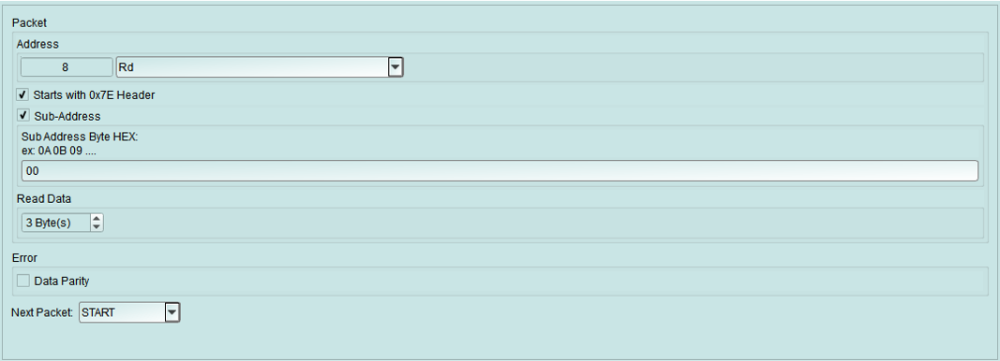

    2. Private Write with SubAddress
    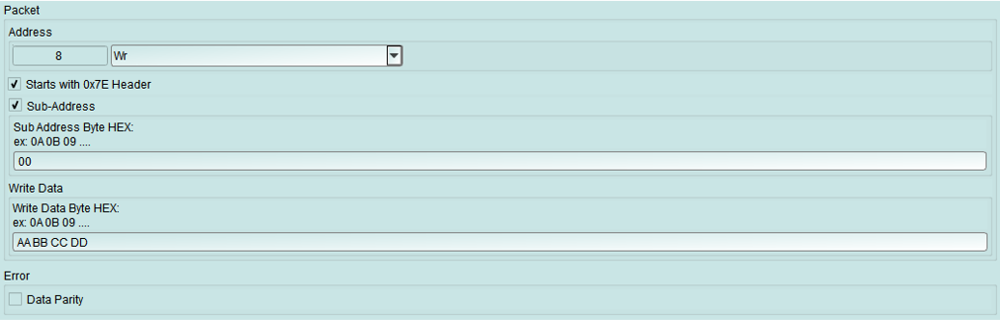

4. Broadcast CCC:
    1. Broadcast CCC - ENEC
    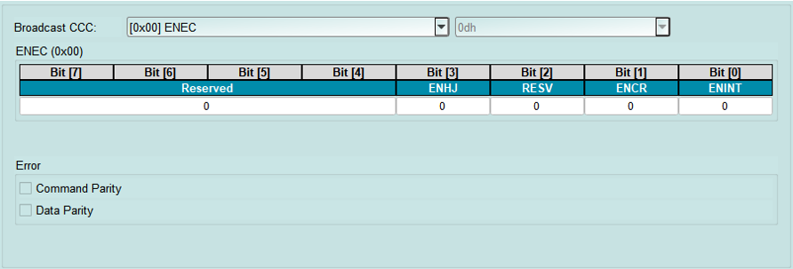
    Broadcast CCC, ENEC allows the controller to enable specific event types simultaneously on all I3C target devices on the bus.
    The ENEC Broadcast CCC tells all targets which events they are allowed to generate, such as:
        * In-Band Interrupts (IBI)
        * Hot-Join
        * Controller Role Request (CRR)

        Without ENEC, targets are not allowed to issue these events.

    2. Broadcast CCC - DISEC
    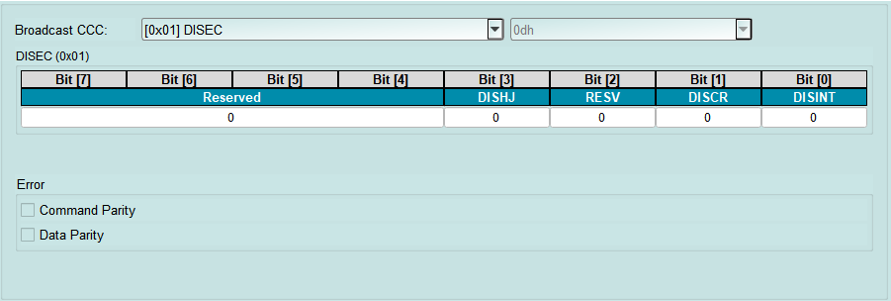
    Broadcast CCC, DISEC allows the controller to disable specific event types on all I3C target devices on the bus.
    The Broadcast DISEC CCC tells all targets to stop generating certain in-band events, including:
        * In-Band Interrupts (IBI)
        * Hot-Join
        * Controller Role Request (CRR)

        After DISEC, targets must not attempt to issue the disabled events.

    3. Broadcast CCC - ENTAS0
    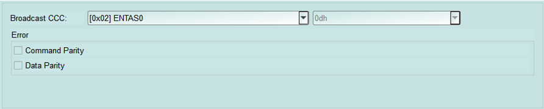
    Broadcast CCC, ENTAS0 instructs all I3C target devices on the bus to enter Activity State 0, which is a defined low-activity / low-power state.
    The Broadcast ENTAS0 CCC tells all targets to:
        * Transition into Activity State 0
        * Reduce internal activity and power consumption
        * Maintain bus awareness so they can resume normal operation later

        Activity State 0 is typically the lowest-power activity state defined for I3C targets.

    4. Broadcast CCC - ENTAS1
    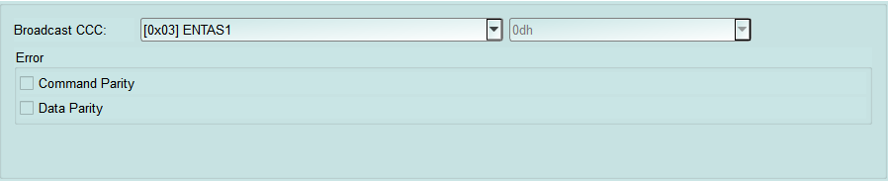
    Broadcast CCC, ENTAS1 instructs all I3C target devices on the bus to transition into Activity State 1, a moderate-activity / reduced-power operating state.
    The Broadcast ENTAS1 CCC tells all targets to:
        * Enter Activity State 1
        * Reduce power compared to full active mode
        * Remain responsive to normal I3C bus operations

        Activity State 1 balances power savings with bus availability.

    5. Broadcast CCC - ENTAS2
    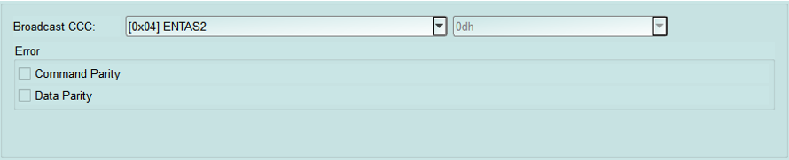
    Broadcast CCC, ENTAS2 instructs all I3C target devices on the bus to transition into Activity State 2, which is a high-activity / near-full-performance state.
    The Broadcast ENTAS2 CCC tells all targets to:
        * Enter Activity State 2
        * Operate with higher internal activity than state 1
        * Be ready for high-throughput or low-latency communication

        Activity State 2 is typically just below the fully unrestricted active state.

    6. Broadcast CCC - ENTAS3
    
    Broadcast CCC, ENTAS3 instructs all I3C target devices on the bus to transition into Activity State 3, which represents the highest activity and performance state defined by the I3C specification.
    The Broadcast ENTAS3 CCC tells all targets to:
        * Enter Activity State 3
        * Operate at full internal performance
        * Be fully ready for maximum bus speed and lowest latency

        Activity State 3 corresponds to unrestricted, fully active operation.

    7. Broadcast CCC - RSTDAA
    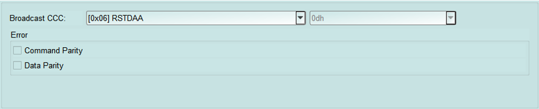
    Broadcast CCC, RSTDAA instructs all I3C target devices on the bus to clear their currently assigned dynamic addresses and return to an unaddressed state.
    The Broadcast RSTDAA CCC tells all targets to:
        * Forget their dynamic address
        * Return to the default, unaddressed condition
        * Prepare for a fresh Dynamic Address Assignment (DAA) process

        After RSTDAA, no target is addressable by private transfers until DAA is performed again.

    8. Broadcast CCC - ENTDAA
    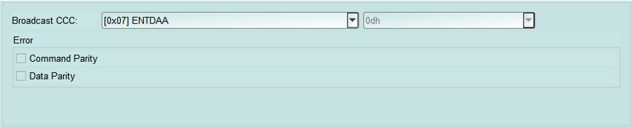
    Broadcast CCC, ENTDAA tells all unaddressed I3C target devices on the bus to participate in the Dynamic Address Assignment (DAA) process, so the controller can assign each device a unique dynamic address.
    The Broadcast ENTDAA CCC allows the controller to:
        * Start the Dynamic Address Assignment (DAA) sequence
        * Assign unique dynamic addresses to all unaddressed targets
        * Ensure no conflicts between devices on the bus

        Targets that already have a dynamic address ignore ENTDAA.

    9. Broadcast CCC - DEFTGTS
    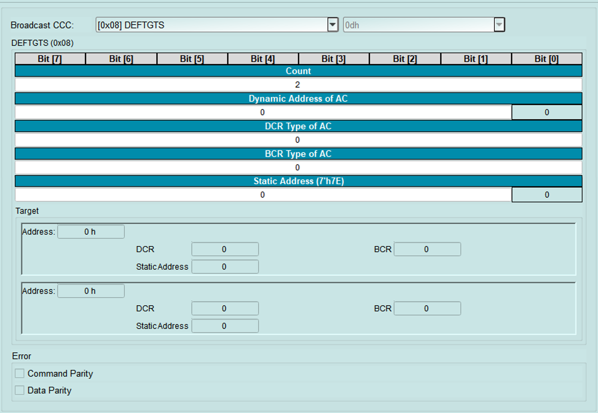
    Broadcast CCC, DEFTGTS allows the controller to define timing parameters or slot assignments for all targets on the bus, particularly in grouped or time-slotted operations.
    The Broadcast DEFTGTS CCC allows the controller to:
        * Assign timing slots to target devices for coordinated operations
        * Control grouped transfer schedules, e.g., for multiple sensors
        * Ensure deterministic data reporting in systems with many devices

        DEFTGTS is particularly important for high-speed or synchronized operations, where multiple targets may need to transmit data in a pre-defined order.

    10. Broadcast CCC - SETMWL
    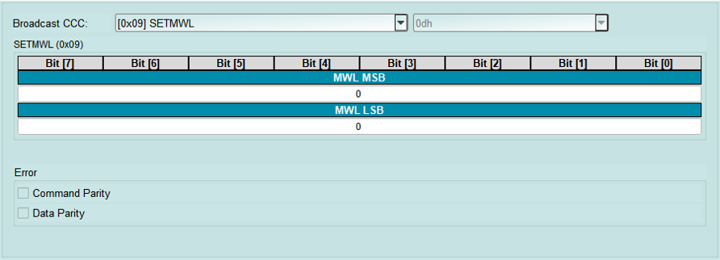
    Broadcast CCC, SETMWL instructs all target devices on the bus to adopt a minimum number of bytes for write transactions before they will respond with an acknowledgment.
    The Broadcast SETMWL CCC allows the controller to:
        * Specify a minimum number of bytes that a target must receive in a write transfer before it can process or respond
        * Prevent targets from being triggered by partial or incomplete writes
        * Improve data integrity and bus efficiency

        Essentially, SETMWL sets a threshold for write transaction length.

    11. Broadcast CCC - SETMRL
    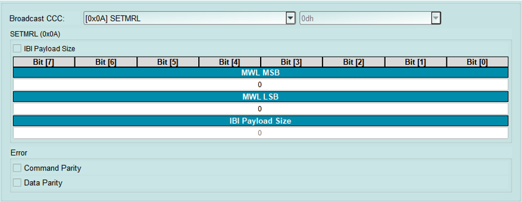
    Broadcast CCC, SETMRL allows the controller to define the maximum number of data bytes that target devices are allowed to return in a single read transaction.
    The Broadcast SETMRL CCC tells all targets to:
        * Limit the length of private read transfers
        * Never return more than the specified number of bytes per read
        * Ensure predictable and controlled read behavior

        This protects the controller from unexpectedly long read responses.

    12. Broadcast CCC - ENTTM
    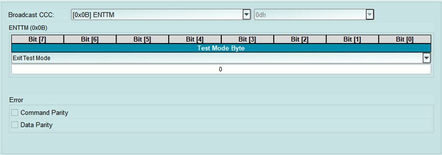
    Broadcast CCC, ENTTM Broadcast CCC tells all targets to enter a special test or compliance mode, which is used for:
        * Manufacturing and production testing
        * Electrical and signal integrity validation
        * Protocol compliance and stress testing

        Only targets that support Test Mode respond to ENTTM; other devices safely ignore the command.

    13. Broadcast CCC - SETBUSCON
    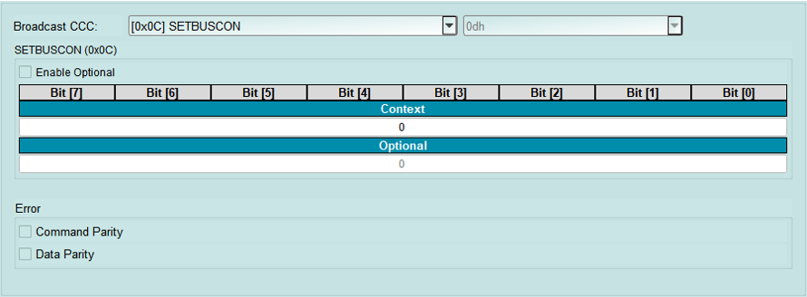
    Broadcast CCC, SETBUSCON allows the controller to configure bus-level operating conditions simultaneously for all I3C target devices on the bus.
    The SETBUSCON Broadcast CCC tells all targets how the bus will operate, including parameters such as:
        * Bus speed and timing constraints
        * Clocking and mode-related behavior
        * Other global bus configuration settings defined by the controller

        By issuing SETBUSCON as a broadcast, the controller ensures that all targets use a consistent view of the bus configuration, avoiding mismatches between devices.

    14. Broadcast CCC - ENDXFER
    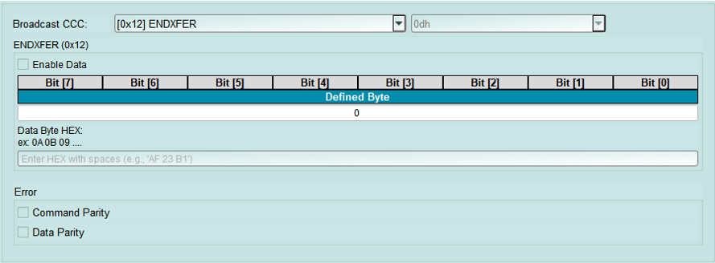
    Broadcast CCC, ENDXFER allows the controller to simultaneously terminate an ongoing data transfer or special bus operation for all I3C target devices on the bus.
    The ENDXFER Broadcast CCC tells all targets that the current transfer context has ended, and that they must:
        * Stop participating in the current data phase or extended transfer
        * Return to an idle or command-ready state
        * Clear any temporary transfer-related state

        ENDXFER is used to cleanly close or abort a bus operation that may involve multiple targets, ensuring all devices are synchronized and no target remains in a partial or undefined transfer state.

    15. Broadcast CCC - ENTHDR0
    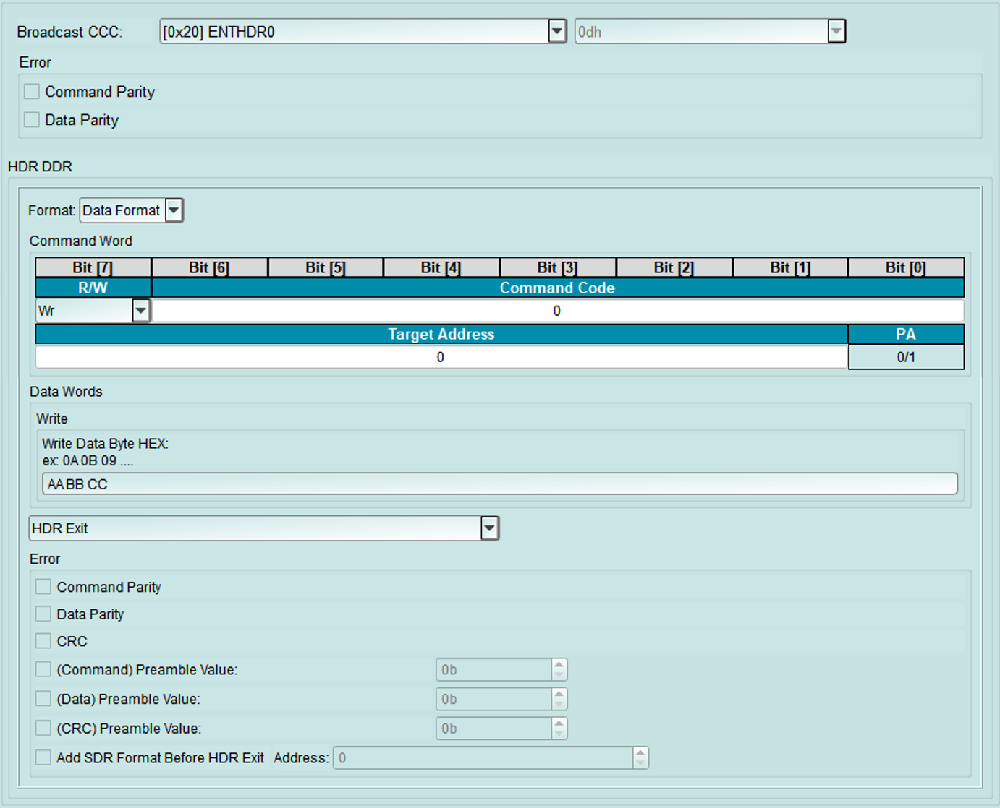
    Broadcast CCC, ENTHDR0 allows the controller to simultaneously switch all I3C target devices on the bus into HDR-DDR (High Data Rate – Double Data Rate) mode.
    The ENTHDR0 Broadcast CCC tells all targets that support HDR-DDR to:
        * Exit Standard Data Rate (SDR) mode
        * Enter HDR-DDR signaling
        * Use double-data-rate transfers for higher throughput

        Only targets that support HDR-DDR mode respond to ENTHDR0. Devices that do not support this HDR mode safely ignore the command and remain in SDR mode.
        In this command, user can decide to turn on the "HDR Repeat".[^1]

    16. Broadcast CCC - ENTHDR1
    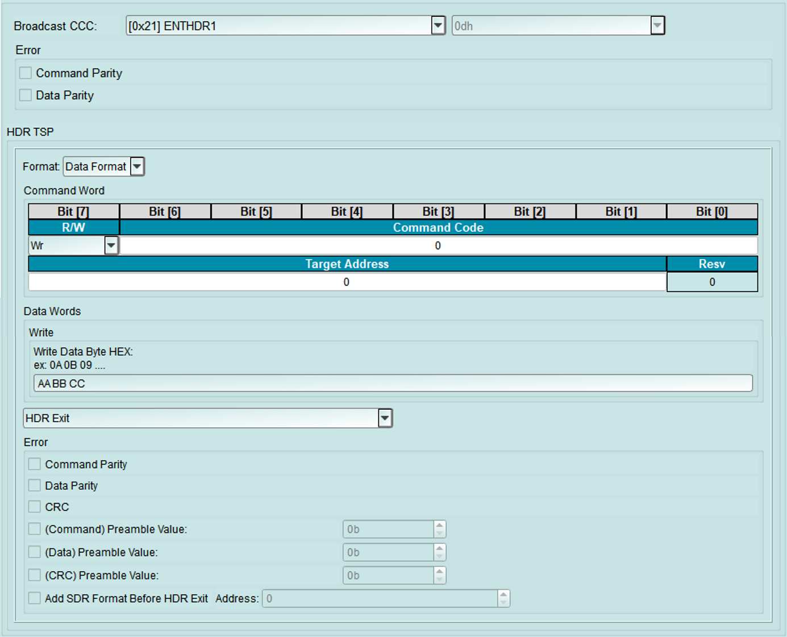
    Broadcast CCC, ENTHDR1 allows the controller to simultaneously switch all I3C target devices on the bus into HDR-TSP (High Data Rate – Ternary Symbol Pattern) mode.
    The ENTHDR1 Broadcast CCC tells all targets that support HDR-TSP to:
        * Exit Standard Data Rate (SDR) mode
        * Enter HDR-TSP signaling
        * Use ternary symbol–based transfers to achieve higher data rates

        Only targets that support HDR-TSP mode respond to ENTHDR1. Devices that do not support this HDR mode safely ignore the command and remain in SDR mode.
        In this command, user can decide to turn on the "HDR Repeat".[^1]

    17. Broadcast CCC - ENTHDR2
    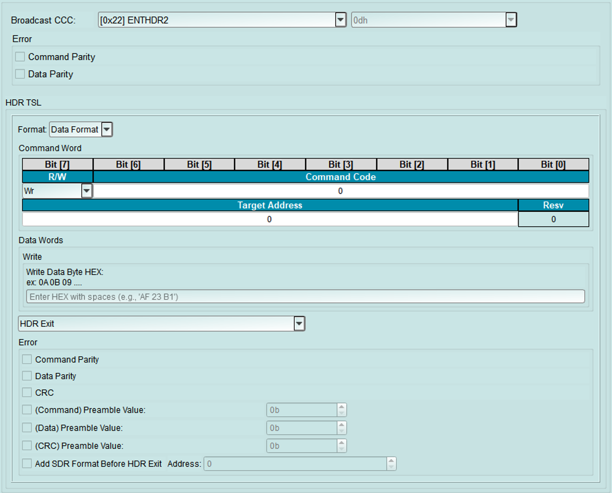
    Broadcast CCC, ENTHDR2 allows the controller to simultaneously switch all I3C target devices on the bus into HDR-TSL (High Data Rate – Ternary Symbol Level) mode.
    The ENTHDR2 Broadcast CCC tells all targets that support HDR-TSL to:
        * Exit Standard Data Rate (SDR) mode
        * Enter HDR-TSL signaling
        * Use ternary symbol–level encoding for higher-throughput transfers

        Only targets that support HDR-TSL mode respond to ENTHDR2; devices that do not support this HDR mode safely ignore the command and remain in SDR mode.
        In this command, user can decide to turn on the "HDR Repeat".[^1]

    18. Broadcast CCC - ENTHDR3
    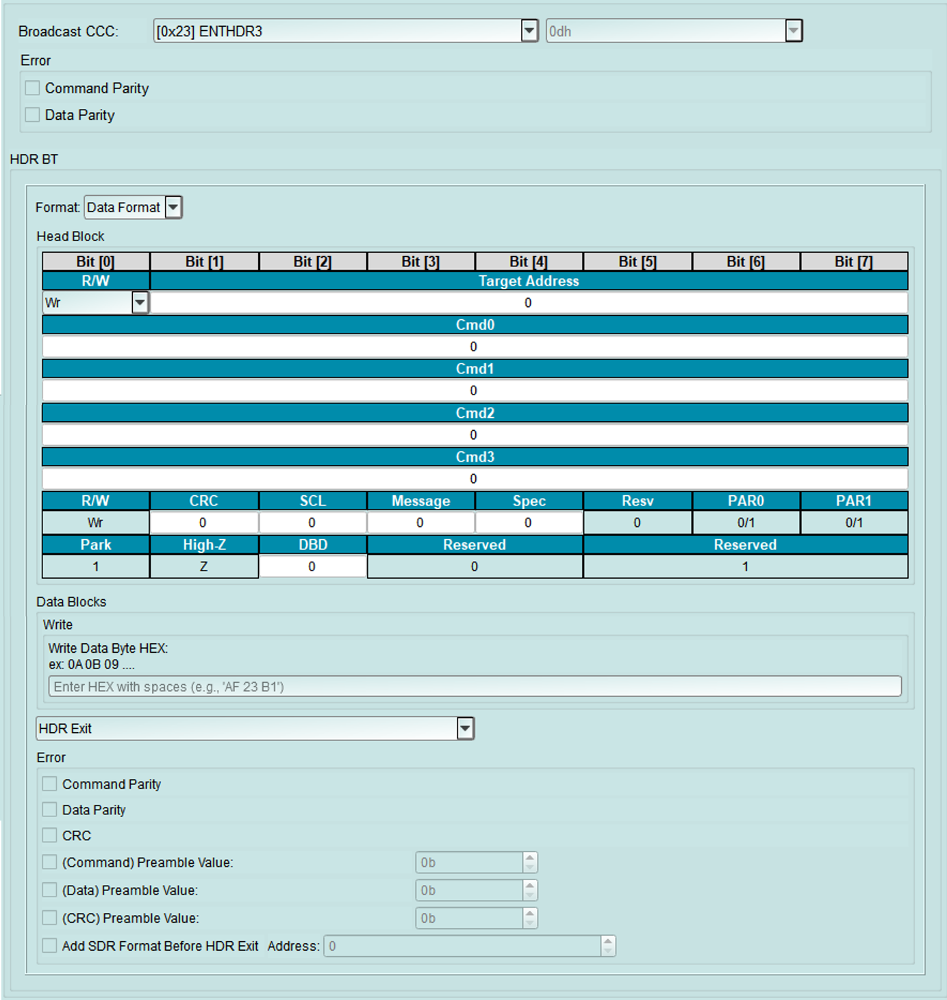
    Broadcast CCC, ENTHDR3 allows the controller to simultaneously switch all I3C target devices on the bus into HDR-BT (High Data Rate – Burst Type) mode.
    The ENTHDR3 Broadcast CCC tells all targets that support HDR-BT to:
        * Exit Standard Data Rate (SDR) mode
        * Enter HDR-BT signaling
        * Use burst-mode transfers for high-speed data communication

        Only targets that support HDR-BT mode respond to ENTHDR3; devices that do not support this HDR mode safely ignore the command and remain in SDR mode.
        In this command, user can decide to turn on the "HDR Repeat".[^1]

    19. Broadcast CCC - ENTHDR4
    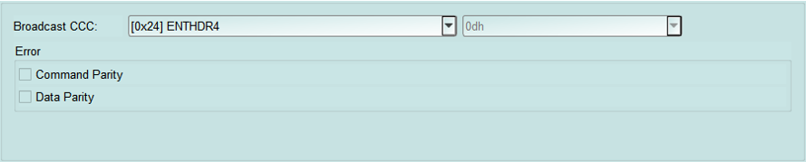
    Broadcast CCC, ENTHDR4 allows the controller to simultaneously switch all I3C target devices on the bus into HDR-DY (High Data Rate – Dynamic) mode.
    The ENTHDR4 Broadcast CCC tells all targets that support HDR-DY to:
        * Exit Standard Data Rate (SDR) mode
        * Enter HDR-DY signaling
        * Use dynamic high-speed transfer modes that adapt to bus conditions for optimized throughput

        Only targets that support HDR-DY mode respond to ENTHDR4; devices that do not support this HDR mode safely ignore the command and remain in SDR mode.

    20. Broadcast CCC - ENTHDR5
    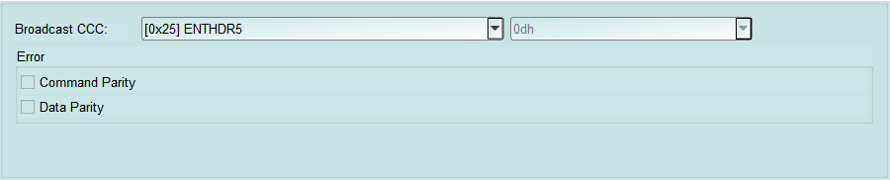
    Broadcast CCC, ENTHDR5 allows the controller to simultaneously switch all I3C target devices on the bus into HDR-TSV (High Data Rate – Ternary Symbol Variable) mode.
    The ENTHDR5 Broadcast CCC tells all targets that support HDR-TSV to:
        * Exit Standard Data Rate (SDR) mode
        * Enter HDR-TSV signaling
        * Use variable ternary-symbol encoding to achieve high-speed, adaptive data transfers

        Only targets that support HDR-TSV mode respond to ENTHDR5; devices that do not support this HDR mode safely ignore the command and remain in SDR mode.

    21. Broadcast CCC - ENTHDR6
    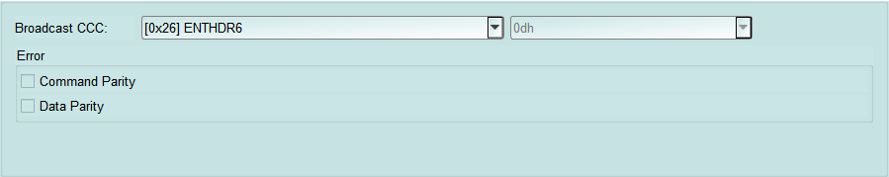
    Broadcast CCC, ENTHDR6 allows the controller to simultaneously switch all I3C target devices on the bus into HDR-BT1 (High Data Rate – Burst Type 1) mode.
    The ENTHDR6 Broadcast CCC tells all targets that support HDR-BT1 to:
        * Exit Standard Data Rate (SDR) mode
        * Enter HDR-BT1 signaling
        * Use burst-type high-speed transfers optimized for single-cycle or low-latency operations

        Only targets that support HDR-BT1 mode respond to ENTHDR6; devices that do not support this HDR mode safely ignore the command and remain in SDR mode.

    22. Broadcast CCC - ENTHDR7
    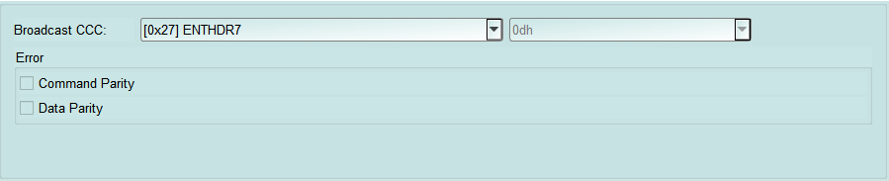
    Broadcast CCC, ENTHDR7 allows the controller to simultaneously switch all I3C target devices on the bus into HDR-BT2 (High Data Rate – Burst Type 2) mode.
    The ENTHDR7 Broadcast CCC tells all targets that support HDR-BT2 to:
        * Exit Standard Data Rate (SDR) mode
        * Enter HDR-BT2 signaling
        * Use an alternative burst-type high-speed transfer mode, typically optimized for higher throughput or multi-cycle burst operations

        Only targets that support HDR-BT2 mode respond to ENTHDR7; devices that do not support this HDR mode safely ignore the command and remain in SDR mode.

    23. Broadcast CCC - SETXTIME
    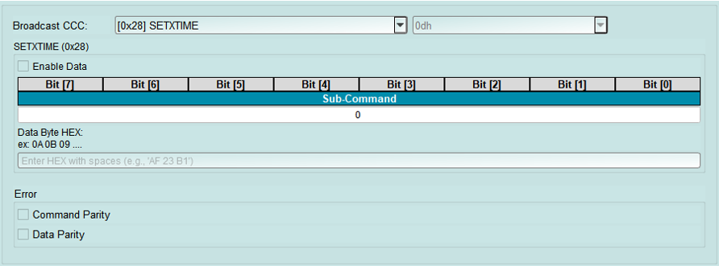
    Broadcast CCC, SETXTIME allows the controller to simultaneously configure the timing parameters for extended data transfers on all I3C target devices on the bus.
    The SETXTIME Broadcast CCC tells all targets to:
        * Set the maximum duration or timeout for ongoing or upcoming transfers
        * Adjust internal timers to ensure synchronized transfer completion
        * Prepare for operations that may require longer or extended data phases

        Only targets that support extended transfer timing respond to SETXTIME; devices that do not support this feature safely ignore the command.

    24. Broadcast CCC - SETAASA
    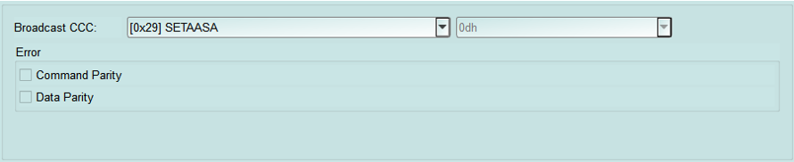
    Broadcast CCC, SETAASA allows the controller to simultaneously configure all I3C target devices on the bus to use a specific Activity-Aware Slave Address (AASA).
    The SETAASA Broadcast CCC tells all targets to:
        * Enable Activity-Aware Slave Addressing, allowing devices to respond to a secondary address based on activity patterns
        * Set the AASA value that targets will recognize for specific operations
        * Support coordinated or selective communication in multi-target or power-optimized bus scenarios

        Only targets that support AASA respond to SETAASA; devices that do not support this feature safely ignore the command.

    25. Broadcast CCC - RSTACT
    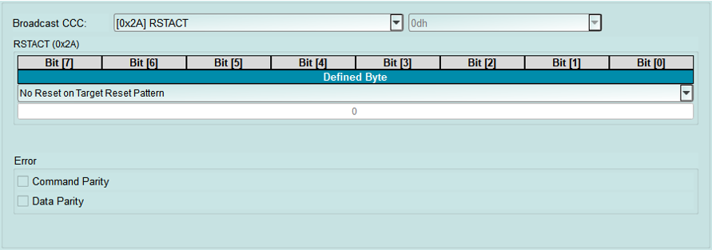
    Broadcast CCC, RSTACK allows the controller to simultaneously reset the activity state of all I3C target devices on the bus.
    The RSTACK Broadcast CCC tells all targets to:
        * Clear their current activity state
        * Reset any activity counters, timers, or internal flags used for Activity-Aware Slave Addressing (AASA) or other activity-based operations
        * Return to a default idle or ready state for bus communication

        Only targets that support activity state tracking respond to RSTACK; devices that do not support this feature safely ignore the command.
    
    26. Broadcast CCC - DEFGRPA
    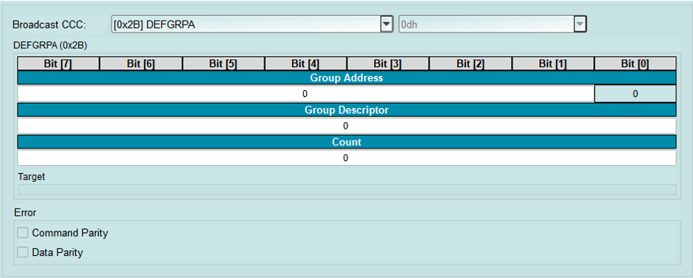
    Broadcast CCC, DEFGRPA allows the controller to simultaneously define or assign a Group Address (GADDR) to all I3C target devices on the bus.
    The DEFGRPA Broadcast CCC tells all targets to:
        * Accept a specific Group Address for future group-directed commands
        * Enable devices to respond collectively to broadcasts or group-targeted operations
        * Support coordinated communication for power optimization, event notification, or synchronized data transfers

        Only targets that support group addressing respond to DEFGRPA; devices that do not support this feature safely ignore the command.

    27. Broadcast CCC - RSTGRPA
    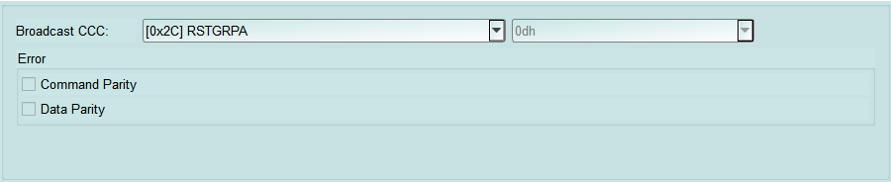
    Broadcast CCC, RSTGRPA allows the controller to simultaneously reset the Group Address (GADDR) of all I3C target devices on the bus.
    The RSTGRPA Broadcast CCC tells all targets to:
        * Clear any previously assigned Group Address
        * Remove the device from any group-targeted communications
        * Return to a default state where they respond only to individual or broadcast commands

        Only targets that support group addressing respond to RSTGRPA; devices that do not support this feature safely ignore the command.

    28. Broadcast CCC - MLANE
    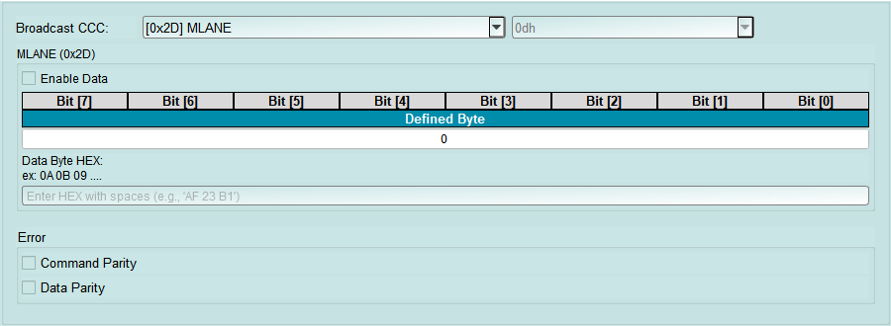
    Broadcast CCC, MLANE allows the controller to simultaneously configure all I3C target devices on the bus for Multi-Lane operation.
    The MLANE Broadcast CCC tells all targets to:
        * Enable or configure multi-lane communication, allowing multiple physical lanes to be used for higher data throughput
        * Coordinate lane mapping and synchronization across all capable devices
        * Prepare devices for parallel high-speed data transfers using multiple I3C lanes

        Only targets that support multi-lane operation respond to MLANE; devices that do not support this feature safely ignore the command.

    29. Broadcast CCC - Customized
    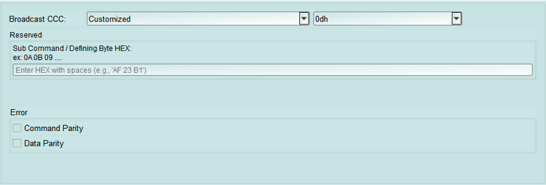
    User can send out customized packet for specific purpose.

5. Direct CCC:
    1. Direct CCC - ENEC
    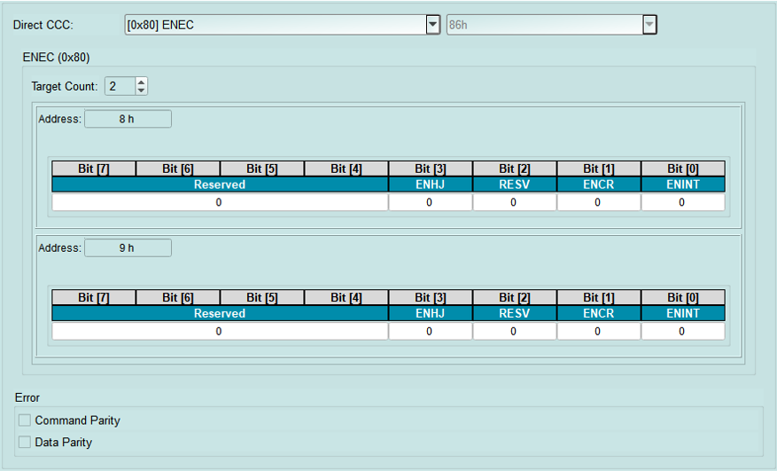
    Direct CCC, ENEC allows the controller to enable specific event types for an individual I3C target device on the bus.
    The ENEC Direct CCC tells a particular target which events it is allowed to generate, such as:
        * In-Band Interrupts (IBI) – for asynchronous notifications to the controller
        * Hot-Join – indicating that a new device has joined the bus
        * Controller Role Request (CRR) – requesting a change in controller role

        Without ENEC, the target cannot issue these events, even if it supports them.

    2. Direct CCC - DISEC
    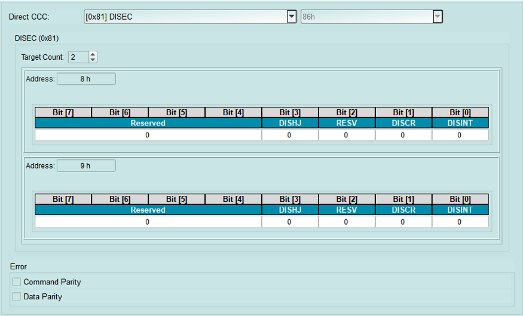
    Direct CCC, DISEC allows the controller to disable specific event types for an individual I3C target device on the bus.
    The DISEC Direct CCC tells a particular target to stop generating certain events, such as:
        * In-Band Interrupts (IBI) – preventing the device from sending asynchronous notifications
        * Hot-Join – ignoring indications when a new device joins
        * Controller Role Request (CRR) – stopping requests to change the controller role

        By using DISEC, the controller can selectively block events from a single device without affecting other devices on the bus.

    3. Direct CCC - ENTAS0
    
    Direct CCC, ENTAS0 instructs certain I3C target devices on the bus to enter Activity State 0, which is a defined low-activity / low-power state.
    The Direct ENTAS0 CCC tells certain targets to:
        * Transition into Activity State 0
        * Reduce internal activity and power consumption
        * Maintain bus awareness so they can resume normal operation later

        Activity State 0 is typically the lowest-power activity state defined for I3C targets.

    4. Direct CCC - ENTAS1
    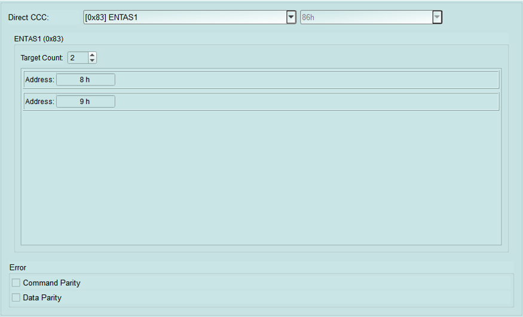
    Direct CCC, ENTAS1 instructs certain I3C target devices on the bus to transition into Activity State 1, a moderate-activity / reduced-power operating state.
    The Direct ENTAS1 CCC tells certain targets to:
        * Enter Activity State 1
        * Reduce power compared to full active mode
        * Remain responsive to normal I3C bus operations

        Activity State 1 balances power savings with bus availability.

    5. Direct CCC - ENTAS2
    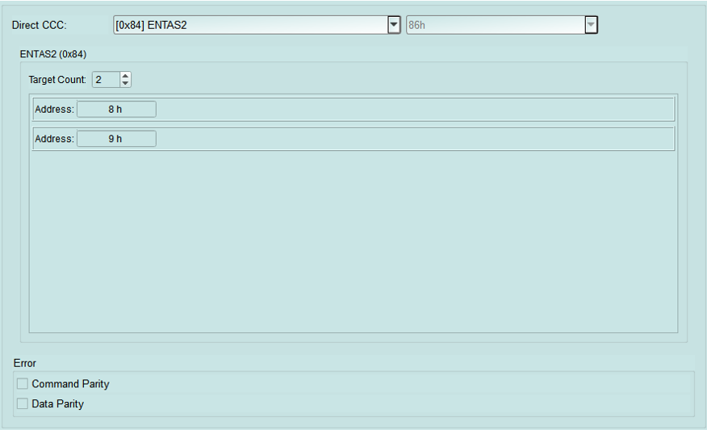
    Direct CCC, ENTAS2 instructs certain I3C target devices on the bus to transition into Activity State 2, which is a high-activity / near-full-performance state.
    The Direct ENTAS2 CCC tells certain targets to:
        * Enter Activity State 2
        * Operate with higher internal activity than state 1
        * Be ready for high-throughput or low-latency communication

        Activity State 2 is typically just below the fully unrestricted active state.

    6. Direct CCC - ENTAS3
    
    Direct CCC, ENTAS3 instructs certain I3C target devices on the bus to transition into Activity State 3, which represents the highest activity and performance state defined by the I3C specification.
    The Direct ENTAS3 CCC tells certain targets to:
        * Enter Activity State 3
        * Operate at full internal performance
        * Be fully ready for maximum bus speed and lowest latency

        Activity State 3 corresponds to unrestricted, fully active operation.

    7. Direct CCC - SETDASA
    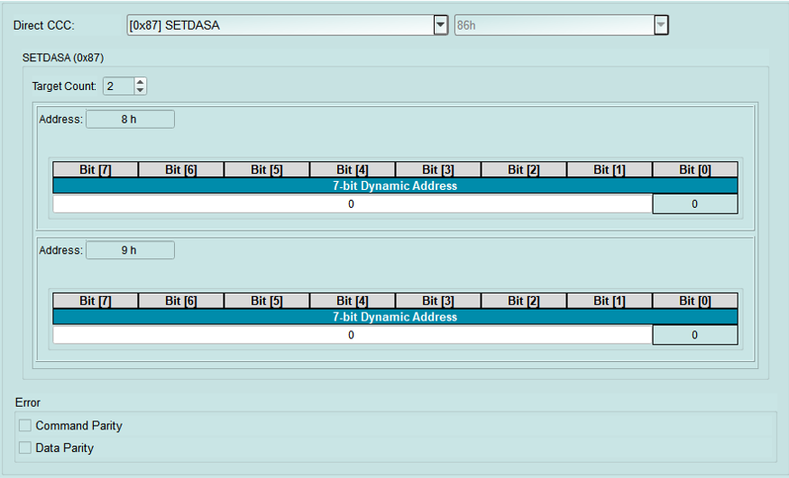
    Direct CCC, SETDASA instructs a specific I3C target device on the bus, identified by its static I2C address, to adopt a new dynamic 7-bit address assigned by the controller.
    The Direct SETDASA CCC tells the target to:
        * Accept the new dynamic address provided by the controller
        * Switch from using its static address to the assigned dynamic address for future communications
        * Acknowledge the assignment so that normal I3C bus communication can proceed

        This allows the controller to efficiently assign dynamic addresses to known devices without performing a full broadcast ENTDAA procedure.

    8. Direct CCC - SETNEWDA
    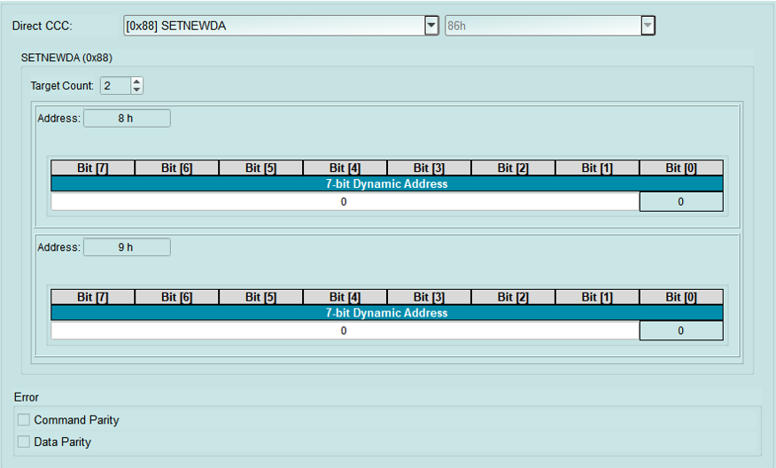
    Direct CCC, SETNEWDA instructs a specific I3C target device, identified by its current dynamic address, to adopt a new dynamic 7-bit address assigned by the controller.
    The Direct SETNEWDA CCC tells the target to:
        * Change its current dynamic address to the new dynamic address provided by the controller
        * Update its internal address mapping so future communications use the new dynamic address
        * Acknowledge the address change so the controller knows the operation was successful

        This command allows the controller to reassign dynamic addresses to devices already on the bus, for example, to resolve address conflicts or reorganize bus addressing without resetting devices.

    9. Direct CCC - SETMWL
    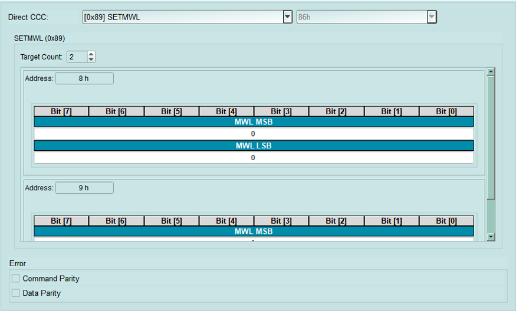
    Direct CCC, SETMWL instructs a specific I3C target device on the bus to set its Maximum Write Length (MWL), which defines the largest number of data bytes the controller is allowed to write to that target in a single I3C write transaction.
    The Direct SETMWL CCC tells the target to:
        * Update its internal Maximum Write Length value to the value provided by the controller
        * Limit future write transfers from the controller to this specified maximum length
        * Enforce flow control by rejecting or managing writes that exceed the configured limit

        This command allows the controller to optimize bus performance and ensure compatibility with targets that have internal buffering or processing constraints.

    10. Direct CCC - SETMRL
    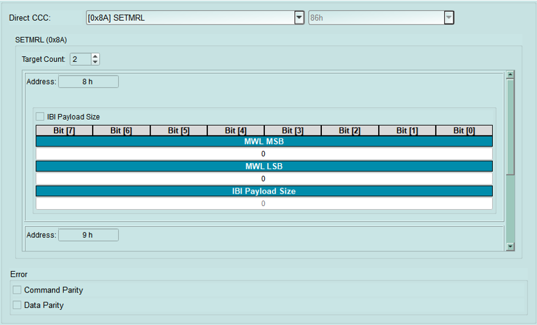
    Direct CCC, SETMRL instructs a specific I3C target device on the bus to set its Maximum Read Length (MRL), which defines the largest number of data bytes the controller is allowed to read from that target in a single I3C read transaction.
    The Direct SETMRL CCC tells the target to:
        * Update its internal Maximum Read Length value to the value provided by the controller
        * Limit future read transfers to the specified maximum length
        * Ensure that read operations do not exceed the target’s internal buffering or data availability constraints

        This command allows the controller to manage read transaction sizes, improving reliability and efficiency while preventing data overruns or incomplete transfers.

    11. Direct CCC - GETMWL
    
    Direct CCC, GETMWL instructs a specific I3C target device on the bus to report its Maximum Write Length (MWL), which indicates the largest number of data bytes the controller is permitted to write to that target in a single I3C write transaction.
    The Direct GETMWL CCC tells the target to:
        * Return its currently configured Maximum Write Length value to the controller
        * Allow the controller to determine safe write transaction sizes
        * Support optimal bus scheduling and flow control decisions

        This command allows the controller to query a target’s write capacity, either before issuing write transfers or to confirm the value previously set using SETMWL.

    12. Direct CCC - GETMRL
    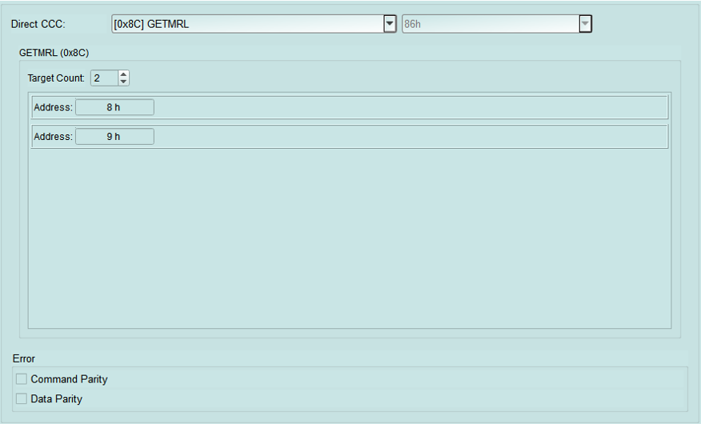
    Direct CCC, GETMRL instructs a specific I3C target device on the bus to report its Maximum Read Length (MRL), which indicates the largest number of data bytes the controller is permitted to read from that target in a single I3C read transaction.
    The Direct GETMRL CCC tells the target to:
        * Return its currently configured Maximum Read Length value to the controller
        * Allow the controller to determine safe and efficient read transaction sizes
        * Support proper flow control and bus scheduling

        This command allows the controller to query a target’s read capacity, either before performing read operations or to verify the value previously configured using SETMRL.

    13. Direct CCC - GETPID
    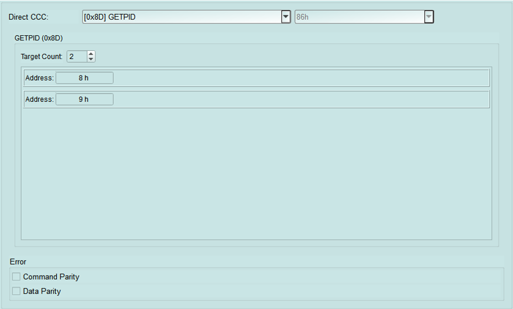
    Direct CCC, GETPID instructs a specific I3C target device on the bus to report its Provisional ID (PID), which uniquely identifies the device according to the MIPI I3C specification.
    The Direct GETPID CCC tells the target to:
        * Return its 48-bit Provisional ID to the controller
        * Allow the controller to identify the device vendor, part, and instance
        * Support device discovery, enumeration, and validation

        This command allows the controller to uniquely identify a target device without relying on static addresses, and is commonly used during device discovery or for verification after dynamic address assignment.

    14. Direct CCC - GETBCR
    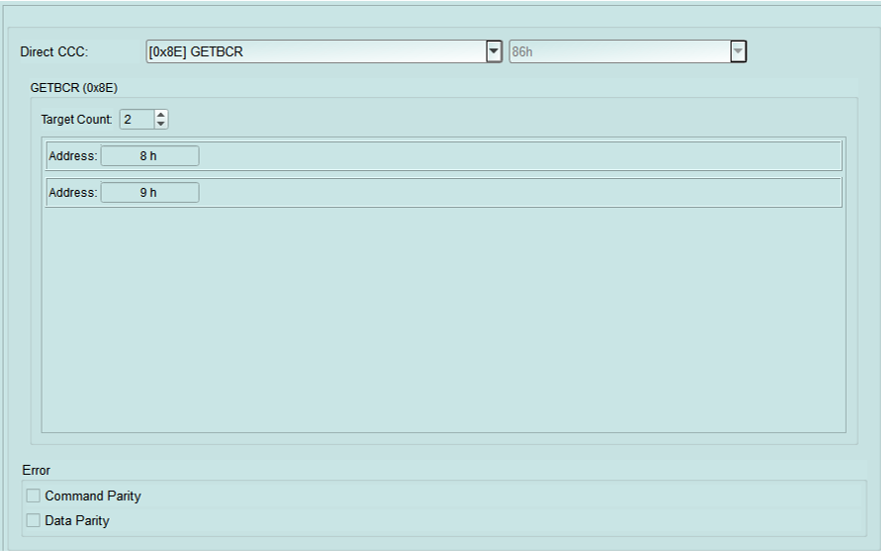
    Direct CCC, GETBCR instructs a specific I³C target device on the bus to report its Bus Characteristics Register (BCR), which describes the target’s fundamental bus-related capabilities.
    The Direct GETBCR CCC tells the target to:
        * Return its Bus Characteristics Register value to the controller
        * Indicate whether the device supports key I³C features such as I³C target mode, I2C legacy compatibility, and in-band interrupt capability
        * Allow the controller to understand how the device behaves on the I³C bus

        This command allows the controller to determine basic bus capabilities and protocol support of a target device, which is essential during device discovery and initialization.

    15. Direct CCC - GETDCR
    
    Direct CCC, GETDCR instructs a specific I³C target device on the bus to report its Device Characteristics Register (DCR), which describes the device’s functional classification.
    The Direct GETDCR CCC tells the target to:
        * Return its Device Characteristics Register value to the controller
        * Indicate the general device type or functional category
        * Allow the controller to identify the intended role of the device on the bus

        This command allows the controller to understand what kind of device a target is, enabling appropriate driver selection and configuration during device discovery and initialization.

    16. Direct CCC - GETSTATUS
    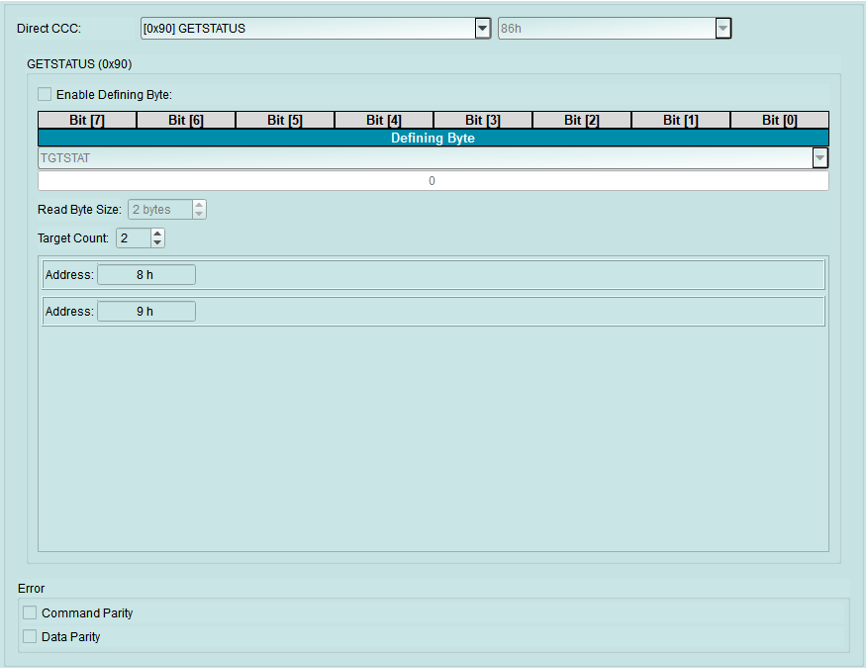
    Direct CCC, GETSTATUS instructs a specific I³C target device on the bus to report its Status Register, which provides current operational and interrupt-related status information.
    The Direct GETSTATUS CCC tells the target to:
        * Return its current status information to the controller
        * Indicate pending events such as interrupts or errors
        * Allow the controller to determine the target’s operational state

        This command allows the controller to query real-time device status, often as a follow-up to an In-Band Interrupt (IBI) or during diagnostic and monitoring operations.

    17. Direct CCC - GETACCCR
    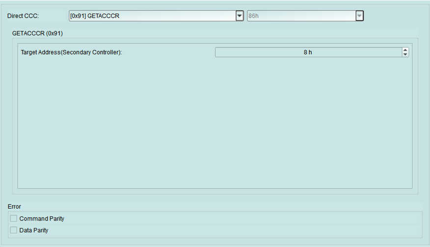
    Direct CCC, GETACCCR instructs a specific I³C target device on the bus to report its Advanced Capabilities Control Register (ACCCR), which describes the target’s support for advanced I³C features and capabilities.
    The Direct GETACCCR CCC tells the target to:
        * Return its Advanced Capabilities Control Register value to the controller
        * Indicate support for optional and advanced I³C features
        * Allow the controller to determine how to enable or use advanced bus functionality with the target

        This command allows the controller to discover advanced target capabilities beyond the basic bus and device characteristics, helping optimize performance and feature usage.

    18. Direct CCC - ENDXFER
    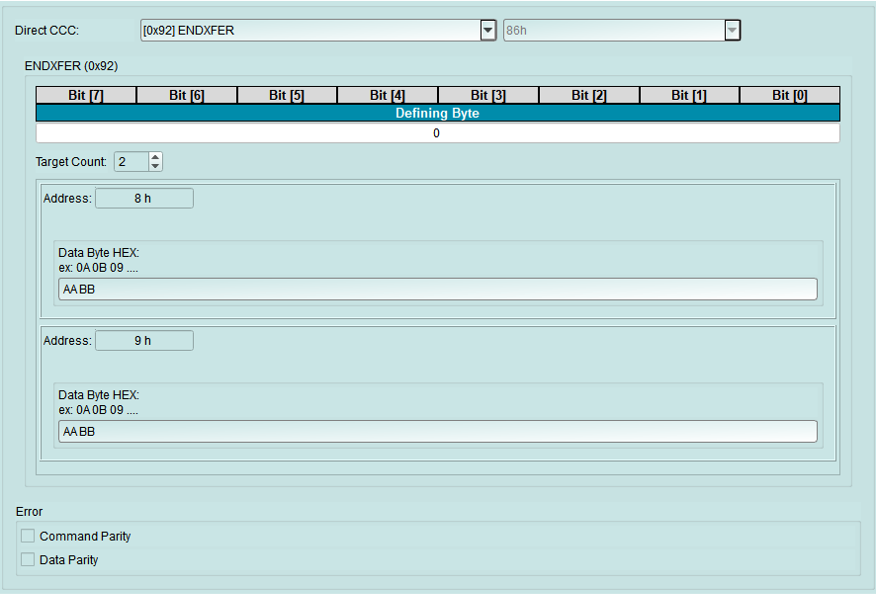
    Direct CCC, ENDXFER instructs a specific I³C target device on the bus to terminate the current data transfer sequence and return to an idle or ready state.
    The Direct ENDXFER CCC tells the target to:
        * End the ongoing transfer or transaction sequence
        * Clear any internal state related to the current transfer
        * Prepare to accept new commands or transfers from the controller

        This command allows the controller to cleanly abort or conclude a transfer, ensuring both the controller and target return to a known, synchronized state on the I³C bus.

    19. Direct CCC - SETBRGTGT
    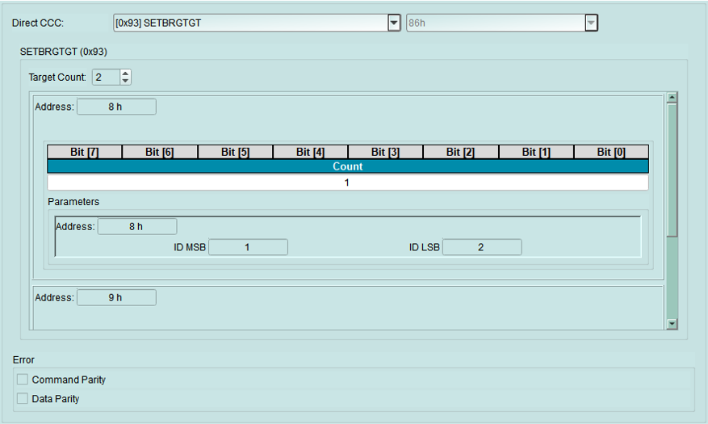
    Direct CCC, SETBRGTGT instructs a specific I³C target device on the bus to configure its bus-related timing or behavior as a bridge target, which is relevant when the device participates in bridging or multi-segment bus topologies.
    The Direct SETBRGTGT CCC tells the target to:
        * Set or update its bridge target configuration parameters
        * Adjust its behavior to properly forward or manage signals between bus segments
        * Acknowledge the configuration so the controller knows the bridge target is ready

        This command allows the controller to manage bus segmentation and bridge devices, enabling proper communication across complex I³C topologies while maintaining timing and protocol integrity.

    20. Direct CCC - GETMXDS
    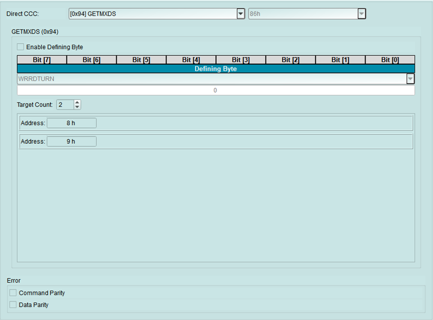
    Direct CCC, GETMXDS instructs a specific I³C target device on the bus to report its Maximum Data Speed (MXDS), which indicates the highest data rate the device can reliably support on the I³C bus.
    The Direct GETMXDS CCC tells the target to:
        * Return its current Maximum Data Speed value to the controller
        * Inform the controller of the fastest speed at which it can communicate
        * Allow the controller to optimize bus timing and overall performance

        This command allows the controller to query a target’s speed capability, ensuring that data transfers are conducted within the device’s supported limits and preventing communication errors due to excessive speed.

    21. Direct CCC - GETCAPS
    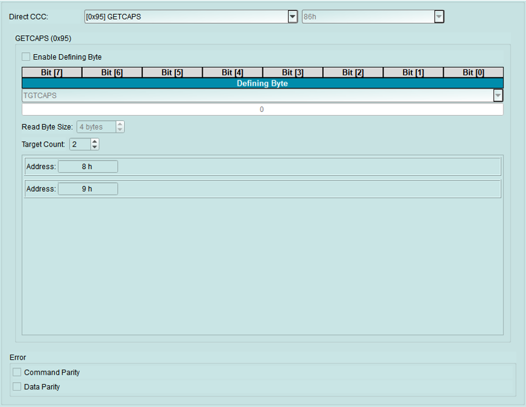
    Direct CCC, GETCAPS instructs a specific I³C target device on the bus to report its capabilities, providing a summary of the device’s supported features and functional options.
    The Direct GETCAPS CCC tells the target to:
        * Return a value indicating which I³C features it supports
        * Include information such as support for In-Band Interrupts (IBIs), HDR modes, multi-master capability, and other optional features
        * Allow the controller to determine how best to communicate with and utilize the device

        This command allows the controller to discover the functional capabilities of a target device, enabling proper configuration, optimized bus usage, and compatibility checks before performing advanced operations.

    22. Direct CCC - SETROUTE
    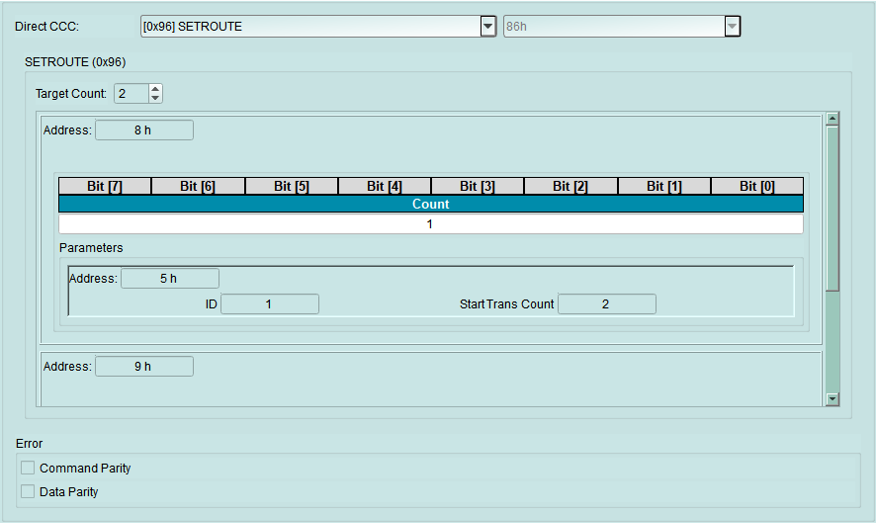
    Direct CCC, SETROUTE instructs a specific I³C target device on the bus to configure its routing path, which is particularly relevant in complex or multi-segment I³C topologies where certain devices act as bridges or routing points.
    The Direct SETROUTE CCC tells the target to:
        * Set or update its internal routing configuration
        * Determine which bus segment or downstream devices it should forward traffic to
        * Acknowledge the new routing path so the controller knows the device is ready for communication

        This command allows the controller to manage traffic paths and device connectivity, ensuring proper communication in multi-segment or bridged I³C networks.

    23. Direct CCC - D2DXFER
    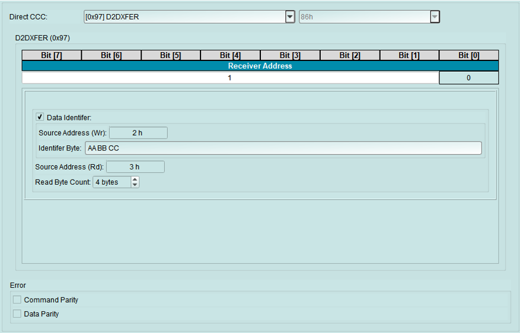
    Direct CCC, D2DXFER instructs a specific I³C target device on the bus to perform a direct-to-direct data transfer between two devices on the bus, without requiring the controller to relay all the data.
    The Direct D2DXFER CCC tells the target to:
        * Transfer a specified block of data directly from a source device to a destination device
        * Use the target device as a facilitator for the transfer if needed
        * Acknowledge completion of the transfer to the controller

        This command allows the controller to offload data movement between devices, reducing bus traffic and improving overall efficiency for large data transfers.

    24. Direct CCC - SETXTIME
    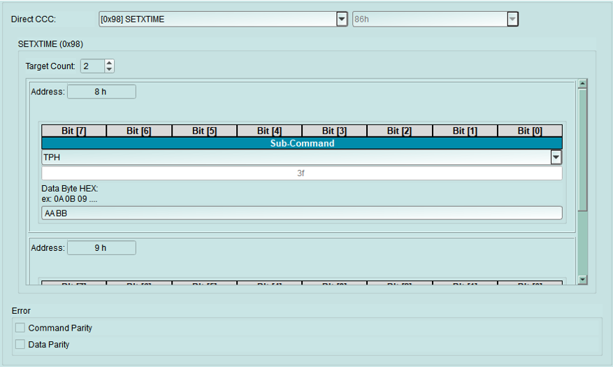
    Direct CCC, SETXTIME instructs a specific I³C target device on the bus to set a transfer timeout value, defining the maximum allowed duration for certain data transfer operations.
    The Direct SETXTIME CCC tells the target to:
        * Configure its internal transfer timeout according to the value provided by the controller
        * Limit how long a read or write transaction can remain active before the target considers it failed
        * Acknowledge the new timeout setting so future transfers comply with the configured limit

        This command allows the controller to enforce reliable and predictable timing on the I³C bus, helping prevent stalled transfers or bus lockup due to slow or unresponsive devices.

    25. Direct CCC - GETXTIME
    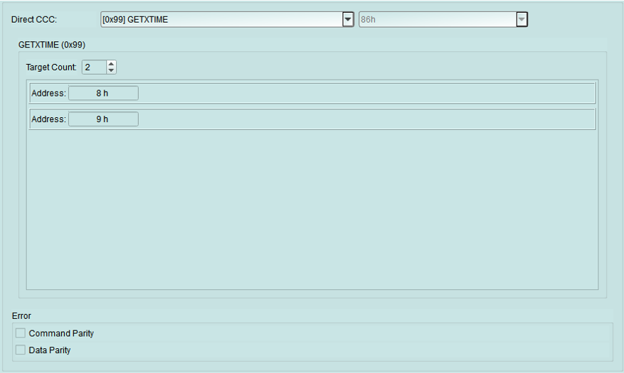
    Direct CCC, GETXTIME instructs a specific I³C target device on the bus to report its current transfer timeout value, which defines the maximum allowed duration for certain data transfer operations.
    The Direct GETXTIME CCC tells the target to:
        * Return its currently configured transfer timeout value to the controller
        * Allow the controller to determine how long the target will wait during a read or write transaction before timing out
        * Support bus scheduling and error management by providing accurate timing information

        This command allows the controller to query a target’s transfer timing constraints, helping ensure that data transfers are performed reliably and within the expected time limits.

    26. Direct CCC - RSTACT
    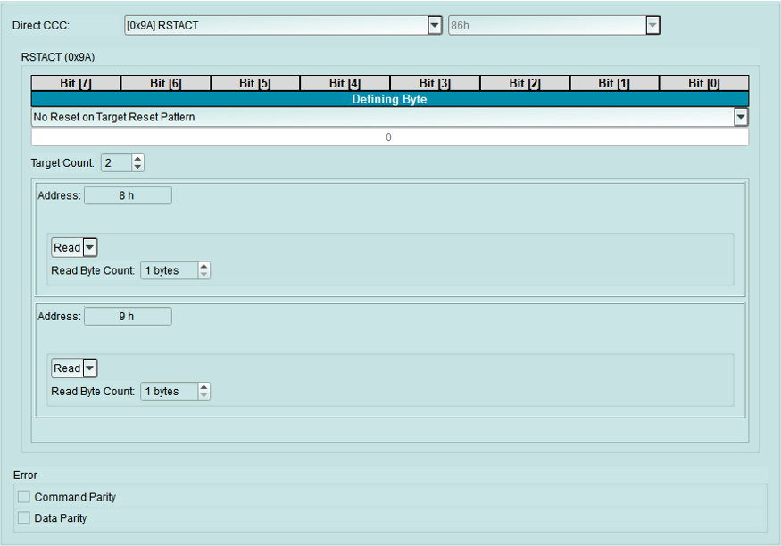
    Direct CCC, RSTACT instructs a specific I³C target device on the bus to reset its Activity State to the default or inactive state as defined by the I³C specification.
    The Direct RSTACT CCC tells the target to:
        * Transition from its current activity state to the default or idle state
        * Clear any temporary operational conditions related to activity state (e.g., performance level, internal counters)
        * Acknowledge the reset so the controller knows the device is back in a known state

        This command allows the controller to reinitialize or normalize a device’s activity state, which is useful for power management, performance tuning, or recovering devices that are in a higher activity state than required.

    27. Direct CCC - SETGRPA
    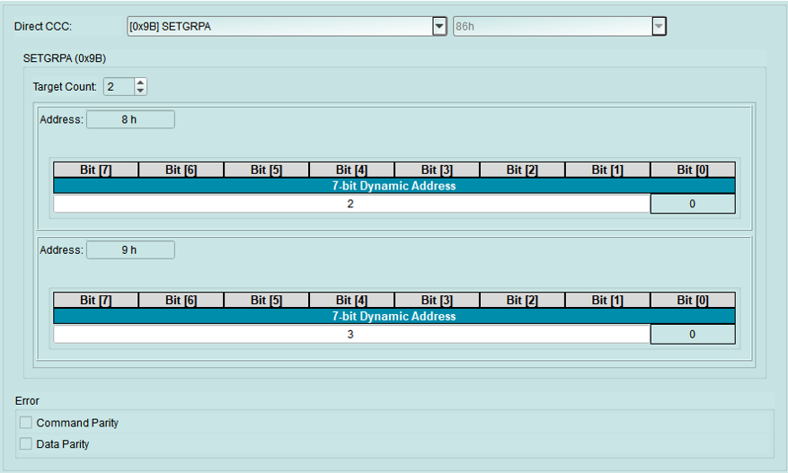
    Direct CCC, SETGRPA instructs a specific I³C target device on the bus to assign it to a particular group address (Group Address A), enabling group communication and selective broadcast operations.
    The Direct SETGRPA CCC tells the target to:
        * Store the specified group address in its internal configuration
        * Respond to future group-targeted broadcast commands sent to that group address
        * Acknowledge the assignment so the controller knows the device is successfully grouped

        This command allows the controller to organize devices into functional or logical groups, enabling efficient broadcast communication without addressing each device individually.

    28. Direct CCC - RSTGRPA
    
    Direct CCC, RSTGRPA instructs a specific I³C target device on the bus to clear or reset its assigned Group Address A (GRPA), removing it from the group.
    The Direct RSTGRPA CCC tells the target to:
        * Delete or invalidate its stored Group Address A
        * Stop responding to broadcast commands sent to that group address
        * Acknowledge the reset so the controller knows the device is no longer part of the group

        This command allows the controller to dynamically manage group memberships, ensuring that devices only respond to group-targeted operations when appropriate.

    29. Direct CCC - MLANE
    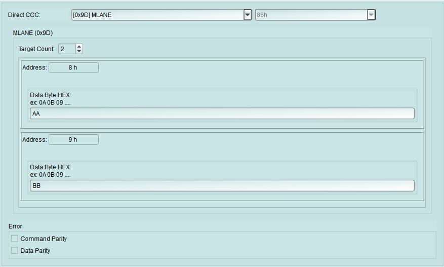
    Direct CCC, MLANE instructs a specific I³C target device on the bus to configure or report its Multi-Lane operation settings, which are used in systems that support multiple physical lanes for parallel data transfer.
    The Direct MLANE CCC tells the target to:
        * Enable or configure multi-lane operation parameters (such as lane assignment or activation)
        * Adjust internal settings to participate correctly in multi-lane transfers
        * Acknowledge the configuration so the controller knows the target is ready for multi-lane communication

        This command allows the controller to optimize data throughput by coordinating devices that support multiple parallel lanes, enabling higher-speed communication or load balancing across lanes.

    30. Direct CCC - Customized
    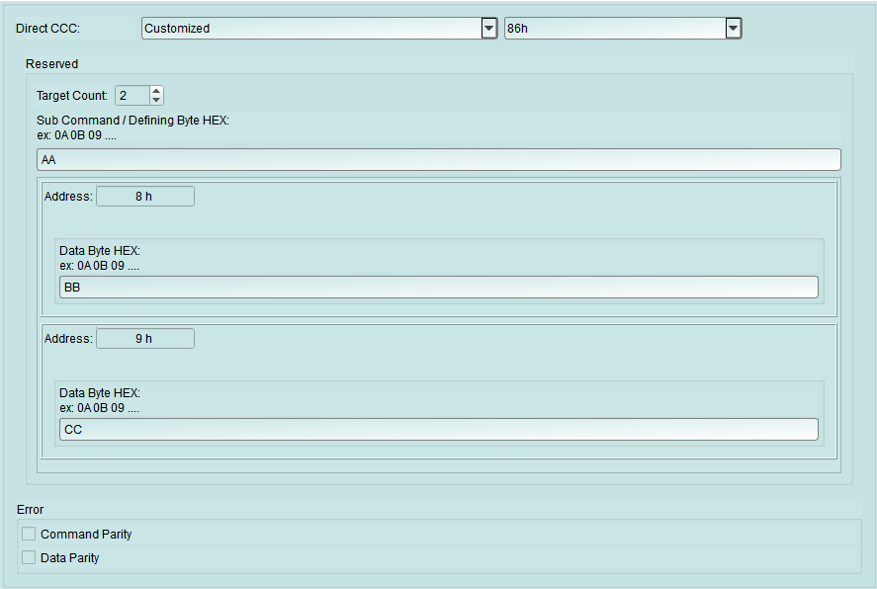
    User can send out customized packet for specific purpose.

6. Legacy I2C RW
    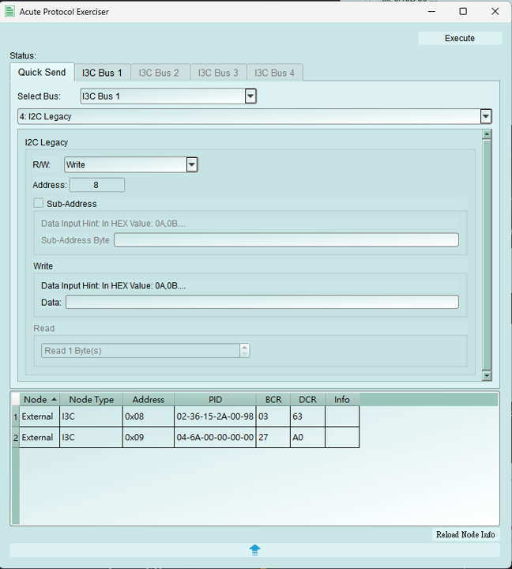

    1. Legacy I2C Read with SubAddr
    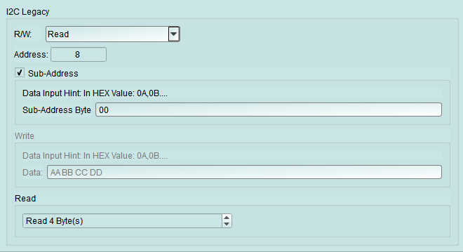

    2. Legacy I2C Write with SubAddr
    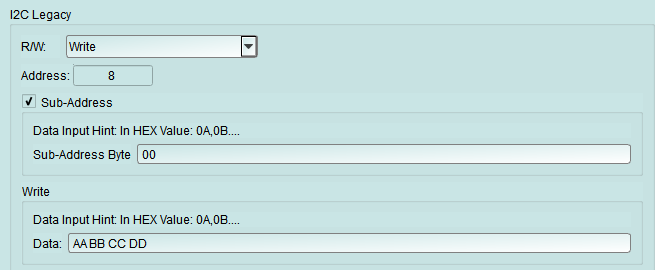

    User can send out legacy I2C packet, for specific purpose.

[^1]: HDR Repeat
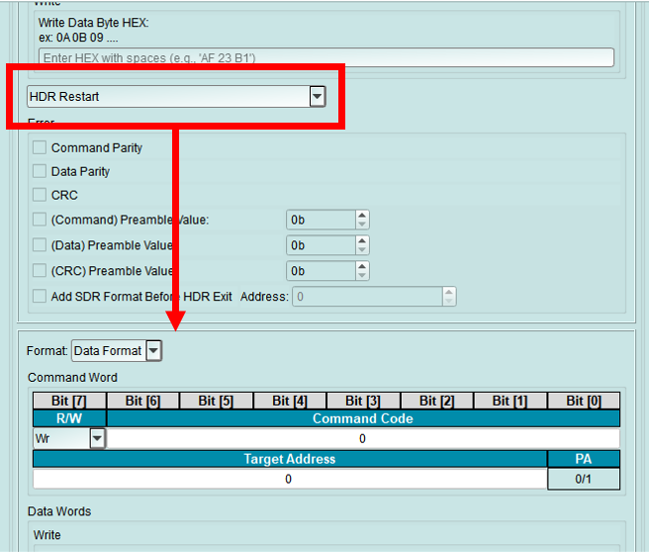
If the user switches the option to *HDR Repeat*, the next frame of the packet will be displayed, allowing other settings to be adjusted at this time.

## Packet Constructor
1. Private RW
    1. Private Read
    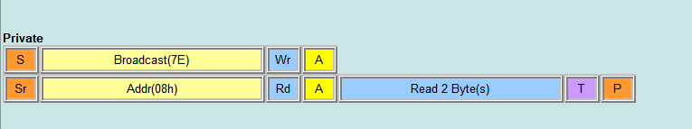

    2. Private Read with SubAddr
    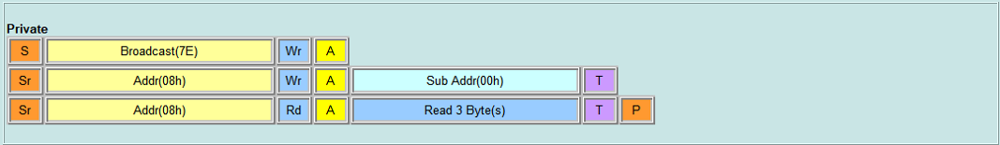

    3. Private Write
    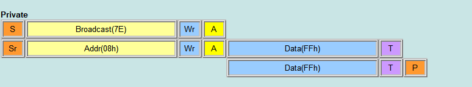

    4. Private Write with SubAddr
    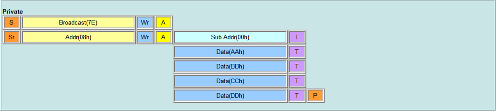

Please refer to [Private RW](#private-rw) for more detail description.

2. Broadcast CCC
    1. Broadcast CCC - ENEC
    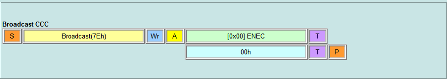
    Please refer to [ENEC](#broadcast-ccc-enec) for more detail description.

    2. Broadcast CCC - DISEC
    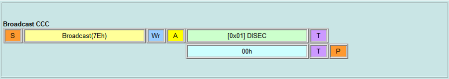
    Please refer to [DISEC](#broadcast-ccc-disec) for more detail description.

    3. Broadcast CCC - ENTAS0
    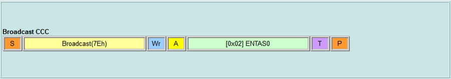
    Please refer to [ENTAS0](#broadcast-ccc-entas0) for more detail description.

    4. Broadcast CCC - ENTAS1
    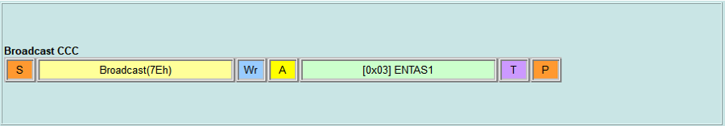
    Please refer to [ENTAS1](#broadcast-ccc-entas1) for more detail description.

    5. Broadcast CCC - ENTAS2
    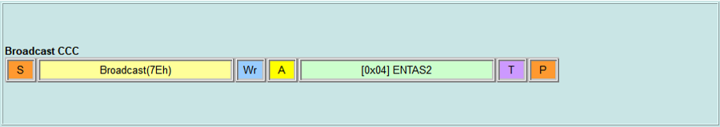
    Please refer to [ENTAS2](#broadcast-ccc-entas2) for more detail description.

    6. Broadcast CCC - ENTAS3
    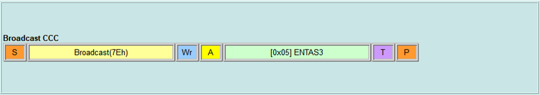
    Please refer to [ENTAS3](#broadcast-ccc-entas3) for more detail description.

    7. Broadcast CCC - RSTDAA
    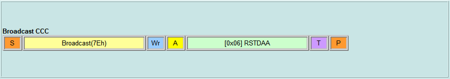
    Pleaset refer to [RSTDAA](#broadcast-ccc-rstdaa) for more detail description.

    8. Broadcast CCC - ENTDAA
    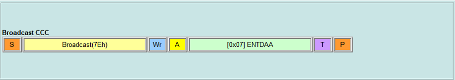
    Pleaset refer to [ENTDAA](#broadcast-ccc-entdaa) for more detail description.

    9. Broadcast CCC - DEFTGTS
    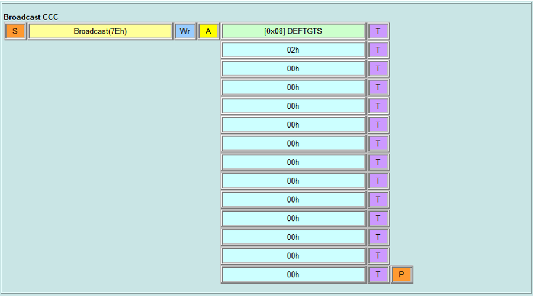
    Pleaset refer to [DEFTGTS](#broadcast-ccc-deftgts) for more detail description.

    10. Broadcast CCC - SETMWL
    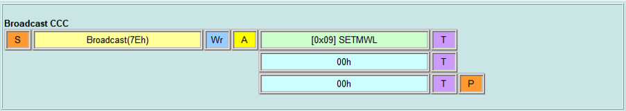
    Pleaset refer to [SETMWL](#broadcast-ccc-setmwl) for more detail description.

    11. Broadcast CCC - SETMRL
    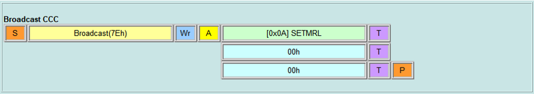
    Pleaset refer to [SETMRL](#broadcast-ccc-setmrl) for more detail description.

    12. Broadcast CCC - ENTTM
    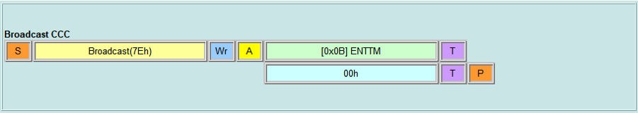
    Pleaset refer to [ENTTM](#broadcast-ccc-enttm) for more detail description.

    13. Broadcast CCC - SETBUSCON
    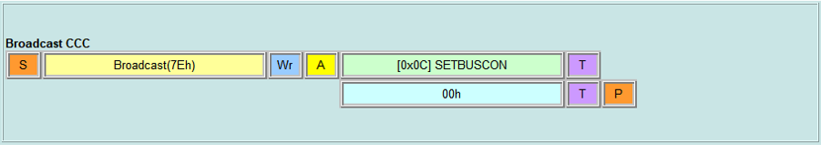
    Pleaset refer to [SETBUSCON](#broadcast-ccc-setbuscon) for more detail description.

    14. Broadcast CCC - ENDXFER
    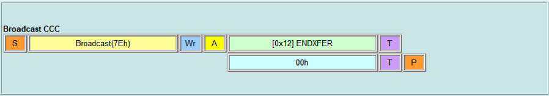
    Pleaset refer to [ENDXFER](#broadcast-ccc-endxfer) for more detail description.

    15. Broadcast CCC - ENTHDR0
        1. 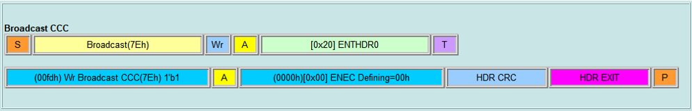
        2. 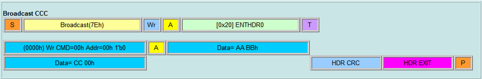
    Pleaset refer to [ENTHDR0](#broadcast-ccc-enthdr0) for more detail description.

    16. Broadcast CCC - ENTHDR1
        1. 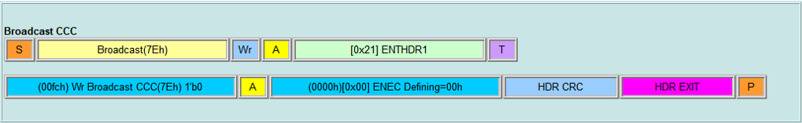
        2. 
    Pleaset refer to [ENTHDR1](#broadcast-ccc-enthdr1) for more detail description.

    17. Broadcast CCC - ENTHDR2
        1. 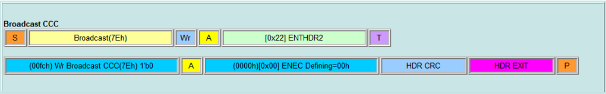
        2. 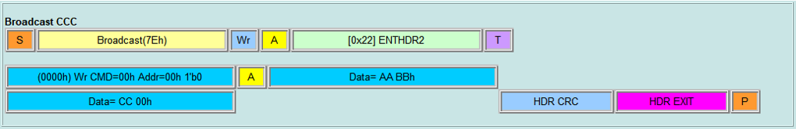
    Pleaset refer to [ENTHDR2](#broadcast-ccc-enthdr2) for more detail description.

    18. Broadcast CCC - ENTHDR3
        1. 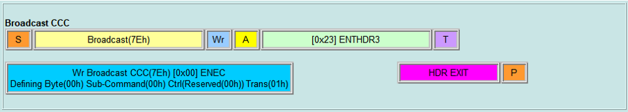
        2. 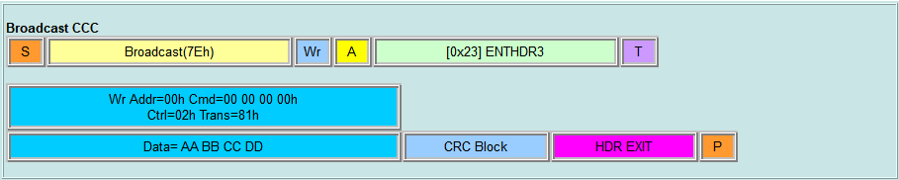
    Pleaset refer to [ENTHDR3](#broadcast-ccc-enthdr3) for more detail description.

    19. Broadcast CCC - ENTHDR4
    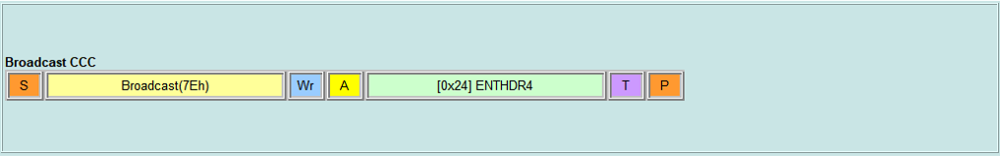
    Pleaset refer to [ENTHDR4](#broadcast-ccc-enthdr4) for more detail description.

    20. Broadcast CCC - ENTHDR5
    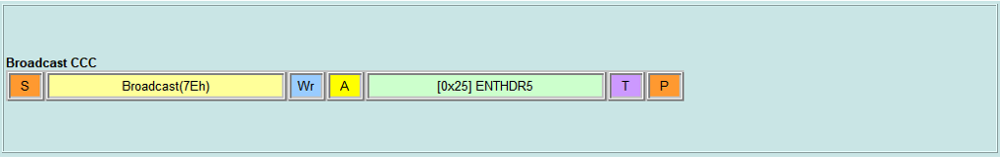
    Pleaset refer to [ENTHDR5](#broadcast-ccc-enthdr5) for more detail description.

    21. Broadcast CCC - ENTHDR6
    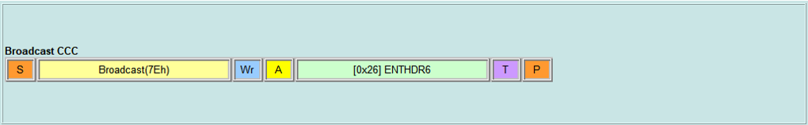
    Pleaset refer to [ENTHDR6](#broadcast-ccc-enthdr6) for more detail description.

    22. Broadcast CCC - ENTHDR7
    
    Pleaset refer to [ENTHDR7](#broadcast-ccc-enthdr7) for more detail description.

    23. Broadcast CCC - SETXTIME
    
    Pleaset refer to [SETXTIME](#broadcast-ccc-setxtime) for more detail description.

    24. Broadcast CCC - SETAASA
    
    Pleaset refer to [SETAASA](#broadcast-ccc-setaasa) for more detail description.

    25. Broadcast CCC - RSTACT
    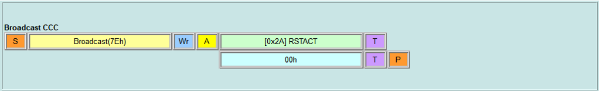
    Pleaset refer to [RSTACT](#broadcast-ccc-rstact) for more detail description.
    
    26. Broadcast CCC - DEFGRPA
    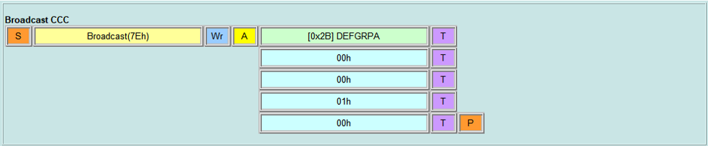
    Pleaset refer to [DEFGRPA](#broadcast-ccc-defgrpa) for more detail description.

    27. Broadcast CCC - RSTGRPA
    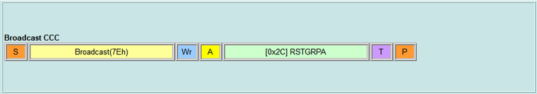
    Pleaset refer to [RSTGRPA](#broadcast-ccc-rstgrpa) for more detail description.

    28. Broadcast CCC - MLANE
    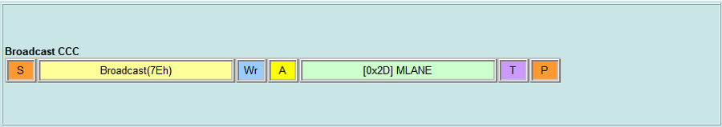
    Pleaset refer to [MLANE](#broadcast-ccc-mlane) for more detail description.

    29. Broadcast CCC - Customized
    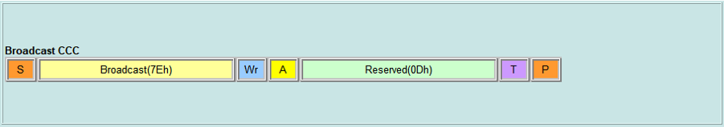
    Pleaset refer to [Customized](#broadcast-ccc-customized) for more detail description.

3. Image for Direct CCC
    Most of the Direct CCC can add Repeat Starts when multiple target address needed.

    1. Direct CCC - ENEC
    
    Pleaset refer to [ENEC](#direct-ccc-enec) for more detail description.

    2. Direct CCC - DISEC
    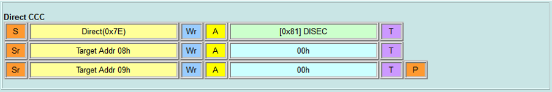
    Pleaset refer to [DISEC](#direct-ccc-disec) for more detail description.

    3. Direct CCC - ENTAS0
    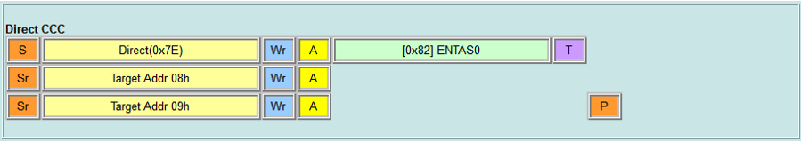
    Pleaset refer to [ENTAS0](#direct-ccc-entas0) for more detail description.

    4. Direct CCC - ENTAS1
    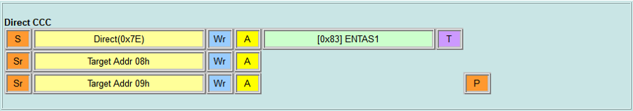
    Pleaset refer to [ENTAS1](#direct-ccc-entas1) for more detail description.

    5. Direct CCC - ENTAS2
    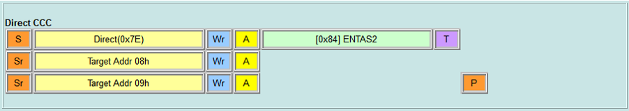
    Pleaset refer to [ENTAS2](#direct-ccc-entas2) for more detail description.

    6. Direct CCC - ENTAS3
    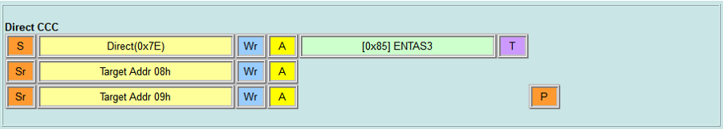
    Pleaset refer to [ENTAS3](#direct-ccc-entas3) for more detail description.

    7. Direct CCC - SETDASA
    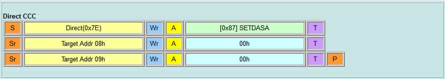
    Pleaset refer to [SETDASA](#direct-ccc-setdasa) for more detail description.

    8. Direct CCC - SETNEWDA
    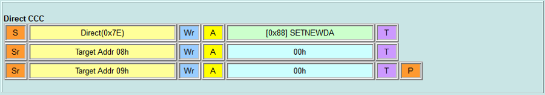
    Pleaset refer to [SETNEWDA](#direct-ccc-setnewda) for more detail description.

    9. Direct CCC - SETMWL
    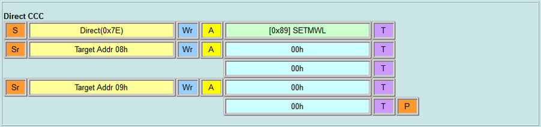
    Pleaset refer to [SETMWL](#direct-ccc-setmwl) for more detail description.

    10. Direct CCC - SETMRL
    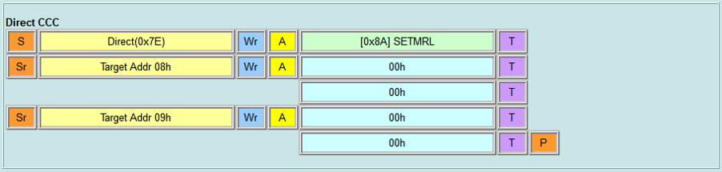
    Pleaset refer to [SETMRL](#direct-ccc-setmrl) for more detail description.

    11. Direct CCC - GETMWL
    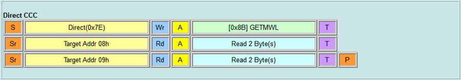
    Pleaset refer to [GETMWL](#direct-ccc-getmwl) for more detail description.

    12. Direct CCC - GETMRL
    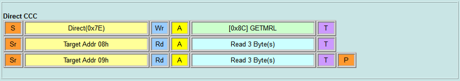
    Pleaset refer to [GETMRL](#direct-ccc-getmrl) for more detail description.

    13. Direct CCC - GETPID
    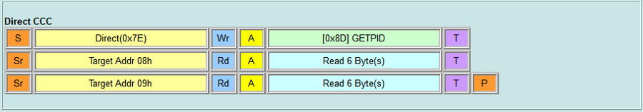
    Pleaset refer to [GETPID](#direct-ccc-getpid) for more detail description.

    14. Direct CCC - GETBCR
    
    Pleaset refer to [GETBCR](#direct-ccc-getbcr) for more detail description.

    15. Direct CCC - GETDCR
    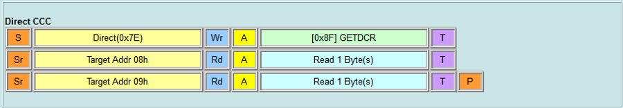
    Pleaset refer to [GETDCR](#direct-ccc-getdcr) for more detail description.

    16. Direct CCC - GETSTATUS
    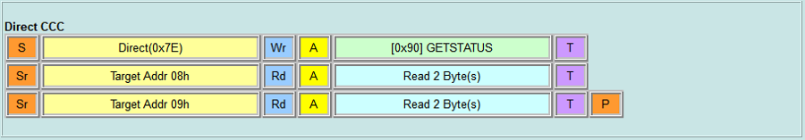
    Pleaset refer to [GETSTATUS](#direct-ccc-getstatus) for more detail description.

    17. Direct CCC - GETACCCR
    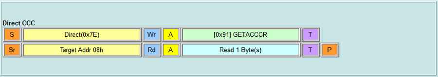
    Pleaset refer to [GETACCCR](#direct-ccc-getacccr) for more detail description.

    18. Direct CCC - ENDXFER
    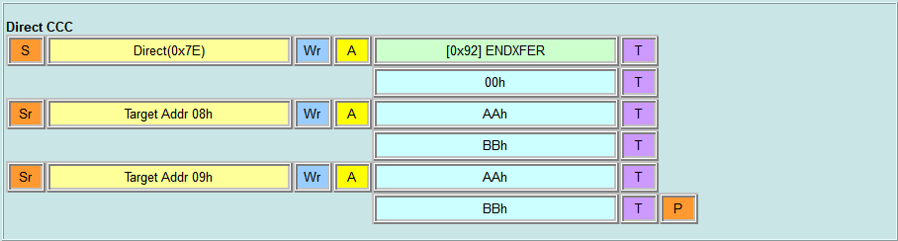
    Pleaset refer to [ENDXFER](#direct-ccc-endxfer) for more detail description.

    19. Direct CCC - SETBRGTGT
    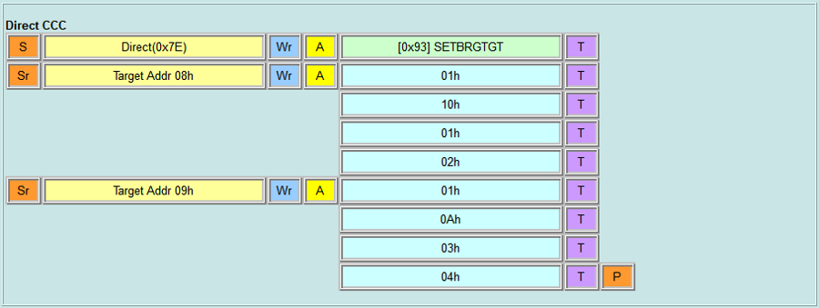
    Pleaset refer to [SETBRGTGT](#direct-ccc-setbrgtgt) for more detail description.

    20. Direct CCC - GETMXDS
    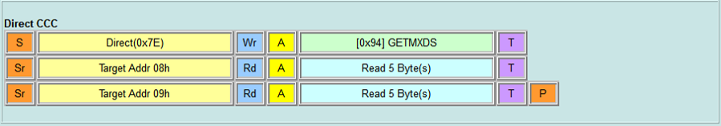
    Pleaset refer to [GETMXDS](#direct-ccc-getmxds) for more detail description.

    21. Direct CCC - GETCAPS
    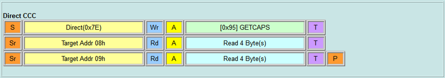
    Pleaset refer to [GETCAPS](#direct-ccc-getcaps) for more detail description.

    22. Direct CCC - SETROUTE
    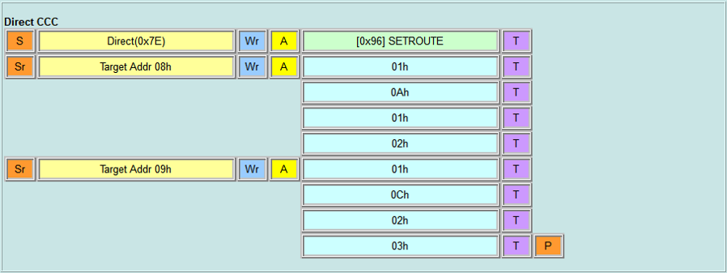
    Pleaset refer to [SETROUTE](#direct-ccc-setroute) for more detail description.

    23. Direct CCC - D2DXFER
    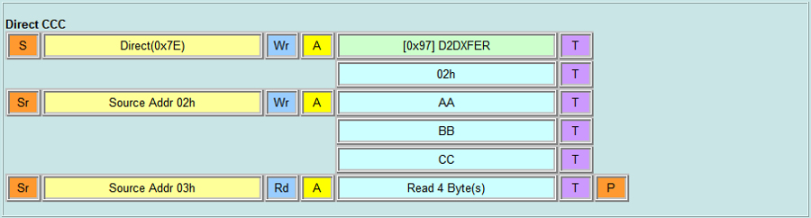
    Pleaset refer to [D2DXFER](#direct-ccc-d2dxfer) for more detail description.

    24. Direct CCC - SETXTIME
    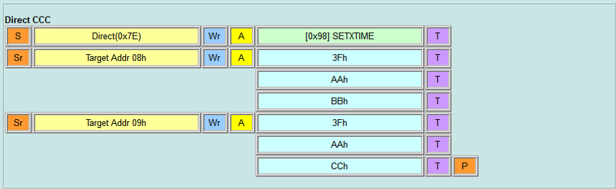
    Pleaset refer to [SETXTIME](#direct-ccc-setxtime) for more detail description.

    25. Direct CCC - GETXTIME
    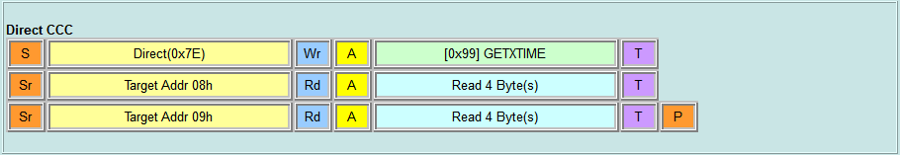
    Pleaset refer to [GETXTIME](#direct-ccc-getxtime) for more detail description.

    26. Direct CCC - RSTACT
    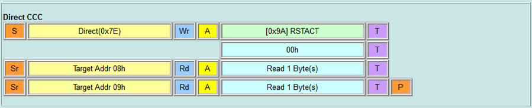
    Pleaset refer to [RSTACT](#direct-ccc-rstact) for more detail description.

    27. Direct CCC - SETGRPA
    
    Pleaset refer to [SETGRPA](#direct-ccc-setgrpa) for more detail description.

    28. Direct CCC - RSTGRPA
    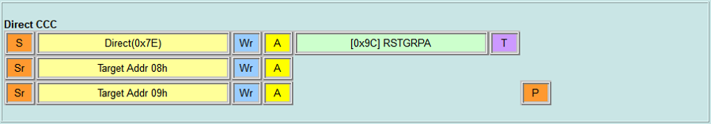
    Pleaset refer to [RSTGRPA](#direct-ccc-rstgrpa) for more detail description.

    29. Direct CCC - MLANE
    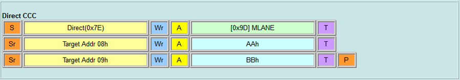
    Pleaset refer to [MLANE](#direct-ccc-mlane) for more detail description.

    30. Direct CCC - Customized
    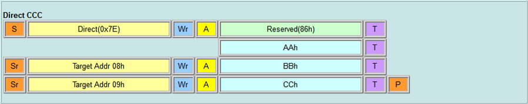   
    Pleaset refer to [Customized](#direct-ccc-customized) for more detail description.
    
4. Legacy I2C RW
    1. Legacy I2C Read
    
    Please refer to [Legacy I2C Read](#legacy-i2c-rw) for more detail description.

    2. Legacy I2C Read with SubAddr
    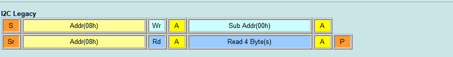
    Please refer to [Legacy I2C Read with SubAddr](#legacy-i2c-rd-subaddr) for more detail description.

    3. Legacy I2C Write
    
    Please refer to [Legacy I2C Write](#legacy-i2c-rw) for more detail description.

    4. Legacy I2C Write with SubAddr
    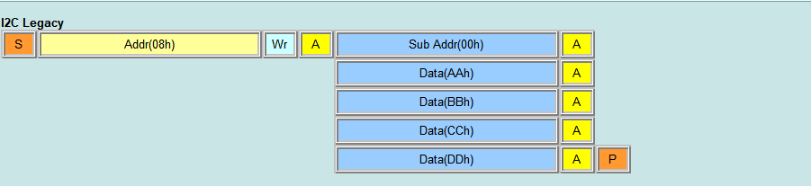
    Please refer to [Legacy I2C Write with SubAddr](#legacy-i2c-wr-subaddr) for more detail description.
