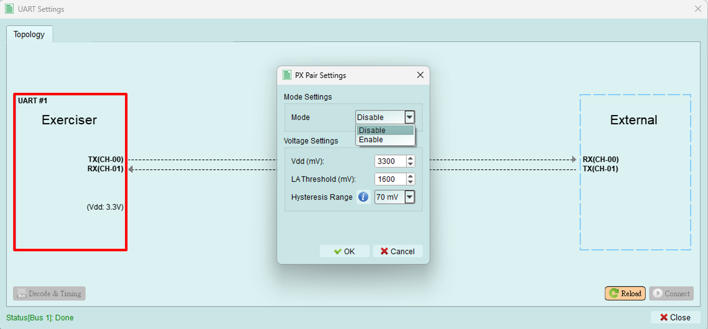
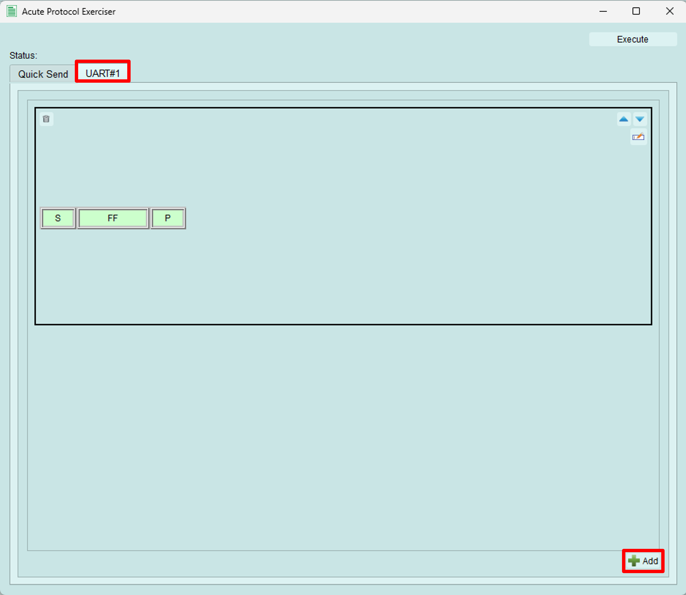
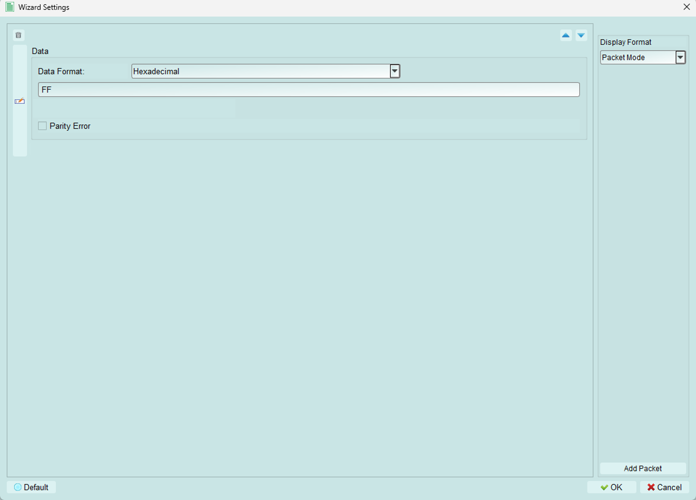

# UART

## Quick Setup
FOLLOWING STEPS:
1. Set up the [PX pod parameters](#px-pair-settings).
2. *(Optional)*Set up your [DC output](../index.md#power-supply).
3. [Decode and Timing Settings](#decode-timing) for UART signals analysis.
4. [Establish the Connection](#connect)
5. Send data using [UART wizard](#send-packets).

## Px Pair Settings

Pressing the button on the left side (in the red box) of this dialog, it will pop out a new dialog called "PX Pair Settings".

### Mode Settings
User can set the mode to:
1. Enable: enable the Exerciser to transmit data.
2. or Disable

### Voltage Settings
All units for these settings are in {++*mV*++}.
1. Vdd: set the working voltage.
2. LA Threshold: set the LA threshold for decoding.
3. Hysteresis Range: set the Hysteresis range.

## Functions

After enable, the buttons below will be turned on.

### Connect
Establish a connection with an external UART device.

### Reload
Reload the connection status and display.

### Decode & Timing

Set the UART decode parameter for LA to decode.

### Send packet {#send-packets}
To open the wizard, please check the [Wizard](../index.md#wizard)

#### Quick Send

1. User can decide to send packet from which bus.
2. User can choose the input data format, for easily read. We now support:
    1. Hexadecimal
    2. Decimal
    3. Binary
    4. Binary (Space Separate), user use SPACE to separate the binary value.
    5. ASCII
In Binary format, Binary values are grouped in units of bit size, with any remaining bits padded with zeros. For instance, bit size is 4, the data is 10101, then the send out data would be 0001 0101.
3. Data that want to send out, based on the input format.
4. Send out the packet.

#### Packet Constructor

Switch to the bus tab, click the bottom right `Add` button, it will automatically create a packet.
After edit the packets, click the `Execute` to send out the packets.

##### Edit Packet

1. Adjust the packet order.
2. Open the detail editing dialog.
    

    1. Add a UART packet
    2. Detailly edit the packet.
        

        1. Data Format: Like the description in [Quick Send](#quick-send)
        2. Data: Data that want to send out. The precautions are the same as those described in [Quick Send](#quick-send)
        3. Parity Error: User can decide to send out a Parity Error purposely.

    3. Drop the packet
    4. Adjust the order of packets.
    5. Change the display format, We now suppor two formats:
        1. Packet Mode: Not only display the data, but also display the START bit and STOP bit.
            

        2. Data Mode: only display the data.
            
