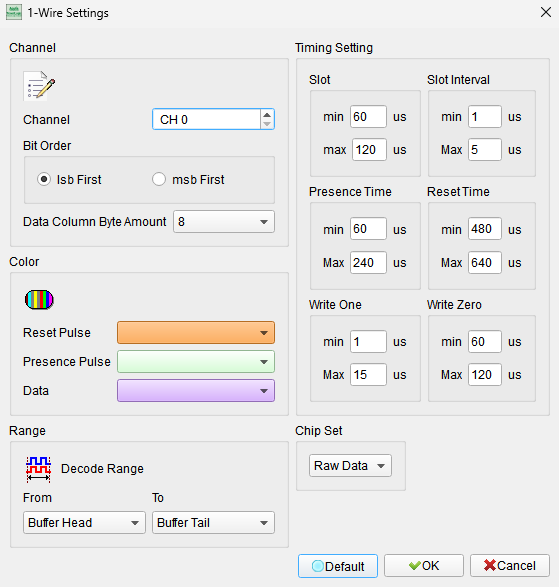
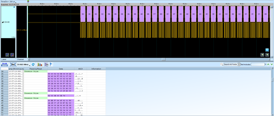

# 1-Wire

## Decode Settings
<figure markdown>
  
  <figcaption>Decode Settings</figcaption>
</figure>

## Example
<figure markdown>
  
  <figcaption>Decode Example</figcaption>
</figure>

## What is 1-Wire?

### Overview

1-Wire is a single-wire serial communication protocol developed by Dallas Semiconductor (now part of Analog Devices) in 1989. As its name suggests, 1-Wire uses only one data line for bidirectional communication, plus a ground reference, making it an extremely efficient solution for connecting low-speed devices. The protocol was originally designed for portable data-carrying modules called iButtons but has since been widely adopted for connecting sensors, memory devices, and other peripherals in embedded systems.

The 1-Wire bus operates using a strict master/slave architecture where a single bus master controls all communication with one or more slave devices connected to the same bus line. Communication is asynchronous and half-duplex, meaning data flows in only one direction at a time. The bus remains in an idle high state using a pull-up resistor, and all devices use open-collector or open-drain outputs to drive the bus low in a wired-AND configuration.

### Key Features

One of the most distinctive features of 1-Wire is its ability to power slave devices directly through the data line, eliminating the need for separate power connections in many applications. This "parasitic power" mode allows devices to harvest energy from the bus during communication and store it for operation. Each 1-Wire device contains a unique 64-bit ROM code programmed at manufacture, enabling the master to individually address multiple devices on the same bus. The protocol also incorporates Cyclic Redundancy Checks (CRC) for data integrity verification, ensuring reliable communication even in electrically noisy environments.

## 1-Wire Timing and Modes

### Communication Speed Modes

The 1-Wire protocol supports two speed modes:

- **Standard Mode**: Time slots of approximately 60 microseconds per bit, providing robust communication for most applications
- **Overdrive Mode**: Higher-speed communication with reduced time slots, offering faster data transfer when timing precision is maintained

### Signal Types

1-Wire communication consists of several distinct signal types:

- **Reset Pulse**: The master initiates communication by sending a reset pulse (holding the bus low for at least 480 microseconds in standard mode)
- **Presence Pulse**: Slave devices respond with a presence pulse to indicate they are on the bus and ready to communicate
- **Write 1**: The master writes a logic 1 by pulling the bus low for a short period (typically 6-15 microseconds)
- **Write 0**: The master writes a logic 0 by holding the bus low for most of the time slot (60 microseconds)
- **Read 1**: When reading a 1, the slave keeps the bus high during the sampling window
- **Read 0**: When reading a 0, the slave pulls the bus low during the sampling window

### Topology

The 1-Wire bus supports a simple linear topology where all devices are connected in parallel to the single data line. The master device typically includes a pull-up resistor (typically 2.2kΩ to 4.7kΩ) to maintain the idle high state. Cable lengths can extend up to 100 meters or more with proper termination and timing considerations. The 1-Wire Extended Network Standard enhances the original protocol with low-pass filtering, voltage hysteresis, and rising-edge hold-off features to improve reliability in noisy industrial environments and long-line applications.

## Decoder Settings

When configuring the 1-Wire decoder in a logic analyzer:

- **Communication Speed**: Select between Standard mode or Overdrive mode based on your device configuration
- **Bit Order**: Choose LSB first or MSB first depending on the device data format
- **Sampling Point**: Set the sampling point in microseconds (µs) after the beginning of each data bit to accurately capture data. Typical values are 15µs for standard mode and 2-3µs for overdrive mode

## Common Applications

1-Wire is widely used in applications requiring simple, low-cost sensor networks:

- Temperature sensors (DS18B20 and similar)
- Unique identification (iButtons, electronic keys)
- Battery monitoring and fuel gauges
- EEPROM and memory devices
- Environmental monitoring systems
- HVAC control systems

## Reference

- [Wikipedia: 1-Wire](https://en.wikipedia.org/wiki/1-Wire)
- [Maxim Integrated (Analog Devices): 1-Wire Protocol Overview](https://www.analog.com/en/resources/design-notes/1wirereg-extended-network-standard.html)
- [1-Wire Theory of Operation](https://onlinedocs.microchip.com/oxy/GUID-1618003F-992B-4E48-9411-5E5D5D952C06-en-US-3/GUID-EE2B21FC-9AA9-4C04-88EF-1951F703A56C.html)
