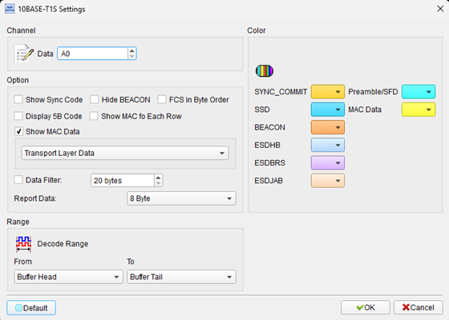
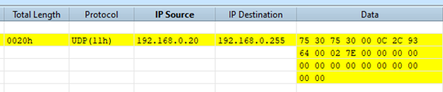
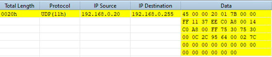
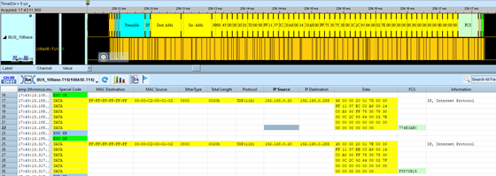
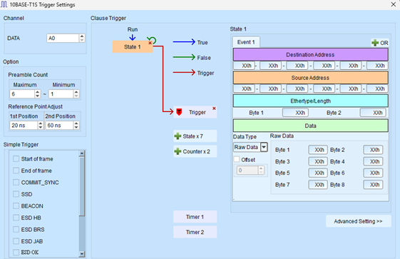
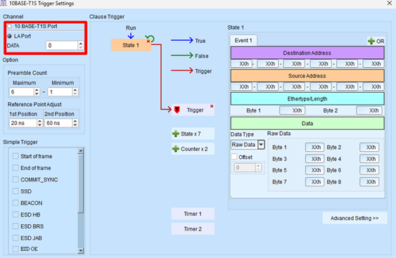

# 10BASE-T1S

## Decode Settings
<figure markdown>
  
  <figcaption>Decode Settings</figcaption>
</figure>

## Example
<figure markdown>
  
  <figcaption>Decode Example</figcaption>
</figure>
<figure markdown>
  
  <figcaption>Decode Figure</figcaption>
</figure>
<figure markdown>
  
  <figcaption>Decode Figure</figcaption>
</figure>
<figure markdown>
  
  <figcaption>Decode Figure</figcaption>
</figure>
<figure markdown>
  
  <figcaption>Decode Figure</figcaption>
</figure>
<figure markdown>
  
  <figcaption>Decode Figure</figcaption>
</figure>

## What is 10BASE-T1S?

### Overview

10BASE-T1S is a modern Ethernet physical layer standard defined by IEEE 802.3cg for 10 Mb/s operation over a single twisted pair of copper conductors. Ratified on February 5, 2020, this specification addresses the growing need for cost-effective, simplified networking in automotive, industrial automation, and building control applications. Unlike traditional Ethernet standards that require separate transmit and receive pairs, 10BASE-T1S operates on just one balanced pair, significantly reducing cabling costs and complexity.

The standard represents a significant evolution in Ethernet technology, bringing full-speed Ethernet connectivity to resource-constrained environments where traditional Ethernet's four-wire implementation would be impractical or cost-prohibitive. 10BASE-T1S maintains full compatibility with standard Ethernet protocols while introducing innovative features specifically designed for short-reach applications in harsh environments.

### Key Features

10BASE-T1S introduces several unique capabilities that distinguish it from traditional Ethernet standards. It supports both point-to-point connections and half-duplex multidrop configurations, allowing up to eight or more transceiver nodes to share a common mixing segment of up to 25 meters with 10cm stubs per node. This multidrop capability eliminates the need for switches in many applications, further reducing system cost and complexity.

The standard employs advanced modulation and encoding techniques, including Differential Manchester Encoding (DME) at 12.5 MBd and 4B5B encoding for improved electromagnetic compatibility (EMC) performance and out-of-band signaling. It also includes optional Energy-Efficient Ethernet (EEE) support with Low Power Idle mode capability, making it suitable for battery-powered and energy-conscious applications.

## Physical Layer Characteristics

### Modulation and Encoding

10BASE-T1S uses a sophisticated encoding scheme to ensure reliable communication:

- **Differential Manchester Encoding (DME)**: Operates at 12.5 MBd (megabaud) for robust signal transmission
- **4B5B Encoding**: Converts 4-bit data symbols into 5-bit transmission symbols, providing DC balance and enabling special control characters
- **Differential Signaling**: Uses balanced differential pairs to minimize electromagnetic interference and improve noise immunity

### Topology Options

**Point-to-Point Mode**: Direct connection between two nodes, providing dedicated 10 Mb/s full-duplex or half-duplex communication.

**Multidrop Mode**: Multiple nodes (typically up to 8) connected to a shared bus segment, operating in half-duplex mode. This configuration uses PHY Level Collision Avoidance (PLCA) to coordinate access to the shared medium, improving efficiency compared to traditional CSMA/CD.

### Cable and Distance Specifications

10BASE-T1S supports cable lengths up to 25 meters in multidrop configurations and longer distances in point-to-point mode. The specification is optimized for:

- Single balanced twisted pair (STP or UTP)
- Short stubs (up to 10cm) in multidrop configurations
- Industrial-grade EMC performance
- Operation in electrically noisy environments

## Advanced Features

### PHY Level Collision Avoidance (PLCA)

One of the most innovative features of 10BASE-T1S is optional PLCA (PHY Level Collision Avoidance). Unlike traditional CSMA/CD (Carrier Sense Multiple Access with Collision Detection), PLCA implements a deterministic arbitration scheme at the physical layer. Each node is assigned a time slot in a round-robin fashion, eliminating collisions and providing more predictable latency characteristics—a critical requirement for industrial control and automotive safety applications.

### Energy Efficiency

10BASE-T1S includes optional support for IEEE 802.3az Energy-Efficient Ethernet, allowing nodes to enter Low Power Idle (LPI) mode during periods of inactivity. This feature is particularly valuable in battery-powered sensors and edge devices where energy conservation is paramount.

## Common Applications

10BASE-T1S is particularly well-suited for:

- **Automotive**: In-vehicle sensor networks, zonal architectures, camera systems
- **Industrial Automation**: Field devices, factory floor sensors, PLC communication
- **Building Automation**: HVAC controls, lighting systems, access control
- **Process Control**: Distributed sensors and actuators in industrial environments
- **Smart Grid**: Utility metering and monitoring equipment

## Reference

- [IEEE 802.3cg-2019 Standard](https://standards.ieee.org/standard/802_3cg-2019.html)
- [Wikipedia: Ethernet Physical Layer](https://en.wikipedia.org/wiki/Ethernet_physical_layer)
- [Microchip: 10BASE-T1S Overview](https://microchip.com/en-us/products/high-speed-networking-and-video/ethernet/single-pair-ethernet/10base-t1s)
