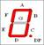
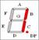
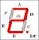
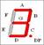
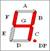
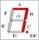
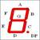
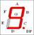
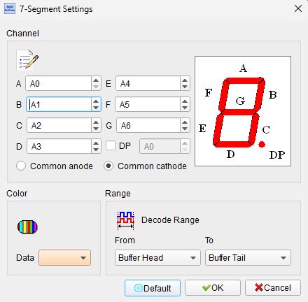
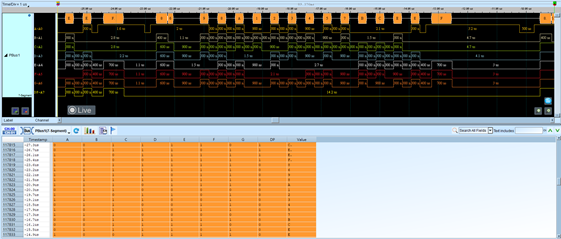

# 7-Segment Display

## Decode Settings
<figure markdown>
  
  <figcaption>Decode Settings</figcaption>
</figure>

## Example
<figure markdown>
  
  <figcaption>Decode Example</figcaption>
</figure>
<figure markdown>
  
  <figcaption>Decode Figure</figcaption>
</figure>
<figure markdown>
  
  <figcaption>Decode Figure</figcaption>
</figure>
<figure markdown>
  
  <figcaption>Decode Figure</figcaption>
</figure>
<figure markdown>
  
  <figcaption>Decode Figure</figcaption>
</figure>
<figure markdown>
  
  <figcaption>Decode Figure</figcaption>
</figure>
<figure markdown>
  
  <figcaption>Decode Figure</figcaption>
</figure>
<figure markdown>
  
  <figcaption>Decode Figure</figcaption>
</figure>
<figure markdown>
  
  <figcaption>Decode Figure</figcaption>
</figure>
<figure markdown>
  
  <figcaption>Decode Figure</figcaption>
</figure>
<figure markdown>
  
  <figcaption>Decode Figure</figcaption>
</figure>

## What is a 7-Segment Display?

### Overview

A seven-segment display is an electronic display device used for presenting decimal numerals and select alphabetic characters through a simple, highly visible format. Invented in the early 1900s and widely adopted in digital electronics since the 1970s, the 7-segment display remains one of the most recognizable and cost-effective methods for numeric visualization. Each display consists of seven LED or LCD bars arranged in a figure-eight pattern, where different combinations of illuminated segments form the digits 0 through 9 and some letters.

The elegance of the 7-segment display lies in its simplicity—using just seven controllable segments (labeled A through G), it can represent all ten decimal digits clearly and unambiguously. An optional eighth segment, the decimal point (DP), extends the display's utility for showing fractional numbers and currency values. The displays are ubiquitous in consumer electronics, appearing in digital clocks, calculators, measuring instruments, home appliances, and industrial equipment.

### Segment Organization

The seven segments are arranged in a standardized pattern:

- **Segment A**: Top horizontal bar
- **Segment B**: Upper right vertical bar
- **Segment C**: Lower right vertical bar
- **Segment D**: Bottom horizontal bar
- **Segment E**: Lower left vertical bar
- **Segment F**: Upper left vertical bar
- **Segment G**: Middle horizontal bar
- **Segment DP** (optional): Decimal point

## Display Configurations

### Common Cathode Configuration

In a common cathode display, all the negative terminals (cathodes) of the segment LEDs are connected together to form a common ground point. To illuminate a segment, a positive voltage (typically +5V or +3.3V through a current-limiting resistor) is applied to the corresponding segment's anode. This configuration is straightforward for microcontrollers with active-high outputs and is widely used in hobbyist and educational projects.

The common cathode configuration requires that the microcontroller or driver IC source current to turn on segments, with each segment typically drawing 10-20mA depending on the desired brightness. Multiple common cathode displays can be multiplexed by switching the common cathode connection between different digit positions while updating the segment data correspondingly.

### Common Anode Configuration

In a common anode display, all the positive terminals (anodes) of the segment LEDs are connected together to a common positive voltage supply. To illuminate a segment, the corresponding segment cathode must be pulled to ground (logic LOW). This configuration requires the driver to sink current rather than source it, which is often more efficient for certain driver ICs and transistor circuits.

Common anode displays are frequently chosen for applications requiring higher brightness or when using PNP transistor drivers. The multiplexing scheme for common anode displays involves switching the common anode voltage between digit positions while updating segment patterns with inverted logic (LOW = segment ON, HIGH = segment OFF).

## Segment Encoding

### Standard Digit Encoding

Each digit is represented by a specific pattern of active segments. The standard encoding for decimal digits is:

| Digit | A | B | C | D | E | F | G | Hex (abcdefg) |
|-------|---|---|---|---|---|---|---|---------------|
| 0 | ON | ON | ON | ON | ON | ON | OFF | 0x3F |
| 1 | OFF | ON | ON | OFF | OFF | OFF | OFF | 0x06 |
| 2 | ON | ON | OFF | ON | ON | OFF | ON | 0x5B |
| 3 | ON | ON | ON | ON | OFF | OFF | ON | 0x4F |
| 4 | OFF | ON | ON | OFF | OFF | ON | ON | 0x66 |
| 5 | ON | OFF | ON | ON | OFF | ON | ON | 0x6D |
| 6 | ON | OFF | ON | ON | ON | ON | ON | 0x7D |
| 7 | ON | ON | ON | OFF | OFF | OFF | OFF | 0x07 |
| 8 | ON | ON | ON | ON | ON | ON | ON | 0x7F |
| 9 | ON | ON | ON | ON | OFF | ON | ON | 0x6F |

### Extended Character Set

Beyond digits, 7-segment displays can show limited alphabetic characters:

- **Letters**: A, b, C, d, E, F, H, J, L, O, P, U
- **Symbols**: Minus sign (-), degree symbol (°), underscore (_)

## Multiplexing Technique

For multi-digit displays, multiplexing allows control of multiple digits using fewer microcontroller pins. Instead of dedicating 7-8 pins per digit, multiplexing shares the segment lines across all digits while rapidly switching which digit's common terminal is active. By cycling through digits at rates faster than human persistence of vision (typically >50 Hz), the display appears continuously lit.

**Advantages of multiplexing:**
- Significantly reduced pin count and wiring complexity
- Lower power consumption (only one digit active at a time)
- Simplified PCB layout
- Cost savings in high-digit-count displays

**Trade-offs:**
- Reduced effective brightness per digit (duty cycle division)
- Increased software complexity for timing control
- Potential for ghosting if timing is incorrect

## Decoder Settings

When configuring a 7-segment decoder:

- **Channel Selection**: Specify which logic analyzer channels correspond to segments A through G and optionally DP
- **DP (Decimal Point)**: Enable decimal point analysis if your display includes this feature
- **Display Type**: Choose between common cathode or common anode to correctly interpret the logic levels
- **Logic Levels**: Understand that for common cathode, HIGH = segment ON; for common anode, LOW = segment ON

## Common Applications

7-segment displays are found in numerous applications:

- Digital clocks and timers
- Calculators and cash registers
- Measurement instruments (multimeters, frequency counters)
- Home appliances (microwave ovens, washing machines)
- Industrial control panels
- Scoreboards and counters
- Point-of-sale terminals
- Temperature and humidity indicators

## Reference

- [Wikipedia: Seven-segment display](https://en.wikipedia.org/wiki/Seven-segment_display)
- [Electronics For You: 7-Segment Display Pinout and Working](https://electronicsforu.com/resources/7-segment-display-pinout-understanding)
- [7-Segment Display Guide: Pinout, Circuit Design, and Applications](https://www.digi-electronics.uk/uk/blogs/7-segment-display-guide-pinout-driving-methods-applications/126.html)
