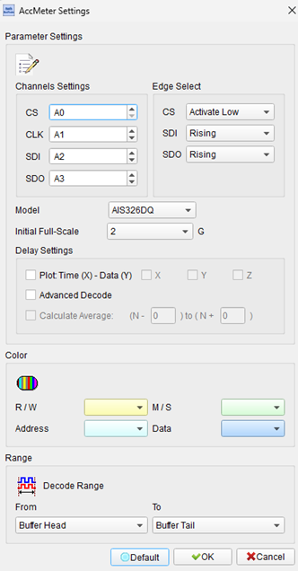
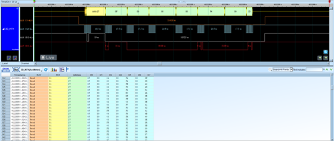
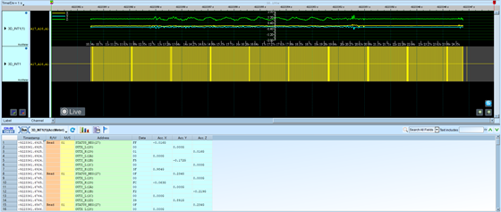

# AcceleroMeter (Accelerometer)

## Decode Settings
<figure markdown>
  
  <figcaption>Decode Settings</figcaption>
</figure>

## Example
<figure markdown>
  
  <figcaption>Decode Example</figcaption>
</figure>
<figure markdown>
  
  <figcaption>Decode Figure</figcaption>
</figure>

## What is an Accelerometer?

### Overview

An accelerometer is a microelectromechanical system (MEMS) sensor that measures acceleration forces acting upon it. These forces can be static (like the constant force of gravity) or dynamic (caused by motion or vibration). Modern digital accelerometers convert these physical accelerations into electrical signals and then into digital data that can be read by microcontrollers and digital systems via standard communication interfaces such as SPI or I2C.

Accelerometers have become ubiquitous in consumer electronics, automotive safety systems, industrial monitoring, and countless other applications. They enable devices to sense orientation, detect motion, measure vibration, and respond to tilt and shake gestures. The technology has evolved from large, expensive analog devices to compact, low-power MEMS sensors that can be integrated into smartphones, wearables, and IoT devices at minimal cost.

### MEMS Technology

MEMS (Microelectromechanical Systems) accelerometers use microscopic mechanical structures fabricated on silicon chips. These structures typically consist of a proof mass suspended by flexible beams. When acceleration occurs, the proof mass moves relative to the fixed frame, and this displacement is detected using capacitive, piezoresistive, or piezoelectric sensing methods. The mechanical displacement is converted to an electrical signal, amplified, filtered, and digitized by an on-chip analog-to-digital converter (ADC).

## SPI Interface Architecture

### Signal Lines

**CS (Chip Select)**: The chip select signal activates the accelerometer for communication. It can be active high or active low depending on the specific sensor model. The CS line must be asserted before any SPI transaction and deasserted after the transaction completes. This allows multiple SPI devices to share the same bus.

**CLK (Serial Clock)**: The master device (typically a microcontroller) generates the clock signal that synchronizes data transfer. The clock frequency can typically range from hundreds of kilohertz to several megahertz, with maximum speeds varying by sensor model (often 10 MHz or higher).

**SDI (Serial Data Input / MOSI)**: This line carries data from the master to the accelerometer, typically used for register address and configuration commands. The data is sampled on a specific clock edge (rising or falling) as defined by the SPI mode.

**SDO (Serial Data Output / MISO)**: This line carries data from the accelerometer to the master, including acceleration measurements, status information, and register contents. Like SDI, the data timing is determined by the SPI mode configuration.

### SPI Modes

Accelerometers typically support SPI modes 0 or 3, defined by clock polarity (CPOL) and clock phase (CPHA):

- **Mode 0**: CPOL=0, CPHA=0 (clock idle low, data sampled on rising edge)
- **Mode 3**: CPOL=1, CPHA=1 (clock idle high, data sampled on rising edge)

## Measurement Specifications

### Measurement Ranges (Full-Scale)

Modern accelerometers offer selectable measurement ranges to accommodate different applications:

- **±2g**: High resolution for applications with small movements (1g = 9.8 m/s²)
- **±4g**: Balanced range for general motion sensing
- **±8g**: Suitable for vigorous motion detection
- **±16g**: High-impact applications, shock detection

The selected range determines the sensitivity and resolution. A ±2g range provides finer resolution (more bits per g) but saturates at lower accelerations, while a ±16g range can measure larger accelerations with reduced resolution.

### Resolution and Data Format

Accelerometers typically provide:

- **10 to 13-bit resolution**: Standard consumer devices (e.g., ADXL345)
- **16-bit resolution**: Common in industrial sensors
- **20-bit resolution**: High-precision scientific instruments (e.g., ADXL359)

Data is usually formatted as **16-bit two's complement** values, where the most significant bits contain the measurement and unused lower bits are zero-padded. This format naturally represents both positive and negative accelerations.

### Axes and Orientation

Most accelerometers are tri-axial, measuring acceleration along three perpendicular axes (X, Y, and Z). The sensor datasheet defines the axis orientation relative to the package. When at rest and level, a tri-axial accelerometer typically reads:

- X-axis: 0g
- Y-axis: 0g
- Z-axis: ±1g (depending on orientation relative to gravity)

## Advanced Features

### FIFO Buffer

Many accelerometers include a First-In-First-Out (FIFO) buffer that stores multiple samples (typically 32 to 320 words). This allows the sensor to continue sampling even when the host processor is busy or in sleep mode, reducing interrupt frequency and power consumption.

### Motion Detection

Integrated motion detection features include:

- **Activity/Inactivity Detection**: Automatically detects when acceleration exceeds or falls below programmable thresholds
- **Tap Detection**: Recognizes single and double tap gestures
- **Free-Fall Detection**: Identifies when all axes experience low acceleration simultaneously
- **Orientation Detection**: Determines device orientation relative to gravity

### Temperature Sensor

Many accelerometers include an integrated temperature sensor for compensation and monitoring. Temperature readings help correct for thermal drift in the acceleration measurements and can be useful for environmental monitoring applications.

## Decoder Features

The AcceleroMeter decoder provides specialized functionality for analyzing accelerometer data:

- **Model Selection**: Choose the specific accelerometer IC model being analyzed to enable proper decoding of register addresses and data formats
- **Initial Full-Scale**: Set the default measurement range configuration
- **Bus Value to Acceleration Conversion**: Automatically converts raw digital values to meaningful acceleration units (g or m/s²)
- **Time-Value Curve Display**: Plots acceleration values over time for each axis, visualizing motion patterns
- **Advanced Decode Mode**: Decodes register addresses and interprets configuration settings and sensor responses

## Decoder Settings

When configuring an accelerometer decoder:

- **CS Pin**: Specify the channel and active state (high/low) of chip select
- **CLK Pin**: Specify the clock channel
- **SDI Pin**: Specify the data input channel and sampling edge
- **SDO Pin**: Specify the data output channel and sampling edge
- **IC Model**: Select the specific accelerometer model (ADXL345, ADXL362, etc.)
- **Full-Scale Range**: Set the initial measurement range (±2g, ±4g, ±8g, ±16g)
- **Plot Enable**: Enable/disable time-value curve visualization
- **Advanced Decode**: Enable to show register addresses and detailed command interpretation

## Common Applications

Accelerometers are used in diverse applications:

- **Consumer Electronics**: Smartphones, tablets, gaming controllers, fitness trackers
- **Automotive**: Airbag deployment, electronic stability control, crash detection
- **Industrial**: Vibration monitoring, predictive maintenance, shock detection
- **Healthcare**: Fall detection, activity monitoring, gait analysis
- **Aerospace**: Inertial navigation, flight control systems
- **Robotics**: Balance control, motion feedback, collision detection
- **IoT Devices**: Environmental monitoring, asset tracking, smart agriculture
- **Structural Monitoring**: Earthquake detection, bridge health monitoring

## Reference

- [Wikipedia: Accelerometer](https://en.wikipedia.org/wiki/Accelerometer)
- [Analog Devices ADXL345 3-Axis Accelerometer](https://www.mouser.com/datasheet/2/609/ADXL345-1517570.pdf)
- [Analog Devices ADXL362 Ultra-Low Power 3-Axis Accelerometer](https://www.analog.com/media/en/technical-documentation/data-sheets/adxl362.pdf)
- [Analog Devices ADXL359 Low Noise 3-Axis Accelerometer](https://www.analog.com/en/products/adxl359.html)
