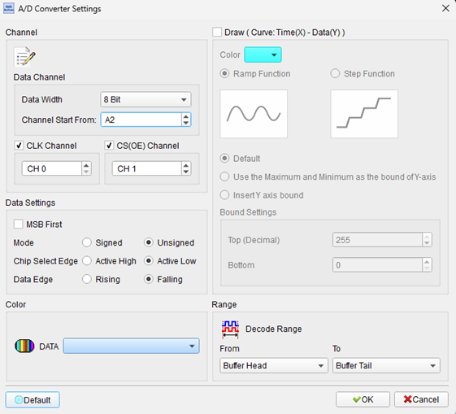
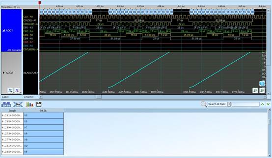
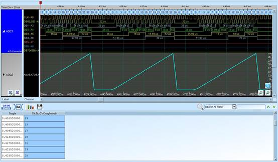

# A/D Converter (ADC)

## Decode Settings
<figure markdown>
  
  <figcaption>Decode Settings</figcaption>
</figure>

## Example
<figure markdown>
  
  <figcaption>Decode Example</figcaption>
</figure>
<figure markdown>
  
  <figcaption>Decode Figure</figcaption>
</figure>

## What is an A/D Converter?

### Overview

An Analog-to-Digital Converter (ADC or A/D Converter) is a fundamental electronic component that converts continuous analog signals—such as voltage, temperature, pressure, or light intensity—into discrete digital values that can be processed by microcontrollers, digital signal processors, and computers. The conversion process involves sampling the analog signal at specific time intervals and quantizing the sampled values into a finite set of digital codes, typically represented as binary numbers.

ADCs are essential building blocks in modern electronics, bridging the physical world of analog phenomena with the digital realm of computation and storage. From simple temperature sensors to high-speed data acquisition systems, ADCs enable digital systems to interact with and interpret real-world signals. The conversion process necessarily involves some loss of information due to quantization, but modern ADC technology provides sufficient resolution and accuracy for most practical applications.

### Working Principle

The ADC conversion process typically involves several steps: sampling (capturing the instantaneous analog value at a specific time), quantization (mapping the continuous range of possible values to discrete levels), and encoding (representing the quantized level as a digital code). The quality and characteristics of this conversion depend on several key parameters including resolution (number of bits), sampling rate (samples per second), and accuracy (how closely the digital output represents the actual analog input).

## Parallel Interface Architecture

### Signal Lines

**Data Lines (D0-Dn)**: The primary output of a parallel ADC consists of multiple data lines that simultaneously present the digital conversion result. The data width typically ranges from 4 bits to 32 bits, with 8-bit, 12-bit, and 16-bit configurations being most common. Higher bit widths provide finer resolution—for example, an 8-bit ADC can distinguish 256 (2⁸) discrete voltage levels, while a 16-bit ADC can resolve 65,536 (2¹⁶) levels.

**Clock (CLK)**: The clock signal synchronizes the data transfer between the ADC and the receiving device. Data is typically valid and should be sampled on a specific clock edge (rising or falling) as specified by the ADC datasheet. The clock frequency determines the maximum rate at which conversion results can be read from the ADC.

**Chip Select/Output Enable (CS/OE)**: This control signal activates the ADC's output buffers, enabling the digital data to drive the data bus. When CS or OE is inactive, the ADC's outputs are in a high-impedance state, allowing multiple devices to share the same data bus. The polarity can be active high or active low depending on the specific ADC model.

**Conversion Start (CONVST)**: Some ADCs require an explicit conversion start signal to initiate the analog-to-digital conversion process. After receiving this trigger, the ADC samples the input and begins the conversion cycle. A separate BUSY or DRDY (data ready) signal may indicate when the conversion is complete and data is available for reading.

## Data Representation

### Unsigned Binary (Unipolar)

Most ADCs measuring positive voltages only (0V to Vref) use unsigned binary representation. The digital output directly corresponds to the input voltage as a fraction of the reference voltage. For example, in an 8-bit ADC with Vref = 5V, an input of 2.5V would produce a digital output of 128 (half scale).

### Two's Complement (Bipolar)

ADCs designed to measure both positive and negative voltages (bipolar inputs) typically use two's complement representation. In this format, the most significant bit (MSB) serves as the sign bit: 0 indicates a positive value, while 1 indicates a negative value. This representation allows seamless arithmetic operations on signed values in digital systems.

For example, in an 8-bit two's complement ADC:
- 0x7F (01111111) = maximum positive value
- 0x00 (00000000) = zero or midscale
- 0x80 (10000000) = maximum negative value

## Decoder Features

### Data Visualization

Logic analyzer ADC decoders often include advanced visualization features beyond simple hex or decimal display:

**Time-Data Curve**: Plots the decoded digital values on a graph with time on the X-axis and data value on the Y-axis, providing an intuitive view of how the analog signal varies over time. This visualization effectively recreates the original analog waveform from the digital samples.

**Ramp vs. Step Display**: The decoder can display data as either a smooth ramp function (interpolating between samples) or as step functions (holding each value until the next sample), depending on the nature of the signal being measured and user preference.

**Y-Axis Scaling**: Users can configure the Y-axis bounds either automatically (using minimum and maximum values from the captured data) or manually (specifying fixed bounds), enabling comparison of multiple captures or focusing on specific value ranges.

## Decoder Settings

When configuring an ADC decoder:

- **Data Channel Start**: Specify the first logic analyzer channel connected to the ADC's LSB or MSB data line
- **Data Width**: Select the ADC resolution (4-bit to 32-bit range)
- **Bit Order**: Choose MSB first or LSB first based on how the data lines are connected
- **Clock Channel**: Specify the channel receiving the ADC clock signal
- **CS/OE Channel**: Specify the channel connected to chip select or output enable
- **Chip Select Polarity**: Configure as active high or active low
- **Data Edge**: Select rising edge or falling edge for data sampling
- **Data Format**: Choose between unsigned binary or two's complement representation
- **Display Options**: Enable curve plotting, select ramp or step visualization, configure Y-axis scaling

## Common Applications

Parallel ADCs are found in numerous applications:

- Data acquisition systems
- Digital oscilloscopes and spectrum analyzers
- Industrial process control and monitoring
- Medical instrumentation (ECG, EEG)
- Audio recording and processing equipment
- Sensor interface circuits (temperature, pressure, position)
- Automated test equipment (ATE)
- High-speed signal processing systems
- Scientific measurement instruments
- Communication receivers

## Reference

- [Wikipedia: Analog-to-digital converter](https://en.wikipedia.org/wiki/Analog-to-digital_converter)
- [Texas Instruments: ADS8586S 16-Bit ADC Datasheet](https://www.ti.com/lit/ds/symlink/ads8586s.pdf)
- [Analog Devices: AD7934-6 12-Bit ADC Datasheet](https://www.analog.com/media/en/technical-documentation/data-sheets/ad7934-6.pdf)
- [Analog Devices: AD7606 Parallel ADC](https://www.mouser.com/datasheet/2/609/ad7606bbchips-3119118.pdf)
