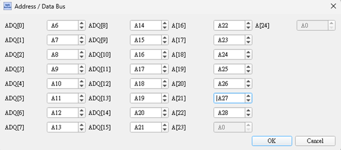
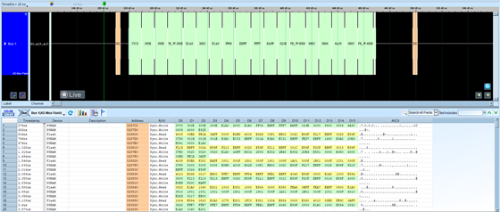

# AD-Mux Flash

## Decode Settings
<figure markdown>
  
  <figcaption>Decode Settings</figcaption>
</figure>

## Example
<figure markdown>
  
  <figcaption>Decode Example</figcaption>
</figure>

## What is AD-Mux Flash?

### Overview

AD-Mux Flash (Address/Data Multiplexed Flash) refers to a category of parallel NOR Flash memory devices that use a multiplexed address and data bus interface. Unlike traditional parallel memory with separate address and data lines, AD-Mux Flash shares the same physical pins for both address and data signals, significantly reducing the total pin count required for the memory interface. This multiplexing approach is particularly valuable in space-constrained embedded systems where board area and connector pins are at a premium.

The technology is commonly found in multichip packages (MCPs) that combine NOR Flash and PSRAM (Pseudo-Static RAM) in a single package, sharing the multiplexed bus between both memory types. This integration provides system designers with a complete memory solution—non-volatile storage plus working RAM—in a compact footprint. Mobile devices, embedded systems, and consumer electronics frequently employ AD-Mux Flash architectures to minimize board space while maintaining good performance characteristics.

### Multiplexing Operation

In an address/data multiplexed interface, the bus lines serve dual purposes at different times during a memory access cycle. During the address phase, these pins carry the memory address; during the data phase, the same pins carry the data being read from or written to the memory. Control signals (such as address latch enable and output enable) coordinate the timing to ensure the address is latched before data transfer begins, preventing bus contention and ensuring reliable operation.

## Interface Architecture

### Multiplexed Address/Data Lines (ADQ)

The ADQ[n:0] bus comprises the multiplexed address/data lines, where 'n' represents the maximum address/data width (commonly 16 bits for a 16-bit wide memory interface). During the address phase, these lines carry the row and column address bits needed to select the target memory location. Control signals latch this address into internal registers. During the data phase, these same lines transition to carrying the data being read from or written to the selected address.

The number of ADQ lines determines both the data bus width and the addressing capability. A 16-bit interface with 16 ADQ lines can address memory in 16-bit words and transfer 16 bits of data per access cycle. The total addressable memory space also depends on whether the addressing is fully multiplexed or uses additional dedicated address lines for higher-order bits.

### Control Signals

**Address Latch Enable (ALE)**: This critical signal indicates when valid address information is present on the multiplexed bus. A rising or falling edge of ALE (depending on the device specification) triggers the internal latching of the address from the ADQ lines. After address latching, the bus transitions to data mode.

**Chip Select (CS)**: Activates the specific memory chip for operation. In systems with multiple memory devices, each has a unique chip select signal. Only the device with its CS asserted will respond to bus transactions. CS can be active high or active low depending on the memory device.

**Output Enable (OE)**: Controls the direction of the ADQ bus during read operations. When OE is asserted during a read cycle, the memory device drives the ADQ lines with the requested data. When deasserted, the memory's data outputs enter a high-impedance state, allowing other devices to use the shared bus.

**Write Enable (WE)**: Indicates a write operation. When WE is asserted, data on the ADQ lines is written to the latched address location. The timing relationship between WE, ALE, and CS determines the exact write operation sequence.

**Other Control Signals**: Depending on the specific device, additional signals may include:
- **Reset**: Initializes the memory to a known state
- **Ready/Busy**: Indicates when the memory has completed internal operations
- **Byte Enable**: Selects which bytes of a multi-byte word are being accessed

## Memory Types in AD-Mux Packages

### NOR Flash

The NOR Flash component provides non-volatile storage for code and data that must persist when power is removed. Typical specifications include:

- **Capacities**: 64 Mbit to 512 Mbit or higher
- **Organization**: 4M × 16-bit or similar configurations
- **Access Modes**: Asynchronous random access, synchronous burst mode
- **Read Performance**: 70ns random access, 66 MHz synchronous burst
- **Operating Voltage**: 1.7V to 3.6V depending on device family
- **Erase/Write**: Block or chip erase, page/word programming

NOR Flash is commonly used for storing boot code, firmware, configuration data, and read-mostly data structures.

### PSRAM (Pseudo-Static RAM)

PSRAM provides volatile working memory with a static RAM interface but uses DRAM technology internally with automatic hidden refresh. Characteristics include:

- **Capacities**: 16 Mbit to 128 Mbit
- **Organization**: 2M × 16-bit or similar configurations
- **Access Modes**: Asynchronous random access, synchronous burst mode
- **Read Performance**: 70ns random access, 83 MHz synchronous burst
- **Operating Voltage**: Matched to the NOR Flash (typically 1.7V–3.6V)
- **No Refresh Required**: Automatic internal refresh transparent to the user

PSRAM serves as program execution space, data buffers, frame buffers, and general-purpose working memory.

### Multi-Chip Packages (MCP)

Many AD-Mux implementations combine NOR Flash and PSRAM in a single package, often called a Multi-Chip Package (MCP). Common configurations include:

- 52-ball or 56-ball VFBGA packages
- Combined NOR Flash (128 Mbit) + PSRAM (64 Mbit)
- Shared multiplexed bus with independent chip selects
- Space savings of 30-50% compared to discrete components
- Reduced routing complexity on the PCB

## Decoder Configuration

### Channel Assignment

**Amax Setting**: Specifies the maximum number of address bits, determining the address space size and helping the decoder interpret the multiplexed bus correctly.

**Quick Setup Mode**: Simplifies configuration by requiring only the specification of ADQ[0] (LSB). The decoder automatically assigns subsequent channels for ADQ[1], ADQ[2], etc., assuming sequential logic analyzer channel mapping.

**User-Defined Mode**: Provides manual control over channel assignments, allowing non-sequential mapping to accommodate specific probing setups or hardware configurations.

### Control Pin Configuration

For accurate decoding, specify which logic analyzer channels are connected to each control signal:

- Flash control pins: CS, OE, WE, ALE, and other relevant signals
- PSRAM control pins: If the MCP includes PSRAM, enable PSRAM decoding and specify its control signals
- Configuration register settings: Some decoders require initial configuration register values to correctly interpret the device's operating mode and timing parameters

## Decoder Settings

When configuring an AD-Mux Flash decoder:

- **Address Width (Amax)**: Set the number of address bits based on memory capacity
- **Channel Mapping**: Use Quick Setup for sequential channels or User-Defined for custom mapping
- **Flash Control Signals**: Specify CS, OE, WE, ALE channel assignments
- **PSRAM Enable**: Check if the package includes PSRAM and enable simultaneous PSRAM decoding
- **PSRAM Control Signals**: If present, specify PSRAM-specific control pins
- **Configuration Register**: Enter the device's configuration register value if known, enabling proper interpretation of operating modes and timing

## Common Applications

AD-Mux Flash architectures are prevalent in:

- Mobile phones and smartphones (boot code + working RAM)
- Portable media players
- Digital cameras and camcorders
- Handheld gaming devices
- GPS navigation systems
- Automotive infotainment systems
- Industrial embedded controllers
- IoT gateway devices
- Set-top boxes and media streamers
- Portable medical devices

## Reference

- [Winbond: 52-Ball Parallel NOR and PSRAM MCP](https://www.mouser.com/datasheet/2/671/52%20ball_nor_psram_winbond_jx68%20jxb8-1283981.pdf)
- [Micron: 56-Ball MCP - 128Mb Parallel NOR and 64Mb PSRAM](https://www.verical.com/datasheet/micron-technology-combo-memory-mt38l3031aa03jvzzi.x7a-1180726.pdf)
- [Infineon: S98GL064NB0 MCP - 64 Mbit Flash and 32 Mbit PSRAM](https://www.infineon.com/dgdl/Infineon-S98GL064NB0-007_MCP_S98GL064NB0-008_MCP_64_Mbit_3_V_Flash_and_32_Mbit_Async_Pseudo_Static_RAM-DataSheet-v03_00-EN.pdf)
- [Infineon: Standard Interface Parallel Flash](https://www.infineon.com/products/memories/nor-flash/parallel/standard-interface)
