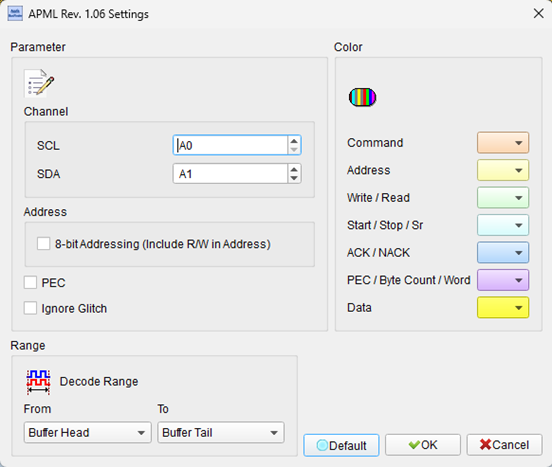
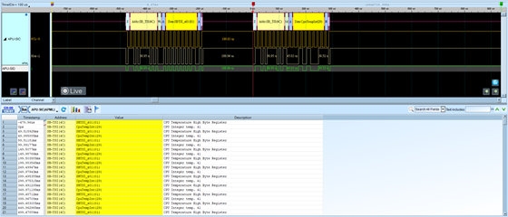

# APML (Advanced Platform Management Link)

## Decode Settings
<figure markdown>
  
  <figcaption>Decode Settings</figcaption>
</figure>

## Example
<figure markdown>
  
  <figcaption>Decode Example</figcaption>
</figure>

## What is APML?

### Overview

Advanced Platform Management Link (APML) is a specialized I2C/I3C-based two-wire communication protocol developed by AMD for system management and monitoring of Opteron and EPYC server processors. Introduced with AMD's Opteron CPU platform, APML provides an out-of-band interface that allows Baseboard Management Controllers (BMCs), system monitors, and management software to access critical processor information without interrupting normal CPU operations or requiring operating system intervention.

APML enables system administrators and datacenter operators to monitor CPU temperature, power consumption, energy usage, performance metrics, and other vital parameters in real-time. This capability is essential for modern server management, enabling features such as dynamic thermal management, power capping, performance optimization, and predictive maintenance. The protocol operates independently of the processor's main execution state, allowing monitoring even when the system is in a low-power state or experiencing operating system failures.

### Evolution and Current Status

Originally specified in Revision 1.02 (August 2009) for AMD's Opteron processors, APML has evolved to support AMD's modern Zen-based processor families, including EPYC, Ryzen Threadripper, and Threadripper Pro series. The protocol has been integrated into AMD's EPYC System Management Software (E-SMS) ecosystem, with the APML Library (formerly E-SMI OOB Library) providing standardized APIs for accessing management functions. Current implementations support AMD Family 17h (Zen, Zen+, Zen 2), 19h (Zen 3, Zen 4), and 1Ah (future generations) processors.

## Protocol Characteristics

### I2C-Based Communication

APML is built upon the industry-standard I2C protocol, inheriting its two-wire architecture with clock (SCL) and data (SDA) lines. This foundation provides several advantages:

- **Simplicity**: Only two signal lines plus ground required
- **Multi-device support**: Multiple processors or components can share the same bus
- **Industry familiarity**: Leverages existing I2C infrastructure and expertise
- **Low pin count**: Minimal hardware overhead for management interfaces

### Addressing Modes

APML supports standard I2C addressing with specific considerations:

**7-bit Addressing**: The primary addressing mode uses 7-bit device addresses, with the 8th bit (least significant bit) serving as the Read/Write indicator. In decoder settings, users can choose to display either:

- **7-bit format**: Shows only the device address (0x00 to 0x7F)
- **8-bit format**: Includes the R/W bit, displaying addresses as 0x00 to 0xFF

The choice affects how addresses appear in decoded output but doesn't change the underlying protocol operation.

## Interface Components

### SB-RMI (SB Remote Management Interface)

The SB-RMI component provides access to processor management and control functions, including:

- **Power Management**: CPU power limits, power capping, energy monitoring
- **Performance Controls**: Frequency limits, boost behavior, core enable/disable
- **System Information**: Processor identification, capabilities, status
- **Configuration**: Runtime configuration of management features
- **Alerts and Events**: Notification of thermal events, power excursions, faults

### SB-TSI (SB Temperature Sensor Interface)

The SB-TSI component specializes in thermal monitoring:

- **Temperature Readings**: Real-time CPU temperature with high precision (often 0.125°C resolution)
- **Thermal Limits**: Reading and setting thermal thresholds
- **Alert Mechanisms**: Automated alerts when temperature exceeds thresholds
- **Historical Data**: Some implementations provide temperature history

## Features and Capabilities

### Packet Error Checking (PEC)

APML optionally supports Packet Error Checking (PEC), an additional data integrity feature inherited from SMBus. When enabled, PEC appends an 8-bit Cyclic Redundancy Check (CRC) byte to each transaction. The receiver recalculates the CRC and compares it to the transmitted value, rejecting transactions with mismatches. PEC provides:

- Enhanced reliability in electrically noisy server environments
- Detection of transmission errors
- Improved system stability for critical management operations

In decoder settings, PEC should be enabled if the platform uses this feature, ensuring correct interpretation of message lengths and data.

### Glitch Filtering

APML implementations may include glitch filtering to handle slow signal transitions or electrical noise. In decoder configuration, the "Ignore glitch" setting helps the analyzer correctly interpret signals on platforms with:

- Long I2C bus traces (common in server motherboards)
- Multiple devices causing bus loading
- Electrically noisy environments (high-power processors, switching power supplies)
- Slower signal rise/fall times

## Decoder Settings

When configuring an APML decoder:

- **Channel Assignment**: Specify logic analyzer channels for CS, WR (SCL), DATA (SDA), and optionally RD
- **Addressing Mode**: Choose 7-bit or 8-bit (with R/W) address display format
- **PEC (Packet Error Check)**: Enable if the platform uses PEC for error detection
- **Glitch Filtering**: Enable "Ignore glitch" for platforms with slow transitions or noise

## Common Applications

APML is essential in:

- **Enterprise Servers**: Multi-socket AMD EPYC platforms
- **Data Centers**: Large-scale server deployments requiring centralized monitoring
- **High-Performance Computing**: Workstations and compute clusters with AMD processors
- **Cloud Infrastructure**: Hyperscale deployments with remote management needs
- **Workstation Platforms**: High-end Threadripper and Threadripper Pro systems
- **Embedded Server Applications**: Industrial servers, telecommunications equipment
- **System Management Software**: BMC firmware, system monitoring tools, datacenter management platforms

## Modern Implementation

AMD's current EPYC System Management Software (E-SMS) provides comprehensive tools for APML-based management:

- **APML Library**: C/C++ APIs for application development
- **BMC Integration**: Support for OpenBMC and proprietary BMC implementations
- **Linux Kernel Support**: Native kernel drivers for APML/SB-RMI
- **Energy and Performance Monitoring**: Real-time power, energy, and frequency tracking
- **Telemetry Collection**: Historical data logging for analytics and optimization

## Reference

- [AMD: EPYC System Management Software (E-SMS)](https://www.amd.com/en/developer/e-sms.html)
- [AMD: Advanced Platform Management Link (APML) Library](https://www.amd.com/en/developer/e-sms/apml-library.html)
- [Linux Kernel: AMD SBI (SB-RMI) Documentation](https://docs.kernel.org/misc-devices/amd-sbi.html)
- [APML Specification (Rev 1.02)](https://www.yumpu.com/en/document/view/19257329/advanced-platform-management-link-apml-specification)
- [Wikipedia: List of AMD Opteron Processors](https://en.wikipedia.org/wiki/List_of_AMD_Opteron_processors)
