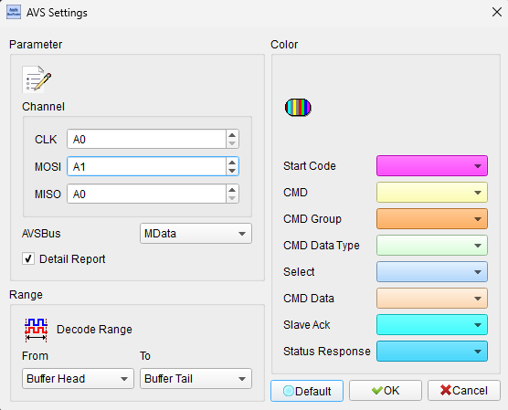
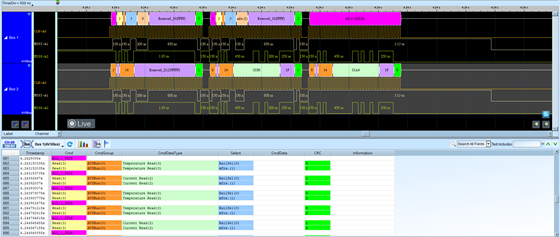

# AVSBus

## Decode Settings
<figure markdown>
  
  <figcaption>Decode Settings</figcaption>
</figure>

## Example
<figure markdown>
  
  <figcaption>Decode Example</figcaption>
</figure>

## What is AVSBus?

### Overview

AVSBus (Adaptive Voltage Scaling Bus) is a high-speed power management protocol developed by the System Management Interface Forum (SMIF) for dynamic voltage and frequency scaling in high-performance processors and System-on-Chips (SoCs). Designed as a complementary standard to PMBus, AVSBus provides fine-grained, real-time voltage control at the point-of-load between processors and power management integrated circuits (PMICs), enabling optimal power efficiency and thermal management in modern computing systems.

As processors become increasingly power-dense and performance-demanding, traditional static voltage schemes prove insufficient. AVSBus addresses this challenge by allowing SoCs to dynamically request voltage changes based on current workload, process variation, temperature, and aging characteristics. This adaptive approach enables processors to run at lower voltages when possible (reducing power consumption) and higher voltages when needed (maximizing performance), achieving an optimal balance between energy efficiency and computational capability.

### Evolution and Standards

AVSBus was initially introduced as Part III of the PMBus Power System Management Protocol Specification version 1.3 in 2014. Recognizing its growing importance and distinct use case, AVSBus has since evolved into a standalone specification, with version 2.0 currently published and version 1.4.1 widely implemented. The protocol represents a significant advancement in power management, providing communication speeds up to 50 MHz—approximately 50 times faster than PMBus's typical 400 kHz operation—enabling the rapid voltage adjustments required for modern adaptive power management.

## Protocol Characteristics

### Three-Wire Interface

Unlike I2C-based protocols that use a two-wire interface (clock and data), AVSBus employs a three-wire communication architecture optimized for high-speed operation:

- **Clock (SCLK)**: High-frequency clock signal up to 50 MHz, enabling rapid command and data transfer
- **Data (SDATA)**: Bidirectional data line for command and response communication
- **Frame Sync or Chip Select**: Additional signal for transaction framing and device selection

The three-wire design provides several advantages:
- Faster communication than traditional I2C or SMBus
- Reduced latency for time-critical voltage adjustments
- Clear transaction boundaries through frame synchronization
- Support for multiple devices with proper addressing

### Communication Speed

AVSBus's 50 MHz maximum communication rate is a defining feature, enabling:

- **Real-time responsiveness**: Voltage changes can occur within microseconds
- **Fine-grained control**: Frequent voltage adjustments matching workload variations
- **Low overhead**: Minimal impact on system performance despite frequent communication
- **High bandwidth**: Multiple parameters can be monitored and controlled simultaneously

This speed advantage is crucial for applications like dynamic voltage and frequency scaling (DVFS), where voltage must rapidly adapt to changing processor operating points.

## Key Features

### Adaptive Voltage Scaling

The core purpose of AVSBus is enabling adaptive voltage scaling, where the SoC dynamically communicates its voltage requirements to the power supply based on:

- **Current Operating Point**: The processor's frequency and performance state
- **Process Variation**: Manufacturing variations affecting transistor characteristics
- **Temperature**: Thermal conditions affecting circuit timing and leakage
- **Aging**: Long-term device degradation requiring voltage compensation
- **Workload Characteristics**: Actual computational demand vs. worst-case assumptions

By adapting voltage in real-time, systems can avoid the traditional worst-case voltage margins, achieving significant power savings (often 10-30%) without sacrificing performance or reliability.

### Standard Commands

AVSBus defines a standardized command set for interoperability across different SoC and PMIC vendors:

- **Voltage Read/Write**: Query current voltage or request voltage changes
- **Current Monitoring**: Read power supply output current
- **Temperature Sensing**: Monitor PMIC and inductor temperatures
- **Status and Faults**: Query fault conditions, warnings, and status information
- **Configuration**: Set operating modes, limits, and thresholds
- **Error Management**: Standardized error reporting and recovery mechanisms

### Zone-Based Architecture

Advanced AVSBus implementations support zone-based control, allowing intelligent device partitioning. Multiple voltage zones or rails can be independently controlled and monitored, enabling:

- Per-core voltage scaling in multi-core processors
- Independent control of CPU, GPU, memory, and I/O voltages
- Optimal power distribution across heterogeneous computing elements
- Hierarchical power management in complex SoCs

## Relationship with PMBus

AVSBus complements rather than replaces PMBus:

- **PMBus**: Handles system-level power management, configuration, and monitoring at relatively slow update rates (kilohertz range). Used for power supplies, voltage regulators, battery management.
  
- **AVSBus**: Focuses on high-speed, point-of-load voltage scaling between SoC and PMIC with rapid updates (up to 50 MHz). Optimized for processor power management.

Many modern systems employ both protocols: PMBus for overall system power configuration and monitoring, AVSBus for real-time processor voltage management.

## Implementation

### Hardware Requirements

Implementing AVSBus requires:

- **SoC Support**: Integrated AVSBus controller and voltage control logic
- **Compatible PMIC**: Power management IC with AVSBus interface and fast voltage transition capability
- **High-Speed Interconnect**: PCB routing capable of 50 MHz signaling
- **Proper Termination**: Signal integrity considerations for high-frequency operation

### Software Support

System software leverages AVSBus through:

- **Firmware**: Low-level drivers and power management firmware
- **Operating System**: Kernel-level power management frameworks (ACPI, cpufreq, devfreq)
- **Application Tuning**: Workload-aware power management policies
- **Diagnostic Tools**: Validation, debugging, and power profiling utilities

## Decoder Settings

When configuring an AVSBus decoder:

- **Signal Assignment**: Specify logic analyzer channels for SCLK, SDATA, and frame sync/chip select
- **Clock Frequency**: Configure expected clock speed (up to 50 MHz)
- **Device Addressing**: Specify target device addresses if multiple AVSBus devices exist
- **Command Interpretation**: Enable decoding of standard AVSBus commands and responses
- **Voltage Unit Scaling**: Configure voltage representation (typically millivolts)

## Common Applications

AVSBus is prevalent in:

- **High-Performance Computing**: Server processors requiring optimal power efficiency
- **Mobile Devices**: Smartphones and tablets maximizing battery life
- **Edge AI and Machine Learning**: Power-constrained AI accelerators
- **Automotive Compute**: Advanced driver assistance systems (ADAS) and infotainment
- **Industrial Automation**: Power-sensitive embedded controllers
- **Networking Equipment**: Routers, switches, and communication infrastructure
- **Consumer Electronics**: Gaming consoles, set-top boxes, smart TVs
- **Data Center Infrastructure**: Power-optimized server platforms

## Reference

- [PMBus: AVSBus Specifications](https://pmbus.org/specification-archives/)
- [PMBus v1.3 with AVSBus Announcement](https://pmbus.org/wp-content/uploads/2018/07/20140311PMBus1.3withAVS_One-Pager-Announcement-final-rev-2.pdf)
- [Synopsys: AMBA AVSBus Controller IP](https://synopsys.com/dw/ipdir.php?ds=amba-avsbus-controller)
- [PMBus Specification Revision 1.3.1 Part II](https://pmbus.org/wp-content/uploads/2022/01/PMBus-Specification-Rev-1-3-1-Part-II-20150313.pdf)
