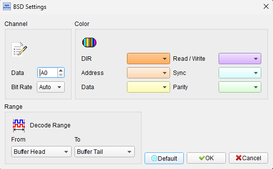
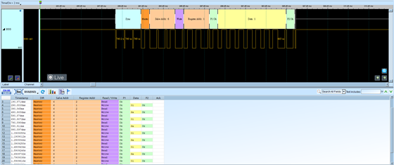

# BSD (Bit Serial Device)

## Decode Settings
<figure markdown>
  
  <figcaption>Decode Settings</figcaption>
</figure>

## Example
<figure markdown>
  
  <figcaption>Decode Example</figcaption>
</figure>

## What is BSD?

### Overview

BSD (Bit Serial Device) is a single-wire serial communication protocol used primarily in BMW automotive systems for battery monitoring and powertrain management. As automotive electrical systems have grown more complex with the introduction of intelligent power management, start-stop systems, and regenerative braking, the need for accurate battery state monitoring has become critical. BSD provides a low-cost, robust communication link between the engine control unit (DME/DDE) and various power system components.

The protocol operates at a relatively low data rate of 1.2 kilobaud, which is sufficient for exchanging battery status, diagnostic information, and control commands without requiring high-bandwidth infrastructure. The single-wire implementation minimizes wiring complexity and cost—important considerations in automotive applications where every connector pin and wire adds weight, cost, and potential failure points. BSD represents an efficient solution for applications where real-time high-speed data transfer is not required, but reliable status monitoring and bidirectional control are essential.

### Historical Context

BSD was developed as automotive battery management systems evolved from simple charge regulation to sophisticated energy management. Modern vehicles require precise monitoring of battery state-of-charge, state-of-health, temperature, and current flow to optimize alternator control, manage start-stop systems, and extend battery life. BSD provides the communication infrastructure needed for these advanced battery management functions while maintaining backward compatibility with existing vehicle electrical architectures.

## Protocol Characteristics

### Single-Wire Serial Interface

BSD uses a single data wire plus ground reference, distinguishing it from multi-wire protocols:

- **Data Rate**: 1.2 kBd (kilobaud) = 1,200 bits per second
- **Bus Type**: Single-wire bidirectional serial communication
- **Topology**: Multi-drop bus allowing multiple components to share the same wire
- **Signal Levels**: Automotive-standard voltage levels (typically 5V or 12V logic)

The low data rate may seem limiting by modern standards, but it provides several advantages:

- Excellent noise immunity in the electrically harsh automotive environment
- Simple, low-cost implementation with minimal hardware
- Long-distance communication over standard automotive wiring
- Low electromagnetic interference (EMI) generation

### Bidirectional Communication

BSD supports bidirectional data exchange, enabling:

**Master to Slave (DME/DDE to Components)**:
- Functional requirements and control commands
- Configuration parameters
- Operating mode selection
- Reset and diagnostic commands

**Slave to Master (Components to DME/DDE)**:
- Component identification data (part numbers, serial numbers, firmware versions)
- Operating values (battery voltage, current, temperature, state-of-charge)
- Performance data and efficiency metrics
- Fault messages and diagnostic trouble codes (DTCs)
- Status information and health indicators

## Connected Components

The BSD network typically interconnects the following components in BMW vehicles:

### Intelligent Battery Sensor (IBS)

The primary BSD device, the IBS monitors:
- Battery voltage with high precision
- Charge and discharge current (typically ±200A range)
- Battery temperature
- State of Charge (SoC) estimation
- State of Health (SoH) estimation
- Battery age and degradation
- Short-circuit and fault detection

### Alternator (Generator)

Modern smart alternators communicate via BSD to:
- Report actual output voltage and current
- Receive charging targets from the engine control unit
- Implement load-response alternator control
- Support battery conditioning strategies
- Enable regenerative braking energy recovery

### Preglow Control Unit (Diesel Engines)

For diesel engines, the preglow system uses BSD for:
- Glow plug status and health monitoring
- Current consumption reporting
- Temperature feedback
- Fault detection and reporting
- Coordination with engine start procedures

### Electric Coolant Pump

Variable-speed electric coolant pumps utilize BSD to:
- Report pump speed and flow rate
- Receive speed control commands
- Monitor motor current and temperature
- Detect blockages or failures
- Coordinate with thermal management strategies

### Oil Condition Sensor

Advanced oil monitoring sensors communicate:
- Oil quality and degradation level
- Contamination detection
- Oil temperature
- Oil change interval estimation
- Fault detection (low level, sensor failure)

## Diagnostic Capabilities

### Multi-Level Fault Detection

**Component Self-Monitoring**: Each BSD device continuously monitors its own functions:
- Sensor accuracy and calibration
- Internal temperature
- Power supply voltage
- Communication integrity
- Actuator operation (if applicable)

**Master Monitoring**: The DME/DDE engine control unit monitors:
- Communication link quality on the BSD interface
- Line faults (short circuits, open circuits, high resistance)
- Missing or unresponsive components
- Data validity and plausibility checks
- Timeout conditions

### Fault Memory and DTCs

When faults are detected:
- The engine control unit records fault events in non-volatile memory
- Diagnostic Trouble Codes (DTCs) are assigned following standard automotive conventions
- Fault context (conditions when fault occurred) is stored
- Fault counters track intermittent vs. persistent faults
- Service indicator lamps may be activated for critical faults

### Diagnostic Access

Automotive diagnostic tools can access BSD information through the vehicle's OBD-II port:
- Read current values from all BSD components
- Retrieve stored fault codes and freeze frame data
- Perform active tests (command components to specific states)
- Update component firmware (if supported)
- Reset adaptive values and learned parameters

## Decoder Settings

When configuring a BSD decoder:

- **Data Channel**: Specify the logic analyzer channel connected to the BSD data line
- **Bit Rate**: Set to 1.2 kBd (1,200 bps)
- **Signal Polarity**: Configure according to the specific implementation (typically active-high)
- **Device Addresses**: If known, configure expected device addresses for enhanced decode
- **Message Format**: Select BMW BSD message format (protocol variants may exist)

## Common Applications

BSD is found in:

- **BMW Vehicles**: Primary application across multiple vehicle lines
- **Automotive Battery Management**: Electric and hybrid vehicles with advanced battery monitoring
- **Engine Management Systems**: Integration with powertrain control
- **Vehicle Diagnostics**: Professional automotive diagnostic equipment
- **Aftermarket Systems**: Performance monitoring and tuning applications
- **Research and Development**: Automotive engineering and validation

## Reference

- [Pico Technology: BMW BSD (Bit Serial Data) Protocol](https://www.picoauto.com/support/viewtopic.php?t=17231)
- [BMW Repair Documentation: Bit-Serial Data Interface (BSD)](https://charm.li/BMW/2009/X5%203.0i%20%28E70%29%20L6-3.0L%20%28N52K%29/Repair%20and%20Diagnosis/Powertrain%20Management/Description%20and%20Operation/Bit-Serial%20Data%20Interface%20%28BSD%29/)
- [Texas Instruments: HDQ Communication Basics for Battery Monitors](https://www.ti.com/lit/an/slva101/slva101.pdf)
