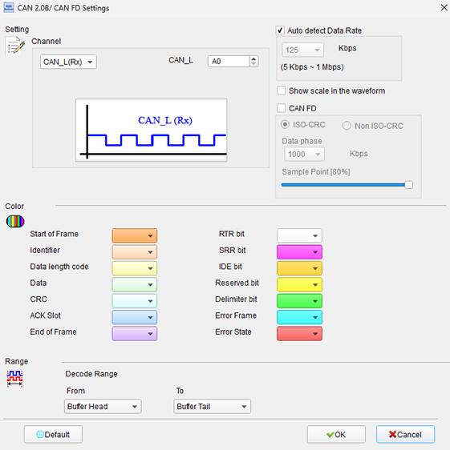
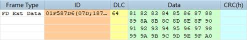
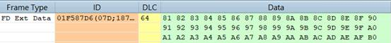
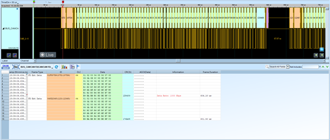

# CAN 2.0B / CAN FD

## Decode Settings
<figure markdown>
  
  <figcaption>Decode Settings</figcaption>
</figure>

## Example
<figure markdown>
  
  <figcaption>Decode Example</figcaption>
</figure>
<figure markdown>
  
  <figcaption>Decode Figure</figcaption>
</figure>
<figure markdown>
  
  <figcaption>Decode Figure</figcaption>
</figure>

## What is CAN?

### Overview

Controller Area Network (CAN) is a robust vehicle bus standard designed by Bosch in the 1980s to allow microcontrollers and devices to communicate with each other without a host computer. Originally developed for automotive applications to reduce wiring harness complexity and weight, CAN has become one of the most widely adopted communication protocols in the automotive industry and has expanded into industrial automation, medical equipment, and many other applications requiring reliable, real-time communication in electrically noisy environments.

CAN protocol exists in several versions. **CAN 2.0A** (Basic CAN) uses 11-bit message identifiers, while **CAN 2.0B** (Extended CAN, also called Peli CAN) extends the identifier to 29 bits, allowing for significantly more unique message types on the same bus. Both versions use the same physical layer and basic protocol structure, with the identifier length being the primary distinction.

### CAN FD Evolution

**CAN FD** (CAN with Flexible Data-Rate), released by Bosch in 2012 and standardized in ISO 11898-1, represents a major evolution of the classical CAN protocol. CAN FD addresses two critical limitations of classical CAN:

1. **Data Payload**: Increased from 8 bytes maximum to up to 64 bytes per frame
2. **Data Rate**: Variable bit rate allowing up to 5-8 Mbit/s during the data phase while maintaining 1 Mbit/s during arbitration for backward compatibility

CAN FD maintains the same arbitration mechanism and message priority system as classical CAN, ensuring that time-critical messages can still preempt lower-priority traffic. The protocol allows gradual migration from classical CAN to CAN FD, with both types of nodes coexisting on the same network during transition periods.

## Physical Layer

### Differential Signaling

CAN uses differential signaling with two wires:

- **CAN_H (CAN High)**: Positive signal line
- **CAN_L (CAN Low)**: Negative signal line

The differential voltage between CAN_H and CAN_L represents the bus state:

- **Dominant (0)**: CAN_H is approximately 3.5V, CAN_L is approximately 1.5V (differential voltage ~2V)
- **Recessive (1)**: Both CAN_H and CAN_L are approximately 2.5V (differential voltage ~0V)

This differential signaling provides excellent noise immunity. Common-mode noise (affecting both wires equally) is rejected, as only the difference matters. This characteristic enables reliable communication in automotive and industrial environments with significant electrical interference.

### Bus Arbitration

CAN uses CSMA/CD+AMP (Carrier Sense Multiple Access/Collision Detection with Arbitration on Message Priority). When multiple nodes attempt to transmit simultaneously, the node with the highest priority message (lowest identifier value) wins arbitration non-destructively—the losing nodes automatically cease transmission and retry later. This deterministic arbitration ensures that critical messages always have priority.

## Message Frame Types

### Data Frame

The most common frame type carries actual data payload. Structure includes:

- **Start of Frame (SOF)**: Single dominant bit marking frame start
- **Identifier**: 11-bit (CAN 2.0A) or 29-bit (CAN 2.0B) message ID determining priority
- **Control Field**: Data Length Code (DLC) and control bits
- **Data Field**: 0-8 bytes in classical CAN, 0-64 bytes in CAN FD
- **CRC Field**: Cyclic Redundancy Check for error detection (15-bit in classical CAN, 17-bit or 21-bit in CAN FD for longer messages)
- **ACK Field**: Acknowledgment from receiving nodes
- **End of Frame (EOF)**: Seven recessive bits marking frame end

### Remote Frame

A Remote Frame requests data from another node. It contains an identifier but no data payload. Nodes configured to respond to that identifier then transmit a Data Frame containing the requested information. Remote frames are less commonly used in modern CAN networks, with most implementations using periodic transmission of Data Frames instead.

### Error Frame

When a node detects an error (CRC mismatch, bit stuffing violation, form error, etc.), it transmits an Error Frame to notify all nodes that the current message should be discarded. The transmitting node will then automatically retransmit the message. This mechanism ensures data integrity without requiring higher-layer protocols to implement retransmission logic.

### Overload Frame

Overload Frames are transmitted by nodes that need additional time before processing the next message. This provides flow control at the protocol level, preventing buffer overruns in slower nodes.

## CAN FD Enhancements

### Flexible Data Rate

CAN FD allows bit rate switching within a single message:

- **Arbitration Phase**: Maintains classical CAN bit rate (typically 500 kbit/s or 1 Mbit/s) to ensure compatibility and reliable arbitration
- **Data Phase**: Switches to higher bit rate (2-8 Mbit/s) during data and CRC transmission

This dual-rate approach provides the best of both worlds: reliable arbitration compatible with classical CAN nodes, and high-speed data transfer for increased throughput.

### Extended Payload

CAN FD supports the following payload sizes: 0, 1, 2, 3, 4, 5, 6, 7, 8, 12, 16, 20, 24, 32, 48, and 64 bytes. The increased payload reduces protocol overhead for transmitting larger messages and decreases bus utilization by reducing the number of frames needed.

### Enhanced Error Detection

CAN FD employs improved CRC polynomials:

- **CRC17**: For messages with payloads ≤16 bytes
- **CRC21**: For messages with payloads >16 bytes

These enhanced CRCs provide better error detection capabilities for the longer message frames, maintaining the reliability that CAN is known for even with increased payload sizes.

## Decoder Configuration

When configuring a CAN/CAN FD decoder:

- **Channel Selection**: Choose CAN_H or CAN_L differential signal (single-ended probing possible, but differential provides better accuracy)
- **Bit Rate**: Specify arbitration bit rate or enable auto-detection (typically 125 kbit/s, 250 kbit/s, 500 kbit/s, or 1 Mbit/s)
- **CAN FD Mode**: Enable if decoding CAN FD frames to properly interpret flexible data rate and extended payloads
- **Data Rate**: For CAN FD, specify data phase bit rate (typically 2-8 Mbit/s)
- **ID Format**: Select 11-bit (CAN 2.0A) or 29-bit (CAN 2.0B) identifier display, or auto-detect
- **Display Options**: Choose to show scale in waveform, decode DLC, display CRC, etc.

## Common Applications

CAN and CAN FD are extensively used in:

**Automotive**:
- Engine control units (ECU)
- Transmission control
- Anti-lock braking systems (ABS)
- Airbag controllers
- Instrument clusters
- ADAS (Advanced Driver Assistance Systems)
- Electric vehicle battery management

**Industrial Automation**:
- Factory automation equipment
- Robotics communication
- Process control systems
- Building automation (elevators, HVAC)

**Medical Devices**:
- Surgical equipment
- Patient monitoring systems
- Medical imaging devices

**Aerospace and Marine**:
- Avionics systems
- Ship control and monitoring

**Off-Highway Vehicles**:
- Agricultural equipment (tractors, harvesters)
- Construction machinery
- Mining equipment (following SAE J1939 standard)

## Standards and Protocols

- **ISO 11898-1**: CAN data link layer and physical signaling
- **ISO 11898-2**: High-speed CAN physical layer
- **SAE J1939**: Heavy-duty vehicle CAN protocol (J1939-17 specifies CAN FD at 500 kbps/2 Mbps)
- **CANopen**: Higher-layer protocol for industrial automation
- **DeviceNet**: Industrial automation protocol based on CAN

## Reference

- [Wikipedia: CAN FD](https://en.wikipedia.org/wiki/CAN_FD)
- [CAN FD Specification (PDF)](https://tekeye.uk/downloads/can_fd_spec.pdf)
- [CAN in Automation: CiA 601 Series - CAN FD Guidelines](https://www.can-cia.org/can-knowledge/cia-601-series-can-fd-guidelines-and-recommendations)
- [SAE J1939-17: CAN FD Physical Layer, 500 kbps/2 Mbps](https://www.sae.org/standards/content/j1939-17_202012/)
