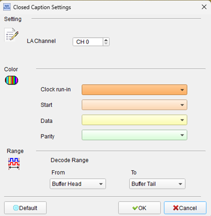
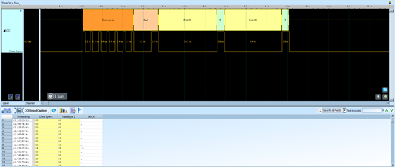

# Closed Caption

## Decode Settings
<figure markdown>
  
  <figcaption>Decode Settings</figcaption>
</figure>

## Example
<figure markdown>
  
  <figcaption>Decode Example</figcaption>
</figure>

## What is Closed Caption?

### Overview

Closed captioning is a text-based accessibility feature that displays dialogue, sound effects, speaker identification, and other audio information as text on video displays. Unlike open captions (burned into the video image), closed captions can be enabled or disabled by viewers, providing flexibility for those who need or prefer them. Originally developed in the 1970s to assist deaf and hard-of-hearing viewers, closed captioning has evolved into an essential feature for diverse audiences, including second-language learners, viewers in sound-sensitive environments, and those watching video without audio.

The term "closed" indicates that captions are hidden by default and must be activated by the viewer, as opposed to "open" captions that are always visible. Modern closed captioning standards provide not only speech transcription but also convey speaker identification, non-speech audio cues (like [music playing] or [door slams]), and even styling information to enhance comprehension and accessibility.

## Closed Caption Standards

### CEA-608 (Analog Television Standard)

CEA-608, now standardized as ANSI/CTA-608-E, is the original closed captioning standard developed for analog NTSC television broadcasts. Adopted in 1980 and mandated by the FCC for broadcast television in 1993, CEA-608 remains relevant today primarily for backward compatibility.

**Technical Characteristics:**

- **Transmission**: Encoded on line 21 of the vertical blanking interval (VBI) in analog video signals
- **Data Rate**: Two bytes per video frame (approximately 60 bytes per second for NTSC)
- **Display Model**: Command-based system defining a 32-column × 15-row character grid
- **Buffer**: Off-screen composition buffer for building captions before display
- **Services**: Supports four caption services (CC1, CC2, CC3, CC4) and four text services

**Limitations:**

- Fixed character grid restricts positioning flexibility
- Limited font and style options (typically only a few preset fonts and colors)
- Roll-up, pop-on, and paint-on display modes
- Basic color support (white, green, blue, cyan, red, yellow, magenta, black)
- No support for complex scripts or vertical text

**Display Modes:**

- **Roll-up**: Captions scroll upward as new lines appear (typically 2-4 lines visible)
- **Pop-on**: Complete caption blocks appear and disappear as units (most common for pre-recorded content)
- **Paint-on**: Characters appear one at a time from left to right (rarely used)

### CEA-708 (Digital Television Standard)

CEA-708, standardized as ANSI/CTA-708-E (formerly EIA-708), is the modern closed captioning standard for ATSC digital television broadcasts in the United States and Canada. Introduced in 1997 and gaining widespread adoption through the 2000s, CEA-708 provides significantly enhanced capabilities compared to CEA-608.

**Advanced Features:**

- **Multiple Windows**: Up to 8 independent caption windows can be displayed simultaneously
- **Flexible Positioning**: Windows can be positioned anywhere on screen with pixel-level precision
- **Enhanced Styling**: Comprehensive font, color, size, and opacity controls
- **Unicode Support**: Support for international character sets and special symbols
- **Directional Text**: Supports vertically rendered text and right-to-left languages (Arabic, Hebrew)
- **Transparency**: Window backgrounds and text can have varying opacity levels
- **Edge Attributes**: Text can have drop shadows, raised edges, or outlined styles

**Service Architecture:**

CEA-708 supports up to 63 caption services, enabling:
- Multiple language tracks
- Easy listening (descriptive) vs. standard captions
- Dialogue-only vs. dialogue-plus-sound-effects captions
- Different verbosity levels

**Backward Compatibility:**

A critical feature of CEA-708 is that it encapsulates CEA-608 caption data within its data stream. Decoders extract and present this embedded CEA-608 data for legacy receivers, ensuring that older television sets can still display captions from digital broadcasts. This dual-standard approach facilitated the transition from analog to digital broadcasting without abandoning existing equipment.

## Data Encoding and Transport

### Analog Video (CEA-608)

In analog broadcasts, CEA-608 data is encoded as:

1. **Line 21 Selection**: Uses line 21 (field 1) and optionally line 21 (field 2) of the VBI
2. **Waveform Encoding**: Data encoded as frequency-modulated waveform (NRZ - Non-Return-to-Zero)
3. **Clock Reference**: Seven-cycle clock run-in synchronizes decoder timing
4. **Start Bit**: Single bit marks beginning of data
5. **Data Bytes**: Two bytes per field carrying caption data or control codes

### Digital Video (CEA-708)

In digital broadcasts, CEA-708 data is transported as:

1. **ATSC/DVB Stream**: Caption data packaged in the MPEG-2 or H.264 video stream
2. **User Data**: Embedded in user data registered as ATSC MPEG-2 user data or H.264 SEI (Supplemental Enhancement Information)
3. **SMPTE ST436**: For professional video equipment, captions carried in dedicated caption space in video frame headers
4. **Packetization**: CEA-708 data is packetized into service blocks for multiplexing multiple caption streams

### Streaming and Web Video

Modern streaming platforms have largely transitioned to:

- **WebVTT** (Web Video Text Tracks): Text-based format for HTML5 video
- **TTML** (Timed Text Markup Language): XML-based format for advanced styling
- **SRT** (SubRip Text): Simple plaintext format widely supported

However, CEA-608 and CEA-708 remain important for broadcast-origin content and live streaming workflows.

## Decoder Configuration

When configuring a closed caption decoder:

- **Standard Selection**: Choose CEA-608 (analog/legacy) or CEA-708 (digital)
- **Service Selection**: Specify which caption service to decode (CC1-CC4 for 608, service 1-63 for 708)
- **Video Format**: NTSC/PAL for analog, ATSC/MPEG for digital
- **Line Selection**: For CEA-608, specify field 1, field 2, or both
- **Character Set**: Configure expected language and character encoding
- **Display Simulation**: Some decoders can display captions overlaid on video for verification

## Common Applications

Closed captioning is essential in:

- **Broadcast Television**: Mandatory for most U.S. broadcast programming (FCC regulations)
- **Streaming Services**: Netflix, Hulu, YouTube, Prime Video, Disney+
- **Educational Video**: E-learning platforms, instructional content
- **Corporate Communications**: Training videos, company announcements
- **Public Venues**: Airports, train stations, restaurants, gyms
- **Medical and Emergency**: Hospitals, emergency broadcasts
- **Legal Requirements**: ADA compliance, FCC regulations, accessibility laws

## Benefits Beyond Accessibility

While originally designed for deaf and hard-of-hearing viewers, captions benefit many audiences:

- **Language Learners**: Visual reinforcement aids comprehension and vocabulary acquisition
- **Noisy Environments**: Airports, gyms, public spaces where audio is difficult to hear
- **Quiet Environments**: Libraries, offices, late-night viewing without disturbing others
- **Comprehension**: Improves retention and understanding of complex content
- **Search and Discovery**: Caption text enables searchability of video content
- **Literacy**: Helps children and adults improve reading skills

## Regulatory Context

**United States:**
- **Television Decoder Circuitry Act (1990)**: Required TVs 13 inches or larger to include caption decoders
- **FCC Rules**: Mandate closed captioning for most television programming
- **21st Century Communications and Video Accessibility Act (CVAA, 2010)**: Extended requirements to online video

**International:**
- Various countries have similar requirements (UK's Ofcom, Canadian CRTC, Australian ACMA)
- European Accessibility Act mandates accessibility features including subtitles

## Reference

- [SVRTA University: CEA-608/708 Closed Captioning Standards](https://university.svta.org/industry-resource/cea-608-708-closed-captioning-standards)
- [Wikipedia: CTA-708 (CEA-708)](https://en.wikipedia.org/wiki/CEA-708)
- [SMPTE Engineering Guideline 43: Conversion of 708 Captions](https://pub.smpte.org/latest/eg43/eg0043-2009.pdf)
- [W3C: Conversion of 608/708 Captions to WebVTT](https://dvcs.w3.org/hg/text-tracks/raw-file/default/608toVTT/608toVTT.html)
- [Federal Agencies Digital Guidelines: Closed Captions](https://www.digitizationguidelines.gov/term.php?term=closedcaptions)
