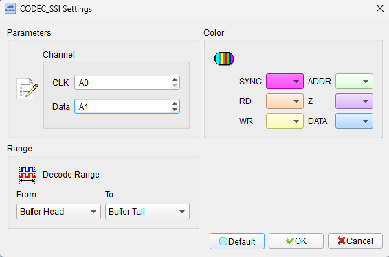
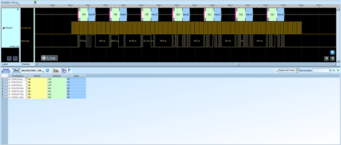

# Codec SSI

## Decode Settings
<figure markdown>
  
  <figcaption>Decode Settings</figcaption>
</figure>

## Example
<figure markdown>
  
  <figcaption>Decode Example</figcaption>
</figure>

## What is Codec SSI?

### Overview

Codec SSI (Synchronous Serial Interface) refers to the digital audio interface used by audio codec chips to transmit and receive digital audio data between digital signal processors (DSPs), microcontrollers, or other audio processing devices. SSI is a generic term for various synchronous serial protocols that transfer digital audio samples in a time-synchronized manner, including I2S (Inter-IC Sound), TDM (Time-Division Multiplexing), Left-Justified, and Right-Justified formats. Audio codecs from manufacturers like Texas Instruments, Analog Devices, and others implement SSI-compatible interfaces to enable high-quality digital audio connectivity.

Modern audio codecs serve as the bridge between analog audio signals (microphones, speakers, line inputs/outputs) and digital audio processing systems. The SSI interface carries digitized audio samples with precision timing, supporting multiple channels, various bit depths (16, 20, 24, or 32 bits), and sample rates from 8 kHz (voice-quality) up to 768 kHz (ultra-high-resolution audio). The synchronous nature ensures that audio samples from ADCs and to DACs maintain perfect timing alignment—critical for maintaining audio quality and preventing glitches or distortion.

### Evolution and Standardization

While SSI is a general concept rather than a single standard, the most common implementation is I2S, originally designed by Philips (now NXP) in the 1980s. Over time, various manufacturers have developed compatible and extended formats (Left-Justified, Right-Justified, TDM, DSP modes) that share SSI's fundamental synchronous serial architecture but differ in data alignment and clocking details. These formats have become de facto standards in consumer electronics, professional audio equipment, automotive entertainment systems, and telecommunications infrastructure.

## Signal Lines

### Bit Clock (BCLK or SCK)

The bit clock (also called serial clock) synchronizes data transfer. Each clock cycle corresponds to one bit of audio data being transmitted. The BCLK frequency equals the sample rate multiplied by the number of bits per sample and the number of channels. For example, stereo 48 kHz audio at 24 bits per sample requires: 48,000 × 24 × 2 = 2.304 MHz BCLK.

### Word Select (WS, LRCLK, or Frame Sync)

The word select signal (also called left-right clock or frame sync) indicates which channel is being transmitted. In I2S stereo format, WS low signifies the left channel, while WS high signifies the right channel. The WS frequency equals the sample rate (e.g., 48 kHz for 48 kHz audio). In TDM formats with more than two channels, WS acts as a frame sync indicating the start of a frame containing multiple channel slots.

### Serial Data (SD, DIN, DOUT)

The serial data line carries the actual audio sample data. Depending on the codec configuration and system architecture, separate data lines may exist for input and output (SDI/SDIN for data into the codec, SDO/SDOUT for data from the codec), or a single bidirectional line may be used.

### Master Clock (MCLK - Optional)

Many audio codecs require a master clock running at a higher frequency than BCLK, typically 256× or 512× the sample rate. MCLK provides the timing reference for the codec's internal PLL (Phase-Locked Loop), ADC, DAC, and signal processing blocks. Some codecs can generate MCLK internally or derive timing from BCLK, eliminating the need for an external MCLK signal.

## Common SSI Audio Formats

### I2S (Inter-IC Sound)

**I2S** is the most prevalent SSI format:

- **Data Alignment**: MSB-first, with data delayed by one BCLK cycle after the WS transition
- **WS Polarity**: Low for left channel, high for right channel
- **Data Valid**: One clock cycle after WS edge
- **Applications**: Consumer audio, DACs, ADCs, audio processors

The one-clock-cycle delay gives receivers time to detect the WS transition before data arrives, simplifying hardware implementation.

### Left-Justified

**Left-Justified** format aligns the MSB with the WS transition:

- **Data Alignment**: MSB transmitted on the same clock cycle as WS transition
- **WS Polarity**: Typically low for left channel, high for right channel
- **Data Valid**: Immediately at WS edge
- **Applications**: Professional audio, multi-channel systems

Left-justified is commonly used when interfacing with certain professional audio equipment and older audio chips.

### Right-Justified

**Right-Justified** format aligns the LSB at the end of the word period:

- **Data Alignment**: MSB appears earlier in the word period, LSB at the end
- **WS Polarity**: Similar to left-justified
- **Flexible Word Lengths**: Allows variable word lengths without changing interface timing
- **Applications**: Legacy audio systems, specific codec requirements

### TDM (Time-Division Multiplexing)

**TDM** supports more than two audio channels on a single serial data line:

- **Channel Slots**: Frame divided into time slots (e.g., 8-channel TDM has 8 slots per frame)
- **Frame Sync**: WS pulses once per frame to mark the first channel
- **High Channel Count**: Supports 4, 6, 8, or more channels
- **Applications**: Multi-channel audio systems, surround sound, automotive audio

TDM is essential for applications requiring more than stereo channels without using multiple physical data lines.

## Audio Codec Examples

### Texas Instruments TAC5242

**High-Performance Stereo Codec:**
- ADC: 119 dB dynamic range
- DAC: 120 dB dynamic range
- Sample rates: 8 kHz to 192 kHz
- Pin or hardware control
- Formats: I2S, Left-Justified, TDM
- Supply: 1.8V or 3.3V

### Texas Instruments PCM3168A

**Multi-Channel Codec:**
- Configuration: 6-input / 8-output
- Formats: I2S, Left-Justified, Right-Justified, DSP, TDM
- Resolution: 24-bit
- Sample rates: 8 kHz to 192 kHz
- Applications: AVR receivers, soundbars, automotive

### Texas Instruments TAC5112

**Low-Power Stereo Codec:**
- ADC: 105 dB dynamic range
- DAC: 114 dB dynamic range
- Sample rates: 4 kHz to 768 kHz (ultra-high-resolution)
- Control: I2C or SPI
- Power: Ultra-low power consumption

## Decoder Configuration

When configuring a Codec SSI decoder:

- **Format Selection**: Choose I2S, Left-Justified, Right-Justified, or TDM
- **Channel Assignment**: Specify logic analyzer channels for BCLK, WS, SD (and optionally MCLK)
- **Sample Rate**: Set expected audio sample rate (e.g., 44.1 kHz, 48 kHz, 96 kHz)
- **Bit Depth**: Configure word length (16, 20, 24, or 32 bits)
- **Channel Count**: For TDM, specify number of channels
- **Clock Mode**: Identify controller (generates clocks) vs. target (receives clocks)
- **Data Direction**: Specify if analyzing ADC output, DAC input, or both

## Common Applications

Codec SSI is found in diverse audio applications:

- **Smartphones and Tablets**: Voice calls, music playback, video recording
- **Portable Audio Players**: High-resolution audio playback
- **Smart Speakers**: Voice assistants, streaming music
- **Automotive Infotainment**: Head units, amplifiers, DSPs
- **Professional Audio**: Mixing consoles, interfaces, effects processors
- **Hearing Aids and Medical**: Audio processing in medical devices
- **Telecommunications**: VoIP phones, conferencing systems
- **Home Theater**: AVR receivers, soundbars, multi-room audio
- **IoT Devices**: Voice-enabled smart home devices
- **Gaming Consoles**: Audio input/output processing

## Advantages of SSI Digital Audio

- **No Degradation**: Digital transmission eliminates noise and distortion from analog interconnects
- **High Quality**: Supports up to 32-bit depth and 768 kHz sample rates
- **Multi-Channel**: TDM enables many channels on a single data line
- **Standardized**: Compatible across multiple vendors and devices
- **Low Pin Count**: Requires only 3-4 signals regardless of bit depth
- **Flexible Configuration**: Software-configurable formats and parameters
- **Synchronization**: Perfect time alignment between channels

## Reference

- [Texas Instruments TAC5242 Datasheet](https://www.ti.com/lit/gpn/tac5242)
- [Texas Instruments PCM3168A Multi-Channel Audio Codec](https://www.ti.com/lit/ds/symlink/pcm3168a.pdf)
- [Texas Instruments TAC5112 Low-Power Codec](https://www.ti.com/lit/ds/symlink/tac5112.pdf)
- [NXP DSP56156 I2S/SSI User Manual](https://nxp.com/docs/en/user-guide/DSP56156UM08.pdf)
