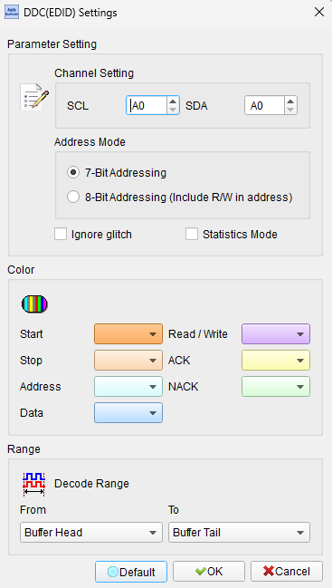
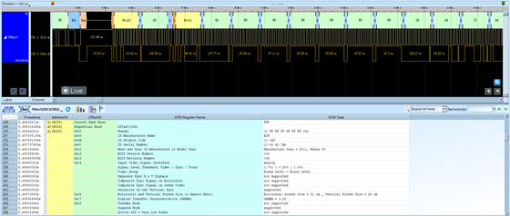

# DDC / EDID

## Decode Settings
<figure markdown>
  
  <figcaption>Decode Settings</figcaption>
</figure>

## Example
<figure markdown>
  
  <figcaption>Decode Example</figcaption>
</figure>

## What is DDC and EDID?

### Overview

DDC (Display Data Channel) and EDID (Extended Display Identification Data) are complementary standards that enable automatic configuration and communication between computer graphics systems and display devices. When you connect a monitor to a computer and it "just works" with the optimal resolution, refresh rate, and color settings, you're experiencing DDC and EDID in action. These standards, developed by VESA (Video Electronics Standards Association), form the foundation of modern Plug and Play display functionality across VGA, DVI, HDMI, and DisplayPort interfaces.

**EDID** is a data structure—a standardized 128-byte (or larger with extensions) block of information stored in the display device that describes its capabilities, identity, and technical specifications. This data includes the manufacturer, model number, production date, supported resolutions, refresh rates, color characteristics, physical dimensions, and other parameters that allow the graphics adapter to configure itself optimally for that specific display.

**DDC** is the communication protocol and physical channel used to read EDID data from the display and, in advanced versions (DDC/CI), send commands to control monitor settings. Think of EDID as the information and DDC as the mechanism for transmitting that information between display and graphics system.

### Historical Evolution

The DDC/EDID ecosystem has evolved through several versions:

- **DDC1**: Unidirectional, very limited capability
- **DDC2B/E-DDC** (Enhanced DDC): I²C-based bidirectional communication, most common implementation
- **DDC/CI** (Command Interface): Extends DDC2B with monitor control commands
- **EDID 1.x**: Original EDID structure with various enhancements
- **EDID 2.0**: Significant expansion, though 1.x remains dominant

## EDID Structure and Content

### Base EDID Block (128 Bytes)

The standard EDID block contains eight 16-byte sections:

**Header (8 bytes):**
- Fixed identification pattern (00 FF FF FF FF FF FF 00)
- Validates that EDID data is present

**Vendor/Product Identification (10 bytes):**
- Manufacturer ID (3-letter code)
- Product code
- Serial number
- Week and year of manufacture

**EDID Version (2 bytes):**
- Version and revision numbers

**Basic Display Parameters (5 bytes):**
- Video input definition (analog vs. digital)
- Screen dimensions (width and height in cm)
- Display gamma
- Feature support flags

**Color Characteristics (10 bytes):**
- Chromaticity coordinates (Red, Green, Blue, White Point)
- Defines the color space and gamut of the display

**Established Timings (3 bytes):**
- Bitmap of common standard resolutions (720×400, 640×480, 800×600, 1024×768, etc.)

**Standard Timings (16 bytes):**
- Up to 8 additional resolution/refresh rate combinations

**Detailed Timing Descriptors (72 bytes):**
- Four 18-byte blocks describing detailed timing information
- First block typically contains the preferred (native) resolution
- Additional blocks may contain more timings or other descriptor types
- Alternative descriptors: Display name (model string), Range limits, Serial number string

**Extension Block Count and Checksum (2 bytes):**
- Number of EDID extension blocks (if any)
- Checksum to validate data integrity

### EDID Extensions

Modern displays often require more than 128 bytes to describe all capabilities:

**CEA-861 Extensions** (most common):
- For HDMI and DVI displays
- Describes audio capabilities (supported formats, channel counts, sample rates)
- Video data blocks (detailed timing, 3D formats)
- Speaker allocation
- Colorimetry data (extended color spaces)
- HDR static metadata (for HDR displays)

**DisplayID Extensions**:
- More flexible structure for complex displays
- Tiled display topology
- Extended color and HDR information

## DDC Communication Protocol

### E-DDC (Enhanced DDC)

The most common implementation uses I²C protocol:

**I²C Addressing:**
- **EDID Read**: Slave address 0xA0 (write) / 0xA1 (read)
- **Segment Pointer**: Address 0x60 (for accessing >256 bytes)
- **E-DDC Extensions**: Address 0xA4/0xA5, 0xA6/0xA7 for additional data

**Data Access:**
- Standard I²C transactions
- Byte-at-a-time reads or multi-byte burst reads
- Typically operates at 100 kHz (standard I²C speed)
- Can access up to 32KB using segment pointer mechanism

### DDC/CI (Command Interface)

DDC/CI extends E-DDC with bidirectional control:

**Capabilities:**
- Adjust brightness, contrast, color temperature
- Select video input source
- Query/set color settings
- Power management (DPMS states)
- OSD (On-Screen Display) control
- Custom manufacturer-specific commands

**Protocol:**
- Also uses I²C with addresses 0x6E/0x6F
- VCP (Virtual Control Panel) codes define specific functions
- Commands follow defined message structure
- Supports checksums for data integrity

## Decoder Configuration

When configuring a DDC/EDID decoder:

- **I²C Channels**: Specify logic analyzer channels for SDA (data) and SCL (clock)
- **Address Filtering**: Filter for EDID read addresses (0xA0/0xA1) and optionally DDC/CI (0x6E/0x6F)
- **Data Interpretation**: Enable EDID structure parsing and field decoding
- **Extension Blocks**: Configure to handle multi-block EDID (CEA-861, DisplayID)
- **Checksum Validation**: Verify EDID checksums
- **Timing Display**: Show detailed timing parameters in human-readable format

## Applications and Use Cases

DDC and EDID are fundamental in:

**Consumer Electronics:**
- Desktop monitors and displays
- Televisions with computer inputs
- Laptop displays (embedded EDID)
- Projectors
- All-in-one computers

**Professional Applications:**
- Medical imaging displays (DICOM calibration)
- Broadcast and production monitors
- Color-critical displays for photography/video
- CAD/CAM workstations

**System Integration:**
- KVM switches (managing EDID for multiple displays)
- Video distribution systems
- Conference room AV equipment
- Digital signage

**Development and Testing:**
- Display firmware development
- Graphics driver development
- EDID emulation and management tools
- Compliance testing equipment

## Common Issues and Debugging

**EDID Problems:**
- Corrupted EDID data (wrong checksums)
- Missing or incomplete EDID
- Non-standard resolutions not properly described
- Incorrect color space information

**Solutions:**
- EDID override/emulation
- Custom EDID creation tools
- EDID readers for diagnosis
- Logic analyzer capture of DDC transactions

## Reference

- [VESA E-EDID Standard](https://glenwing.github.io/docs/VESA-EEDID-A1.pdf)
- [VESA DDC/CI Specification](https://glenwing.github.io/docs/VESA-DDCCI-1.1.pdf)
- [VESA E-DDC 1.2 Standard](https://glenwing.github.io/docs/VESA-EDDC-1.2.pdf)
- [Wikipedia: Display Data Channel](https://en.wikipedia.org/wiki/Display_Data_Channel)
- [EdidCraft: Learn EDID](https://edidcraft.com/learn)
