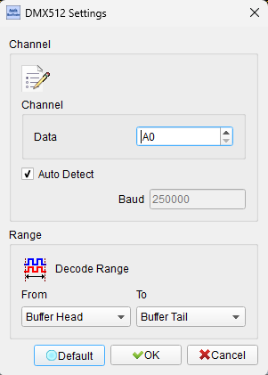
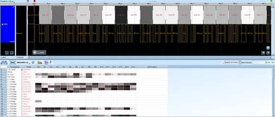

# DMX512

## Decode Settings
<figure markdown>
  
  <figcaption>Decode Settings</figcaption>
</figure>

## Example
<figure markdown>
  
  <figcaption>Decode Example</figcaption>
</figure>

## What is DMX512?

### Overview

DMX512 (Digital Multiplex with 512 pieces of information) is the entertainment industry's standard digital communication protocol for controlling theatrical and architectural lighting, as well as effects equipment. Developed in 1986 by the USITT (United States Institute for Theatre Technology) and subsequently adopted internationally, DMX512 enables a single controller to manage hundreds of lighting fixtures, dimmers, fog machines, moving lights, LED displays, and other stage equipment through one standardized cable. The protocol's simplicity, reliability, and universal adoption have made it indispensable in theaters, concert venues, television studios, architectural lighting, theme parks, and anywhere sophisticated lighting control is required.

The "512" in DMX512 refers to the maximum number of control channels (or slots) available in a single DMX universe. Each channel carries an 8-bit value (0-255), allowing 256 discrete levels of control—ideal for dimming intensity, positioning moving lights, setting colors, or controlling any parameter of intelligent lighting fixtures. Large installations can employ multiple universes (up to 64,000 with modern Ethernet converters), providing virtually unlimited scalability for complex lighting designs.

### Evolution and Standardization

The current standard is **ANSI E1.11 (DMX512-A)**, approved in November 2004 and maintained by ESTA (Entertainment Services and Technology Association). This updated standard clarified ambiguities in the original specification, improved timing definitions, and added provisions for proper implementation. Related standards include **E1.20** for RDM (Remote Device Management), which adds bidirectional communication for configuration and monitoring, and **E1.27** for cabling requirements.

## Technical Specifications

### Physical Layer

**Electrical Characteristics:**
- **Standard**: EIA-485 (RS-485) differential signaling
- **Data Rate**: 250 kbit/s (250,000 bits per second)
- **Signal Format**: Asynchronous serial, 8N2 (one start bit, eight data bits, two stop bits, no parity)
- **Voltage**: Differential ±5V nominal (meets EIA-485 specifications)
- **Impedance**: 120-ohm nominal cable impedance

**Topology and Cabling:**
- **Topology**: Daisy-chain (multi-drop bus) configuration
- **Standard Connector**: XLR-5 (5-pin XLR) for temporary/touring applications
- **Permanent Installation**: XLR-5 or RJ45 for fixed architectural installations
- **Cable**: 2-pair, 24 AWG, rated for EIA-485 systems
- **Maximum Cable Length**: 1,000 feet (300 meters) per link without repeaters or optical isolation
- **Maximum Devices**: 32 devices per link (without amplification or splitting)
- **Termination**: 120-ohm resistor required at the final device to prevent signal reflections

### Data Packet Structure

Each DMX512 packet (frame) consists of:

**Break:** (88-968 microseconds)
- Mark-After-Break (MAB): 8-1,000,000 microseconds
- Signals the start of a new packet

**Start Code:** (44 microseconds)
- Byte 0: Usually 0x00 for standard dimmer data
- Other codes reserved for alternate start codes (ASC) like RDM, text packets, etc.

**Data Slots:** (44 microseconds each)
- Slots 1-512: Channel data (0-255 for each channel)
- Each slot represents one control parameter
- Not all 512 slots need to be transmitted; packets can be shorter

**Mark Time Between Slots:**
- Variable inter-slot time accommodates different receiver speeds

**Frame Rate:**
- Theoretical maximum: ~44 times per second (for full 512-channel packets)
- Practical rates: 25-40 Hz typical, providing smooth fades and responsive control
- Slower rates reduce flicker in LED fixtures

## Channel Assignment and Addressing

### DMX Addressing

Each lighting fixture or device is assigned a starting DMX address (1-512):

**Simple Dimmer:** Uses one channel
- Address 1: Intensity control (0-255)

**RGB LED Fixture:** Uses three channels
- Address 10: Red intensity (0-255)
- Address 11: Green intensity (0-255)
- Address 12: Blue intensity (0-255)

**Moving Head Fixture:** May use 16+ channels
- Address 50: Pan (horizontal position)
- Address 51: Pan fine (16-bit precision)
- Address 52: Tilt (vertical position)
- Address 53: Tilt fine
- Address 54: Color wheel
- Address 55: Gobo selection
- Address 56: Shutter/strobe
- Address 57: Dimmer
- Address 58-65: Additional functions

### Personality and Channel Modes

Modern intelligent fixtures support multiple DMX "personalities" or "modes":

- **Basic Mode**: Fewer channels, simpler control (e.g., 8 channels)
- **Extended Mode**: More channels, finer control, additional features (e.g., 24 channels)
- **High-Resolution Mode**: 16-bit control for smooth, precise movements

Users configure fixtures to operate in specific modes and set their starting address using on-board menus or configuration software.

## DMX Universes

A single DMX universe provides 512 channels. Large installations require multiple universes:

**Universe Management:**
- Each universe is an independent DMX512 link
- Separate controller outputs or network nodes for each universe
- Lighting consoles manage multiple universes simultaneously
- Art-Net, sACN (E1.31), and other protocols convert network data to DMX universes

**Scalability:**
- Small show: 1-2 universes (few hundred fixtures)
- Medium venue: 4-16 universes
- Large concert or stadium: 32-128+ universes
- Massive installations: Thousands of universes via networked systems

## RDM (Remote Device Management)

**E1.20 RDM** extends DMX512 with bidirectional communication:

**Capabilities:**
- **Discovery**: Automatically detect devices on the DMX line
- **Identification**: Retrieve manufacturer, model, serial number
- **Configuration**: Set DMX address, personality, lamp hours
- **Status Monitoring**: Check lamp status, temperature, errors
- **Diagnostics**: Identify problems remotely without physical access

**Implementation:**
- Uses same DMX cable and physical layer
- Controller polls devices during breaks in DMX transmission
- Devices respond with requested data
- Does not interfere with normal DMX lighting control

## Decoder Configuration

When configuring a DMX512 decoder:

- **Signal Lines**: Specify logic analyzer channels for DMX+ and DMX- (differential pair) or single-ended DMX signal
- **Baud Rate**: Set to 250,000 bps
- **Data Format**: 8N2 (8 data bits, no parity, 2 stop bits)
- **Break Detection**: Configure minimum break time threshold
- **Channel Display**: Select which channels (1-512) to decode and display
- **Start Code Filtering**: Optionally filter by start code (0x00 for dimmer data, 0xCC for RDM)
- **Update Rate Measurement**: Calculate packet frame rate

## Common Applications

DMX512 is the universal standard in:

**Live Entertainment:**
- Concert tours and music festivals
- Theater productions (Broadway, regional, community)
- Corporate events and trade shows
- Nightclubs and DJ lighting
- Worship facilities

**Architectural Lighting:**
- Building façade illumination
- Landscape and garden lighting
- Museum and gallery exhibits
- Retail and hospitality accent lighting

**Broadcast and Film:**
- Television studios
- Film and video production sets
- Broadcast news sets

**Specialty Applications:**
- Theme parks and attractions
- Laser shows and special effects
- Fountains (water features with lighting)
- LED video walls and displays
- Kinetic installations and art

## Advantages of DMX512

- **Universal Standard**: Supported by virtually all professional lighting equipment
- **Simple Implementation**: Straightforward protocol, easy to implement and troubleshoot
- **Reliable**: Differential signaling provides excellent noise immunity
- **Flexible**: Supports simple dimmers to complex moving lights
- **Proven**: Decades of field use in demanding environments
- **Interoperable**: Mix equipment from different manufacturers
- **Extensible**: RDM adds advanced features without breaking compatibility
- **Scalable**: From single-universe small shows to massive multi-universe installations

## Reference

- [Pathway Connectivity: Introduction to DMX512](https://pathway.acuitybrands.com/-/media/abl/pathway/files/resources/reference-guides/introduction-to-dmx512.pdf)
- [Wikipedia: DMX512](https://en.wikipedia.org/wiki/DMX512)
- [Microchip: DMX-512 Protocol](https://onlinedocs.microchip.com/oxy/GUID-19E32404-10A3-4F82-A4B0-9332290B918C-en-US-1/GUID-E3A73BEC-FD66-4B46-A7F8-8D84A734DF4A.html)
- [The DMX Wiki](https://www.thedmxwiki.com/dmx_definitions/dmx512)
- [ESTA E1.27-1 DMX512 Cable Standard](https://tsp.esta.org/tsp/documents/docs/E1-27-1_2006R2016.pdf)
