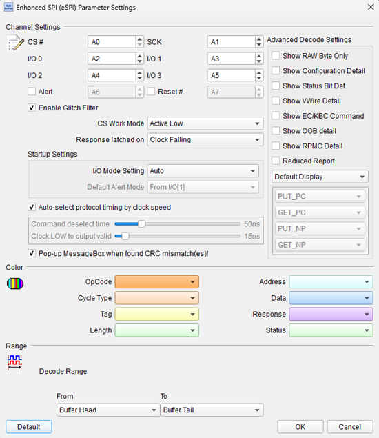
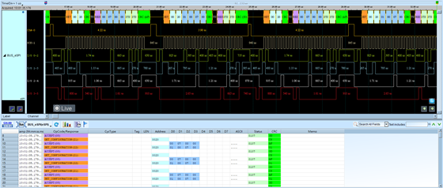

# eSPI (Enhanced Serial Peripheral Interface)

## Decode Settings
<figure markdown>
  
  <figcaption>Decode Settings</figcaption>
</figure>

## Example
<figure markdown>
  
  <figcaption>Decode Example</figcaption>
</figure>

## What is eSPI?

### Overview

eSPI (Enhanced Serial Peripheral Interface) is a bus interface developed by Intel to serve as the successor to the Low Pin Count (LPC) bus for connecting embedded controllers, BMCs (Baseboard Management Controllers), Super I/O chips, and other low-bandwidth peripheral devices to the Platform Controller Hub (PCH) in modern computer systems. Introduced as an evolution beyond traditional SPI and LPC interfaces, eSPI significantly reduces pin count and physical footprint while providing enhanced capabilities including tunneling of multiple legacy interfaces, improved power management, and increased bandwidth compared to its predecessors.

The motivation for eSPI stems from the ongoing miniaturization of computer systems, particularly in laptops, tablets, and compact form factor devices where board space and connector pins are at a premium. LPC bus, introduced in the late 1990s, required substantial pin count (7 data pins plus control signals) and lacked the bandwidth and features needed for modern system management functions. eSPI addresses these limitations with a compact 4-wire serial interface capable of tunneling multiple communication channels—including legacy LPC cycles, Out-of-Band (OOB) management, flash access, GPIO, and UART—over a single physical link.

### Standardization and Versions

The eSPI specification is maintained by Intel as an open industry standard. The latest specification is **Revision 1.6 (March 2025)**, which covers both client and server platforms. Previous significant versions include Revision 1.5 (May 2022) and earlier iterations. The specification is widely adopted across Intel chipsets including the latest 800 Series PCH and is supported by numerous embedded controller and peripheral vendors.

## Technical Architecture

### Physical Interface

**Signal Lines:**
- **ESPI_CS#**: Chip Select (active low)
- **ESPI_CLK**: Clock signal (master-generated)
- **ESPI_IO[0]**: Data line 0 (bidirectional)
- **ESPI_IO[1]**: Data line 1 (bidirectional)
- **ESPI_RESET#**: Reset signal (optional)
- **ESPI_ALERT#**: Alert signal from slave to master (optional)

eSPI can operate in single, dual, or quad I/O modes:
- **Single I/O**: Uses only IO[0] for data transfer
- **Dual I/O**: Uses IO[0] and IO[1] simultaneously, doubling throughput
- **Quad I/O**: Future expansion capability using four data lines

**Clock Frequency:**
- Supports multiple frequencies: 20 MHz, 25 MHz, 33 MHz, 50 MHz, 66 MHz
- Negotiated during initialization based on device capabilities
- Higher frequencies enable greater throughput for flash access and other high-bandwidth operations

### Operational Modes

eSPI operates in a master-slave configuration where the PCH (Platform Controller Hub) acts as the master, controlling all bus transactions, while peripherals (embedded controllers, BMC, Super I/O) function as slaves.

## Channel Architecture

eSPI virtualizes multiple communication types into separate logical channels sharing the same physical wires:

### Channel 0: Peripheral Channel

**Purpose:** Tunnels legacy LPC I/O and memory cycles

**Functions:**
- I/O read/write cycles (legacy PC I/O space, e.g., 0x80 POST codes, keyboard controller 0x60/0x64)
- Memory read/write cycles
- Bus master cycles (DMA)
- Supports legacy peripherals without requiring separate LPC bus

**Use Cases:**
- Keyboard and mouse controller (8042)
- POST code (Port 80) logging
- BIOS/firmware communication with embedded controller
- Legacy hardware emulation

### Channel 1: Virtual Wire Channel

**Purpose:** Replaces individual wires for system control signals

**Signals Virtualized:**
- **CLKRUN#, SMI#, SCI#**: Power management and interrupt signals
- **RESET#, PLTRST#, PCIRST#**: Reset control
- **S3, S4, S5**: System power states
- **HOST_C10, PCH_SLP_SX**: Sleep state indicators
- **LPC_PD_N, SUSWARN#, SUSACK#**: Suspend/resume coordination

**Benefits:**
- Eliminates dedicated physical pins for each signal
- Reduces connector pin count dramatically
- Maintains compatibility with legacy system management functions

### Channel 2: Out-of-Band (OOB) Channel

**Purpose:** System management and monitoring independent of main processor

**Capabilities:**
- **BMC Communication**: Connects to Baseboard Management Controllers
- **SMBUS/I2C Tunneling**: Provides access to platform SMBUS devices
- **Platform Monitoring**: Temperature, voltage, fan control
- **Remote Management**: IPMI, Redfish, and other out-of-band management protocols

**Applications:**
- Server management interfaces
- Remote KVM (Keyboard-Video-Mouse)
- Out-of-band firmware updates
- Platform health monitoring

### Channel 3: Flash Access Channel

**Purpose:** Shared access to SPI flash memory

**Features:**
- **Read Access**: Allows slaves to read from SPI flash (for firmware, configuration data)
- **Write/Erase**: Coordinated flash programming operations
- **Flash Sharing**: Multiple devices can access flash with proper arbitration
- **Transaction Types**: Read, write, erase operations

**Benefits:**
- Eliminates need for separate flash chips for each device
- Reduces BOM cost and board complexity
- Centralized firmware storage

## Command and Response Protocol

eSPI transactions follow a structured command-response format:

1. **Command Phase**: Master transmits command opcode, address, length
2. **Turn-Around Time**: Brief period for bus direction reversal
3. **Response Phase**: Slave responds with status and data (if applicable)
4. **Data Phase**: Multi-byte data transfer for reads or writes

**Transaction Types:**
- **Short Transactions**: Single-cycle operations for virtual wires, simple I/O
- **Long Transactions**: Multi-byte transfers for memory, flash, large data blocks
- **Posted Transactions**: No response required, optimizes throughput
- **Non-Posted Transactions**: Response required for confirmation

## Power Management

eSPI supports sophisticated power management:

**Active Power Management:**
- Clock gating when idle
- Dynamic frequency scaling based on traffic
- Per-channel power gating

**Low-Power States:**
- **Suspend**: All channels enter low-power mode
- **Deep Sleep**: Minimal power consumption while maintaining context
- **Wake Events**: Alert# signal allows slaves to wake system

## Decoder Configuration

When configuring an eSPI decoder:

- **Signal Assignment**: Specify logic analyzer channels for CS#, CLK, IO[0], IO[1], RESET#, ALERT#
- **Clock Frequency**: Set expected clock rate (20-66 MHz)
- **I/O Mode**: Configure for single, dual, or quad I/O operation
- **Channel Filtering**: Select which channels (Peripheral, Virtual Wire, OOB, Flash) to decode
- **Command Interpretation**: Enable decoding of command opcodes, addresses, and data payloads
- **Timing Verification**: Check setup/hold times and timing compliance

## Common Applications

eSPI is ubiquitous in modern computing platforms:

- **Laptops and Ultrabooks**: Connecting embedded controllers for keyboard, battery management
- **Desktop Motherboards**: System management and monitoring
- **Servers**: BMC communication, out-of-band management
- **Industrial PCs**: Embedded controller integration
- **IoT Gateways**: System management in compact form factors
- **Chromebooks**: Embedded controller and security chip communication
- **Tablets and Convertibles**: Power and thermal management

## Advantages Over LPC

- **Reduced Pin Count**: 4-6 pins vs. 10+ for LPC
- **Higher Bandwidth**: Up to 66 MHz vs. LPC's 33 MHz, with dual/quad I/O multipliers
- **Multiple Channels**: Virtualized channels replace separate physical buses
- **Better Power Management**: Fine-grained power control
- **Scalability**: Supports future enhancements via firmware
- **Lower Cost**: Fewer pins reduce connector and routing costs

## Reference

- [Intel eSPI Interface Base Specification Rev. 1.6 (March 2025)](https://cdrdv2-public.intel.com/841685/841685_ESPI_IBS_TS_Rev_1_6.pdf)
- [Intel eSPI Specification Rev. 1.5 (May 2022)](https://downloadmirror.intel.com/27055/327432%20espi_base_specification%20R1-5.pdf)
- [Intel 800 Series PCH eSPI Interface](https://edc.intel.com/content/www/us/en/design/products/platforms/details/arrow-lake-s/800-series-chipset-family-platform-controller-hub-pch-datasheet-volume/003/enhanced-serial-peripheral-interface-espi)
- [Intel: eSPI Interface Base Specification Support](https://www.intel.com/content/www/us/en/support/articles/000020952/software/chipset-software.html)
