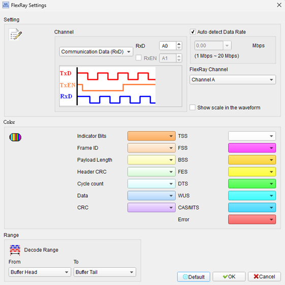
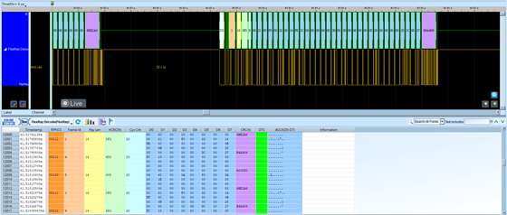

# FlexRay

## Decode Settings
<figure markdown>
  
  <figcaption>Decode Settings</figcaption>
</figure>

## Example
<figure markdown>
  
  <figcaption>Decode Example</figcaption>
</figure>

## What is FlexRay?

### Overview

FlexRay is a high-speed, deterministic automotive network communications protocol designed for safety-critical and time-sensitive applications in vehicles. Developed by the FlexRay Consortium—a partnership of leading automotive manufacturers and suppliers including BMW, DaimlerChrysler, General Motors, Volkswagen, Robert Bosch, and others—FlexRay addresses the limitations of CAN and LIN bus systems by providing significantly higher bandwidth (up to 10 Mbit/s), deterministic communication guarantees, and built-in fault tolerance through redundant channels.

The need for FlexRay emerged as automotive systems evolved from simple electronic control units to complex, interconnected safety-critical systems. Modern vehicles employ drive-by-wire technologies (electronic throttle, steering, braking) and advanced driver assistance systems (ADAS) that demand reliable, predictable communication with strict timing requirements that CAN's 1 Mbit/s maximum speed and event-triggered architecture cannot satisfy. Flex Ray's time-triggered protocol ensures that critical messages arrive within precisely defined time windows—a requirement for systems where timing violations could compromise safety.

### Standardization

The FlexRay Consortium released Protocol Specification V2.1 Rev. A as the definitive standard before disbanding in December 2009, having accomplished its mission of establishing the protocol. The specifications were subsequently adopted as ISO 17458 (parts 1-5), providing international recognition:

- **ISO 17458-1**: Physical layer specification
- **ISO 17458-2**: Data link layer specification
- **ISO 17458-3**: Transport protocol
- **ISO 17458-4**: System design recommendations
- **ISO 17458-5**: Conformance test plan

## Technical Specifications

### Physical Layer

**Topology Support:**
- **Bus Topology**: Traditional multi-drop configuration, similar to CAN
- **Star Topology**: Hub-based architecture for better signal quality and fault isolation
- **Hybrid Topology**: Combination of bus and star segments

**Data Rates:**
- **2.5 Mbit/s**: Common configuration per channel
- **5 Mbit/s**: Higher-speed operation per channel
- **Up to 10 Mbit/s**: Combined bandwidth with dual-channel operation

**Signal Characteristics:**
- **Differential Signaling**: Similar to CAN, using twisted-pair cabling
- **Two-Channel Architecture**: Channel A and Channel B for redundancy
- **Bus Levels**: BP (Bus Power), Idle, and Data states
- **Shielded Twisted Pair**: Required for EMI immunity in automotive environment

### Communication Cycle Structure

FlexRay organizes communication in repeating cycles, each typically 5 milliseconds (configurable from 1-16 ms):

**Static Segment:**
- **Time-Division Multiple Access (TDMA)**: Each node has pre-allocated time slots
- **Deterministic Communication**: Guaranteed message delivery times
- **Fixed Slot Length**: All static slots have identical duration
- **Bounded Latency**: Predictable worst-case timing
- **Safety-Critical Data**: Sensor data, actuator commands, control loops

**Dynamic Segment:**
- **Flexible Priority Arbitration**: Mini-slotting with priority-based access
- **Variable Message Length**: Adaptive to actual needs
- **Event-Triggered**: Responds to asynchronous events
- **Lower Priority**: Diagnostic data, status updates, configuration

**Symbol Window:**
- **Collision Avoidance Symbol (CAS)**: Used during startup to coordinate network initialization
- **Media Test Symbol (MTS)**: Verifies physical layer integrity
- **Wake-Up Symbol (WUS)**: Initiates network wake from sleep

**Network Idle Time (NIT):**
- **Clock Synchronization**: Nodes synchronize their local clocks
- **No Active Communication**: Allows settling time for next cycle
- **Maintenance Window**: Background operations, diagnostics

## Dual-Channel Redundancy

FlexRay's defining feature is its two independent physical channels:

**Redundancy Modes:**
- **Dual-Channel Mode**: Transmit same data on both channels for maximum reliability
- **Single-Channel Mode**: Use each channel independently, doubling effective bandwidth
- **Mixed Mode**: Critical messages on both channels, non-critical on one channel

**Fault Tolerance:**
- If one channel fails completely, communication continues on the remaining channel
- Automatic degradation handling without manual intervention
- Maintains essential vehicle functions even with channel failures
- Satisfies automotive safety standards (ISO 26262 functional safety)

## Message Frame Structure

**Frame Components:**
- **Header Segment**: Contains frame ID, payload length, CRC, cycle count
- **Payload Segment**: 0-254 bytes of actual data
- **Trailer Segment**: 24-bit CRC for error detection

**Frame ID**: Determines slot assignment in static segment or priority in dynamic segment

**Cycle Counter**: 6-bit counter indicating communication cycle number, enables synchronization

## Clock Synchronization

FlexRay employs a distributed clock synchronization algorithm:

**Synchronization Mechanism:**
- All nodes participate in global time base maintenance
- Correction offsets calculated from multiple sync frames
- Fault-tolerant against failing nodes
- Maintains microsecond-level precision across the network

**Benefits:**
- Enables time-triggered communication
- Coordinates distributed real-time operations
- Supports deterministic behavior
- Critical for drive-by-wire safety

## Startup and Wake-Up

**Startup Process:**
- **Coldstart Nodes**: Designated nodes that can initiate network startup (typically 2 for redundancy)
- **Coldstart Listen**: Wait for startup frames from other coldstart nodes
- **Integration**: Other nodes join after detecting stable communication
- **Synchronization**: Align to network timing after integration

**Wakeup:**
- Any node can send Wake-Up Pattern on the bus
- Sleeping nodes detect pattern and enter active state
- Coordinated startup follows
- Enables power management in vehicles

## Decoder Configuration

When configuring a FlexRay decoder:

- **Channel Selection**: Specify logic analyzer channels for Channel A and Channel B differential pairs (Flexray_BP, Flexray_BM)
- **Bit Rate**: Set to 2.5, 5, or 10 Mbit/s based on system configuration
- **Cluster Parameters**: Configure cycle length, static slot count, slot duration
- **Frame ID Filtering**: Select specific frame IDs to decode
- **Segment Display**: Choose to show static, dynamic, or both segments
- **Error Detection**: Enable CRC verification and error frame identification
- **Clock Sync Analysis**: Display synchronization corrections and timing deviations

## Common Applications

FlexRay is deployed in safety-critical automotive systems:

**Drive-by-Wire Systems:**
- **Steer-by-Wire**: Electronic steering without mechanical backup
- **Brake-by-Wire**: Electronic braking systems (regenerative braking in EVs)
- **Throttle-by-Wire**: Electronic throttle control

**Active Safety:**
- **Adaptive Cruise Control**: Radar-based speed and distance management
- **Lane Keeping Assist**: Automated steering corrections
- **Emergency Braking**: Autonomous collision avoidance
- **Electronic Stability Control**: Advanced ESC with faster response

**Chassis and Suspension:**
- **Active Suspension**: Real-time damping adjustment (e.g., air suspension)
- **All-Wheel-Drive Control**: Torque vectoring and distribution
- **Active Roll Stabilization**: Dynamic anti-roll systems

**Production Vehicles:**
- **BMW X5 (E70) 2006**: First production deployment
- **BMW 7 Series (F01) 2008**: Comprehensive FlexRay network
- **Audi A8**: Multiple generations with FlexRay
- **Mercedes-Benz S-Class**: Advanced safety systems
- Many premium vehicles from European manufacturers

## Advantages

- **High Bandwidth**: 10 Mbit/s combined throughput
- **Determinism**: Guaranteed message timing in static segment
- **Fault Tolerance**: Dual-channel redundancy
- **Scalability**: Supports up to 74 nodes per network
- **Safety-Certified**: Meets ISO 26262 functional safety requirements
- **Flexibility**: Mix of time-triggered and event-triggered communication
- **Global Time Base**: Synchronized clock for distributed control

## Challenges

Despite advantages, FlexRay has faced adoption challenges:

- **Complexity**: More difficult to design and debug than CAN
- **Cost**: Higher component and development costs
- **Limited Adoption**: Primarily in premium vehicles
- **Competition**: Automotive Ethernet gaining traction for future vehicles
- **Tooling**: Specialized development and diagnostic tools required

## Reference

- [FlexRay Communication System Protocol Specification V2.1](https://www.plus.ac.at/wp-content/uploads/2021/02/FlexRayCommunicationSystem.pdf)
- [FlexRay Protocol Specification V2.1 Rev.A (Scribd)](https://www.scribd.com/document/36667622/FlexRay-Protocol-Specification-V2-1-Rev-A)
- [Wikipedia: FlexRay](https://en.wikipedia.org/wiki/FlexRay)
- [NXP: Network for the Way Forward - FlexRay](https://nxp.com/docs/en/supporting-information/NETWRKFRWAY.pdf)
- [ISO 17458-2:2013: Data Link Layer Specification](https://www.iso.org/standard/59806.html)
