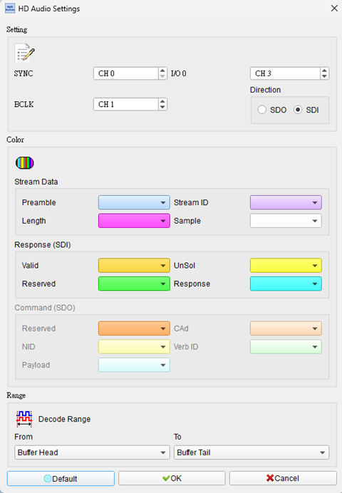
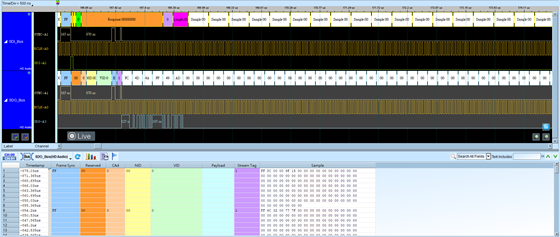

# HD Audio (High Definition Audio)

## Decode Settings
<figure markdown>
  
  <figcaption>Decode Settings</figcaption>
</figure>

## Example
<figure markdown>
  
  <figcaption>Decode Example</figcaption>
</figure>

## What is HD Audio?

### Overview

Intel High Definition Audio (HD Audio), codenamed "Azalia" during development, is a specification for audio subsystems in personal computers that defines both the hardware interface and software architecture for delivering high-quality digital audio. Released on April 15, 2004, HD Audio succeeded the aging AC'97 (Audio Codec '97) standard, providing dramatically improved audio quality, greater flexibility, more channels, higher sample rates, and a more efficient architecture suited to modern computing requirements. The specification enables everything from basic stereo playback to professional-grade multi-channel audio recording and playback within mainstream PCs.

Where AC'97 was limited to 20-bit/48kHz stereo with a relatively inflexible parallel bus interface, HD Audio supports up to 32-bit/192kHz audio across up to 15 simultaneous input and 15 output streams, with each stream capable of handling up to 16 channels. This massive capability increase enables applications ranging from simple stereo music playback and VoIP calls to professional digital audio workstation (DAW) software, multi-channel home theater systems, and sophisticated voice recognition systems—all using standardized, manufacturer-independent drivers.

### Architecture Philosophy

HD Audio represents a fundamental architectural shift from AC'97:

**AC'97 Limitations:**
- Fixed parallel bus (AC-Link) requiring many pins
- Hardcoded codec functions, limited extensibility
- Vendor-specific drivers required for each codec
- Single stereo input/output with basic mixing
- Limited to 48 kHz sample rate
- No provision for high-impedance headphones or power amplifiers

**HD Audio Improvements:**
- Serial link (HD Audio Link) with fewer pins and higher bandwidth
- Discoverable codecs with programmable function groups
- Universal Audio Architecture (UAA) allows generic OS drivers
- Multiple independent audio streams with flexible routing
- Sample rates from 6 kHz to 192 kHz
- Support for high-quality DACs/ADCs, power amplifiers, S/PDIF, HDMI audio

## Technical Specifications

### HD Audio Link Interface

**Physical Layer:**
- **Serial Data Out (SDO)**: Data from controller to codec(s), 48 Mbps
- **Serial Data In (SDI)**: Data from codec(s) to controller, 24 Mbps per SDI line
- **Bit Clock (BCLK)**: 24 MHz clock signal
- **Frame Sync (SYNC)**: Frame synchronization at 48 kHz
- **Reset Signal**: Codec reset control

**Multiple SDI Support:**
The specification allows up to 15 SDI lines, enabling multiple codecs to connect to a single controller without multiplexing delays—critical for applications requiring many simultaneous audio channels.

### Stream Capabilities

**Input Streams:**
- Up to 15 independent input streams
- Each stream: Mono to 16 channels
- Formats: PCM (6-192 kHz, 8-32 bit), Float32, AC-3
- Direct Memory Access (DMA) for CPU efficiency

**Output Streams:**
- Up to 15 independent output streams
- Each stream: Mono to 16 channels
- Same flexible format support as inputs
- Hardware mixing and routing

**Bidirectional Streams:**
- Certain streams can be configured as bidirectional
- Useful for loop-back testing and monitoring

### Codec Discovery and Configuration

HD Audio codecs are discoverable and programmable:

**Verb-Based Control:**
- Commands (verbs) sent to codec nodes to configure functions
- Standard verb set for common operations
- Vendor-specific verbs for extended features

**Function Groups:**
- **Audio Function Group (AFG)**: Handles audio I/O, processing, routing
- **Modem Function Group (MFG)**: For integrated modem functionality
- **Vendor-Specific Groups**: Custom functionality

**Widgets (Nodes):**
Each codec contains interconnected widgets representing audio components:
- **Audio Output/Input**: DAC/ADC widgets
- **Pin Complex**: Physical connectors (jacks, internal connections)
- **Mixer**: Combines multiple audio sources
- **Selector**: Switches between sources
- **Power**: Power management controls
- **Volume/Mute**: Gain and mute controls

The controller discovers the codec's widget topology at startup and configures routing according to application needs and user preferences.

### Supported Audio Formats

**PCM Formats:**
- Sample Rates: 6, 8, 11.025, 16, 22.05, 32, 44.1, 48, 88.2, 96, 176.4, 192 kHz
- Bit Depths: 8, 16, 20, 24, 32 bits
- Channels: Mono, Stereo, 2.1, 4.0, 4.1, 5.1, 7.1, and custom multi-channel configurations

**Compressed Formats:**
- AC-3 (Dolby Digital) pass-through for home theater applications
- DTS pass-through
- Other compressed audio via software encoding/decoding

**Floating Point:**
- 32-bit floating-point PCM for professional audio applications

## Multi-Stream Architecture

HD Audio's multi-stream capability enables sophisticated audio scenarios:

**Simultaneous Operations:**
- Play music while recording a podcast
- System sounds mixed with game audio and VoIP
- Multi-room audio with independent streams to different outputs
- Professional recording with multiple microphone inputs processed separately

**DMA Engines:**
Each stream has a dedicated DMA engine that:
- Transfers audio data between system memory and codec without CPU intervention
- Reduces CPU load dramatically compared to AC'97
- Enables lower latency audio processing
- Supports circular buffers for continuous streaming

## Power Management

HD Audio includes comprehensive power management:

**Codec Power States:**
- **D0**: Fully On
- **D1**: Low Power, reduced functionality
- **D2**: Deeper sleep, longer wake time
- **D3**: Powered down, maximum power savings

**Node-Level Power:**
Individual widgets can be powered down when not in use, minimizing power consumption while maintaining active audio paths.

**Controller Power States:**
The controller implements standard PCI Express power management, coordinating with system-wide power states (S0-S5).

## Universal Audio Architecture (UAA)

Microsoft's UAA driver model for Windows Vista and later leverages HD Audio's standardized architecture:

**Class Drivers:**
- Generic HD Audio driver works with any compliant codec
- No vendor-specific drivers needed for basic functionality
- Automatic codec discovery and configuration
- Reduced driver development burden for manufacturers

**Enhanced Functionality:**
- Vendor drivers can still provide advanced features
- Coexist with class drivers
- Add vendor-specific extensions (e.g., audio effects, EQ, virtual surround)

## Decoder Configuration

When configuring an HD Audio decoder:

- **Signal Assignment**: Specify logic analyzer channels for SDO, SDI, BCLK, SYNC, RESET
- **Clock Rate**: Set to 24 MHz for BCLK
- **Frame Rate**: 48 kHz for SYNC
- **Stream Selection**: Choose which streams (input/output) to decode
- **Data Format**: Configure expected PCM format (sample rate, bit depth, channels)
- **Verb Decoding**: Enable command/response interpretation for verb transactions
- **Widget Map**: Display codec topology if known

## Common Applications

HD Audio is ubiquitous in modern computing:

**Consumer PCs:**
- Desktop motherboards (integrated audio)
- Laptop and ultrabook audio subsystems
- All-in-one PCs
- Home theater PC (HTPC) audio outputs

**Professional Audio:**
- Digital audio workstations (DAWs)
- Podcast recording and editing
- Music production
- Voice-over and dubbing

**Gaming:**
- High-quality game audio
- Positional 3D audio
- Voice chat with simultaneous game sound

**Communication:**
- VoIP (Skype, Teams, Zoom)
- Conferencing systems
- Streaming and content creation

**Specialized:**
- Medical devices (hearing diagnostics)
- Kiosks and digital signage
- Automotive infotainment (some implementations)
- Industrial HMI systems with audio feedback

## Advantages Over AC'97

- **Higher Quality**: 24/32-bit, 192 kHz vs. 20-bit, 48 kHz
- **More Channels**: Up to 16 per stream vs. fixed stereo
- **Multiple Streams**: 15 in + 15 out vs. single stereo path
- **Lower CPU Usage**: Hardware DMA vs. software polling
- **Flexible Routing**: Programmable audio paths vs. fixed mixer
- **Better Power Management**: Fine-grained control vs. on/off
- **Standardized Drivers**: UAA class drivers vs. vendor-specific
- **Ext ensibility**: Discoverable codecs vs. fixed functionality
- **Higher Bandwidth**: 48/24 Mbps vs. 12 Mbps theoretical

## Reference

- [Intel High Definition Audio Specification](https://www.intel.com/content/www/us/en/standards/high-definition-audio-specification.html)
- [Intel 800 Series PCH HD Audio Interface](https://edc.intel.com/content/www/us/en/design/products/platforms/details/arrow-lake-s/800-series-chipset-family-platform-controller-hub-pch-datasheet-volume/003/intel-high-definition-audio-interface-capabilities)
- [Intel HD Audio Multi-Stream Specification](https://www.intel.la/content/dam/www/public/us/en/documents/specification-updates/high-definition-audio-multi-stream.pdf)
- [Intel: Electrical Characteristics of HD Audio](https://www.intel.com/content/www/us/en/developer/articles/technical/electrical-characteristics-of-the-intel-high-definition-audio-specification.html)
- [Grokipedia: Intel High Definition Audio](https://grokipedia.com/page/Intel_High_Definition_Audio)
