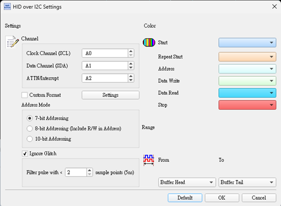
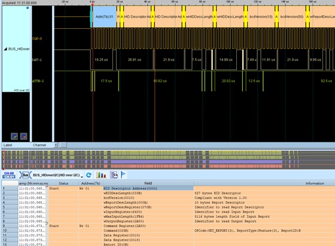

# HID over I2C

## Decode Settings
<figure markdown>
  
  <figcaption>Decode Settings</figcaption>
</figure>

## Example
<figure markdown>
  
  <figcaption>Decode Example</figcaption>
</figure>

## What is HID over I2C?

### Overview

HID over I2C is a protocol specification that extends the Human Interface Device (HID) standard—originally designed for USB—to operate over the I²C (Inter-Integrated Circuit) bus. Developed by Microsoft and introduced with Windows 8, this protocol enables touch screens, touchpads, keyboards, mice, sensors, and other input devices to communicate with host systems using the ubiquitous I²C interface found in virtually all modern SoCs (System-on-Chips). By leveraging I²C, device manufacturers can integrate HID-class peripherals directly into embedded systems, tablets, laptops, and smartphones without requiring USB infrastructure, reducing pin count, cost, and power consumption.

The protocol provides a standardized way for operating systems to discover, enumerate, and communicate with HID devices over I²C, maintaining the same logical model and report descriptors used in USB HID. Windows provides inbox driver support (HIDI2C.sys), eliminating the need for manufacturers to develop custom drivers for standard HID devices—a significant advantage for faster time-to-market and improved reliability. The specification supports the full range of HID device classes including pointing devices, keyboards, game controllers, and sensor collections.

### Key Features

- **Bus Agnostic**: HID layer abstracts underlying transport (I²C vs. USB)
- **Inbox Drivers**: Windows HIDI2C.sys provides native support
- **Power Management**: Integrated support for connected standby and modern power states
- **Interrupt-Driven**: Uses GPIO interrupt for efficient host notification
- **Multitouch Support**: Full support for precision touchpads and touchscreens
- **Sensors**: Accelerometers, gyroscopes, ambient light, and other HID sensors

## Protocol Architecture

### I²C Transport Layer

**Physical Interface:**
- **SDA**: Serial Data line (bidirectional)
- **SCL**: Serial Clock line (master-generated)
- **INT**: Interrupt line (GPIO) from device to host
- **Reset** (optional): Hardware reset from host to device

**I²C Addressing:**
- Device operates as I²C slave
- 7-bit I²C addressing
- Typical I²C speeds: 100 kHz (standard), 400 kHz (fast mode)
- Some implementations support 1 MHz (fast-mode plus)

### HID Layer

**Report Descriptors:**
- Same HID report descriptors as USB HID
- Defines device capabilities, input/output formats
- Parsed by HID class driver
- Enables standardized interpretation across different devices

**Reports:**
- **Input Reports**: Device to host (touch coordinates, key presses, sensor data)
- **Output Reports**: Host to device (LED states, haptic feedback commands)
- **Feature Reports**: Bidirectional configuration and status

### Register Model

HID over I²C devices expose a register-based interface:

**Descriptor Registers:**
- **HID Descriptor**: Contains device information, report descriptor length, version
- **Report Descriptor**: Full HID report descriptor data

**Data Registers:**
- **Input Register**: Contains input reports from device
- **Output Register**: Host writes output reports
- **Command Register**: Host sends commands (SET_POWER, RESET, etc.)

**Power Management Registers:**
- Device power state control
- Wake capabilities configuration

## Communication Flow

### Device Initialization

1. **Hardware Reset** (optional): Host pulses reset line
2. **HID Descriptor Read**: Host reads HID descriptor via I²C at fixed register address (0x0001)
3. **Report Descriptor Read**: Host reads complete report descriptor
4. **Enumeration**: HID class driver parses descriptors and loads appropriate functionality

### Normal Operation

**Interrupt-Driven Input:**
1. Device has input data ready (touch event, key press)
2. Device asserts INT line (GPIO interrupt to host)
3. Host receives interrupt, reads Input Register via I²C
4. Input report delivered to HID class driver
5. Application receives HID event

**Host-Initiated Communication:**
1. Host writes to Output Register (LED control, configuration)
2. Device processes command/data
3. No interrupt needed for output reports

### Power Management

**Power States:**
- **D0 (Fully On)**: Device fully operational
- **D1/D2 (Sleep)**: Reduced power with faster wake
- **D3 (Deep Sleep)**: Minimal power consumption

**Commands:**
- **SET_POWER**: Host commands device to enter specific power state
- **Wake**: Device can wake system via INT assertion

**Connected Standby:**
Windows connected standby requires specific power behaviors:
- Touch screens: Transition to D3 during standby
- Keyboards/mice: Remain in D0 to wake system
- Sensors: Application-dependent behavior

## Supported Device Types

**Pointing Devices:**
- Touchpads (precision touchpads)
- Touchscreens (single and multitouch)
- Pointing sticks
- Trackballs

**Input Devices:**
- Keyboards
- Keypads and number pads
- Game controllers
- Remote controls

**Sensors:**
- Accelerometers (3-axis)
- Gyroscopes
- Magnetometers (compasses)
- Ambient light sensors
- Proximity sensors
- Temperature sensors

**Custom HID Devices:**
- Buttons and switches
- Vendor-specific controls

## Decoder Configuration

When configuring a HID over I²C decoder:

- **I²C Channels**: Specify SDA and SCL logic analyzer channels
- **INT Signal**: Include GPIO interrupt line for complete analysis
- **I²C Address**: Set device I²C slave address (typically from datasheet)
- **Clock Speed**: Configure expected SCL frequency
- **Register Interpretation**: Enable HID-specific register decoding
- **Report Parsing**: If HID descriptor known, decode report contents
- **Power Command Display**: Show SET_POWER and other HID commands

## Common Applications

HID over I²C is widespread in modern devices:

**Laptops and Tablets:**
- Integrated touchpads (precision touchpads)
- Touchscreen controllers
- Keyboard controllers
- Ambient light sensors for automatic brightness

**Smartphones:**
- Touchscreen digitizers
- Accelerometers and gyroscopes
- Proximity sensors
- Hall effect sensors (flip cover detection)

**2-in-1 Convertibles:**
- Detachable keyboard docks
- Active pen digitizers
- Orientation sensors

**IoT and Embedded:**
- Smart home control panels
- Industrial HMI touchscreens
- Kiosk input devices
- Medical device interfaces

**Automotive:**
- Touchscreen infotainment
- Steering wheel controls
- Center console input devices

## Advantages

- **Reduced Cost**: Eliminates USB host controller requirements
- **Lower Pin Count**: I²C uses only 2 wires vs. USB's 4 (D+, D-, VBUS, GND)
- **Power Efficiency**: I²C typically consumes less power than USB
- **SoC Integration**: Leverages I²C controllers already in SoCs
- **Standardized Drivers**: Windows inbox support, no custom drivers
- **Flexible Power Management**: Fine-grained power state control
- **Proven HID Model**: Reuses mature USB HID infrastructure

## Reference

- [Microsoft: HID Over I²C Protocol Specification](https://learn.microsoft.com/en-us/previous-versions/windows/hardware/design/dn642101(v=vs.85))
- [Microsoft: Introduction to HID over I²C](https://learn.microsoft.com/en-us/windows-hardware/drivers/hid/hid-over-i2c-guide)
- [Linux Kernel: HID over I²C Device Tree Bindings](https://www.kernel.org/doc/Documentation/devicetree/bindings/input/hid-over-i2c.txt)
- [Microsoft: HID Power Management over I²C](https://learn.microsoft.com/en-us/windows-hardware/drivers/hid/power-management-over-i2c)
- [Microsoft: Touch, Input, and HID - Windows 10](https://learn.microsoft.com/en-us/previous-versions/windows/hardware/design/dn614616(v=vs.85))
