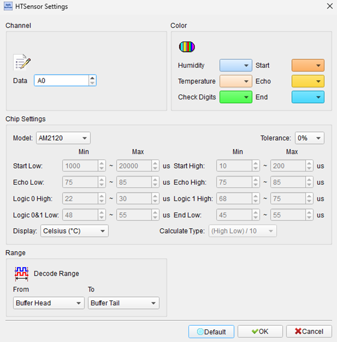
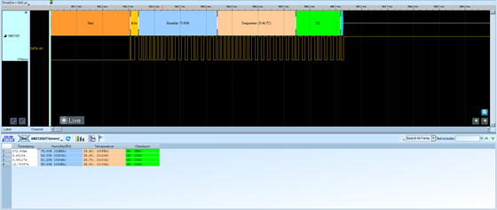

# HTSensor


## Decode Settings
<figure markdown>
  
  <figcaption>Decode Settings</figcaption>
</figure>

## Example
<figure markdown>
  
  <figcaption>Decode Example</figcaption>
</figure>

## What is HTSensor?

### Overview

HTSensor (Humidity and Temperature Sensor) refers to a category of digital sensors that measure environmental humidity and temperature, transmitting data over common digital interfaces such as I²C, SPI, or proprietary one-wire protocols. These sensors integrate MEMS (Microelectromechanical Systems) or thin-film sensing elements with analog-to-digital converters and digital logic, providing calibrated, temperature-compensated measurements directly in digital format without requiring external ADCs or complex analog signal conditioning.

Modern HTSensors from manufacturers like Sensirion, Texas Instruments, Bosch, STMicroelectronics, and Honeywell serve applications ranging from consumer electronics (smartphones, smart thermostats) to industrial monitoring (HVAC systems, data centers) and medical devices (respiratory equipment, incubators). The integration of both humidity and temperature sensing in a single package is essential because humidity measurement is inherently temperature-dependent—accurate relative humidity readings require simultaneous temperature measurement for proper compensation.

### Common Protocols

HTSensors typically communicate via:

**I²C (Most Common):**
- 2-wire interface (SDA, SCL)
- Standard or fast mode (100 kHz - 400 kHz)
- 7-bit or 10-bit addressing
- Examples: SHT3x, SI7021, HDC2080

**SPI:**
- 4-wire interface (SCLK, MOSI, MISO, CS)
- Higher speed capability
- Lower latency for time-critical applications
- Examples: Some industrial-grade sensors

**Proprietary One-Wire:**
- Single data line plus ground
- Manufacturer-specific timing
- Examples: DHT11, DHT22, AM2302

**UART/Serial:**
- Simple serial communication
- Common in modules with microcontrollers
- ASCII or binary protocols

## Sensor Parameters

### Humidity Measurement

**Relative Humidity (RH):**
- Range: 0-100% RH
- Accuracy: ±2% to ±3% RH (typical for quality sensors)
- Resolution: 8-16 bits (0.01% to 0.04% RH steps)
- Response Time: 8-30 seconds (63% of step change)

**Technologies:**
- Capacitive polymer sensors (most common)
- Resistive sensors (older, less common)

### Temperature Measurement

**Temperature Range:**
- Typical: -40°C to +125°C
- Accuracy: ±0.2°C to ±0.5°C
- Resolution: 8-16 bits (0.01°C to 0.1°C steps)
- Response Time: Faster than humidity (few seconds)

**Technologies:**
- Bandgap temperature sensors
- Thermistors (in some designs)
- Integrated with humidity sensor element

## Communication Examples

### I²C-Based HTSensors (e.g., SHT3x)

**Initialization:**
1. Power-on reset or soft reset command
2. Configure measurement mode (periodic vs. single-shot)
3. Set resolution and repeatability

**Measurement Commands:**
- **Single-Shot**: Trigger one measurement, read result
- **Periodic**: Configure automatic measurements at specified intervals
- **Clock Stretching**: Sensor holds SCL low during measurement

**Data Format:**
- Temperature: 16-bit value (T_raw)
- Humidity: 16-bit value (RH_raw)
- CRC: 8-bit checksum per value for data integrity

**Conversion:**
```
Temperature (°C) = -45 + 175 × (T_raw / 65535)
Relative Humidity (%) = 100 × (RH_raw / 65535)
```

### One-Wire HTSensors (e.g., DHT22)

**Communication Sequence:**
1. **Start Signal**: Host pulls line low for >1ms, then releases
2. **Response**: Sensor pulls line low for 80μs, then high for 80μs
3. **Data Transmission**: 40 bits total
   - 16 bits: Humidity (0.1% resolution)
   - 16 bits: Temperature (0.1°C resolution)
   - 8 bits: Checksum
4. **Bit Encoding**: Timing-based (50μs low + 26-70μs high)

## Common Sensor Models

### Sensirion SHT Series

**SHT3x:**
- I²C interface
- ±2% RH, ±0.2°C accuracy
- 2.4-5.5V supply
- Very low power

**SHT4x (Latest):**
- Improved accuracy and speed
- Heater for condensation removal
- Small 1.5×1.5mm package

### Texas Instruments HDC Series

**HDC2080:**
- I²C interface
- Integrated heater
- Low power consumption
- ±2% RH, ±0.2°C

### Silicon Labs / Skyworks Si70xx

**SI7021:**
- I²C interface
- ±3% RH, ±0.4°C
- Wide voltage range
- On-chip heater

### Bosch BME280

**BME280:**
- I²C or SPI
- Humidity + Temperature + Pressure (barometric)
- 3-in-1 environmental sensor
- Popular in IoT applications

### DHT Series (One-Wire)

**DHT11 (Budget):**
- One-wire protocol
- ±5% RH, ±2°C accuracy
- Integer values only
- Very low cost

**DHT22 / AM2302:**
- One-wire protocol
- ±2% RH, ±0.5°C
- 0.1 resolution
- Good price/performance

## Decoder Configuration

When configuring an HTSensor decoder:

**I²C Sensors:**
- **Channels**: Assign SDA and SCL
- **Address**: Set sensor I²C address (typically 0x44, 0x40, etc.)
- **Clock Speed**: 100 kHz or 400 kHz
- **Command Set**: Load sensor-specific commands
- **Data Conversion**: Apply formulas to convert raw values to physical units
- **CRC Verification**: Enable checksum validation

**One-Wire Sensors:**
- **Channel**: Assign data line
- **Protocol**: Select DHT11, DHT22, or custom
- **Timing Analysis**: Verify bit timing meets specification
- **Checksum**: Validate data integrity

## Applications

HTSensors are ubiquitous in modern devices:

**Consumer Electronics:**
- Smart thermostats (Nest, Ecobee)
- Weather stations
- Smart home hubs
- Indoor air quality monitors

**HVAC and Building Automation:**
- Temperature and humidity control
- Energy management systems
- Demand-controlled ventilation
- Data center environmental monitoring

**Industrial:**
- Process control
- Clean rooms and laboratories
- Food storage and transport monitoring
- Pharmaceutical manufacturing

**Medical:**
- Respiratory therapy equipment (CPAP, ventilators)
- Incubators
- Medical refrigeration
- Hospital environmental monitoring

**Agriculture:**
- Greenhouse automation
- Soil monitoring (combined with other sensors)
- Livestock environment control
- Grain storage monitoring

**Transportation:**
- Automotive climate control
- Cargo environmental monitoring
- Aircraft cabin systems

## Calibration and Accuracy

**Factory Calibration:**
Most digital HTSensors are factory-calibrated and provide corrected values directly.

**Field Calibration:**
- Some sensors support user calibration
- Offset adjustment for drift compensation
- Reference measurement comparison

**Accuracy Factors:**
- Temperature affects humidity reading (compensated internally)
- Aging can cause sensor drift
- Contamination degrades performance
- Condensation requires heater-equipped sensors

## Reference

For specific sensor documentation:
- Sensirion: [SHT3x Datasheet](https://www.sensirion.com)
- Texas Instruments: HDC2080 Product Page
- Silicon Labs: Si7021 Humidity and Temperature Sensor
- Bosch: BME280 Environmental Sensor
- Aosong (DHT Series): DHT11, DHT22 Datasheets
