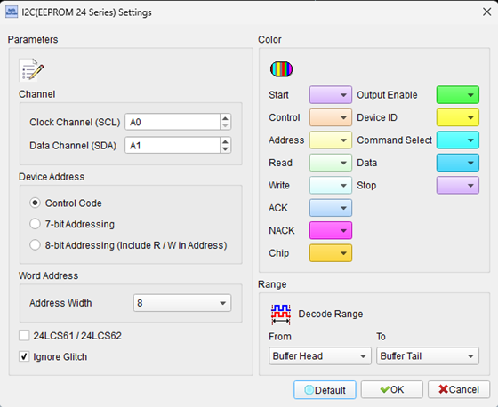
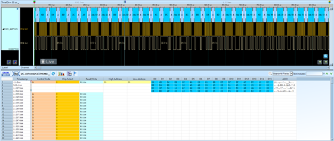

# I2C EEPROM


## Decode Settings
<figure markdown>
  
  <figcaption>Decode Settings</figcaption>
</figure>

## Example
<figure markdown>
  
  <figcaption>Decode Example</figcaption>
</figure>

## What is I2C EEPROM?

### Overview

I2C EEPROM (Electrically Erasable Programmable Read-Only Memory) devices are non-volatile memory chips that use the I²C serial interface for communication, providing persistent data storage that survives power cycling. These devices, commonly designated with part numbers like 24C02, 24LC256, AT24C128, store configuration parameters, calibration data, serial numbers, manufacturing information, and small amounts of program code or lookup tables in embedded systems. The "24C" prefix has become a near-universal naming convention, with the subsequent numbers indicating memory size (e.g., 24C02 = 2 Kbit, 24C256 = 256 Kbit).

I2C EEPROMs occupy a crucial niche in embedded system design, offering the perfect balance of non-volatility, accessibility, and cost for applications requiring small to medium amounts of persistent storage. Unlike flash memory that requires complex erase-before-write procedures and sector management, EEPROM allows byte-level or page-level writes without erasing entire blocks. The I²C interface makes these devices trivially simple to integrate—just two wires (SDA/SCL) plus power and ground—and multiple devices can coexist on the same bus using hardware address pins for unique identification.

### Industry Standards and Family

The most common I²C EEPROM families include:

- **Microchip 24 Series**: 24AA, 24LC, 24FC variants with different voltages
- **Atmel/Microchip AT24C Series**: Industry-standard compatibility
- **STMicroelectronics M24 Series**: Similar pinout and protocol
- **ON Semiconductor N24C Series**: Compatible implementations
- **Texas Instruments 24x Series**: Various capacity options

These devices maintain high levels of protocol compatibility, allowing second-sourcing and drop-in replacements across manufacturers—a testament to the standardization within the industry.

## Technical Specifications

### Memory Organization

**Capacity Ranges**:
- **1-2 Kbit**: 24C01, 24C02 (128-256 bytes): minimal configuration data
- **4-16 Kbit**: 24C04 to 24C16 (512-2048 bytes): moderate data storage
- **32-64 Kbit**: 24C32, 24C64 (4-8 KB): larger configurations, firmware parameters
- **128-512 Kbit**: 24C128 to 24C512 (16-64 KB): substantial data, small programs
- **1-2 Mbit**: 24C1024, 24C2048 (128-256 KB): extensive storage needs

**Organization**:
- Organized as bytes (8-bit words)
- Sequential addressing from 0 to (capacity - 1)
- Some larger devices use block or page organization internally

### I²C Addressing

**Device Address Structure** (7-bit addressing):
```
[1 0 1 0 A2 A1 A0 R/W]
```

**Fixed Bits**: 1010 identifies device as 24C-series EEPROM

**Address Pins** (A2, A1, A0):
- Three hardware pins set device address
- Allows up to 8 devices (addresses 0b000 to 0b111) on same bus
- Enables expanded capacity by using multiple chips

**Example Addresses**:
- A2=A1=A0=0 (all grounded): 0x50 (write), 0x51 (read)
- A2=A1=A0=1 (all high): 0x57 (write), 0x58 (read)

**Larger EEPROMs** (128 Kbit+):
Use full address space; some address pins become "don't care" or encode upper address bits for accessing beyond 64KB.

### I²C Clock Speeds

Most I²C EEPROMs support:
- **100 kHz**: Standard mode (universal compatibility)
- **400 kHz**: Fast mode (4× throughput increase)
- **1 MHz**: Fast mode plus (10× throughput, newer devices)

Selection depends on: device capability, bus capacitance, cable length, and microcontroller support.

## Read Operations

### Sequential Read

1. **Write Address**: Master writes device address + memory address
2. **Repeated Start**: Master issues repeated start condition
3. **Read Data**: Master reads data bytes sequentially
4. **Auto-Increment**: Address automatically increments after each byte
5. **Stop**: Master generates stop condition to end transfer

**Auto-Rollover**: Address wraps to 0 after reaching maximum address.

### Random Read

1. **Write Address**: Send memory address to set internal pointer
2. **Repeated Start**: Transition to read mode
3. **Read Single Byte**: Read from specified address
4. **Stop**: Terminate transaction

### Current Address Read

1. **Read**: Start reading without writing address first
2. **Continues**: From last accessed address
3. **Useful**: For sequential multi-transaction reads

## Write Operations

### Byte Write

1. **Device Address + Write**: Select device for writing
2. **Memory Address**: Send target address (1 or 2 bytes depending on capacity)
3. **Data Byte**: Send single byte to write
4. **Acknowledge**: EEPROM acknowledges
5. **Stop**: Master terminates
6. **Write Cycle**: EEPROM internally programs (4-5ms typical)

During write cycle, EEPROM will not acknowledge further commands—master must poll or wait.

### Page Write

**Multiple Bytes in One Transaction**:
- Write address followed by multiple data bytes (up to page size)
- Significantly faster than individual byte writes
- All bytes written in single internal write cycle (~4-5ms)

**Page Sizes**:
- **Smaller devices** (2-16 Kbit): 8 or 16-byte pages
- **Medium devices** (32-128 Kbit): 32-byte pages
- **Larger devices** (256-512 Kbit): 64 or 128-byte pages

**Address Auto-Increment**:
- Within page: Address increments normally
- Across page boundary: Address wraps to page start (page write only affects one page)
- Critical: Don't cross page boundaries in single write transaction

### Write Cycle Time

After receiving stop condition following write:
- **Internal Programming**: 4-5ms maximum (device-specific)
- **No Response**: EEPROM won't ACK during write cycle
- **Polling**: Master can poll device (send address, check for ACK) to detect write completion
- **Wait**: Alternatively, master waits maximum write cycle time

## Memory Characteristics

### Endurance and Retention

**Write Endurance**:
- Typically 1,000,000 write/erase cycles per byte
- Far exceeds most application requirements
- Wear-leveling algorithms can extend effective lifetime

**Data Retention**:
- Minimum 100 years at 25°C (specification)
- 40+ years at 85°C typical
- Adequate for virtually all non-archival applications

### Write Protection

**Hardware Write Protect** (WP pin):
- When tied high: All writes disabled, only reads allowed
- When tied low: Normal write operation
- Mechanical switch or jumper configuration common
- Prevents accidental data loss during field service

**Software Write Protection** (some devices):
- Block protection bits in control register
- Protects portions of memory from writes
- Requires unlock sequence to modify protected areas

## Decoder Configuration

When configuring an I²C EEPROM decoder:

- **I²C Channels**: Assign SDA and SCL logic analyzer channels
- **Device Address**: Specify base address (0x50-0x57 typical for 24C series)
- **Memory Size**: Set EEPROM capacity for correct address interpretation
- **Address Width**: Configure 1-byte or 2-byte addressing based on device size
- **Page Size**: Specify page write buffer size for transaction analysis
- **Clock Speed**: Set expected SCL frequency
- **Data Interpretation**: Display memory contents in hex, ASCII, or decoded structures
- **Write Cycle Detection**: Flag write-in-progress periods

## Common Applications

I²C EEPROMs are ubiquitous in electronics:

**Consumer Electronics**:
- TV and monitor configuration (EDID data)
- Router/modem settings and MAC addresses
- Appliance user preferences
- Set-top box configurations

**Industrial and Embedded**:
- Sensor calibration data
- Manufacturing data (serial numbers, dates)
- Configuration parameters
- Event logging and fault history

**Automotive**:
- Module identification and coding
- Mileage and service records
- Calibration data for sensors
- Radio and infotainment presets

**Telecommunications**:
- SFP/SFP+ module identification
- Device credentials and certificates
- Network configuration

**IoT and Smart Devices**:
- Device pairing information
- Usage statistics and metering
- User preferences
- Firmware version tracking

## Advantages

- **Non-Volatile**: Data persists without power
- **Simple Interface**: Two-wire I²C, easy integration
- **Low Power**: Minimal power in standby, moderate during writes
- **Byte-Level Access**: Read/write individual bytes without erase
- **Long Life**: Million write cycles, century+ retention
- **Reliable**: Mature technology with proven track record
- **Cost-Effective**: Inexpensive for small to medium capacities
- **Multiple Devices**: Up to 8 on same bus with address pins

## Limitations

- **Write Cycle Time**: 4-5ms per page write (slow compared to SRAM)
- **Capacity**: Economical only up to ~256 KB; larger needs use flash
- **Write Endurance**: Limited compared to RAM (though adequate for most applications)
- **Page Boundaries**: Must respect page alignment during writes
- **Speed**: Slower than parallel flash or modern serial flash (SPI/QSPI)

## Reference

- [Microchip 24AA024/24LC024 2K EEPROM](https://ww1.microchip.com/downloads/en/devicedoc/21210G.pdf)
- [Microchip AT24C256C 256 Kbit I²C EEPROM](https://ww1.microchip.com/downloads/en/DeviceDoc/AT24C256C-I2C-Compatible-Serial-EEPROM-256-Kbit-20006042A.pdf)
- [Microchip AT24C128C 128 Kbit I²C EEPROM](https://ww1.microchip.com/downloads/en/DeviceDoc/AT24C128C-AT24C256C-Data-Sheet-DS20006270B.pdf)
- [ON Semiconductor N24C02 2-16 Kb EEPROM](https://onsemi.com/download/data-sheet/pdf/n24c02-d.pdf)
