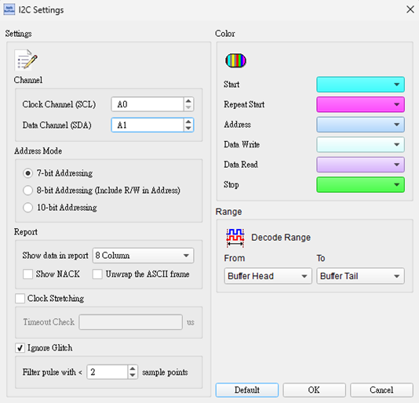
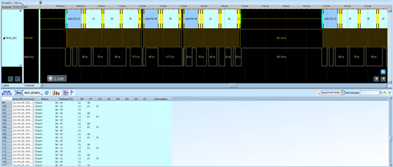

# I2C

## Decode Settings
<figure markdown>
  
  <figcaption>Decode Settings</figcaption>
</figure>

## Example
<figure markdown>
  
  <figcaption>Decode Example</figcaption>
</figure>

## What is inter-integrated circuit (I2C)?

### I2C Topology

I²C is a two-wire serial communication bus that uses a multi-master/slave architecture. 
It was developed by Philips in the 1980s as a communication specification for connecting low-speed peripherals to motherboards, 
embedded systems, or mobile devices. It is widely used in electronic circuit systems. 

I²C only uses two bidirectional signal lines, namely the clock line (SCL) and the data line (SDA). 
The signal content includes start, address, data, read/write, and so on. 
The transmission is bidirectional, and the data format can be either 8 bits or 10 bits. 
The transmission speed ranges from 100 kbit/s to 3.4 Mbit/s.

### I2C Modes

- Standard-Mode (Sm) with a bit rate up to 100 kbit/s
- Fast-Mode (Fm) with a bit rate up to 400 kbit/s
- Fast-Mode Plus (Fm+) with a bit rate up to 1 Mbit/s

### Reference

- [Wikipedia: I2C](https://en.wikipedia.org/wiki/I%C2%B2C)
- [I2C Specification Version 2.1](https://www.nxp.com/docs/en/user-guide/UM10204.pdf)
