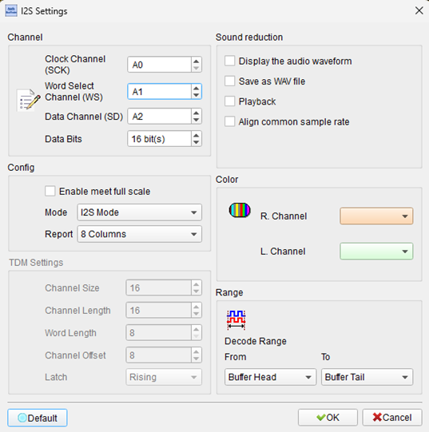
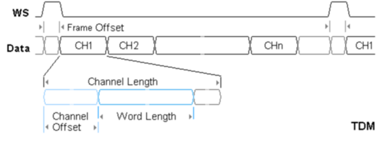
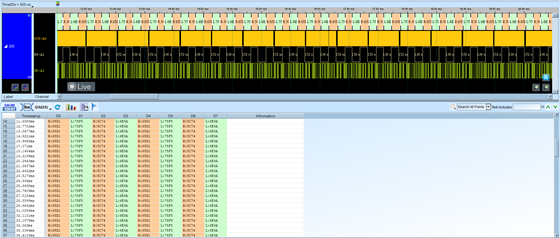

# I2S (Inter-IC Sound)

## Decode Settings
<figure markdown>
  
  <figcaption>Decode Settings</figcaption>
</figure>

## Example
<figure markdown>
  
  <figcaption>Decode Example</figcaption>
</figure>
<figure markdown>
  
  <figcaption>Decode Figure</figcaption>
</figure>

## What is I2S?

### Overview

I2S (Inter-IC Sound) is a serial bus interface standard designed by Philips Semiconductor (now NXP Semiconductors) in 1986 for connecting digital audio devices together within electronic equipment. The protocol provides a simple, efficient method for transmitting two-channel PCM (Pulse-Code Modulation) digital audio data between integrated circuits, such as from a digital signal processor to a digital-to-analog converter (DAC), or from an analog-to-digital converter (ADC) to a processor. I2S has become the de facto standard for digital audio interconnection in consumer electronics, professional audio equipment, and embedded systems.

The beauty of I2S lies in its simplicity and efficiency. Unlike parallel audio buses that require many data lines, I2S transmits multi-bit audio data serially using just three signal lines (or four with an optional master clock). This reduces pin count, simplifies PCB routing, and minimizes electromagnetic interference. The protocol separates the serial clock from the data, eliminating the need for complex clock recovery circuits, and uses a dedicated word select line to distinguish left and right audio channels—making stereo audio implementation straightforward.

### Evolution and Revisions

The I2S standard was first introduced in 1986 and underwent its first revision on June 5, 1996. The most recent update occurred on February 17, 2022, which modernized terminology from "master/slave" to "controller/target" while maintaining technical compatibility. Despite being over three decades old, I2S remains relevant due to its effectiveness, simplicity, and universal support across audio chipsets worldwide.

## Technical Specifications

### Signal Lines

**SCK (Serial Clock) / BCLK (Bit Clock)**:
- Continuous clock signal generated by the controller
- Frequency = Sample Rate × Bits Per Channel × Number of Channels
- Example: CD audio (44.1 kHz, 16-bit, stereo) = 44,100 × 16 × 2 = 1.4112 MHz
- Drives data transfer timing for both transmitter and receiver

**WS (Word Select) / LRCLK (Left-Right Clock)**:
- Indicates which audio channel is being transmitted
- WS = 0 (LOW): Left channel data
- WS = 1 (HIGH): Right channel data
- Frequency equals audio sample rate (e.g., 48 kHz for 48 kHz audio)
- Transitions once per audio frame (per stereo sample pair)

**SD (Serial Data) / SDATA**:
- Carries the actual audio sample data
- Separate SD lines often used for input (SDIN/DIN) and output (SDOUT/DOUT)
- MSB (Most Significant Bit) transmitted first
- Data formatted as two's complement for signed values

**MCLK (Master Clock): Optional**:
- Provides system clock reference, typically 256× or 512× the sample rate
- Example: For 48 kHz audio, MCLK = 12.288 MHz (256×) or 24.576 MHz (512×)
- Not required by I2S specification but commonly included
- Helps synchronize internal PLL, ADC, and DAC operations

### Data Format and Timing

**I2S Format (Philips Standard)**:
- WS changes one clock cycle before the first bit of data
- Data is delayed by one SCK cycle from WS edge
- MSB transmitted immediately after the one-cycle delay
- This timing gives receivers advanced notice of the channel change

**Left-Justified Format**:
- MSB aligned with WS transition (no delay)
- Data starts on the same clock cycle as WS change
- Common in some Japanese audio equipment

**Right-Justified Format**:
- LSB (Least Significant Bit) aligned with end of WS period
- Allows variable word lengths without changing interface timing
- MSB position varies depending on actual word length

**TDM (Time-Division Multiplexing) Mode**:
- Supports more than two channels on a single SD line
- Multiple time slots per frame (e.g., 8 channels = 8 slots)
- WS indicates start of frame; data for all channels transmitted sequentially

### Bit Depths and Sample Rates

**Supported Bit Depths**:
- 8-bit: Voice-quality audio, simple applications
- 16-bit: CD-quality audio (most common)
- 20-bit: Professional audio equipment
- 24-bit: High-resolution audio, studio recording
- 32-bit: Maximum precision, floating-point audio

**Common Sample Rates**:
- 8 kHz: Telephony, voice recording
- 16 kHz: Wideband voice
- 44.1 kHz: CD audio standard
- 48 kHz: Professional audio, video production standard
- 88.2 kHz, 96 kHz: High-resolution audio
- 176.4 kHz, 192 kHz: Ultra-high-resolution audio, mastering

## Decoder Configuration

When configuring an I2S decoder:

- **Signal Assignment**: Map logic analyzer channels to SCK, WS, SD (and optionally MCLK)
- **Sample Rate**: Specify the audio sample rate (e.g., 48 kHz)
- **Bit Depth**: Select bits per sample (16, 24, 32, etc.)
- **Format**: Choose I2S (Philips), Left-Justified, Right-Justified, or TDM
- **Channel Count**: Stereo (2) or multi-channel TDM
- **Clock Polarity**: Specify data sampling edge (typically rising edge)
- **Data Display**: Show hex values, decimal, or as audio waveform visualization

## Common Applications

I2S is found throughout the audio industry:

**Consumer Electronics**:
- Smartphones and tablets (internal audio routing)
- Digital audio players (DAPs)
- Bluetooth speakers and headphones
- Soundbars and home theater systems
- Smart speakers (Alexa, Google Home)

**Professional Audio**:
- Digital mixing consoles
- Audio interfaces for computers
- Effects processors and signal processors
- Digital audio workstations (DAW) hardware
- Studio monitors with digital inputs

**Automotive**:
- Infotainment systems
- Amplifier connections
- Hands-free communication systems
- Advanced driver assistance systems (audio alerts)

**Embedded Systems**:
- IoT devices with audio capabilities
- Voice-controlled appliances
- Security systems with audio
- Intercom systems
- Medical devices (hearing aids, diagnostic equipment)

## Advantages

- **Simple Implementation**: Only 3-4 signal lines required
- **Flexible**: Supports various bit depths and sample rates
- **Synchronous**: Clock and data transmitted together, no clock recovery needed
- **Low EMI**: Serial transmission reduces electromagnetic interference vs. parallel
- **Widely Supported**: Virtually all audio ICs support I2S
- **Cost Effective**: Minimal hardware overhead
- **Scalable**: TDM extensions support many channels

## Limitations

- **Short Distance**: Designed for on-board connections, not long cables
- **No Error Detection**: No built-in CRC or parity checking
- **No Flow Control**: No mechanism to pause or throttle data
- **Cable Sensitivity**: Prone to noise on cables longer than ~30cm without proper design
- **Clock Jitter**: Sensitive to clock timing variations affecting audio quality

## Reference

- [Wikipedia: I²S](https://en.wikipedia.org/wiki/I%C2%B2S)
- [Philips I2S Bus Specification](https://www.datasheet.support/pdfviewer?url=https%3A%2F%2Fpdf.datasheet.support%2F6338f6ad%2Fsemiconductors.philips.com%2FI2S%2520BUS%2520SPECIFICATION.pdf)
- [Infineon: Inter-IC Sound Bus (I2S)](https://www.infineon.com/dgdl/Infineon-Component_I2S_V2.30-Software%20Module%20Datasheets-v02_07-EN.pdf)
- [NXP: I²S Specification and Applications](https://www.nxp.com)
