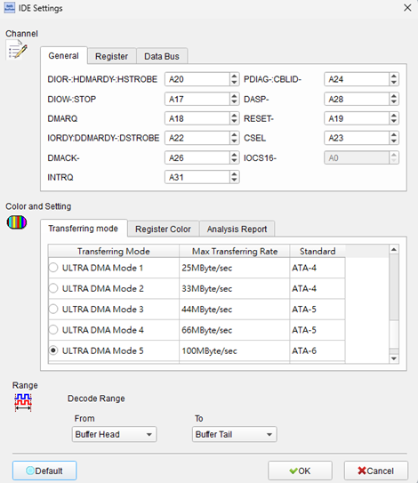
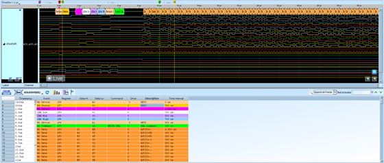

# IDE (Integrated Drive Electronics)

## Decode Settings
<figure markdown>
  
  <figcaption>Decode Settings</figcaption>
</figure>

## Example
<figure markdown>
  
  <figcaption>Decode Example</figcaption>
</figure>

## What is IDE?

IDE (Integrated Drive Electronics), formally known as ATA (AT Attachment) or PATA (Parallel ATA), is a parallel bus interface standard designed for connecting mass storage devices such as hard disk drives, optical drives, and tape drives to computer motherboards. Developed in 1986 by Western Digital and standardized through ANSI committees in the 1990s, IDE revolutionized personal computing by integrating drive controller electronics directly onto the drive itself, eliminating the need for separate controller cards. The name "AT Attachment" derives from its initial design for IBM's PC/AT computer, while "Integrated Drive Electronics" reflects the embedded controller architecture that simplified system integration and reduced costs.

The IDE/ATA interface uses a 40-pin or 80-conductor ribbon cable to transmit data in 16-bit parallel words, with additional pins dedicated to addressing, control signals, power, and ground. The protocol evolved through seven major revisions (ATA-1 through ATA-7), progressively increasing data transfer rates from 8.3 MB/s (PIO Mode 0) to 133 MB/s (Ultra DMA Mode 6), while introducing enhanced features like DMA transfers, 48-bit logical block addressing (LBA48) for drives exceeding 137 GB, and S.M.A.R.T. (Self-Monitoring, Analysis and Reporting Technology) for predictive failure analysis. Each IDE channel supports two devices configured as master and slave through jumper settings or cable select mechanisms.

IDE/PATA dominated the personal computer storage market from the late 1980s through the early 2000s. However, it has been largely superseded by Serial ATA (SATA) since 2003, which offers higher performance, thinner cables, hot-swapping capabilities, and simpler device configuration. Despite obsolescence in consumer systems, IDE remains relevant for legacy system maintenance, embedded applications, vintage computing restoration, and specialized industrial equipment where existing IDE-based hardware continues operational service.

## Technical Specifications

### Physical Interface

**Connector Type:**
- **40-pin dual inline**: Standard connector on both motherboard and drive
- **Pin spacing**: 2.54mm (0.1") pitch
- **Cable types**: 40-conductor (ATA-1 through ATA-4) or 80-conductor with 40 additional ground wires (Ultra ATA/66 and higher)
- **Maximum cable length**: 450mm (18 inches) for 40-conductor, 450-900mm for 80-conductor

**Signal Lines:**
- **DD[15:0]**: 16-bit bidirectional data bus
- **DA[2:0]**: 3-bit address/register select lines
- **/RESET**: Hardware reset signal
- **/DIOW**: Data I/O Write strobe (active low)
- **/DIOR**: Data I/O Read strobe (active low)
- **IORDY**: I/O Channel Ready signal for wait states
- **INTRQ**: Interrupt Request from drive to host
- **/DMACK**: DMA Acknowledge (active low)
- **DMARQ**: DMA Request from drive
- **/CS0, /CS1**: Chip Select signals for register access
- **/IOCS16**: 16-bit I/O indication
- **PDIAG**: Passed Diagnostics signal
- **GND**: Multiple ground pins
- **VCC**: +5V power supply

### Data Transfer Modes and Rates

**PIO (Programmed I/O) Modes:**
- **PIO Mode 0**: 3.3 MB/s (600ns cycle time)
- **PIO Mode 1**: 5.2 MB/s (383ns cycle time)
- **PIO Mode 2**: 8.3 MB/s (240ns cycle time)
- **PIO Mode 3**: 11.1 MB/s (180ns cycle time)
- **PIO Mode 4**: 16.7 MB/s (120ns cycle time)

**Multiword DMA Modes:**
- **DMA Mode 0**: 4.2 MB/s
- **DMA Mode 1**: 13.3 MB/s
- **DMA Mode 2**: 16.7 MB/s

**Ultra DMA Modes (using both clock edges):**
- **Ultra DMA 0**: 16.7 MB/s
- **Ultra DMA 1**: 25 MB/s
- **Ultra DMA 2**: 33 MB/s (ATA-4, requires 80-conductor cable)
- **Ultra DMA 3**: 44 MB/s (ATA-5)
- **Ultra DMA 4**: 66 MB/s (ATA-5)
- **Ultra DMA 5**: 100 MB/s (ATA-6)
- **Ultra DMA 6**: 133 MB/s (ATA-7, final specification)

### Register Set

**Command Block Registers (accessed via /CS0):**
- **1F0h**: Data register (16-bit)
- **1F1h**: Error register (read) / Features register (write)
- **1F2h**: Sector count register
- **1F3h**: Sector number / LBA low
- **1F4h**: Cylinder low / LBA mid
- **1F5h**: Cylinder high / LBA high
- **1F6h**: Drive/Head register (includes master/slave bit)
- **1F7h**: Status register (read) / Command register (write)

**Control Block Registers (accessed via /CS1):**
- **3F6h**: Alternate status (read) / Device control (write)
- **3F7h**: Drive address register

### Command Set Examples

- **20h**: Read Sectors with retry
- **30h**: Write Sectors with retry
- **90h**: Execute Drive Diagnostic
- **91h**: Initialize Drive Parameters
- **C4h**: Read Multiple
- **C5h**: Write Multiple
- **C8h**: Read DMA
- **CAh**: Write DMA
- **E3h**: Idle
- **E7h**: Flush Cache
- **ECh**: Identify Drive
- **EFh**: Set Features

## Common Applications

IDE/PATA interfaces were ubiquitous in computing for over two decades:

- **Desktop personal computers**: Primary storage interface from late 1980s through mid-2000s
- **Hard disk drives**: Internal 3.5" and 2.5" HDDs with capacities from 20 MB to 750 GB
- **Optical drives**: CD-ROM, DVD-ROM, CD-RW, DVD±RW drives
- **Legacy servers**: File servers and workstations from 1990s-early 2000s era
- **Industrial PCs and embedded systems**: Long-lifecycle industrial equipment still using IDE
- **Retro gaming systems**: Custom arcade cabinets and gaming PCs
- **Tape backup drives**: IDE-attached backup solutions
- **Point-of-sale terminals**: Legacy retail systems
- **Medical imaging equipment**: Older diagnostic systems with IDE storage
- **CNC machines and factory automation**: Industrial controllers with IDE-based data logging
- **Military and aerospace systems**: Legacy certified systems requiring IDE maintenance
- **Educational institutions**: Computer labs with older equipment
- **Home theater PCs and DVRs**: Media center systems from early 2000s
- **Storage forensics**: Analysis of IDE drives for data recovery and investigation
- **Vintage computing restoration**: Maintaining historical computer systems

## Decoder Configuration

When configuring a logic analyzer to decode IDE/ATA protocol signals:

### Channel Assignment

**Essential Signals:**
- **DD[15:0]**: 16-bit data bus (capture all 16 lines for complete decoding)
- **DA[2:0]**: 3-bit address lines (identifies register being accessed)
- **/DIOW**: Write strobe (marks write operations)
- **/DIOR**: Read strobe (marks read operations)
- **/CS0**: Command block chip select
- **/CS1**: Control block chip select

**Optional but Recommended:**
- **/RESET**: Captures reset sequences
- **IORDY**: Shows wait state insertion
- **INTRQ**: Indicates command completion interrupts
- **DMARQ/DMACK**: For DMA transfer analysis

### Protocol Parameters

- **Transfer mode**: Select PIO, Multiword DMA, or Ultra DMA mode being analyzed
- **Device configuration**: Master, slave, or both devices
- **Addressing mode**: CHS (Cylinder-Head-Sector) or LBA (Logical Block Addressing)
- **Register display format**: Hexadecimal or symbolic register names

### Decoding Options

- **Command decoding**: Translate command codes (e.g., 20h → "Read Sectors")
- **Register access**: Show register addresses and values (1F0h-1F7h, 3F6h-3F7h)
- **Status register interpretation**: Decode BSY, DRDY, DRQ, ERR bits
- **Data block capture**: Display sector data in hex/ASCII format
- **Error register decoding**: Parse error conditions (CRC, UNC, IDNF, etc.)
- **Timing analysis**: Measure strobe timing, setup/hold times
- **Command sequences**: Track multi-register command setup patterns

### Trigger Configuration

- **Command trigger**: Trigger on specific command writes to register 1F7h
- **Data transfer**: Trigger on first data word of sector read/write
- **Error condition**: Trigger when ERR bit set in status register
- **Register access**: Trigger on specific register address (DA[2:0])
- **Drive selection**: Trigger on master/slave select bit change
- **Reset event**: Trigger on /RESET assertion

### Analysis Tips

When analyzing IDE/ATA communications:

1. **Capture command sequence**: IDE commands require writing to multiple registers in sequence (sector count, LBA registers, command)
2. **Monitor status polling**: Host reads status register (1F7h) repeatedly until BSY clears and DRQ sets
3. **Identify PIO vs. DMA**: PIO shows data transfers with /DIOR or /DIOW strobes; DMA uses DMARQ/DMACK handshaking
4. **Check timing compliance**: Verify strobe pulse widths and setup/hold times meet mode specifications
5. **Decode Identify Drive data**: Command ECh returns 512 bytes describing drive capabilities, capacity, and supported features
6. **Track error handling**: When status ERR bit is set, read error register (1F1h) for details
7. **Observe master/slave**: Monitor bit 4 of register 1F6h to see which device is being addressed

### Common Protocol Patterns

**Read Sectors (PIO):**
1. Write sector count to 1F2h
2. Write LBA to registers 1F3h-1F6h
3. Write command 20h to 1F7h
4. Poll status register until BSY=0, DRQ=1
5. Read 256 words (512 bytes) from data register 1F0h
6. Repeat step 5 for additional sectors

**Write Sectors (PIO):**
1. Write sector count to 1F2h
2. Write LBA to registers 1F3h-1F6h
3. Write command 30h to 1F7h
4. Poll status until DRQ=1
5. Write 256 words to data register 1F0h
6. Poll status until BSY=0
7. Repeat for additional sectors

**DMA Transfer:**
1. Host programs DMA controller
2. Host writes DMA command to IDE
3. Drive asserts DMARQ
4. DMA controller asserts /DMACK
5. Data transfers using /DIOR or /DIOW
6. Drive asserts INTRQ when complete

## Reference

- [ATA-7 Specification (ANSI INCITS 397-2005)](https://pdos.csail.mit.edu/6.828/2005/readings/hardware/ATA-d1410r3a.pdf)
- [Wikipedia: Parallel ATA](https://en.wikipedia.org/wiki/Parallel_ATA)
- [Pinout Guide: P-ATA/IDE Connector](https://pinoutguide.com/HD/AtaInternal_pinout.shtml)
- [IDE Interface Design Guide](https://k1.spdns.de/Develop/Hardware/K1-Computer/IO-Boards/IDE/IDE%20INFO/Design_Connector_IDE.html)
- [Grokipedia: Parallel ATA Technical Details](https://grokipedia.com/page/Parallel_ATA)
