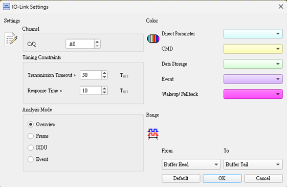
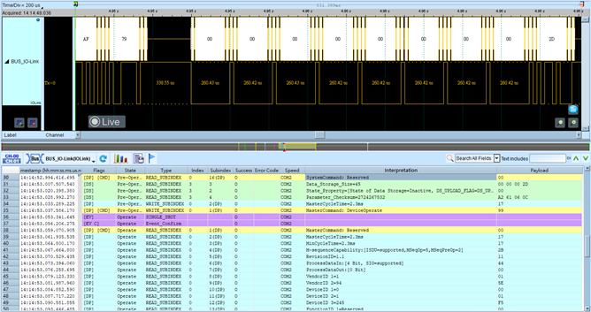
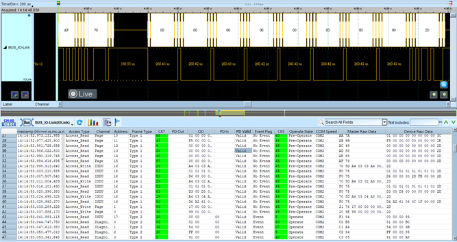
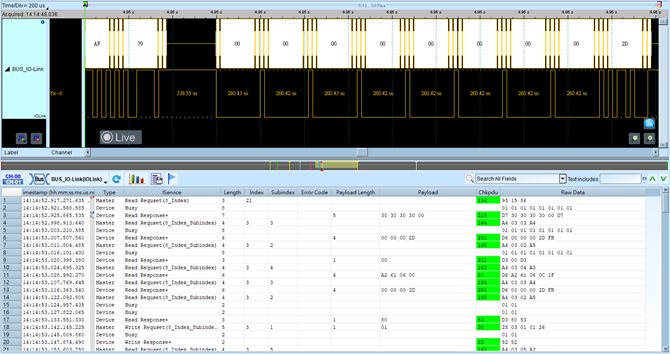
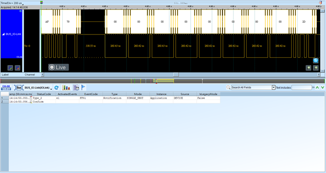

# IO-Link

## Decode Settings
<figure markdown>
  
  <figcaption>Decode Settings</figcaption>
</figure>

## Example
<figure markdown>
  
  <figcaption>Decode Example</figcaption>
</figure>
<figure markdown>
  
  <figcaption>Decode Figure</figcaption>
</figure>
<figure markdown>
  
  <figcaption>Decode Figure</figcaption>
</figure>
<figure markdown>
  
  <figcaption>Decode Figure</figcaption>
</figure>

## What is IO-Link?

IO-Link is the first globally standardized I/O technology (IEC 61131-9) for communication with sensors and actuators in factory automation. Developed by a consortium of leading automation manufacturers and standardized in 2013, IO-Link transforms traditional digital input/output connections into intelligent point-to-point communication links without requiring changes to existing wiring infrastructure. The protocol enables bidirectional data exchange, parameter configuration, diagnostics, and device identification over standard 3-wire sensor cables, elevating simple binary sensors into smart devices that provide rich information to automation systems.

Unlike traditional analog (4-20mA) or binary (24V DC) sensor connections that carry only basic signal information, IO-Link provides a digital communication channel overlaid on the standard 24V DC power supply connection. The technology uses the existing C/Q (communication/signal) line for half-duplex UART-based serial communication at speeds of 4.8 kbps (COM1), 38.4 kbps (COM2), or 230.4 kbps (COM3). An IO-Link master device connects to a PLC or fieldbus and provides multiple ports, each establishing a point-to-point link to an individual IO-Link sensor or actuator. This architecture maintains electrical simplicity while enabling advanced features like automatic device identification, parameter cloning, predictive maintenance through diagnostic data, and hot-swapping of devices with automatic reconfiguration.

IO-Link has achieved widespread adoption in industrial automation due to its backward compatibility with standard IO systems (non-IO-Link devices work as traditional inputs/outputs on IO-Link ports), vendor-neutral standardization, and low implementation cost. The protocol is particularly valuable in Industry 4.0 and IIoT (Industrial Internet of Things) contexts where detailed device-level data collection, remote configuration, and predictive maintenance are essential. Each IO-Link device includes an IODD (IO Device Description) file—a standardized XML document that fully describes the device's capabilities, parameters, and data structure, enabling plug-and-play integration across different automation platforms.

## Technical Specifications

### Physical Layer

**Connection Types:**
- **3-wire (Class A ports)**: Most common
  - L+ (24V DC power supply)
  - C/Q (Communication/Signal line)
  - L- (Ground/0V)
  - Connector: 4-pin M12 or 3-pin M8
- **4/5-wire (Class B ports)**: For higher power devices
  - Additional aux power line for devices requiring up to 2A
  - Connector: 5-pin M12

**Cable Specifications:**
- Standard 3-conductor unshielded sensor cable
- Maximum length: 20 meters (standard)
- Voltage: 24V DC nominal (18-30V DC operating range)
- Current per port: Typically 200mA (Class A), up to 2A (Class B)

**Electrical Characteristics:**
- Operates over 24V DC industrial power supply
- C/Q line uses current modulation for communication
- Backward compatible: Standard IO devices work on IO-Link ports

### Communication Modes (Data Rates)

IO-Link defines three communication speeds:

- **COM1**: 4.8 kbit/s - Basic mode, maximum reliability
- **COM2**: 38.4 kbit/s - Standard mode, good balance
- **COM3**: 230.4 kbit/s - Fast mode, high-speed applications

Master and device negotiate the communication rate during startup, automatically selecting the highest common mode supported by both.

### Frame Structure

**UART Encoding:**
- 11-bit frame: 1 START + 8 DATA + 1 PARITY (even) + 1 STOP
- Half-duplex communication on C/Q line
- Direction switching delays: 1-10 bit times

**Message Types (M-sequences):**

**Type 0 (No communication):**
- Device operates in standard IO mode (SIO)
- C/Q line carries binary on/off signal only

**Type 1 (Point-to-point):**
- Full IO-Link communication
- Master-initiated request-response cycles
- Cyclic process data and acyclic service data

**Type 2 (Page communication):**
- Multiple data pages per cycle
- Higher throughput for complex devices

### Protocol Stack

**Physical Layer:**
- 24V DC with current modulation on C/Q line
- UART framing at COM1/COM2/COM3 rates

**Data Link Layer:**
- Master-slave communication
- Cyclic data exchange (process data)
- Acyclic data exchange (parameters, diagnostics)
- Checksum protection

**Application Layer:**
- Process Data (PD): Real-time sensor/actuator values
- Service Data (SD): Parameters, configuration, diagnostics
- On-request Data (OD): Infrequent status and events
- ISDU (Index Service Data Unit): Parameter access by index

### Data Types

**Process Data:**
- Cyclic exchange of sensor values and actuator commands
- 1-32 bytes per cycle
- Typical cycle times: 2-10 ms (depending on COM mode and data length)

**Parameter Data:**
- Device configuration (setpoints, thresholds, operating modes)
- Stored in device non-volatile memory
- Accessed via index-based addressing

**Diagnostic Data:**
- Device health indicators
- Error codes and warnings
- Maintenance counters

**Identification Data:**
- Vendor ID, Device ID, Serial number
- Device name and function description
- Firmware version

### IODD Files

IO Device Description (IODD) is an XML file containing:
- Device identification (Vendor, Device ID, Version)
- Process data structure and meaning
- Parameter definitions with min/max ranges
- Diagnostic information definitions
- Menu structure for configuration tools
- Icons and text descriptions

IODDs enable universal device integration across different automation platforms without proprietary drivers.

## Common Applications

IO-Link is deployed across industrial automation sectors:

- **Proximity sensors**: Distance measurement, object detection with diagnostics
- **Photoelectric sensors**: Presence detection with teach-in and parameter access
- **Flow sensors**: Liquid and gas flow monitoring with remote configuration
- **Pressure sensors**: Hydraulic and pneumatic system monitoring
- **Temperature sensors**: Process temperature measurement with calibration data
- **Vision sensors**: Simple machine vision with parameter tuning
- **Level sensors**: Tank level monitoring in process industries
- **RFID read/write heads**: Identification system interfaces
- **Solenoid valves**: Pneumatic valve control with position feedback
- **Grippers**: Robotic gripper control with force monitoring
- **Lighting**: Industrial LED lighting with dimming and status
- **Vibration sensors**: Condition monitoring for predictive maintenance
- **Inductive sensors**: Metal detection with switching distance adjustment
- **Ultrasonic sensors**: Non-contact distance measurement
- **Barcode scanners**: Auto-ID integration with configuration access

## Decoder Configuration

When configuring a logic analyzer to decode IO-Link signals:

### Channel Assignment

**Required Signal:**
- **C/Q line**: Communication/Signal line (single-ended)

Probe the C/Q line between IO-Link master port and device. Ground reference to L- (0V).

### Protocol Parameters

- **Communication mode**: Select COM1 (4.8 kbps), COM2 (38.4 kbps), or COM3 (230.4 kbps)
- **UART format**: 1 start, 8 data, 1 parity (even), 1 stop = 11 bits total
- **Direction**: Half-duplex (bidirectional on same line)

### Decoding Options

- **Frame identification**: Distinguish master request frames from device response frames
- **M-sequence type**: Display message type (Type 1, Type 2)
- **Checksum verification**: Verify frame integrity
- **Process data display**: Show cyclic sensor data values
- **Service data display**: Show acyclic parameter read/write operations
- **Device identification**: Parse and display Vendor ID, Device ID from startup sequence
- **ISDU transactions**: Decode index-based parameter access

### Trigger Configuration

- **Communication start**: Trigger on first frame after power-up or wake-up
- **Process data**: Trigger on cyclic process data frames
- **Parameter write**: Trigger on ISDU write operations
- **Error condition**: Trigger on checksum errors or invalid frames
- **Device events**: Trigger on event notification frames

### Sampling Requirements

**Minimum Sampling Rate:**
- At least 10× the communication rate
- COM1 (4.8 kbps): 48 kHz minimum
- COM2 (38.4 kbps): 384 kHz minimum
- COM3 (230.4 kbps): 2.3 MHz minimum

**Recommended Sampling Rate:**
- 20× communication rate for clear waveforms
- COM3 at 230.4 kbps: 4.6 MHz sampling recommended

**Buffer Depth:**
- Typical cycle: 10-100 frames
- Recommended buffer: 1-10ms of data (varies by COM mode)

### Analysis Tips

When analyzing IO-Link communications:

1. **Identify COM mode**: Measure bit time to determine communication speed
2. **Startup sequence**: Observe wake-up and mode negotiation after power-on
3. **Cyclic timing**: Measure process data cycle time (typically 2-10 ms)
4. **Direction switching**: Note timing gaps between master request and device response
5. **Parameter access**: Identify ISDU frames for configuration read/write
6. **Error handling**: Watch for retries and checksum failures
7. **Device identification**: Capture startup frames containing Vendor ID and Device ID
8. **Fallback mode**: Device may operate in SIO (Standard IO) mode if IO-Link fails

### Common Protocol Sequences

**Device Startup:**
1. Master sends wake-up request (WU sequence)
2. Device responds, indicating supported COM modes
3. Master selects communication mode (COM1, COM2, or COM3)
4. Master reads device identification (Vendor ID, Device ID)
5. Master may restore parameters from IODD or previous session
6. Cyclic process data exchange begins

**Cyclic Data Exchange:**
1. Master sends M-sequence request (process data output + command)
2. Device responds with process data input (sensor value)
3. Cycle repeats at configured rate (e.g., every 5 ms)

**Parameter Write (ISDU):**
1. Master sends ISDU write request with index and data
2. Device acknowledges or reports error
3. Device stores parameter in non-volatile memory
4. Master may read back to verify

**Diagnostic Event:**
1. Device detects fault condition (e.g., sensor blocked)
2. Device sets diagnostic flag in process data
3. Master reads detailed diagnostic via ISDU
4. Master logs event and may alert operator

## Reference

- [IEC 61131-9:2022 - Single-drop digital communication interface](https://webstore.iec.ch/en/publication/68534)
- [IO-Link Official Website](https://io-link.com/)
- [IO-Link Interface Specification v1.1.4](https://io-link.com/share/Downloads/Package-2024-released/IOL-Interface-Spec_10002_V114_Jun24.pdf)
- [ifm: IO-Link Wiring Guide](https://www.ifm.com/us/en/shared/technologies/io-link/technology/io-link-wiring)
- [Analog Devices: IO-Link Handbook](https://www.analog.com/media/en/news-marketing-collateral/solutions-bulletins-brochures/io-link-handbook.pdf)
