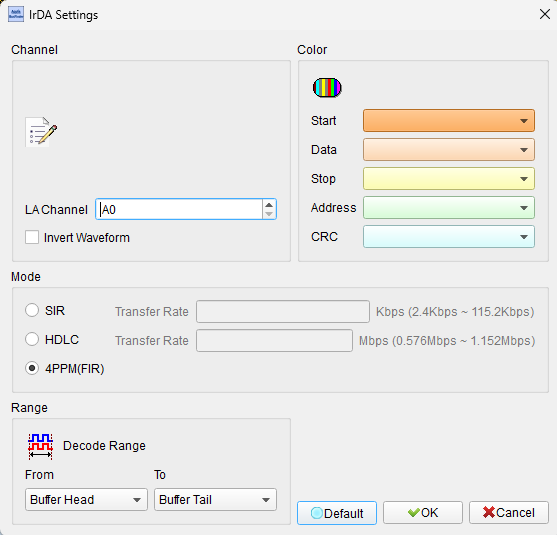
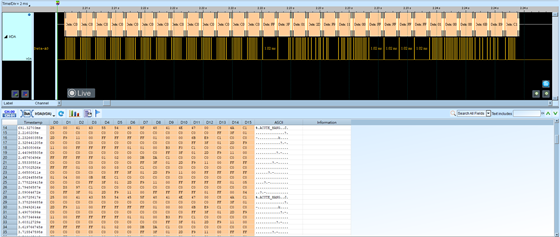

# IrDA

## Decode Settings
<figure markdown>
  
  <figcaption>Decode Settings</figcaption>
</figure>

## Example
<figure markdown>
  
  <figcaption>Decode Example</figcaption>
</figure>

## What is IrDA?

IrDA (Infrared Data Association) is a wireless standard for short-range infrared data transmission established in 1993 and introduced commercially in June 1994. The protocol provides physically secure, point-to-point bidirectional data transfer using infrared light in the 850-900 nanometer wavelength range. IrDA was developed as a standard for connecting portable devices such as laptops, mobile phones, PDAs, cameras, and printers without physical cables.

The protocol operates in half-duplex mode with practical operating ranges between 5 cm and 60 cm, though theoretical ranges can extend up to 1 meter under optimal conditions. IrDA uses line-of-sight communication with a cone angle of approximately 30 degrees, requiring devices to be positioned facing each other for data exchange. The protocol stack includes multiple layers from the physical layer through link management and transport protocols.

IrDA gained widespread adoption in the late 1990s and early 2000s for consumer electronics, particularly mobile devices. While largely superseded by Bluetooth and Wi-Fi for general connectivity, IrDA remains relevant for specific applications requiring point-to-point secure transfer, low electromagnetic interference, and minimal regulatory constraints. Modern applications include infrared remote control functionality in smartphones and secure data exchange in medical and industrial equipment.

## Technical Specifications

### Data Rate Modes

IrDA supports multiple speed tiers to accommodate different application requirements:

- **SIR (Serial Infrared)**: Up to 115.2 kbit/s - basic standard mode compatible with UART interfaces
- **MIR (Medium Infrared)**: 576 kbit/s and 1.152 Mbit/s - medium-speed applications
- **FIR (Fast Infrared)**: 4 Mbit/s - high-speed file transfers
- **VFIR (Very Fast Infrared)**: 16 Mbit/s - maximum speed for large data transfers

### Physical Layer

The IrDA physical layer specification (current version 1.4) defines the optical transmission characteristics:

- **Wavelength**: 850-900 nm infrared spectrum
- **Modulation**: Pulse position modulation with RZI (Return-to-Zero Inverted) encoding
- **Power**: Low power consumption through efficient encoder/decoder modules
- **Range**: 5-60 cm practical operating distance
- **Angle**: 30-degree cone for transmit and receive
- **Operation**: Half-duplex bidirectional communication

### Protocol Stack

IrDA protocol architecture consists of mandatory and optional layers:

- **IrPHY**: Physical layer specification
- **IrLAP**: Link Access Protocol for reliable data link
- **IrLMP**: Link Management Protocol for multiplexing
- **Tiny TP**: Tiny Transport Protocol for segmentation and flow control
- **IrOBEX**: Object Exchange protocol for file and data transfer
- **IrCOMM**: Serial and parallel port emulation

## Common Applications

IrDA has been implemented across numerous device categories:

- **Mobile devices**: File transfer between phones, PDAs, and laptops
- **Printing**: Wireless printing from portable devices to IrDA-enabled printers
- **Point-of-sale**: Secure payment terminal communications
- **Medical devices**: Equipment data exchange with minimal EMI concerns
- **Industrial control**: Sensor and controller communications in electromagnetically noisy environments
- **Remote control**: Universal remote functionality in smartphones
- **Gaming**: Wireless controller and peripheral connections
- **Synchronization**: Contact and calendar synchronization between devices
- **Barcode scanners**: Wireless data transmission to host systems
- **Test equipment**: Data logging and measurement transfer

## Decoder Configuration

When configuring a logic analyzer to decode IrDA signals:

### Channel Assignment

- **IR Data**: Assign to the infrared transceiver signal line (typically a digital output from the IR receiver module)

### Protocol Parameters

- **Bit Rate**: Select the appropriate speed mode (SIR/MIR/FIR/VFIR) based on the communication speed
- **SIR**: 9600, 19200, 38400, 57600, or 115200 baud
- **MIR/FIR/VFIR**: Specify the exact data rate (576 kbps, 1.152 Mbps, 4 Mbps, or 16 Mbps)

### Decoding Options

- **Frame format**: Enable IrLAP frame structure decoding
- **Address display**: Show connection and device addresses
- **CRC checking**: Verify frame check sequences
- **Protocol layer**: Select which protocol layer to decode (IrLAP, IrLMP, Tiny TP, etc.)

### Trigger Configuration

- **Start of frame**: Trigger on the frame delimiter pattern
- **Specific address**: Trigger when a particular device address is detected
- **Frame type**: Trigger on specific command or response frames

### Notes

When capturing IrDA signals with a logic analyzer, connect to the digital output of the IR receiver module rather than the raw optical signal. The receiver module demodulates the infrared pulses into digital logic levels suitable for analysis. Ensure adequate sampling rate: at least 4x the data rate for SIR mode, and 10x or higher for FIR and VFIR modes to capture the pulse timing accurately.

## Reference

- [Wikipedia: IrDA](https://en.wikipedia.org/wiki/IrDA)
- [IrDA Library of Specifications](https://www.irda.org/library-of-specs)
- [IrDA Physical Layer Specification v1.4](https://www.vishay.com/docs/82513/physicallayer.pdf)
- [Microsoft IrDA Protocol Documentation](https://learn.microsoft.com/en-us/openspecs/windows_protocols/ms-irda/)
