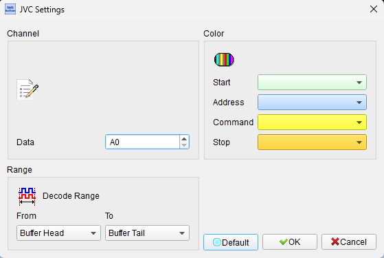
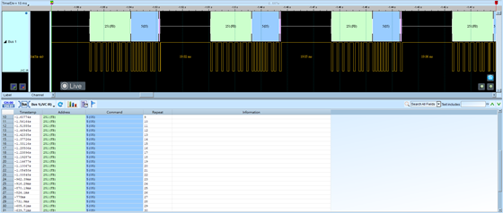

# JVC IR (Infrared Remote Control Protocol)

## Decode Settings
<figure markdown>
  
  <figcaption>Decode Settings</figcaption>
</figure>

## Example
<figure markdown>
  
  <figcaption>Decode Example</figcaption>
</figure>

## What is JVC IR?

The JVC infrared remote control protocol is a proprietary infrared transmission standard developed by JVC (Victor Company of Japan, Ltd.) for consumer electronics remote controls, particularly for audio and video equipment. Developed in the 1980s, the JVC protocol uses pulse distance modulation (also called pulse-interval encoding) on a 38 kHz carrier frequency to encode 16 bits of data consisting of an 8-bit address and an 8-bit command. Unlike the NEC protocol which includes redundant inverse bytes for error detection, JVC's protocol is more compact, transmitting only the essential address and command bytes without inversions, resulting in shorter frame durations and faster response times suitable for audio/video equipment where rapid commands (volume adjustment, channel changes) are common.

The JVC protocol's distinctive characteristic is its header structure, featuring an 8.4 ms AGC (Automatic Gain Control) burst followed by a 4.2 ms space to stabilize receiving circuits. Data bits use pulse distance encoding with a fixed 0.527 ms pulse (approximately 20 cycles of the 38 kHz carrier) followed by either a 0.528 ms space for logical 0 (total 1.055 ms) or 1.583 ms space for logical 1 (total 2.11 ms). Bits are transmitted LSB first, and the complete 16-bit frame takes approximately 46 ms including the header and stop pulse. A unique feature of the JVC protocol is its repeat behavior: when a button is held continuously, the complete frame repeats every 50-60 ms, but the AGC header is omitted after the initial transmission, allowing receivers to distinguish between a new button press (with header) and a continued button hold (without header).

JVC IR protocol is primarily found in JVC-branded audio equipment, video equipment, camcorders, and televisions, though its adoption outside the JVC ecosystem has been limited compared to more universal protocols like NEC. The protocol's compact design with no redundant error-checking bytes makes it faster but potentially less robust in noisy environments, a trade-off acceptable for typical home entertainment applications where line-of-sight communication paths are clear. The protocol remains relevant for legacy JVC equipment support, vintage audio/video system integration, universal remote programming, and maker projects requiring compatibility with JVC-controlled devices.

## Technical Specifications

### Physical Layer

**Infrared Carrier:**
- **Carrier frequency**: 38 kHz (37.9 kHz ±0.4 kHz tolerance)
- **Wavelength**: 940 nm (standard infrared LED)
- **Duty cycle**: 1/3 or 1/4 recommended (carrier on 25-33% of time)
- **Modulation**: On-off keying (OOK) — carrier burst represents mark, absence represents space

**Communication Range:**
- **Typical range**: 5-10 meters (line of sight)
- **Beam angle**: 30-60° cone (depending on transmitter LED and receiver sensitivity)

### Timing Specifications

**Pulse Duration:**
- **Standard pulse**: 0.527 ms (527 µs ±60 µs) — approximately 20 cycles of 38 kHz carrier

**Bit Encoding (Pulse Distance):**
- **Logical '0'**: 0.527 ms pulse + 0.528 ms space = 1.055 ms total (±60 µs) — 40 cycles
- **Logical '1'**: 0.527 ms pulse + 1.583 ms space = 2.11 ms total (±100 µs) — 80 cycles

**Frame Header (AGC Burst):**
- **Leading pulse burst**: 8.44 ms (typically 8.4 ms)
- **Header space**: 4.22 ms (typically 4.2 ms)

**Frame Characteristics:**
- **Word cycle time**: 46.42 ms (±2 ms) for complete frame with header
- **Repeat cycle**: 50-60 ms (without header after first transmission)

### Message Frame Format

**Initial Transmission (First Button Press):**

1. **8.4 ms leading pulse burst** (AGC burst)
2. **4.2 ms space**
3. **8-bit address** (device ID, LSB first)
4. **8-bit command** (button/function code, LSB first)
5. **0.527 ms stop pulse**

**Total initial frame**: ~46 ms

**Repeat Transmission (Button Held):**

1. **No header** (header omitted on repeats)
2. **8-bit address** (LSB first)
3. **8-bit command** (LSB first)
4. **0.527 ms stop pulse**

**Total repeat frame**: ~34 ms (no 12.6 ms header)

**Repeat interval**: 50-60 ms from start of previous frame

### Protocol Characteristics

**No Error Checking:**
- Unlike NEC, JVC protocol does not include inverse address or command bytes
- No built-in redundancy for error detection
- Receiver must rely on valid frame structure and reasonable data values

**Repeat Detection:**
- Receiver identifies initial press by presence of 8.4 ms + 4.2 ms header
- Subsequent frames without header indicate continuous button hold
- Receiver can implement auto-repeat functionality for held buttons

**Two-Word Coincidence Check:**
- JVC specification recommends checking two consecutive valid frames to prevent malfunctions
- Helps reject spurious noise or partial frames

**17th Bit Check Pulse:**
- Some implementations include a check pulse after the 16 data bits
- Used for additional frame validation

### Bit Order

**LSB First Transmission:**
- Bit 0 (LSB) transmitted first
- Bit 7 (MSB) transmitted last
- Both address and command bytes follow this order

**Example:**
- Address byte 0xC1 (binary 11000001) transmits as: 1-0-0-0-0-0-1-1
- Command byte 0x2A (binary 00101010) transmits as: 0-1-0-1-0-1-0-0

## Common Applications

JVC IR protocol is primarily used in JVC consumer electronics:

- **JVC televisions**: Remote control for power, channel, volume, input selection
- **JVC audio systems**: Stereo receivers, amplifiers, CD players, cassette decks
- **JVC camcorders**: Camera control functions, playback, menu navigation
- **JVC VCRs**: Transport controls, recording, timer programming
- **JVC DVD players**: Playback control, menu navigation
- **JVC Blu-ray players**: Transport and menu controls
- **JVC car audio**: In-dash receivers and CD changers with IR remote support
- **JVC projectors**: Power, input selection, menu controls
- **JVC boomboxes**: Portable audio systems with remote control
- **Universal remote controls**: Learning remotes that support JVC command set
- **Home theater systems**: JVC-branded complete audio/video systems
- **Vintage audio equipment**: Legacy JVC stereo components
- **Custom home automation**: Integration of JVC equipment into smart home systems
- **Maker projects**: Arduino/Raspberry Pi control of JVC devices
- **IR repeater systems**: Extending JVC IR signals through walls or cabinets

## Decoder Configuration

When configuring a logic analyzer to decode JVC IR protocol:

### Signal Capture Method

**Option 1: IR Receiver Module Output (Recommended)**
- Capture demodulated output from IR receiver (e.g., TSOP38238, VS1838B)
- Provides clean digital signal (typically active low)
- Carrier frequency already demodulated

**Option 2: Raw IR Signal**
- Capture direct from photodiode to observe carrier
- Requires fast sampling to resolve 38 kHz modulation
- Useful for carrier frequency and duty cycle analysis

### Channel Assignment

**Essential Signal:**
- **IR_DATA**: Demodulated IR receiver output (digital)

**Optional Signals:**
- **POWER**: Device power state (for context)
- **TRIGGER**: External trigger for timing correlation

### Protocol Parameters

- **Protocol type**: JVC IR
- **Carrier frequency**: 38 kHz (37.9-38.4 kHz)
- **Bit encoding**: Pulse distance encoding
- **Bit order**: LSB first
- **Frame structure**: 16-bit (8-bit address + 8-bit command)
- **Logic polarity**: Active low (typical for IR receivers)

### Decoding Options

- **Frame decoding**: Parse 16-bit frames into 8-bit address and 8-bit command
- **Address display**: Show device address in hex or decimal
- **Command display**: Show command code in hex or decimal
- **Header detection**: Identify presence of AGC header (initial press vs. repeat)
- **Repeat identification**: Distinguish frames with header from header-less repeats
- **Timing measurement**: Measure pulse and space durations, verify specifications
- **Frame counting**: Count number of repeat frames during button hold
- **Timing validation**: Check word cycle timing (46 ms initial, 50-60 ms repeats)

### Trigger Configuration

- **Start of frame**: Trigger on 8.4 ms leading AGC pulse
- **Specific address**: Trigger when specific device address decoded
- **Specific command**: Trigger when specific command code transmitted
- **Repeat frame**: Trigger on frame without header (address bit pattern starting without AGC)
- **Frame timing**: Trigger on specific intervals (46 ms or 50-60 ms patterns)

### Analysis Tips

When analyzing JVC IR signals:

1. **Verify AGC header**: Initial transmission should have 8.4 ms pulse + 4.2 ms space
2. **Check bit timing**: Logical 0 = ~1.055 ms, logical 1 = ~2.11 ms (measure total bit time)
3. **Identify repeats**: Subsequent frames lack the 12.6 ms header (8.4 ms + 4.2 ms)
4. **Measure repeat interval**: Should be 50-60 ms between frame starts
5. **Validate bit order**: Remember LSB first — lowest bit transmitted before highest
6. **Check pulse width consistency**: All pulses should be ~0.527 ms regardless of bit value
7. **Observe button hold behavior**: First frame has header, repeats do not
8. **Look for stop pulse**: Final 0.527 ms pulse marks end of frame
9. **Compare with NEC**: JVC frames are shorter (no inverse bytes) and faster
10. **Test two-word coincidence**: Some receivers require two valid consecutive frames

### Common Protocol Patterns

**Single Button Press:**
1. User presses button
2. Full frame with 8.4 ms header + address + command (~46 ms)
3. User releases button immediately
4. No repeat frames

**Button Hold:**
1. User presses and holds button
2. First frame with header + address + command (~46 ms)
3. After 50-60 ms, first repeat frame (no header, just address + command, ~34 ms)
4. Subsequent repeats every 50-60 ms while button held
5. User releases button
6. Transmission stops

**Rapid Sequential Presses:**
1. User presses button 1
2. Full frame with header for button 1
3. User releases and quickly presses button 2
4. Full frame with header for button 2 (header indicates new button)
5. Each distinct press includes header

**Comparison with NEC Protocol:**

| Feature | JVC | NEC |
|---------|-----|-----|
| Frame size | 16 bits | 32 bits |
| Header pulse | 8.4 ms | 9 ms |
| Header space | 4.2 ms | 4.5 ms |
| Error checking | None | Inverse bytes |
| Repeat behavior | Omit header | Separate repeat code |
| Frame duration | ~46 ms initial, ~34 ms repeat | ~67.5 ms, ~11.8 ms repeat |

## Reference

- [SB-Projects: JVC IR Protocol Guide](https://www.sbprojects.net/knowledge/ir/jvc.php)
- [JVC Official Remote Control Codes (PDF)](https://support.jvc.com/consumer/support/documents/RemoteCodes.pdf)
- [ElectroDragon Wiki: Infrared Protocols - JVC](https://w.electrodragon.com/w/Infrared_Protocols)
- [JVC Interface Specifications](https://support.jvc.com/consumer/support/support.jsp?pageID=11)
- [Wikipedia: Consumer IR Remote Control Protocols](https://en.wikipedia.org/wiki/Consumer_IR)
