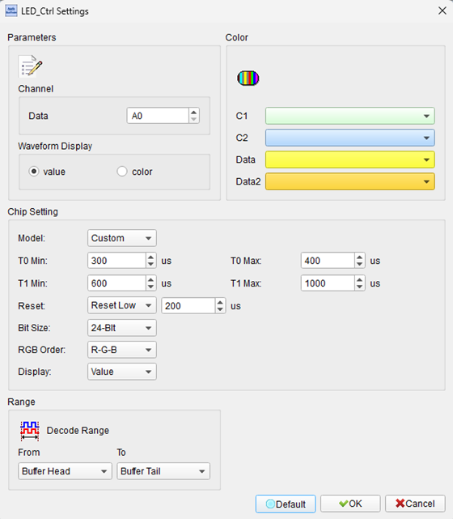
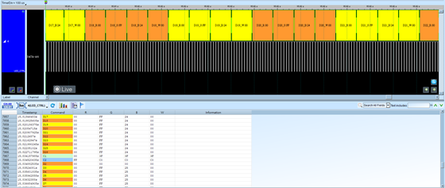

# LED Control Protocols

## Decode Settings
<figure markdown>
  
  <figcaption>Decode Settings</figcaption>
</figure>

## Example
<figure markdown>
  
  <figcaption>Decode Example</figcaption>
</figure>

## What are LED Control Protocols?

LED Control protocols refer to a family of single-wire serial communication standards used to control individually addressable RGB and RGBW LEDs in cascaded configurations. The most common protocols—including WS2812/WS2812B, WS2813, WS2814, APA102, HD107S, and SK6812—integrate LED driver circuitry directly into each LED package, enabling daisy-chained arrangements where hundreds or thousands of LEDs can be controlled from a single microcontroller data pin. These protocols revolutionized LED display and lighting applications by eliminating the need for complex multiplexing hardware, individual current-limiting resistors, and parallel control lines, replacing them with simple serial data streams that specify color and brightness for each LED in sequence.

The fundamental operation involves transmitting RGB (or RGBW) color data as a continuous stream where each LED captures its designated 24-bit (or 32-bit) color value and passes remaining data downstream to the next LED. Protocols use precise pulse-width encoding to represent binary 1s and 0s, with timing specifications typically in the range of 0.4-1.25 microseconds per bit, achieving data rates of 800 Kbps to 1 Mbps. After transmitting data for all LEDs, a reset pulse (low signal lasting 50-280 microseconds depending on protocol) latches the color values and illuminates all LEDs simultaneously. Most protocols use high-frequency PWM (2-27 kHz) to control brightness, providing 256 levels per color channel for 16.7 million possible colors (24-bit RGB) or 4.3 billion colors (32-bit RGBW).

These LED control protocols have become ubiquitous in hobbyist, commercial, and professional lighting applications. Popular implementations include WS2812B (also known as "NeoPixel" in Adafruit products), which uses a single-wire 800 Kbps protocol with automatic signal reshaping to extend cascade length, and APA102/HD107S, which use a separate clock line for higher PWM frequencies and better camera compatibility. The ecosystem includes extensive software library support (FastLED, AdaFruit NeoPixel, etc.), making these LEDs accessible to makers, artists, and lighting designers for creating dynamic displays, architectural lighting, wearable electronics, and entertainment effects.

## Technical Specifications

### Common Protocol Types

**WS2812/WS2812B (NeoPixel):**
- **Data rate**: 800 Kbps (1.25 µs per bit)
- **Color format**: 24-bit RGB (8 bits per channel)
- **Signal lines**: Single data wire + VCC + GND
- **PWM frequency**: ~2 kHz
- **Reset time**: >50 µs (WS2812), >280 µs (WS2812B)
- **Voltage**: 5V operation
- **Features**: Integrated signal reshaping, automatic cascade

**WS2813/WS2814:**
- **Data rate**: 800 Kbps
- **Color format**: 24-bit RGB (WS2813), 32-bit RGBW (WS2814)
- **Signal lines**: Dual data lines for redundancy (WS2813/WS2814)
- **PWM frequency**: ~2 kHz
- **Reset time**: >280 µs
- **Voltage**: 5V or 12V variants
- **Features**: Fault tolerance (if one LED fails, chain continues), white LED channel (WS2814)

**APA102/APA102C:**
- **Data rate**: Up to 30 MHz (clock-driven)
- **Color format**: 24-bit RGB + 5-bit brightness
- **Signal lines**: Separate data and clock (4 wires total with power)
- **PWM frequency**: ~20 kHz
- **Reset**: No specific reset time required
- **Voltage**: 5V operation
- **Features**: Higher PWM rate reduces flicker on camera, clock line improves timing tolerance

**HD107S:**
- **Data rate**: Up to 40 MHz (clock-driven)
- **Color format**: 24-bit RGB + brightness control
- **Signal lines**: Data + clock (4 wires)
- **PWM frequency**: ~27 kHz (highest in class)
- **Voltage**: 5V/12V variants
- **Features**: Best camera compatibility, very high PWM frequency eliminates flicker

**SK6812/SK6812-RGBW:**
- **Data rate**: 800 Kbps
- **Color format**: 24-bit RGB or 32-bit RGBW
- **Signal lines**: Single data wire + power
- **PWM frequency**: ~1.2 kHz
- **Reset time**: >80 µs
- **Voltage**: 5V operation
- **Features**: RGBW variant adds dedicated white LED for better color rendering

### Timing Specifications (WS2812B Example)

**Bit Encoding:**
- **Logic '1'**: High for 0.8 µs, Low for 0.45 µs (total 1.25 µs)
- **Logic '0'**: High for 0.4 µs, Low for 0.85 µs (total 1.25 µs)
- **Tolerance**: Typically ±150 ns

**Frame Structure:**
- **Data order**: GRB (Green, Red, Blue) for most WS281x; RGB for APA102
- **Bit order**: MSB first (Most Significant Bit first)
- **Bits per LED**: 24 (RGB) or 32 (RGBW)
- **Reset pulse**: >50-280 µs low signal to latch all data

**Cascade Operation:**
1. Controller sends color data for LED #1
2. LED #1 captures first 24/32 bits, passes remainder downstream
3. LED #2 captures next 24/32 bits, passes remainder, and so on
4. After all data sent, reset pulse latches values to all LEDs simultaneously

### Power and Electrical Characteristics

**Power Consumption:**
- Each RGB LED: ~60 mA maximum at full white brightness
- Typical current: ~20 mA per LED at moderate brightness
- RGBW LEDs: Higher current due to additional white channel

**Supply Voltage:**
- **5V variants**: WS2812B, APA102, SK6812, HD107S
- **12V variants**: Available for WS2813, WS2814, reduced current for same power

**Signal Levels:**
- **Logic high**: >0.7 × VCC
- **Logic low**: <0.3 × VCC
- **Input impedance**: Typically high impedance with Schmitt trigger input

## Common Applications

LED control protocols are used across a wide range of lighting applications:

**Hobbyist and Maker Projects:**
- Arduino, Raspberry Pi, and microcontroller LED projects
- LED strips for home automation and mood lighting
- Wearable electronics (LED clothing, accessories, costumes)
- Interactive art installations and sculptures

**Architectural and Decorative Lighting:**
- Building facade lighting and pixel mapping
- Interior accent lighting and cove lighting
- Restaurant and retail environment lighting
- Holiday and event decorative lighting
- Signage and channel letters

**Entertainment and Stage Lighting:**
- Concert stage LED panels and video walls
- DJ booths and nightclub lighting effects
- Theater productions and special effects
- Festival and event lighting installations

**Displays and Indicators:**
- LED matrices and text displays
- Animated signs and scoreboards
- Information displays and tickers
- Status indicators and progress bars

**Automotive and Transportation:**
- Custom underglow and accent lighting
- Interior cabin lighting effects
- Motorcycle and bicycle lighting
- Aftermarket automotive customization

**Gaming and PC Modding:**
- RGB PC case lighting and fans
- Gaming keyboard and mouse backlighting
- LED light strips for desk and monitor backlighting
- Custom-built gaming setups

**Toys and Consumer Products:**
- Light-up toys and games
- Smart home lighting products
- Decorative LED lamps and fixtures
- Consumer electronics accent lighting

## Decoder Configuration

When configuring a logic analyzer to decode LED control protocol signals:

### Channel Assignment

**For Single-Wire Protocols (WS2812B, WS2813, SK6812):**
- **DATA**: LED data signal line
- **Optional**: VCC (power reference)

**For Clock + Data Protocols (APA102, HD107S):**
- **DATA**: Serial data signal
- **CLK**: Clock signal
- **Optional**: VCC (power reference)

### Protocol Parameters

**Timing Settings (WS2812B example):**
- **Data rate**: 800 Kbps (~1.25 µs per bit)
- **T0H (0 bit high time)**: 0.4 µs (±150 ns)
- **T0L (0 bit low time)**: 0.85 µs (±150 ns)
- **T1H (1 bit high time)**: 0.8 µs (±150 ns)
- **T1L (1 bit low time)**: 0.45 µs (±150 ns)
- **Reset time**: >50 µs (WS2812) or >280 µs (WS2812B)
- **Sampling rate**: Minimum 10 MHz, recommend 50-100 MHz

**Decoding Options:**
- **Color format**: RGB (24-bit) or RGBW (32-bit)
- **Bit order**: MSB first
- **Byte order**: GRB for WS281x, RGB for APA102
- **LED count**: Number of LEDs in chain
- **Color display**: Show RGB values as hex or visualize as color swatches

### Trigger Settings

**Common trigger configurations:**
- **Frame start**: Trigger on first bit after reset pulse
- **Specific color**: Trigger when particular RGB value appears
- **Reset pulse**: Trigger on long low pulse (>50-280 µs)
- **Pattern matching**: Trigger on specific LED color sequence
- **Timing violations**: Trigger on out-of-spec pulse widths

### Display Options

**Visualization:**
- **LED indexing**: Number LEDs sequentially (LED 0, LED 1, LED 2...)
- **Color representation**: Display RGB/RGBW values in hex (e.g., #FF8000)
- **Visual color swatch**: Show actual color for each LED
- **Brightness values**: Display calculated brightness percentage
- **Timing annotations**: Mark bit boundaries and pulse widths
- **Reset indicators**: Highlight reset pulses and frame boundaries

### Analysis Tips

**Signal Integrity:**
Check pulse widths against specifications. Timing violations cause color errors or LEDs not updating. Verify rise and fall times are clean—slow edges can cause bit errors, especially with long LED chains or improper PCB layout.

**Power Supply Correlation:**
Capture VCC alongside data signal to correlate LED behavior with power supply stability. Voltage drops during high-brightness white patterns can cause brownouts, resets, or color shifts. Ensure power supply can handle peak current (60 mA × number of LEDs at full white).

**Reset Pulse Identification:**
Reset pulses latch data to LEDs. Verify reset pulse duration meets specification (>50-280 µs depending on IC). Too-short reset pulses cause LEDs not to update; too-long resets waste refresh time and reduce maximum frame rate.

**Frame Rate Calculation:**
Measure time between reset pulses to calculate frame rate. For smooth animations, aim for 30+ fps (33 ms per frame). Frame rate = 1 / (data transmission time + reset pulse time). More LEDs = longer transmission time = lower maximum frame rate.

**Color Order Verification:**
Different LED types use different byte orders (GRB vs. RGB vs. RGBW). If colors appear wrong (e.g., red and green swapped), verify byte order configuration. Decode a known test pattern (solid red) to confirm correct interpretation.

**Cascade Propagation:**
In long chains, slight timing variations accumulate. Measure timing at first vs. last LED in chain (if accessible). Signal reshaping ICs (WS2812B) regenerate clean signals, but protocols without reshaping (WS2811) can degrade over long chains.

**PWM Frequency Analysis:**
For camera-based applications, low PWM frequencies (<2 kHz) cause visible flicker or banding in photos/videos. APA102/HD107S with >20 kHz PWM eliminate this issue. Verify PWM frequency by zooming in on steady-state LED output signal.

**Fault Isolation:**
If LEDs behave incorrectly past a certain point in chain, suspect failed LED. WS2813/WS2814 with dual data lines provide fault tolerance—verify backup data line operation if primary fails.

## Reference

- [WS2812B Datasheet](https://www.mouser.com/pdfDocs/WS2812B-2020_V10_EN_181106150240761.pdf): Worldsemi WS2812B specifications
- [WS2812B Protocol Guide](https://www.arrow.com/en/research-and-events/articles/protocol-for-the-ws2812b-programmable-led): Arrow Electronics
- [APA102/SK9822 LED Protocol](https://cpldcpu.wordpress.com/2014/11/30/understanding-the-apa102-superled/): Technical analysis
- [AdaFruit NeoPixel Überguide](https://learn.adafruit.com/adafruit-neopixel-uberguide): Comprehensive usage guide
- [FastLED Library](https://fastled.io/): Popular LED control library with protocol support
- [Pixel Protocols Overview](https://www.enttec.com/pixel-protocols/): Comparison of addressable LED protocols
