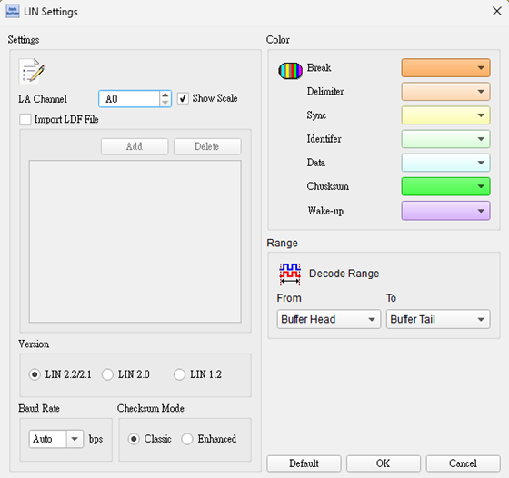
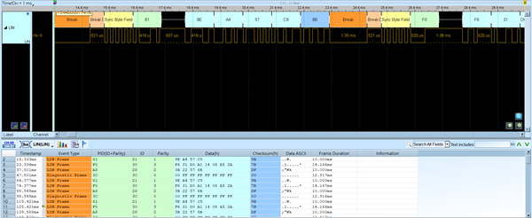
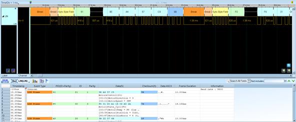

# LIN (Local Interconnect Network)

## Decode Settings
<figure markdown>
  
  <figcaption>Decode Settings</figcaption>
</figure>

## Example
<figure markdown>
  
  <figcaption>Decode Example</figcaption>
</figure>
<figure markdown>
  
  <figcaption>Decode Figure</figcaption>
</figure>

## What is LIN?

### Overview

LIN (Local Interconnect Network) is a low-cost, single-wire serial communication protocol developed specifically for automotive applications as a complementary sub-network to CAN (Controller Area Network). Introduced in the late 1990s by a consortium of automotive manufacturers and semiconductor companies, LIN addresses applications where the cost, complexity, and bandwidth of CAN bus are excessive—such as controlling windows, mirrors, seats, climate controls, door locks, and other non-critical comfort and convenience functions. The protocol enables up to 16 nodes (1 commander and up to 15 responders) to communicate over a single wire at speeds up to 20 kbit/s.

The genius of LIN lies in its intentional simplicity and cost-optimization. By using a single-wire interface that can be implemented with standard UART/SCI hardware present in virtually all microcontrollers, LIN eliminates the need for expensive specialized communication controllers or crystals. The protocol includes self-synchronization capabilities, allowing nodes to operate with inexpensive RC oscillators instead of crystal oscillators—a significant cost saving when multiplied across dozens of control modules in a vehicle. This makes LIN ideal for replacing expensive wiring harnesses and enabling smart, distributed control in cost-sensitive automotive subsystems.

### International Standardization

LIN has achieved comprehensive international standardization through the ISO 17987 series (established 2016), which covers all seven OSI layers from physical signaling to application interfaces. The SAE International J2602 series provides complementary recommended practices for automotive implementation. Recent standards revisions (2021-2024) have modernized terminology, replacing "master/slave" with "commander/responder" to align with industry-wide inclusive language initiatives while maintaining full technical compatibility with existing implementations.

## Technical Specifications

### Physical Layer

**Single-Wire Bus**:
- One shared bus line plus ground reference
- All nodes connected in parallel (multi-drop topology)
- Pull-up resistor maintains bus at battery voltage when idle
- Open-drain/open-collector outputs pull bus low during transmission

**Electrical Characteristics**:
- **Voltage**: Automotive battery voltage (typically 12V in passenger vehicles, 24V in commercial vehicles)
- **Dominant State** (0): Bus pulled low (~0V)
- **Recessive State** (1): Bus released high (~battery voltage)
- **Bit Rate**: Up to 20 kbit/s (20,000 bits per second)

**Cable and Distance**:
- Maximum cable length: ~40 meters (depends on bit rate and capacitance)
- Suitable for intra-body communication within vehicle compartments
- Typically implemented using existing wiring harness with minimal additional wires

### Frame Structure

LIN communication is organized into frames transmitted by the commander:

**Frame Components**:

1. **Break**: Dominant state for at least 13 bit times (signals start of frame)
2. **Sync Byte**: 0x55 (01010101 binary) allows responders to measure bit timing and synchronize
3. **Identifier (ID)**: 6-bit message ID + 2 parity bits = 8-bit protected ID
4. **Data Bytes**: 1-8 bytes of payload data
5. **Checksum**: Validates data integrity (classic or enhanced checksum)

**Bit Timing**:
At 19.2 kbit/s (common rate):
- Each bit: ~52 μs
- Break: ~676 μs minimum
- Complete frame: Several milliseconds depending on data length

### Commander-Responder Architecture

**Commander (Master) Node**:
- Initiates all communication by sending frame header (break, sync, ID)
- Controls bus timing and schedules
- Only one commander per LIN bus
- Typically the main body control module or gateway

**Responder (Slave) Nodes**:
- Listen for ID in header
- Respond with data if ID matches their assigned message
- Can provide data (publish) or receive data (subscribe)
- 1-15 responders per bus
- Cannot initiate communication or talk directly to other responders

### Self-Synchronization

LIN's self-synchronization eliminates the need for crystal oscillators:

1. **Sync Byte Analysis**: Responders measure time between edges in 0x55 sync byte
2. **Bit Time Calculation**: Calculate actual bit period from measured timings
3. **Local Clock Adjustment**: Temporarily adjust baud rate to match commander
4. **Per-Frame Synchronization**: Resynchronize on every frame's sync byte

This allows responders to use cheap RC oscillators with ±15% initial tolerance, bringing bit costs down significantly.

## Message Scheduling

**Schedule Table**:
The commander executes a predefined schedule determining:
- Which message IDs are transmitted and when
- Frame transmission order
- Timing between frames
- Cyclic vs. sporadic messages

**Frame Types**:
- **Unconditional Frames**: Normal data transfer, always transmitted when scheduled
- **Event-Triggered Frames**: Multiple responders compete to publish (one ID, first responder wins)
- **Sporadic Frames**: Transmitted only when data has changed
- **Diagnostic Frames**: Special IDs (0x3C, 0x3D) for node configuration and diagnostics

## Diagnostic and Configuration

### Diagnostic Communication

**Reserved IDs**:
- **0x3C (60)**: Master request frame for diagnostics
- **0x3D (61)**: Slave response frame for diagnostics

**Diagnostic Services**:
- Read by Identifier: Request specific data from nodes
- Conditional Change NAD: Assign network addresses dynamically
- Save Configuration: Store settings in non-volatile memory
- Assign Frame ID Range: Configure message assignments
- Read Data By Identifier: Query node parameters
- Fault Memory Access: Read and clear diagnostic trouble codes

### Node Configuration

**Network Address (NAD)**:
- 1-byte address for diagnostic communication
- Assigned during manufacturing or dynamically at runtime
- Separate from message IDs used in normal communication

**Configuration Files**:
- **LDF (LIN Description File)**: Defines network architecture, nodes, signals, schedules
- **NCF (Node Capability File)**: Describes individual node capabilities

## Checksum Calculation

**Classic Checksum** (LIN 1.x):
- Calculated over data bytes only
- Inverted sum modulo 256

**Enhanced Checksum** (LIN 2.x):
- Calculated over protected ID + data bytes
- Provides better error detection
- Preferred for new designs

## Decoder Configuration

When configuring a LIN decoder:

- **Signal Line**: Assign logic analyzer channel to LIN bus
- **Baud Rate**: Set to actual or expected bit rate (often 19.2 kbit/s, auto-detect available)
- **LIN Version**: Select 1.x (classic checksum) or 2.x+ (enhanced checksum)
- **Break Detection**: Configure minimum break time threshold
- **Sync Validation**: Verify sync byte is 0x55
- **ID Interpretation**: Load LDF file if available for message name display
- **Checksum Verification**: Enable checksum validation and error reporting

## Common Applications

LIN is pervasive in automotive applications:

**Body Electronics**:
- Power windows and sunroof
- Side mirror adjustment and folding
- Seat position and heating controls
- Door locks and latches
- Interior lighting

**Climate Control**:
- Blower motor control
- Temperature sensors
- Vent actuators
- Rear climate controls

**Lighting**:
- Headlight leveling
- Adaptive lighting controls
- Ambient lighting systems
- LED driver modules

**Sensors**:
- Rain sensors
- Light sensors
- Occupancy sensors
- Temperature sensors

**Switches and Controls**:
- Steering wheel buttons
- Door panel switches
- Center console controls
- Window switches

## Advantages

- **Extremely Low Cost**: Minimal hardware, cheap components
- **Single Wire**: Reduces wiring harness cost and weight
- **Self-Synchronizing**: No crystal required, uses RC oscillators
- **Simple Implementation**: Based on standard UART hardware
- **Deterministic**: Commander controls all timing
- **Standardized**: ISO and SAE standards ensure interoperability
- **Diagnostic Support**: Built-in configuration and diagnostic capabilities
- **CAN Complement**: Perfect for low-speed, cost-sensitive applications

## Comparison with CAN

| Feature | LIN | CAN |
|---------|-----|-----|
| Speed | Up to 20 kbit/s | Up to 1 Mbit/s (8 Mbit/s with CAN FD) |
| Topology | Single-wire, commander-responder | Two-wire, multi-master |
| Cost | Very low | Moderate |
| Complexity | Simple | Complex |
| Applications | Non-critical comfort | Critical control and safety |
| Arbitration | None (commander-scheduled) | Priority-based |

## Reference

- [LIN Consortium: Standards](https://www.lin-cia.org/standards/)
- [Texas Instruments: LIN Protocol and Physical Layer (SLLA383A)](https://www.ti.com/lit/an/slla383a/slla383a.pdf)
- [Microchip: LIN Overview](https://developerhelp.microchip.com/xwiki/bin/view/applications/lin/overview/)
- [SAE J2602-1_202110: LIN Network for Vehicle Applications](https://www.sae.org/standards/content/j2602-1_202110/)
- [STMicroelectronics: LIN Solutions (AN1278)](https://www.st.com/resource/en/application_note/an1278-lin-local-interconnect-network-solutions-stmicroelectronics.pdf)
