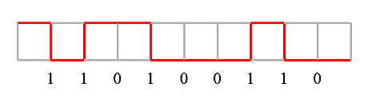
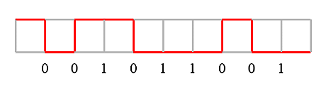
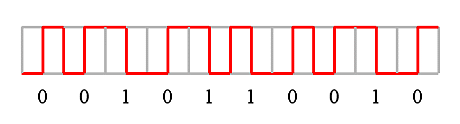
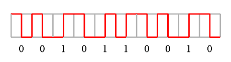
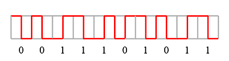
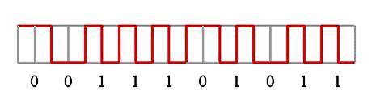
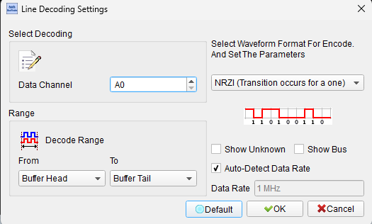
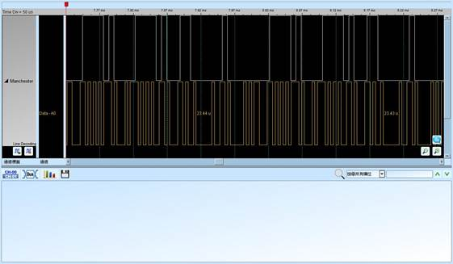

# Line Decoding

## Decode Settings
<figure markdown>
  
  <figcaption>Decode Settings</figcaption>
</figure>

## Example
<figure markdown>
  
  <figcaption>Decode Example</figcaption>
</figure>
<figure markdown>
  
  <figcaption>Decode Figure</figcaption>
</figure>
<figure markdown>
  
  <figcaption>Decode Figure</figcaption>
</figure>
<figure markdown>
  
  <figcaption>Decode Figure</figcaption>
</figure>
<figure markdown>
  
  <figcaption>Decode Figure</figcaption>
</figure>
<figure markdown>
  
  <figcaption>Decode Figure</figcaption>
</figure>
<figure markdown>
  
  <figcaption>Decode Figure</figcaption>
</figure>

## What is Line Decoding?

Line decoding is the process of extracting digital data from encoded physical layer signals captured by logic analyzers or oscilloscopes. While line encoding converts logical data into transmission-optimized waveforms, line decoding reverses this process—analyzing captured signal transitions, voltage levels, and timing to recover the original binary information. In logic analyzer workflows, line decoding acts as the critical first stage of protocol analysis, transforming raw electrical signals into bit streams that higher-layer decoders can then interpret as packets, frames, commands, and data according to protocol specifications.

The line decoding process involves several key operations: sampling the analog or digital signal at rates significantly higher than the data rate (typically 10-100× oversampling), detecting signal transitions (edges) and voltage level crossings with precise timing, recovering the embedded clock from the data stream using phase-locked loops (PLLs) or similar techniques, determining bit boundaries and values based on the encoding scheme's rules, and validating decoded symbols against the encoding specification to detect errors. For example, when decoding 8B/10B-encoded data from a Gigabit Ethernet link, the decoder must identify 10-bit symbol boundaries, map each 10-bit pattern to its corresponding 8-bit data value or control character, track running disparity to verify DC balance, and flag invalid codes that don't match any valid 8B/10B symbol.

Line decoding presents several technical challenges: timing precision becomes critical at high data rates where nanosecond-level accuracy is required; jitter, noise, and signal degradation can obscure transitions and cause bit errors; clock recovery can fail with pathological data patterns or poor signal quality; and different encoding schemes require specialized algorithms (Manchester's guaranteed mid-bit transitions enable simpler clock recovery than NRZ's potentially long runs without transitions). Modern logic analyzers implement sophisticated line decoding engines in hardware (FPGAs or ASICs) to handle these challenges in real-time, providing engineers with decoded binary data, error annotations, and statistics for debugging physical layer problems, validating protocol compliance, and troubleshooting communication failures.

## Line Decoding Techniques

### Clock Recovery

**Embedded Clock Extraction:**
Most line codes embed timing information in signal transitions. The decoder uses these transitions to recover the clock:

- **Phase-Locked Loop (PLL)**: Continuously adjusts clock phase to align with signal transitions
- **Digital PLL (DPLL)**: Software or FPGA-based clock tracking using transition edge timing
- **Oversampling**: Samples signal at high rate, detects edges, and determines bit centers
- **Data-Driven Timing Recovery (DDTR)**: Adjusts sampling based on detected data patterns

**Clock Recovery Challenges:**
- Long runs without transitions (NRZ, NRZI) cause clock drift
- Jitter accumulation over long bit sequences
- Frequency offset between transmitter and receiver clocks
- Temperature-induced clock variations

### Edge Detection and Bit Boundary Determination

**Transition Detection:**
- Identify rising and falling edges in the signal
- Filter noise and glitches below minimum pulse width
- Measure time between transitions with high precision

**Bit Boundary Alignment:**
- For NRZ: Bit boundaries occur at regular intervals based on recovered clock
- For Manchester: Transitions at bit centers define bit values; boundaries between mid-bit transitions
- For 8B/10B: 10-bit symbol boundaries must be found via sync patterns or unique code violations

### Symbol Decoding

**NRZ/NRZI Decoding:**
- Sample signal level at bit center
- NRZ: High=1, Low=0
- NRZI: Transition=1, No transition=0

**Manchester Decoding:**
- Identify mid-bit transition direction
- High-to-low=1 (or 0, depending on convention)
- Low-to-high=0 (or 1)
- Verify transitions occur at expected times

**Block Code Decoding (8B/10B, 64B/66B):**
- Identify symbol boundaries (10-bit or 66-bit blocks)
- Look up symbol in encoding table
- Map to 8-bit data or control character
- Verify disparity (8B/10B) or sync header (64B/66B)
- Detect invalid codes

### Error Detection

**Coding Violations:**
- Invalid symbols not in encoding table
- Disparity errors (8B/10B running disparity violation)
- Missing or incorrect sync patterns

**Timing Violations:**
- Bit width outside specification limits
- Excessive jitter
- Run-length violations (too many consecutive bits without transition)

**Signal Quality Issues:**
- Insufficient voltage swing
- Ringing or reflections
- Slow rise/fall times
- Noise-induced false transitions

## Decoding Methodologies

### Hardware-Based Decoding

**FPGA/ASIC Implementation:**
- Real-time decoding at line rate
- Parallel processing for high throughput
- Specialized state machines for each encoding type
- Low latency for triggering and analysis

**Advantages:**
- Handles high data rates (multi-Gbps)
- Real-time triggering on decoded data
- Minimal latency

**Limitations:**
- Fixed functionality (requires FPGA reprogramming for new codes)
- Higher cost
- Power consumption

### Software-Based Decoding

**Post-Capture Processing:**
- Capture raw samples to memory
- Process offline using CPU or GPU
- Flexible algorithms easily modified

**Advantages:**
- Supports custom and proprietary encodings
- Can implement complex error correction
- Easy updates and modifications

**Limitations:**
- Cannot handle real-time high-speed signals
- Higher memory requirements
- No real-time triggering on decoded data

### Hybrid Approaches

Many modern logic analyzers use hybrid architectures:
- Hardware performs initial decoding and triggering
- Software provides detailed analysis, visualization, and protocol decode
- Combines real-time performance with flexibility

## Common Applications

Line decoding is essential for analyzing digital communication systems:

**Serial Protocol Analysis:**
- UART, RS-232, RS-485 decoding from raw waveforms
- USB, SATA, PCIe physical layer decode
- SPI, I2C, JTAG signal analysis

**High-Speed Serial Links:**
- Gigabit Ethernet 8B/10B decode
- 10G Ethernet 64B/66B decode
- Fibre Channel and InfiniBand analysis
- PCIe, SATA, SAS physical layer validation

**Signal Integrity and Compliance Testing:**
- Verifying transmitter output meets timing specs
- Measuring bit error rates (BER)
- Eye diagram generation from decoded bits
- Jitter analysis and decomposition

**Physical Layer Debugging:**
- Identifying intermittent bit errors
- Isolating signal quality problems
- Troubleshooting clock recovery failures
- Validating encoding implementations

**Protocol Development:**
- Implementing custom line codes
- Testing encoder/decoder circuits
- Debugging new physical layer designs
- Compliance and interoperability testing

## Decoder Configuration

When configuring line decoding in a logic analyzer:

### Channel Assignment

**Signal Inputs:**
- **DATA**: Primary data signal (required)
- **DATA#**: Differential pair negative (for differential signaling)
- **CLK**: External clock reference (optional, for source-synchronous)
- **Threshold**: Voltage threshold for logic level detection

### Decoder Parameters

**Encoding Scheme:**
Select the line code to decode:
- NRZ, NRZI
- Manchester, Differential Manchester
- 4B/5B, 8B/10B, 64B/66B
- MLT-3 (requires three-level detection)
- Custom encodings

**Timing Configuration:**
- **Data rate**: Expected bit rate (bps)
- **Sample rate**: Capture sample rate (must be >> data rate)
- **Clock recovery method**: PLL, DPLL, oversampling, external clock
- **Clock tolerance**: Allowed frequency variation (ppm)

**Signal Parameters:**
- **Threshold voltage**: Logic high/low detection level
- **Hysteresis**: Noise immunity (Schmitt trigger behavior)
- **Minimum pulse width**: Glitch filter setting
- **Termination**: Input impedance matching

**Decoding Options:**
- **Bit order**: MSB-first or LSB-first
- **Polarity**: Normal or inverted
- **Error detection**: Enable coding violation detection
- **Disparity tracking**: For DC-balanced codes
- **Statistics**: BER, symbol error rate, jitter measurements

### Display and Analysis Options

**Data Visualization:**
- **Binary**: Raw bit stream (0s and 1s)
- **Hex**: Decoded data in hexadecimal
- **Symbol**: Encoded symbols (e.g., 10-bit 8B/10B codes)
- **ASCII**: Data interpreted as characters
- **Packet/Frame**: Higher-level protocol decode

**Annotations:**
- Highlight coding violations in red
- Mark control characters (K-codes for 8B/10B)
- Show timing measurements (bit width, jitter)
- Indicate clock recovery events

**Statistics and Measurements:**
- Bit error rate (BER)
- Symbol error rate (SER)
- Coding violation count
- Disparity error count
- Jitter histogram
- Eye diagram

### Analysis Tips

**Sampling Rate Selection:**
Use at least 10× oversampling for reliable edge detection. For critical timing analysis or eye diagrams, 50-100× oversampling is recommended. Insufficient sampling causes missed transitions and bit errors.

**Clock Recovery Validation:**
Monitor clock recovery status and phase error. Large phase errors or frequent loss of lock indicate signal quality problems or data patterns hostile to clock recovery (long runs without transitions).

**Baseline and Threshold Calibration:**
Set logic threshold at the midpoint between high and low levels for maximum noise margin. For AC-coupled signals, ensure decoder tracks baseline wander caused by DC imbalance.

**Error Pattern Analysis:**
Isolated errors suggest noise or interference; burst errors indicate clock loss or signal integrity issues; periodic errors point to crosstalk or power supply problems. Error patterns reveal root causes.

**Comparing Decoded Data:**
When available, compare decoded data to transmitted data (if known) to calculate bit error rate and identify systematic vs. random errors. This is critical for BER testing and compliance validation.

**Symbol Alignment Verification:**
For block codes (8B/10B, 64B/66B), verify correct symbol alignment. Misalignment causes all symbols to be incorrectly decoded. Use comma symbols (K28.5 in 8B/10B) or sync headers (64B/66B) to establish alignment.

**Multi-Lane Decoding:**
High-speed interfaces often use multiple lanes (4× for PCIe, XAUI for 10G Ethernet). Decode each lane independently, then align and merge at the protocol level. Verify lane-to-lane skew is within specifications.

## Reference

- [Wikipedia: Line Code](https://en.wikipedia.org/wiki/Line_code): Line encoding and decoding overview
- [Manchester Code Decoding](https://digilent.com/reference/test-and-measurement/guides/manchester-encoding): Practical decoding techniques
- [8b/10b Encoding](https://en.wikipedia.org/wiki/8b/10b_encoding): Decoding 8B/10B codes
- [Clock and Data Recovery](https://en.wikipedia.org/wiki/Clock_recovery): Clock recovery methods
- [Digital Signal Processing for Communications](https://www.amazon.com/Digital-Signal-Processing-Communication-Systems/dp/1580531259): Advanced decoding techniques
